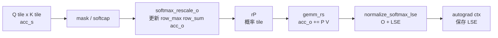

# Online-Softmax · 源码走读

## 读者任务

这篇沿一个 query tile 的生命周期读源码：它依次扫描多个 K/V block，每次拿到一个 score tile，更新全局 softmax 状态，并把概率 tile 立即消费成 `P @ V`。

读完你应该能回答：

- `acc_s` 从 raw score 变成 probability 的位置在哪里。
- `row_max/row_sum/acc_o` 如何在第一块和后续块之间迁移。
- 为什么 forward 主循环不保存完整 `P`。
- `softmax_lse` 如何从 CUDA epilogue 传到 Python autograd，再服务 backward。

## 长文读法

这篇按一个 query tile 扫描多个 K/V block 的状态转移读：行级 reduce 先在寄存器 fragment 上算 max / sum，`Softmax` 持有跨 block 的 `row_max`、`row_sum`、`acc_o`，第一块初始化状态，后续块重标尺历史输出，主循环每个 block 立刻把概率 tile 消费成 `P @ V`，epilogue 只落 `O` 和 LSE。

| 你的任务 | 先读 | 抓住什么 |
|----------|------|----------|
| 建立 online softmax 心智模型 | 1 到 4 | 状态跨 K block 传递，完整 `P` 不落 HBM |
| 排查第一块和后续块差异 | 3 到 4 | 后续块必须用新 max 重新缩放历史 `acc_o` |
| 定位主循环调用点 | 5 | mask / softcap 后立即更新 softmax 并消费概率 tile |
| 排查输出和 LSE | 6 到 7 | epilogue 写 `O` / LSE，Python autograd 保存 LSE 支撑 backward |
| 做源码验证 | 运行验证 | grep `softmax_rescale_o`、`normalize_softmax_lse` 和 `softmax_lse` 的跨层流向 |

## 主线地图



## 1. 行级 reduce 在寄存器 fragment 上完成

系统压力是片上存储：score tile 位于 MMA accumulator fragment 中，不能为了 softmax 把完整矩阵写回 HBM。`softmax.h` 先提供行级 reduce 工具，把每行的 max/sum 摘出来。

```cpp
// 来源：csrc/flash_attn/src/softmax.h L23-L63
template<bool zero_init=true, typename Engine0, typename Layout0, typename Engine1, typename Layout1, typename Operator>
__device__ __forceinline__ void thread_reduce_(Tensor<Engine0, Layout0> const &tensor, Tensor<Engine1, Layout1> &summary, Operator &op) {
    static_assert(Layout0::rank == 2, "Only support 2D Tensor");
    static_assert(Layout1::rank == 1, "Only support 1D Tensor");
    CUTE_STATIC_ASSERT_V(size<0>(summary) == size<0>(tensor));
    for (int mi = 0; mi < size<0>(tensor); mi++) {
        summary(mi) = zero_init ? tensor(mi, 0) : op(summary(mi), tensor(mi, 0));
        for (int ni = 1; ni < size<1>(tensor); ni++) {
            summary(mi) = op(summary(mi), tensor(mi, ni));
        }
    }
}

template<typename Engine0, typename Layout0, typename Engine1, typename Layout1, typename Operator>
__device__ __forceinline__ void quad_allreduce_(Tensor<Engine0, Layout0> &dst, Tensor<Engine1, Layout1> &src, Operator &op) {
    for (int i = 0; i < size(dst); i++){
        dst(i) = Allreduce<4>::run(src(i), op);
    }
}
```

这里的关键不是通用 reduce，而是 shape 约束：输入是二维 score fragment，输出是一维行摘要。Online softmax 的状态从一开始就是按 query 行组织的。

## 2. `Softmax` 持有跨 K block 的两本账

`Softmax<kNRows>` 自己只持有 `row_max` 和 `row_sum`。输出分子账 `acc_o` 在 forward 主循环中已经存在，所以作为参数传入并被同步重标尺。

```cpp
// 来源：csrc/flash_attn/src/softmax.h L128-L142
template <int kNRows>
struct Softmax {

    using TensorT = decltype(make_tensor<float>(Shape<Int<kNRows>>{}));
    TensorT row_max, row_sum;

    __forceinline__ __device__ Softmax() {};

    template<bool Is_first, bool Check_inf=false, typename Tensor0, typename Tensor1>
    __forceinline__ __device__ void softmax_rescale_o(Tensor0 &acc_s, Tensor1 &acc_o, float softmax_scale_log2) {
        Tensor scores = make_tensor(acc_s.data(), FLASH_NAMESPACE::convert_layout_acc_rowcol(acc_s.layout()));
        static_assert(decltype(size<0>(scores))::value == kNRows);
```

`acc_s` 会被原地改写。进入函数时它是 mask 后 score；离开函数时它已经是当前 block 的未归一化概率 tile。

## 3. 第一块 K/V 初始化状态

第一块没有历史，源码直接从当前 score tile 建立 `row_max` 和 `row_sum`。

```cpp
// 来源：csrc/flash_attn/src/softmax.h L136-L145
if (Is_first) {
    FLASH_NAMESPACE::template reduce_max</*zero_init=*/true>(scores, row_max);
    FLASH_NAMESPACE::scale_apply_exp2(scores, row_max, softmax_scale_log2);
    FLASH_NAMESPACE::reduce_sum</*zero_init=*/true>(scores, row_sum);
} else {
```

这一步做了三件事：

- `reduce_max` 得到当前已知的行最大值。
- `scale_apply_exp2` 把 score 变成 `exp(score - row_max)` 形态。
- `reduce_sum` 建立当前标尺下的分母。

首块路径不会缩放 `acc_o`，因为历史输出还不存在。

## 4. 后续块必须重标尺历史状态

后续 K/V block 可能出现新的最大 score。源码先保存旧最大值，再把当前 block 的最大值合并进 `row_max`，最后用同一个 `scores_scale` 缩放 `row_sum` 和 `acc_o`。

```cpp
// 来源：csrc/flash_attn/src/softmax.h L146-L166
Tensor scores_max_prev = make_fragment_like(row_max);
cute::copy(row_max, scores_max_prev);
FLASH_NAMESPACE::template reduce_max</*zero_init=*/false>(scores, row_max);
Tensor acc_o_rowcol = make_tensor(acc_o.data(), FLASH_NAMESPACE::convert_layout_acc_rowcol(acc_o.layout()));
for (int mi = 0; mi < size(row_max); ++mi) {
    float scores_max_cur = !Check_inf
        ? row_max(mi)
        : (row_max(mi) == -INFINITY ? 0.0f : row_max(mi));
    float scores_scale = exp2f((scores_max_prev(mi) - scores_max_cur) * softmax_scale_log2);
    row_sum(mi) *= scores_scale;
    for (int ni = 0; ni < size<1>(acc_o_rowcol); ++ni) {
        acc_o_rowcol(mi, ni) *= scores_scale;
    }
}
FLASH_NAMESPACE::scale_apply_exp2(scores, row_max, softmax_scale_log2);
FLASH_NAMESPACE::reduce_sum</*zero_init=*/false>(scores, row_sum);
```

这是本专题最重要的源码段。只要新旧最大值不同，旧分母和旧输出分子都不在新标尺上；二者必须一起迁移。`Check_inf` 是 causal/local mask 场景的保护，避免整行 `-inf` 产生无意义缩放。

## 5. Forward 主循环在 mask 后立即调用 online softmax

`flash_fwd_kernel.h` 里，score tile 经过 QK GEMM、softcap、mask 后，马上进入 `softmax_rescale_o`。`masking_step == 0` 决定它是第一块还是后续块。

```cpp
// 来源：csrc/flash_attn/src/flash_fwd_kernel.h L320-L367
FLASH_NAMESPACE::gemm(
    acc_s, tSrQ, tSrK, tSsQ, tSsK, tiled_mma, smem_tiled_copy_Q, smem_tiled_copy_K,
    smem_thr_copy_Q, smem_thr_copy_K
);
if constexpr (Is_softcap){
    FLASH_NAMESPACE::apply_softcap(acc_s, params.softcap);
}
mask.template apply_mask<Is_causal, Is_even_MN>(
    acc_s, n_block * kBlockN, m_block * kBlockM + row_offset, kNWarps * 16
);
masking_step == 0
    ? softmax.template softmax_rescale_o</*Is_first=*/true,  /*Check_inf=*/Is_causal || Is_local>(acc_s, acc_o, params.scale_softmax_log2)
    : softmax.template softmax_rescale_o</*Is_first=*/false, /*Check_inf=*/Is_causal || Is_local>(acc_s, acc_o, params.scale_softmax_log2);

Tensor rP = FLASH_NAMESPACE::convert_type<Element>(acc_s);
// 省略 Return_softmax 与 dropout 分支。
Tensor tOrP = make_tensor(rP.data(), FLASH_NAMESPACE::convert_layout_acc_Aregs<typename Kernel_traits::TiledMma>(rP.layout()));
FLASH_NAMESPACE::gemm_rs(acc_o, tOrP, tOrVt, tOsVt, tiled_mma, smem_tiled_copy_V, smem_thr_copy_V);
```

这条顺序说明 `P` 的生命周期很短：`acc_s` 原地变成概率，转成 `rP`，随后立刻被 `gemm_rs` 消费为 `P @ V`。常规路径不会把完整概率矩阵写出去。

## 6. Epilogue 把状态落成 `O` 和 LSE

主循环结束后，`normalize_softmax_lse` 补齐 lane 间 `row_sum`，归一化 `acc_o`，并返回每行 LSE。

```cpp
// 来源：csrc/flash_attn/src/softmax.h L169-L185
template<bool Is_dropout=false, bool Split=false, typename Tensor0>
__forceinline__ __device__ TensorT normalize_softmax_lse(Tensor0 &acc_o, float softmax_scale, float rp_dropout=1.0) {
    SumOp<float> sum_op;
    quad_allreduce_(row_sum, row_sum, sum_op);
    TensorT lse = make_fragment_like(row_sum);
    Tensor acc_o_rowcol = make_tensor(acc_o.data(), FLASH_NAMESPACE::convert_layout_acc_rowcol(acc_o.layout()));
    for (int mi = 0; mi < size<0>(acc_o_rowcol); ++mi) {
        float sum = row_sum(mi);
        float inv_sum = (sum == 0.f || sum != sum) ? 1.f : 1.f / sum;
        lse(mi) = (sum == 0.f || sum != sum) ? (Split ? -INFINITY : INFINITY) : row_max(mi) * softmax_scale + __logf(sum);
        float scale = !Is_dropout ? inv_sum : inv_sum * rp_dropout;
        for (int ni = 0; ni < size<1>(acc_o_rowcol); ++ni) { acc_o_rowcol(mi, ni) *= scale; }
    }
    return lse;
};
```

调用点在 forward epilogue：

```cpp
// 来源：csrc/flash_attn/src/flash_fwd_kernel.h L431-L433
// Epilogue

Tensor lse = softmax.template normalize_softmax_lse<Is_dropout>(acc_o, params.scale_softmax, params.rp_dropout);
```

`softmax_scale_log2` 用于 `exp2` 路径，`softmax_scale` 用于最终 LSE 的自然对数表达。读代码时不要把这两个 scale 混成一个。

## 7. Python 保存 LSE，让 backward 不保存完整 `P`

CUDA forward 返回 `softmax_lse` 后，Python autograd 保存它。Backward 取回 LSE、`out`、Q/K/V 和 RNG，再交给 CUDA backward 重算概率。

```python
# 来源：flash_attn/flash_attn_interface.py L828-L910
out_padded, softmax_lse, S_dmask, rng_state = _wrapped_flash_attn_forward(
    q,
    k,
    v,
    dropout_p,
    softmax_scale,
    causal=causal,
    window_size_left=window_size[0],
    window_size_right=window_size[1],
    softcap=softcap,
    alibi_slopes=alibi_slopes,
    return_softmax=return_softmax and dropout_p > 0,
)
if is_grad:
    ctx.save_for_backward(q, k, v, out_padded, softmax_lse, rng_state)
# 省略从 ctx 记录 dropout、mask、window、softcap、alibi 与 deterministic 配置。
q, k, v, out, softmax_lse, rng_state = ctx.saved_tensors
_wrapped_flash_attn_backward(
    dout_padded, q, k, v, out, softmax_lse, dq, dk, dv,
    ctx.dropout_p, ctx.softmax_scale, ctx.causal,
    ctx.window_size[0], ctx.window_size[1],
    ctx.softcap, ctx.alibi_slopes, ctx.deterministic,
    rng_state=rng_state,
)
```

`S_dmask` 是可选返回，主要用于 `return_softmax` 的测试/调试路径；训练 backward 的协议字段是 `out + softmax_lse + rng_state`。

## 运行验证

可以用一个纯 Python 小例子验证 streaming online softmax 与全量 softmax 一致：

```powershell
python - <<'PY'
import math

scores = [1.0, -2.0, 3.0, 0.5, 4.0, -1.0]
values = [2.0, 5.0, -1.0, 3.0, 0.25, 7.0]
blocks = [(scores[:2], values[:2]), (scores[2:4], values[2:4]), (scores[4:], values[4:])]

m = -math.inf
l = 0.0
o = 0.0
for s_block, v_block in blocks:
    block_m = max(s_block)
    new_m = max(m, block_m)
    scale_old = 0.0 if m == -math.inf else math.exp(m - new_m)
    l *= scale_old
    o *= scale_old
    for s, v in zip(s_block, v_block):
        p = math.exp(s - new_m)
        l += p
        o += p * v
    m = new_m

online = o / l
full_m = max(scores)
den = sum(math.exp(s - full_m) for s in scores)
full = sum(math.exp(s - full_m) * v for s, v in zip(scores, values)) / den
print(round(online, 12), round(full, 12), abs(online - full) < 1e-12)
PY
```

预期输出最后一列是 `True`。如果把 `o *= scale_old` 删除，这个验证会失败，这正是 `acc_o` 必须随 `row_sum` 一起重标尺的原因。

## 复盘

- `softmax_rescale_o` 是 online softmax 的核心状态机。
- `acc_s` 的身份会变化：raw score -> masked score -> probability tile。
- `P` 只在当前 block 的寄存器 fragment 中短暂存在，随即被 `gemm_rs` 消费。
- `softmax_lse` 是 forward 留给 backward 的紧凑摘要，不是附带统计。
