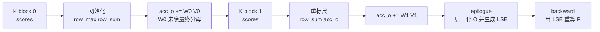

# Online-Softmax

> 这组笔记以基线 `002cce0` 的 FA2 为落点，回答核心原理问题：QK 分块之后，softmax 为什么仍等价于全量 attention，而不是每个 block 各算各的局部 softmax？

## 读者任务

读完本专题，你应该能处理三类问题：

| 任务 | 读完能做什么 |
|------|--------------|
| 理解 FA exact attention | 说明分块扫描 K/V 时如何维护全局 softmax 归一化 |
| 读 forward kernel | 在 `softmax.h` 和 `flash_fwd_kernel.h` 找到 `row_max/row_sum/acc_o/LSE` 的生命周期 |
| 连接 backward | 解释 forward 为什么保存 `softmax_lse`，以及 backward 如何用它重算局部权重 |

## 首次阅读路径

| 顺序 | 文件 | 读法 |
|------|------|------|
| 1 | [[FlashAttention-Online-Softmax-核心概念]] | 先理解 `m_i/l_i/o_i` 三本账 |
| 2 | [[FlashAttention-Online-Softmax-源码走读]] | 沿一个 query 行跨多个 K/V block 的主线读源码 |
| 3 | [[FlashAttention-Online-Softmax-数据流]] | 对齐寄存器 fragment、未归一化指数权重、LSE、autograd context |
| 4 | [[FlashAttention-Online-Softmax-排障指南]] | 排查局部 softmax、rescale、dropout、softcap 等误解 |
| 5 | [[FlashAttention-Online-Softmax-学习检查]] | 用小脚本验证 streaming softmax 与全量 softmax 等价 |

## 源码范围

| 源码文件 | 角色 |
|----------|------|
| `csrc/flash_attn/src/softmax.h` | `Softmax<kNRows>`、行级 reduce、online rescale、LSE epilogue |
| `csrc/flash_attn/src/flash_fwd_kernel.h` | forward 主循环中 `QK -> softcap -> mask/ALiBi -> online softmax -> 权重乘 V` 的调用点 |
| `flash_attn/flash_attn_interface.py` | Python autograd 保存 `softmax_lse/out/rng_state` 给 backward |
| `csrc/flash_attn/flash_api.cpp` | forward 入口中的 softcap/dropout 组合限制等能力边界 |

## 主线图

关键判断：Online softmax 保存的是每个 query 行的全局归一化状态，不是近似、采样或互不相干的局部 softmax。`acc_s/rP` 在主循环中是未归一化指数权重，最终除 `row_sum` 在 epilogue；dropout 只改送入权重乘 V 的副本。

## 继续读

- 已理解 online softmax 后，读 [[FlashAttention-FA2-Forward]] 会更容易看懂 forward kernel 主循环。
- 想看 LSE 如何支撑训练反向，读 [[FlashAttention-Backward]]。
- 想把原理放回 IO 模型，读 [[FlashAttention-Attention-IO]]。
