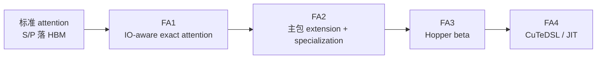

# FlashAttention 代际演进

## 读者任务

这篇先回答“FA1、FA2、FA3、FA4 到底是不是四套不同算法”。结论是：它们共享 exact attention 的核心目标，差异主要在执行顺序、并行分工、硬件映射和 kernel 组织方式。

读完后你应该能做到：

- 不在当前源码树里硬找一条独立 FA1 kernel 主线。
- 能把 FA2 看成当前稳定主包，而不是单个 forward 函数。
- 能说明 FA3 为什么单独放在 `hopper/`。
- 能说明 FA4 为什么引入 `flash_attn.cute` 和 CuTeDSL/JIT。

## 先建立模型：同一问题的四种工程形态



把四代压成一句话：

| 代际 | 读法 |
|------|------|
| FA1 | 算法原点：tile + online softmax 证明 exact attention 不必长期保存完整 `P` |
| FA2 | 工程主线：把算法原点做成 Python API、C++ 参数包、CUDA specialization 和训练/推理路径 |
| FA3 | 硬件主线：为 Hopper 的执行模型和 FP8 forward 单独组织 beta 包 |
| FA4 | 维护主线：用 CuTeDSL/JIT 管理 Hopper/Blackwell 与复杂特性组合 |

## 上游证据：README 的发布边界

README 开头确认这个仓库同时提供 FlashAttention 与 FlashAttention-2 的官方实现。论文标题紧接在后面，说明 FA1/FA2 是论文和实现目标的代际边界，而不是读者自己编出来的分类。

```markdown
# 来源：README.md L1-L4
# FlashAttention
This repository provides the official implementation of FlashAttention and
FlashAttention-2 from the
following papers.
```

FA3 在 README 中被明确标为 Hopper GPU 的 beta release，并要求 H100/H800 与 CUDA 12.3 以上。这说明它不是默认 FA2 extension 的普通小版本。

```markdown
# 来源：README.md L39-L45
This is a beta release for testing / benchmarking before we integrate that with
the rest of the repo.

Currently released:
- FP16 / BF16 forward and backward, FP8 forward

Requirements: H100 / H800 GPU, CUDA >= 12.3.
```

FA4 则是另一个边界：README 明确写它是 CuTeDSL，并面向 Hopper 与 Blackwell。

```markdown
# 来源：README.md L80-L83
## FlashAttention-4 (CuTeDSL)

FlashAttention-4 is written in CuTeDSL and optimized for Hopper and Blackwell GPUs (e.g. H100, B200).
```

## FA1 到 FA2：从算法原点到稳定主包

FA1 解决的是 memory wall：标准 attention 会生成 `S` 和 `P` 两个二次方中间矩阵。FA1 的核心贡献是改变执行顺序：score/probability tile 在片上生成即消费，用 online softmax 维护行级状态。

FA2 没有把 exact attention 改成近似算法。它把 FA1 的思想变成更完整的工程系统：API 更清楚，并行分工更好，变长 batch、训练 backward、推理 decode 逐步进入主包。

README 的 changelog 把 1.x 到 2.0 的接口升级说得很直接：`unpadded` 改为 `varlen`，同长度 batch 则走更简单的 dense API。

```markdown
# 来源：README.md L405-L414
### 2.0: Complete rewrite, 2x faster
Upgrading from FlashAttention (1.x) to FlashAttention-2

These functions have been renamed:
- `flash_attn_unpadded_func` -> `flash_attn_varlen_func`
- `flash_attn_unpadded_qkvpacked_func` -> `flash_attn_varlen_qkvpacked_func`
- `flash_attn_unpadded_kvpacked_func` -> `flash_attn_varlen_kvpacked_func`

If the inputs have the same sequence lengths in the same batch, it is simpler
and faster to use these functions:
```

读者抓手：`varlen` 不是简单改名，它表示“变长 token layout 是一等输入形态”。这会影响 `cu_seqlens`、packed token、LSE shape 和 backward。

## FA2 中期：从训练扩展到 serving decode

FA2 2.1 到 2.7 的变化，基本都在把主包从训练 full attention 扩展成更完整的 AI infra attention backend。

2.1 改了 `seqlen_q != seqlen_k` 时 causal mask 的对齐方式。这个变化对 decode 和 cross length 场景很关键。

```markdown
# 来源：README.md L421-L424
### 2.1: Change behavior of causal flag

If seqlen_q != seqlen_k and causal=True, the causal mask is aligned to the
bottom right corner of the attention matrix, instead of the top-left corner.
```

读矩阵例子时抓住一个不变量：当 `seqlen_q != seqlen_k`，mask 不再按左上角解释，而是贴到 attention matrix 右下角。这个改变会直接影响 decode 与 cross-length 场景。

2.2 把小 `seqlen_q` decode 的瓶颈说清楚：重点是快速加载 KV cache，并用额外 kernel combine split 结果。

```markdown
# 来源：README.md L450-L458
### 2.2: Optimize for inference

Optimize for inference (iterative decoding) when query has very small sequence
length (e.g., query sequence length = 1). The bottleneck here is to load KV
cache as fast as possible, and we split the loading across different thread
blocks, with a separate kernel to combine results.

See the function `flash_attn_with_kvcache` with more features for inference
(perform rotary embedding, updating KV cache inplace).
```

2.5 到 2.7 继续把 paged KV、softcapping 和 `torch.compile` 兼容纳入主包。

```markdown
# 来源：README.md L475-L485
### 2.5: Paged KV cache.

Support paged KV cache (i.e., [PagedAttention](https://arxiv.org/abs/2309.06180)).
Thanks to @beginlner for this contribution.

### 2.6: Softcapping.

Support attention with softcapping, as used in Gemma-2 and Grok models.
Thanks to @Narsil and @lucidrains for this contribution.

### 2.7: Compatibility with torch compile
```

读者抓手：FA2 的演进不是“每版多一个开关”，而是逐步覆盖训练、推理、模型结构和 PyTorch 编译生态。

## FA2 的工程形态：静态 specialization

`setup.py` 里 `flash_attn_2_cuda` 的源码列表展示了 FA2 的核心工程取舍：把 head_dim、dtype、causal 等组合提前拆成多个编译单元，减少 kernel 内运行时分支。

```python
# 来源：setup.py L304-L330
    ext_modules.append(
        CUDAExtension(
            name="flash_attn_2_cuda",
            sources=[
                "csrc/flash_attn/flash_api.cpp",
                "csrc/flash_attn/src/flash_fwd_hdim32_fp16_sm80.cu",
                "csrc/flash_attn/src/flash_fwd_hdim32_bf16_sm80.cu",
                "csrc/flash_attn/src/flash_fwd_hdim64_fp16_sm80.cu",
                "csrc/flash_attn/src/flash_fwd_hdim64_bf16_sm80.cu",
                "csrc/flash_attn/src/flash_fwd_hdim96_fp16_sm80.cu",
                "csrc/flash_attn/src/flash_fwd_hdim96_bf16_sm80.cu",
                "csrc/flash_attn/src/flash_fwd_hdim128_fp16_sm80.cu",
                "csrc/flash_attn/src/flash_fwd_hdim128_bf16_sm80.cu",
                "csrc/flash_attn/src/flash_fwd_hdim192_fp16_sm80.cu",
                "csrc/flash_attn/src/flash_fwd_hdim192_bf16_sm80.cu",
                "csrc/flash_attn/src/flash_fwd_hdim256_fp16_sm80.cu",
                "csrc/flash_attn/src/flash_fwd_hdim256_bf16_sm80.cu",
                "csrc/flash_attn/src/flash_fwd_hdim32_fp16_causal_sm80.cu",
                "csrc/flash_attn/src/flash_fwd_hdim32_bf16_causal_sm80.cu",
                "csrc/flash_attn/src/flash_fwd_hdim64_fp16_causal_sm80.cu",
                "csrc/flash_attn/src/flash_fwd_hdim64_bf16_causal_sm80.cu",
                "csrc/flash_attn/src/flash_fwd_hdim96_fp16_causal_sm80.cu",
                "csrc/flash_attn/src/flash_fwd_hdim96_bf16_causal_sm80.cu",
                "csrc/flash_attn/src/flash_fwd_hdim128_fp16_causal_sm80.cu",
                "csrc/flash_attn/src/flash_fwd_hdim128_bf16_causal_sm80.cu",
                "csrc/flash_attn/src/flash_fwd_hdim192_fp16_causal_sm80.cu",
                "csrc/flash_attn/src/flash_fwd_hdim192_bf16_causal_sm80.cu",
```

这就是为什么源码里会出现大量看似重复的 `.cu` 文件：它们不是文档噪声，而是性能路径的一部分。

## FA3：Hopper 专门路径

FA3 的读法是“同一个 exact attention 问题，在 Hopper 硬件能力下重新组织”。它的重点不是 API 数量，而是 H100/H800、CUDA 版本、FP8 forward、TMA/GMMA 和 scheduler metadata。

排障时要记住：FA3 README 要求单独进入 `hopper` 安装和测试，import 形态也是 `flash_attn_3`。因此它和 FA2 主包的安装、依赖、测试和路径边界不同。

## FA4：CuTeDSL/JIT 路径

FA4 的 README 把定位写得更窄：CuTeDSL-based implementation for Hopper and Blackwell。它保留 FlashAttention 的算法目标，但把 kernel 的表达、选择和编译缓存变成读源码时必须关注的新边界。

```markdown
# 来源：flash_attn/cute/README.md L1-L3
# FlashAttention-4 (CuTeDSL)

FlashAttention-4 is a CuTeDSL-based implementation of FlashAttention for Hopper and Blackwell GPUs.
```

读者抓手：FA4 的新风险不是“softmax 公式换了”，而是 JIT 首次编译、compile key、cache 命中、shape bucketing、CUDA 版本和多进程 warmup。

## 复盘迁移

读代际演进时，按这五个问题自检：

- 当前问题是算法不变量、API 形态、kernel specialization，还是硬件/JIT 组织。
- 当前路径是 FA2 主包、FA3 Hopper beta，还是 FA4 CuTeDSL。
- 当前输入是 dense batch、varlen packed token，还是 KV cache decode。
- 这个版本变化影响的是 mask 语义、KV cache IO、模型特性，还是编译生态。
- 如果要排障，应该先看 Python API、C++ 参数装配、CUDA template，还是 JIT/cache。
