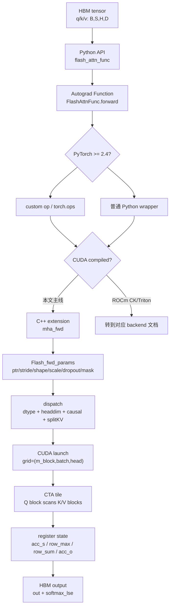

# FlashAttention 前向全链路

> 这篇只追 FA2 **CUDA compiled backend** 的 fixed-length standard forward：一次 `flash_attn_func(q, k, v)` 如何把 HBM 里的 Q/K/V tensor 变成 C++ 参数包、CUDA launch、CTA tile、寄存器里的 online softmax，最后写回 `out` 与 `softmax_lse`。ROCm CK/Triton、FA3、FA4、varlen、KV cache、backward 是其他分支，不在这条主线里展开。

## 长文读法

这篇按 fixed-length forward 的七段边界读：Python API 把普通函数变成可反传算子；PyTorch 2.4+ 经 custom op，旧版本经普通 wrapper；确认 backend 是 CUDA compiled 后，pybind/C++ 检查并装配参数，dispatch 把运行时形状变成模板实例，kernel 主循环在 tile 内完成 QK、mask、online softmax、PV，最后写回主路径需要的 `out` 和 `softmax_lse`。

| 你的任务 | 先读 | 抓住什么 |
|----------|------|----------|
| 第一次走完全链路 | 先建立模型、贯穿场景 | 本篇只追 FA2 fixed-length forward，不展开 varlen / KV cache / backward |
| 排查 Python 到 C++ 过桥 | Python 层、custom op 层、C++ 入口 | autograd、custom op、pybind 各自承担不同边界 |
| 排查参数限制 | C++ 入口、参数包 | dtype、head dim、stride、scale、mask 最终都落到参数包 |
| 排查 dispatch | Dispatch | 运行时 shape / dtype / causal 等开关在这里变成模板组合 |
| 理解 kernel 主循环 | Kernel 主循环、Online softmax、写回 | `S/P` 只在 tile 内生成和消费，长期 HBM 状态是 `O/LSE` |
| 做迁移阅读 | 读完后的迁移 | 再去 Python API、FA2 Forward、Backward、KV Cache、Hopper/CuTe 分支深入 |

## 读者先拿到什么

读完这篇，你应该能解决四类问题：

| 读者问题 | 这篇给出的答案 |
|----------|----------------|
| `flash_attn_func` 为什么看起来只是 Python 函数，却能跑 CUDA kernel？ | 在 CUDA compiled backend 下，Python API 经 autograd Function、版本化 wrapper、pybind 进入 `mha_fwd`，最终由 launch template 实例化 kernel。 |
| dtype、headdim、contiguous last dim、Ampere+ 这些限制从哪来？ | 它们不是表面 API 习惯，而是 C++ 参数检查、向量化访存、tile layout、shared memory 和模板实例的前置条件。 |
| FlashAttention 为什么不把完整 attention matrix 写回显存？ | kernel 只在 tile 内生成局部 score，马上做 mask、online softmax、未归一化指数权重与 V 的累积；常规输出只写 `out` 和每行 `softmax_lse`。 |
| 出错或性能异常时先看哪里？ | 先分辨问题卡在 Python 包装、C++ 检查、dispatch 组合，还是 kernel tile 循环。 |

## 源码阅读依据

| 层 | 读过的源码 |
|----|------------|
| Python 入口 | 来源：flash_attn/flash_attn_interface.py L1-L28；来源：flash_attn/flash_attn_interface.py L84-L150；来源：flash_attn/flash_attn_interface.py L828-L905；来源：flash_attn/flash_attn_interface.py L1156-L1230 |
| C++ API 与参数装配 | 来源：csrc/flash_attn/flash_api.cpp L70-L159；来源：csrc/flash_attn/flash_api.cpp L243-L255；来源：csrc/flash_attn/flash_api.cpp L350-L512；来源：csrc/flash_attn/flash_api.cpp L1481-L1488 |
| 参数结构 | 来源：csrc/flash_attn/src/flash.h L21-L130 |
| CUDA launch | 来源：csrc/flash_attn/src/flash_fwd_launch_template.h L32-L99；来源：csrc/flash_attn/src/flash_fwd_launch_template.h L195-L325 |
| CUDA forward kernel | 来源：csrc/flash_attn/src/flash_fwd_kernel.h L250-L430；来源：csrc/flash_attn/src/flash_fwd_kernel.h L431-L494 |
| online softmax 与 mask | 来源：csrc/flash_attn/src/softmax.h L128-L189；来源：csrc/flash_attn/src/mask.h L14-L205 |
| 上游验证方式 | 来源：tests/test_flash_attn.py L903-L1130；来源：tests/test_flash_attn.py L2197-L2228 |

## 先建立模型



把一次 fixed-length forward 想成一条搬运和压缩链：

1. Python 层看到的是 `(batch, seqlen, heads, headdim)` 的 Q/K/V。
2. C++ 层把 tensor 拆成裸指针、stride、shape、scale、mask、dropout、输出指针，塞进 `Flash_fwd_params`。
3. launch 层按 dtype、head dim、causal、dropout 选定一个编译好的模板实例。
4. kernel 层让一个 CTA 负责一块 query 行，沿 K/V 维度扫 tile；score 矩阵只在寄存器和 shared memory 的局部片段中短暂停留。
5. epilogue 层把累积好的 `acc_o` 归一化、转回 fp16/bf16，并把 `softmax_lse` 写回 HBM，供 backward 和测试使用。

这条链的关键不是“调用栈很长”，而是表示逐层收紧：Python 把用户意图整理成 API/autograd 协议，C++ 把 tensor 元数据冻结为地址、stride、shape 和 flag，kernel 不物化完整 attention matrix，只长期保留主输出与每行归一化摘要。

## 贯穿场景

我们追一个最朴素的调用：

```python
out = flash_attn_func(q, k, v, dropout_p=0.0, causal=False)
```

其中 `q/k/v` 是 CUDA tensor，形状近似为 `B=2, Sq=128, Sk=128, H=8, D=64`，dtype 是 fp16 或 bf16，最后一维 contiguous。这个场景避开 varlen、KV cache、local window、alibi、dropout、backward，只保留最能说明主路径的 fixed-length forward。

## Python 层：把普通函数变成可反传算子

公开入口 `flash_attn_func` 本身没有做计算，它的职责是固定用户 API：Q/K/V shape、MQA/GQA 约束、causal mask 语义、local window、返回值形状，以及 `return_attn_probs` 只是测试选项。最后它把所有参数交给 `FlashAttnFunc.apply`。来源：flash_attn/flash_attn_interface.py L1156-L1230

进入 `FlashAttnFunc.forward` 后，第一件重要事情是确定 `softmax_scale`，并处理 head dim 不是 8 的倍数时的 padding。随后它调用 `_wrapped_flash_attn_forward`，如果需要梯度，就保存 `q/k/v/out_padded/softmax_lse/rng_state`。这里解释了为什么 forward 内部必须产出 `softmax_lse`：它不只是给用户看的调试值，也是 backward 重建 softmax 归一化的证据。来源：flash_attn/flash_attn_interface.py L828-L878

这层的对象变化是：

```text
Python tensor q/k/v
  -> autograd context 中可保存的 q/k/v/out_padded/softmax_lse/rng_state
  -> 用户只拿到 out，除非显式要求测试用的 lse/S_dmask
```

## custom op 层：把 PyTorch 调用接到扩展模块

文件开头先做 backend 路由：普通 CUDA 直接导入 `flash_attn_2_cuda`；HIP 默认尝试 compiled extension，失败才 fallback 到 Aiter Triton；显式 Triton 环境直接选择 Aiter。普通 CUDA import 失败不会自动 fallback。`maybe_contiguous` 只修最后一维，以满足下一层末维 stride 为 1 的契约。来源：flash_attn/flash_attn_interface.py L1-L28

`_flash_attn_forward` 是 PyTorch custom op 包装层。它先对 Q/K/V 调 `maybe_contiguous`，再调用 `flash_attn_gpu.fwd(...)`，返回 `out, softmax_lse, S_dmask, rng_state`。PyTorch 2.4 之后 `_wrapped_flash_attn_forward` 会指向 `torch.ops.flash_attn._flash_attn_forward`，否则退回普通 Python 函数包装。来源：flash_attn/flash_attn_interface.py L84-L150

这一层容易误读：它不是在 Python 里“实现 attention”，而是在建立 PyTorch dispatcher 与所选 backend 的边界。只有确认 `flash_attn_gpu` 是 CUDA compiled extension 后，本文才继续进入下方 C++；ROCm CK/Triton 不能照搬后续文件链。

## C++ 入口：把 tensor 外壳剥成参数包

在 CUDA compiled 分支，pybind 表把 Python 侧的 `fwd` 绑定到 `mha_fwd`，同一个 extension 还暴露 `varlen_fwd`、`bwd`、`varlen_bwd`、`fwd_kvcache`。只有在这个分支看到 `flash_attn_gpu.fwd`，才能跳到 `mha_fwd`；同时不要把 varlen 或 KV cache 混进当前 fixed-length 场景。来源：csrc/flash_attn/flash_api.cpp L1481-L1488

`mha_fwd` 先用 `CUDAGuard` 固定当前设备，然后检查计算能力至少是 Ampere，dtype 只能是 fp16/bf16，Q/K/V dtype 必须一致，并要求三个输入都在 CUDA 上。接着它检查最后一维 contiguous、head dim 不超过 256、head dim 是 8 的倍数、K/V heads 能整除 Q heads。来源：csrc/flash_attn/flash_api.cpp L350-L395

这些检查对应的是 kernel 现实：

| 检查 | 源码层含义 |
|------|------------|
| Ampere+ | launch template 对 sm80-sm90 路径有硬约束。 |
| fp16/bf16 | 模板 dispatch 只实例化半精度输入类型。 |
| `stride(-1) == 1` | head dim 连续，才能按 tile/vector layout 读写。 |
| `head_size <= 256` | shared memory、寄存器和预编译 head-dim specialization 的边界。 |
| `head_size % 8 == 0` | C++ fixed-length 入口要求对齐；Python 层会先 pad 非 8 倍数的原始 head dim。 |
| `num_heads % num_heads_k == 0` | MQA/GQA 通过 `h_h_k_ratio` 映射 Q head 到 K/V head。 |

检查通过后，`mha_fwd` 分配 `out`，计算 `head_size_rounded/seqlen_q_rounded/seqlen_k_rounded`，分配 float32 的 `softmax_lse`。只有 `return_softmax` 且 `p_dropout > 0` 时，才分配完整的 `p` 矩阵；常规推理和训练 forward 不会把完整 attention probability 当输出写回。来源：csrc/flash_attn/flash_api.cpp L420-L447

## 参数包：kernel 只认指针、stride 和开关

`Flash_fwd_params` 继承 `Qkv_params`。`Qkv_params` 持有 Q/K/V 裸指针、batch/row/head stride、Q heads 与 K/V heads，以及 `h_h_k_ratio`。`Flash_fwd_params` 再加输出指针、`p_ptr`、`softmax_lse_ptr`、sequence/head 维度、rounded 维度、softmax scale、`cu_seqlens_*`、dropout、window、随机状态和 causal 标志。来源：csrc/flash_attn/src/flash.h L21-L130

`set_params_fprop` 是这条链里最值得慢读的函数。它把 `q.data_ptr()`、`k.data_ptr()`、`v.data_ptr()`、`out.data_ptr()` 写入参数包，把 row/head/batch stride 写进去；fixed-length 路径下 `cu_seqlens_q/k` 是 `nullptr`，所以 batch stride 也会被写入。它还设置 `p_ptr`、`softmax_lse_ptr`、`b/h/h_k/h_h_k_ratio/seqlen_q/seqlen_k/d`、`scale_softmax/log2`、dropout keep probability、window 和 `is_causal`。来源：csrc/flash_attn/flash_api.cpp L70-L159

`mha_fwd` 调 `set_params_fprop` 时明确传入 `cu_seqlens_q_d=nullptr`、`cu_seqlens_k_d=nullptr`、`seqused_k=nullptr`。这就是 fixed-length 与 varlen 的分界线：fixed-length 依赖规则 batch stride，varlen 依赖累计长度数组。来源：csrc/flash_attn/flash_api.cpp L452-L470

对象在这一刻已经从“张量”变成“kernel 参数”：

```text
q/k/v/out tensor
  -> data_ptr + stride + shape + scale + dropout + mask flags
  -> Flash_fwd_params params
```

kernel 不再理解 PyTorch tensor，只理解这些地址和整数。

## Dispatch：从运行时形状走到编译期模板

`mha_fwd` 最后在 `seqlen_k > 0` 时取当前 CUDA stream，并调用 `run_mha_fwd(params, stream)`；如果 `seqlen_k == 0`，它直接把 `out` 置零、`softmax_lse` 填成 infinity。来源：csrc/flash_attn/flash_api.cpp L497-L511

`run_mha_fwd` 用三层 switch 把运行时参数变成编译期模板：输入 dtype、head dim、是否 causal。然后根据 `num_splits` 选择普通 forward 或 split-KV forward。本文普通 dense 场景的 `num_splits=0`，所以进入 standard `run_mha_fwd_`；不要把 KV-cache forced split 或 aligned single-split 套进来。来源：csrc/flash_attn/flash_api.cpp L243-L255

launch template 再继续细分：`run_flash_fwd` 计算 `num_m_block`，设置 grid 为 `(query block, batch, head)`，判断 `is_even_MN`、`is_even_K`、是否返回 softmax、local/alibi/softcap，然后选出一个 `flash_fwd_kernel<...>` 模板实例并 launch。来源：csrc/flash_attn/src/flash_fwd_launch_template.h L32-L99

head dim 的选择不是装饰性分支。比如 `D=64`、无 dropout 时走 `128 x 128` tile；`D=128` 会根据 sm86/sm89、causal、dropout 选择 `128 x 32`、`64 x 64` 或 `128 x 64`；`D=256` 还要看设备允许的 shared memory。来源：csrc/flash_attn/src/flash_fwd_launch_template.h L195-L325

所以性能排查时不要只看 Python 参数。相同的 `flash_attn_func`，只要 head dim、causal、dropout、GPU 架构不同，落到的 tile shape 和 shared memory 压力就会不同。

## Kernel 主循环：一个 CTA 如何消化 Q/K/V tile

`flash_fwd_kernel` 本身只是薄壳，真正工作在 `compute_attn`。来源：csrc/flash_attn/src/flash_fwd_launch_template.h L32-L39

在 `compute_attn` 的主路径里，CTA 先把 Q tile 和最后一个 K tile 从 HBM 异步搬到 shared memory，必要时把 Q 再搬进寄存器；然后清零 `acc_o`，构造 `Softmax` 和 `Mask` 对象。来源：csrc/flash_attn/src/flash_fwd_kernel.h L250-L288

接下来是 FlashAttention 的核心循环。每扫一个 K/V block，kernel 会：

| kernel 局部对象 | 发生了什么 |
|-----------------|------------|
| `acc_s` | `Q @ K^T` 的当前 score tile，fp32 accumulator。 |
| `Mask` | 对越界、causal、local window、alibi 做局部修正或置 `-INFINITY`。 |
| `Softmax.row_max/row_sum` | 维护到目前为止每行的 online softmax 归一化状态。 |
| `acc_o` | 已处理 K/V blocks 的重标定输出分子，epilogue 前尚未最终归一化。 |
| `rP` | 当前 score tile 经 online update 后形成的未最终归一化指数权重，转回 fp16/bf16 后乘 V。 |

源码顺序是：加载 V tile，做 `gemm` 得到 `acc_s`，可选 softcap，mask，预取下一个 K tile，调用 `softmax_rescale_o` 更新 `row_max/row_sum` 并重缩放 `acc_o`，把 `acc_s` 转成 `rP`，可选记录/dropout，然后 `gemm_rs(acc_o, P, V)` 累积输出。来源：csrc/flash_attn/src/flash_fwd_kernel.h L301-L367

第一段循环处理必须 mask 的 block，例如 K 长度不是 tile 整数倍、causal 尾部、local window 边界；第二段循环处理不需要复杂 masking 的 block，但仍会调用 mask 的统一入口来处理 local 或非整齐边界。来源：csrc/flash_attn/src/flash_fwd_kernel.h L290-L430

这里要纠正一个常见误解：FlashAttention 不是“不算 attention score”，而是不把完整 `Sq×Sk` score/probability 矩阵长期物化到 HBM。`acc_s` 是局部 score，online update 后承载未归一化指数权重；`rP` 是其低精度副本。它们的生命周期只覆盖当前 K/V block，马上被折叠进尚未最终归一化的 `acc_o`。

## Online softmax：为什么 LSE 能替代完整概率矩阵

`Softmax` 保存每行的 `row_max` 和 `row_sum`。第一次 block 直接 reduce max、指数化、reduce sum；后续 block 会先保存旧 `row_max`，再用新旧 max 的差值重缩放旧的 `row_sum` 和已经累积的 `acc_o`，这样就能把多个 K/V block 的 softmax 合成一个完整行 softmax。来源：csrc/flash_attn/src/softmax.h L128-L167

epilogue 调 `normalize_softmax_lse`：先跨线程规约 `row_sum`，计算每行 `lse = row_max * scale + log(row_sum)`，再用 `1 / row_sum` 归一化 `acc_o`。如果有 dropout，还会乘 `rp_dropout`。来源：csrc/flash_attn/src/softmax.h L169-L189

mask 的实现也发生在 tile 内。普通越界 mask 看列号是否超过 `max_seqlen_k`；causal mask 是 local mask 的特例；统一的 `Mask::apply_mask` 会把 causal、local、alibi、非整齐 M/N 边界折叠到同一个 score tile 修改过程里。来源：csrc/flash_attn/src/mask.h L14-L205

这就是 `softmax_lse` 的意义：它记录每行完整 softmax 的归一化因子，使 backward 可以重建必要的概率关系，而不需要 forward 预先保存完整 `B x H x Sq x Sk` attention matrix。

## 写回：只把必要结果落到 HBM

主循环结束后，kernel 进入 epilogue。它调用 `normalize_softmax_lse` 得到 `lse` 并归一化 `acc_o`，把 `acc_o` 转成输入元素类型 fp16/bf16，先写到 shared memory 的输出 tile，再拷到 global memory 的 `out`。同时它把每行 `lse` 写入 `softmax_lse` 对应位置。来源：csrc/flash_attn/src/flash_fwd_kernel.h L431-L494

CUDA backend 内部固定产生 out/LSE 协议对象；公开 API 默认只返回 out：

```text
out:          B x Sq x H x D
softmax_lse: B x H x Sq
p/S_dmask:   只有 return_softmax 且 dropout_p > 0 时分配；testing only，不保证是标准概率
```

这也解释了为什么 `return_attn_probs=True` 不是日常观测接口。Python 文档已经说明它是 testing only；Python 只有在 dropout>0 时向 backend 请求 softmax 调试输出，C++ 也只在 `return_softmax && p_dropout > 0` 时分配 `p`，以避免无用 buffer 与模板组合。来源：flash_attn/flash_attn_interface.py L1203-L1215；来源：csrc/flash_attn/flash_api.cpp L441-L447

## 运行验证

如果有可用 CUDA 环境，最小正确性验证不是看 kernel 名字，而是比较输出误差：

```python
import torch
from flash_attn import flash_attn_func

torch.manual_seed(0)
q = torch.randn(2, 128, 8, 64, device="cuda", dtype=torch.float16)
k = torch.randn(2, 128, 8, 64, device="cuda", dtype=torch.float16)
v = torch.randn(2, 128, 8, 64, device="cuda", dtype=torch.float16)

out = flash_attn_func(q, k, v, dropout_p=0.0, causal=False)
ref = torch.nn.functional.scaled_dot_product_attention(
    q.transpose(1, 2),
    k.transpose(1, 2),
    v.transpose(1, 2),
).transpose(1, 2)

print((out - ref).abs().max())
```

上游测试的核心也是这个思路：`test_flash_attn_output` 构造 Q/K/V，调用 `flash_attn_func` 或 packed 版本，再用 reference attention 比较 forward、backward 和 dropout 误差边界。来源：tests/test_flash_attn.py L903-L1130

排障时可以做三类观察：

| 验证 | 期望看到什么 |
|------|--------------|
| 传入 fp32 或 CPU tensor | C++ 入口报 dtype/device 检查错误。来源：csrc/flash_attn/flash_api.cpp L368-L382 |
| 传入 `D > 256` | C++ 入口报 head dim 上限错误。来源：csrc/flash_attn/flash_api.cpp L392-L395 |
| 用 profiler 看 kernel | 能看到 `flash_fwd_kernel` 或对应实例；不同 `D/causal/dropout` 会改变模板组合。来源：csrc/flash_attn/src/flash_fwd_launch_template.h L79-L92 |

上游还专门有 race condition 测试：固定随机种子，多次运行 `flash_attn_func(..., return_attn_probs=True)`，要求 `out` 和 `lse` 重复一致。它证明该测试覆盖的 forward 输出/LSE 重复性；不能仅凭这段测试外推所有 dropout、backward 或 backend 的确定性。来源：tests/test_flash_attn.py L2197-L2228

## 常见卡点

| 症状 | 先看哪里 | 判断方式 |
|------|----------|----------|
| import 失败或没有 CUDA 扩展 | Python 文件开头的 backend 路由 | 先区分 CUDA、ROCm CK、ROCm Triton；普通 CUDA 不自动 fallback。 |
| 报 dtype/device/contiguous 错 | `mha_fwd` 参数检查 | 这些错误在 launch 之前发生，不要去 kernel 里找。 |
| `return_attn_probs=True` 没返回期望矩阵 | Python 文档与 C++ `return_softmax` 条件 | 它是测试选项；dropout=0 第三项为空，dropout>0 的 `p/S_dmask` 也不保证是标准概率。 |
| 性能随 head dim 或 causal 改变很大 | head-dim launch helpers | tile shape、warps、shared memory 组合会变。 |
| 以为 varlen 也走同一组 stride | `set_params_fprop` 的 `cu_seqlens_*` 分支 | fixed-length 用 batch stride，varlen 用累计长度。 |
| 想找完整 attention matrix | kernel 主循环和 epilogue | 常规路径只保留局部 tile、`acc_o`、`softmax_lse`，不写完整矩阵。 |

无可加载 CUDA backend 时，执行静态替代：

```powershell
@'
import ast
from pathlib import Path
ast.parse(Path("flash-attn/flash-attention/flash_attn/flash_attn_interface.py").read_text(encoding="utf-8"))
print("Python interface AST: PASS")
'@ | python -

rg -n 'mha_fwd|set_params_fprop|run_mha_fwd|softmax_rescale_o|normalize_softmax_lse' flash-attn/flash-attention/csrc/flash_attn
```

预期能静态定位 CUDA compiled 主线的 C++ 入口、参数冻结、dispatch、online update 与 epilogue。它不证明实际 backend、ABI、GPU 数值或性能。

## 读完后的迁移

如果你想补原理，先读 [[FlashAttention-Attention-IO]] 和 [[FlashAttention-Online-Softmax]]；如果你想继续沿代码走，读 [[FlashAttention-Python-API]] 和 [[FlashAttention-FA2-Forward]]。等 fixed-length forward 读顺后，再进入 [[FlashAttention-KV-Cache]]、[[FlashAttention-Backward]] 和 [[FlashAttention-Hopper与CuTe]]，否则容易把 FA2、FA3、FA4、varlen、decode cache 的主线混在一起。
