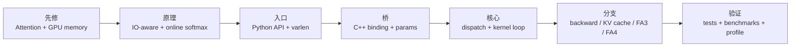

# FlashAttention 学习路径

## 读者任务

这篇解决“我应该按什么顺序读 FlashAttention”的问题。读完后你应该能从三种任务中选路：

- 第一次读：先建立 IO-aware attention 和源码分层模型。
- 正在排障：按症状进入 API、C++ binding、dispatch、kernel 或 KV cache。
- 准备改代码：按修改点找到必须先理解的不变量和测试入口。

## 长文读法

这篇本身就是路线图，读法是先选任务再走路径：第一次读按 Attention / IO 原理、Python API、C++ binding、kernel、分支和验证推进；排障时按症状跳到对应层；改代码时先找到必须保护的不变量和测试入口。

| 你的任务 | 先读 | 抓住什么 |
|----------|------|----------|
| 第一次读 FlashAttention | 总图、首次阅读路线 | 不要从 CUDA 文件随机开读，先建立 Q/K/V 形态和分层模型 |
| 确认 API 分叉 | 上游证据、源码主线 | dense、varlen、KV cache、FA3、FA4 是不同入口或分支 |
| 正在排障 | 排障入口 | 先定位问题在 API、binding、dispatch、kernel、KV cache 还是 build |
| 准备改代码 | 改代码路线 | 改 forward、backward、KV cache、FA4 前要先读对应不变量 |
| 做收尾验证 | 运行验证、收官 | 用源码命中和测试入口确认路线没有漂移 |

## 总图：一个 Q/K/V tensor 的阅读路线



不要从 `csrc/flash_attn/src/*.cu` 随机挑文件开始。先确认自己能解释：Q/K/V 形态是什么，是否需要 `cu_seqlens`，是否走 KV cache，最终是 FA2 extension、FA3 Hopper，还是 FA4 CuTeDSL。

## 上游证据：公开 API 是第一道入口

普通 dense API 的参数已经暴露了后续大部分分叉：mask、local window、softcap、ALiBi、deterministic backward、是否返回 attention probs。

```python
# 来源：flash_attn/flash_attn_interface.py L1156-L1168
def flash_attn_func(
    q,
    k,
    v,
    dropout_p=0.0,
    softmax_scale=None,
    causal=False,
    window_size=(-1, -1),  # -1 means infinite context window
    softcap=0.0, # 0.0 means deactivated
    alibi_slopes=None,
    deterministic=False,
    return_attn_probs=False,
):
```

KV cache API 则说明 decode 是独立阅读路线：它把 cache append、RoPE 和 attention 合在一条推理路径中。

```python
# 来源：flash_attn/flash_attn_interface.py L1485-L1510
def flash_attn_with_kvcache(
    q,
    k_cache,
    v_cache,
    k=None,
    v=None,
    rotary_cos=None,
    rotary_sin=None,
    cache_seqlens: Optional[Union[(int, torch.Tensor)]] = None,
    cache_batch_idx: Optional[torch.Tensor] = None,
    cache_leftpad: Optional[torch.Tensor] = None,
    block_table: Optional[torch.Tensor] = None,
    softmax_scale=None,
    causal=False,
    window_size=(-1, -1),  # -1 means infinite context window
    softcap=0.0, # 0.0 means deactivated
    rotary_interleaved=True,
    alibi_slopes=None,
    num_splits=0,
    return_softmax_lse=False,
):
    """
    If k and v are not None, k_cache and v_cache will be updated *inplace* with the new values from
    k and v. This is useful for incremental decoding: you can pass in the cached keys/values from
    the previous step, and update them with the new keys/values from the current step, and do
    attention with the updated cache, all in 1 kernel.
```

FA4 另有 CuTeDSL API，不应混到 FA2 C++/CUDA extension 路线里。

```python
# 来源：flash_attn/cute/__init__.py L10-L18
from .interface import (
    flash_attn_func,
    flash_attn_varlen_func,
)

__all__ = [
    "flash_attn_func",
    "flash_attn_varlen_func",
]
```

## 首次阅读路线

| 顺序 | 读什么 | 读完要能回答 |
|------|--------|--------------|
| 1 | [[FlashAttention-零基础先修]] | 标准 attention 为什么会产生 `S/P` 两个大矩阵 |
| 2 | [[FlashAttention-代际演进]]、[[FlashAttention-版本演进全景]] | FA1、FA2、FA3、FA4 的边界是什么 |
| 3 | [[FlashAttention-项目总览]]、[[FlashAttention-架构分层]] | 源码从 Python 到 kernel 经过哪几道门 |
| 4 | [[FlashAttention-Attention-IO]]、[[FlashAttention-算法原点]] | tile + online softmax 为什么能减少 HBM traffic |
| 5 | [[FlashAttention-Online-Softmax]] | `row_max/row_sum/acc_o/LSE` 如何保持 exact softmax |
| 6 | [[FlashAttention-前向全链路]] | 一个 Q/K/V tensor 如何从 API 走到 kernel 再返回 |

第一轮只要求读懂主线，不要求看完每个 specialization。能把 `S/P 不落 HBM`、`LSE 保存给 backward`、`dispatch 组合爆炸` 三件事串起来，就可以进入源码层。

## 源码主线

| 阶段 | 读什么 | 读者抓手 |
|------|--------|----------|
| Python API | [[FlashAttention-Python-API]]、[[FlashAttention-Python-API-源码走读]] | dense、packed、varlen、KV cache API 如何分叉 |
| 数据形态 | [[FlashAttention-Python-API-数据流]] | padded batch 如何变成 packed token + `cu_seqlens` |
| C++ binding | [[FlashAttention-FA2-Forward-核心概念]] | `Flash_fwd_params` 装了哪些指针、shape、mask、dropout 状态 |
| Dispatch | [[FlashAttention-FA2版本演进]]、[[FlashAttention-FA2-Forward-源码走读]] | dtype、head_dim、causal、local、ALiBi、softcap 如何变成模板常量 |
| Kernel loop | [[FlashAttention-FA2-Forward-数据流]] | `QK → mask → online softmax → PV → LSE/O` 顺序 |
| Backward | [[FlashAttention-Backward]] | forward 保存什么，backward 为什么重算 |
| Decode | [[FlashAttention-KV-Cache]] | cache append、paged KV、SplitKV、RoPE 如何改变路径 |
| FA3/FA4 | [[FlashAttention-Hopper与CuTe]]、[[FlashAttention-FA3-Hopper演进]]、[[FlashAttention-FA4-CuTeDSL演进]] | Hopper beta 和 CuTeDSL/JIT 如何接上主线 |

## 排障入口

| 症状 | 先读 | 源码入口 |
|------|------|----------|
| import 或 `undefined symbol` | [[FlashAttention-Python-API-排障指南]] | Python package、`flash_attn_2_cuda`、PyTorch/CUDA ABI |
| dtype、device、stride 报错 | [[FlashAttention-架构分层]] | `csrc/flash_attn/flash_api.cpp` 检查段 |
| `causal=True` 且 `seqlen_q != seqlen_k` 结果不符合直觉 | [[FlashAttention-FA2版本演进]] | API docstring 和 README 2.1 |
| varlen 输出跨样本污染 | [[FlashAttention-Python-API-数据流]] | `cu_seqlens_q/k`、unpad/pad |
| decode 性能差 | [[FlashAttention-KV-Cache-源码走读]] | `flash_attn_with_kvcache`、SplitKV、paged KV |
| backward 数值或显存异常 | [[FlashAttention-Backward-源码走读]] | `softmax_lse`、RNG、deterministic backward |
| FA3/FA4 安装或首轮运行慢 | [[FlashAttention-Hopper与CuTe-排障指南]] | `hopper/` 要求、`flash_attn.cute` JIT/cache |

## 改代码路线

| 修改点 | 必读 | 不变量 |
|--------|------|--------|
| 新增 Python 参数 | [[FlashAttention-Python-API-源码走读]]、[[FlashAttention-FA2-Forward-核心概念]] | 参数必须下沉到 C++ binding、params、fake tensor/autograd 路径 |
| 改变 mask/local/softcap | [[FlashAttention-FA2-Forward-源码走读]] | dispatch 模板组合和 kernel mask 语义要一致 |
| 改 varlen | [[FlashAttention-Python-API-数据流]] | `cu_seqlens` 必须隔离样本边界 |
| 改 backward | [[FlashAttention-Backward-源码走读]] | forward 保存的 `out/LSE/RNG` 必须足够 backward 重算 |
| 改 KV cache | [[FlashAttention-KV-Cache-数据流]] | cache 容量、offset、block table、RoPE position 必须一致 |
| 改 FA4 | [[FlashAttention-FA4-CuTeDSL演进]] | compile key、cache、GPU 架构和 API 表面要同时考虑 |

## 运行验证

| 阶段 | 验证方式 | 预期 |
|------|----------|------|
| 原理 | 小 shape 对比 PyTorch reference | 输出接近，差异在容差内 |
| API | import dense/varlen/KV cache API | Python 入口可用 |
| C++ binding | 构造错误 dtype/stride/device | 在 launch 前给出明确检查错误 |
| Forward | 跑 upstream forward tests 或最小调用 | `out` 和 `softmax_lse` shape 正确 |
| Decode | 跑 KV cache 测试或 profile 小 `seqlen_q` | 重点热点在 KV load 和 combine |
| FA4 | import `flash_attn.cute` 并触发一次 JIT | 首次可能编译，后续命中 cache |

## 收官

完成这条导读后，用 [[FlashAttention-前向全链路]] 复述一次 Q/K/V tensor 的生命周期，再回到 [[knowledge_maps/三框架知识地图]] 看它和 SGLang attention backend、Slime rollout serving 的关系。
