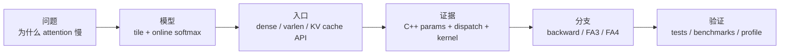

# FlashAttention 导读与总览

## 读者任务

这一层是 FlashAttention 的读者入口，解决三个问题：

- 你为什么要读 FlashAttention：它是理解 attention kernel、长上下文、KV cache、训练反向和新 GPU 后端的共同入口。
- 读完能解决什么：能判断一个 attention 问题发生在算法、API、C++ binding、dispatch、kernel、KV cache，还是 FA3/FA4 后端。
- 源码主线是什么：一个 Q/K/V tensor 从 Python API 进入 C++ 参数包，再经过 dispatch 到 GPU kernel，最后写回 `out` 和 `softmax_lse`。

## 入口模型：先看对象旅程，再看文件树



第一轮不要从 `csrc/flash_attn/src/` 随机挑 `.cu` 文件读。先明确自己在追哪种对象：

| 对象 | 为什么重要 | 入口 |
|------|------------|------|
| Q/K/V tensor | 所有路径的输入形态，dense、packed、varlen、KV cache 都从这里分叉 | [[FlashAttention-关键概念]] |
| `softmax_lse` | forward 保存给 backward 的每行摘要 | [[FlashAttention-Online-Softmax]] |
| `cu_seqlens` | varlen batch 的样本边界 | [[FlashAttention-Python-API-数据流]] |
| `Flash_fwd_params` | Python 参数下沉到 kernel 的契约 | [[FlashAttention-FA2-Forward-核心概念]] |
| KV cache | decode 不同于训练 forward 的核心状态 | [[FlashAttention-KV-Cache]] |
| CuTeDSL compile key | FA4 把组合选择推到 JIT/cache 层 | [[FlashAttention-FA4-CuTeDSL演进]] |

## 上游证据：API 参数就是第一张地图

公开 dense API 已经把后续专题的关键分叉列出来：dropout、causal/local mask、softcap、ALiBi、deterministic backward、是否返回 attention 概率。

```python
# 来源：flash_attn/flash_attn_interface.py L1156-L1168
def flash_attn_func(
    q,
    k,
    v,
    dropout_p=0.0,
    softmax_scale=None,
    causal=False,
    window_size=(-1, -1),  # -1 means infinite context window
    softcap=0.0, # 0.0 means deactivated
    alibi_slopes=None,
    deterministic=False,
    return_attn_probs=False,
):
```

读者抓手：如果你还不能解释这些参数如何改变 dispatch 或 kernel 行为，就不应该直接进 generated kernel。先把 API 形态和数据流读清楚。

## 推荐阅读顺序

| 文档 | 读完要能回答 |
| ------ | -------------- |
| [[FlashAttention-零基础先修]] | 标准 attention 为什么被 HBM traffic 卡住 |
| [[FlashAttention-代际演进]] | FA1、FA2、FA3、FA4 的边界是什么 |
| [[FlashAttention-版本演进全景]] | 每一代相对上一代新增了什么 |
| [[FlashAttention-项目总览]] | 仓库目录如何映射到源码主线 |
| [[FlashAttention-架构分层]] | Python API、C++ binding、dispatch、kernel 各负责什么 |
| [[FlashAttention-关键概念]] | IO-aware、online softmax、LSE、varlen、KV cache 如何落到源码对象 |
| [[FlashAttention-前向全链路]] | 一个 Q/K/V tensor 如何完整走一遍 |
| [[FlashAttention-学习路径]] | 首次阅读、排障、改代码分别怎么走 |
| [[FlashAttention-源码地图]] | 已知文件名时如何反查专题 |
| [[FlashAttention-术语表]] | 术语速查 |

## 专题入口

| 专题 | 入口 | 核心问题 |
|------|------|----------|
| Attention IO | [[FlashAttention-Attention-IO]] | 为什么 `S/P` 不应长期落 HBM |
| Online Softmax | [[FlashAttention-Online-Softmax]] | 分块后如何保持 exact softmax |
| Python API | [[FlashAttention-Python-API]] | dense、packed、varlen、KV cache API 如何分叉 |
| FA2 Forward | [[FlashAttention-FA2-Forward]] | C++ params、launch template、CUDA 主循环如何衔接 |
| FA2 Backward | [[FlashAttention-Backward]] | backward 为什么重算 score，保存哪些摘要 |
| KV Cache | [[FlashAttention-KV-Cache]] | decode、append KV、paged KV、SplitKV 如何改变路径 |
| Hopper/CuTe | [[FlashAttention-Hopper与CuTe]] | FA3/FA4 如何面向 Hopper/Blackwell 和 JIT/cache |

## 按任务选路

| 你的状态 | 推荐入口 | 不要做什么 |
|----------|----------|------------|
| 第一次读 | [[FlashAttention-零基础先修]] → [[FlashAttention-关键概念]] | 不要直接看所有 `.cu` 文件 |
| 想理解仓库 | [[FlashAttention-项目总览]] → [[FlashAttention-架构分层]] | 不要把 FA2、FA3、FA4 混成一条路径 |
| 正在排障 | [[FlashAttention-学习路径]] 的排障表 | 不要只搜索报错字符串，先判断边界 |
| 准备改代码 | [[FlashAttention-前向全链路]] → 相关专题 checkpoint | 不要只改 Python 参数，忘记 C++/kernel/fake tensor 路径 |
| 对比 SGLang/Slime | [[knowledge_maps/三框架知识地图]] | 不要把 FlashAttention 当成调度器，它是算子后端 |

## 运行验证

| 验证目标 | 操作 | 预期 |
|----------|------|------|
| 验证入口可用 | `python -c "from flash_attn import flash_attn_func"` | Python API import 成功 |
| 验证 API 形态 | import `flash_attn_func`、`flash_attn_varlen_func`、`flash_attn_with_kvcache` | dense、varlen、decode 入口都存在 |
| 验证源码证据 | 运行 `node maintenance/audit_source_evidence.mjs` | FlashAttention 引用无缺文件、无坏行号 |
| 验证读者路线 | 从本页跳到 [[FlashAttention-学习路径]] | 能按首次阅读、排障、改代码选路径 |

## 复盘

导读层的判断标准不是“链接够不够多”，而是读者能否在两分钟内判断自己该读哪条线。FlashAttention 的主线是一个 Q/K/V tensor 的旅程；文件树、版本演进和专题目录都应服务这条旅程。
