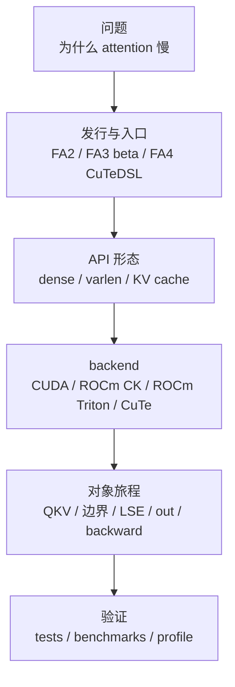

# FlashAttention 导读与总览

## 读者任务

这一层是 FlashAttention 的读者入口，解决三个问题：

- 你为什么要读 FlashAttention：它是理解 attention kernel、长上下文、KV cache、训练反向和新 GPU 后端的共同入口。
- 读完能解决什么：能判断一个 attention 问题发生在算法、API、C++ binding、dispatch、kernel、KV cache，还是 FA3/FA4 后端。
- 源码主线是什么：先判断调用属于 FA2 主包、FA3 独立 beta 包还是 FA4 CuTeDSL 包；在 FA2 内再判断 CUDA compiled、ROCm CK compiled 或 ROCm Triton/Aiter，最后沿 Q/K/V、边界元数据、行级归一化状态与输出追到具体实现。

## 入口模型：先判路径，再追对象，最后看文件树



第一轮不要从 `csrc/flash_attn/src/` 随机挑 `.cu` 文件读。先完成两个判断：你安装/阅读的是哪个发行包，当前平台路由到哪个 backend。之后再明确自己在追哪种对象：

| 对象 | 为什么重要 | 入口 |
|------|------------|------|
| Q/K/V tensor | 所有路径的输入形态，dense、packed、varlen、KV cache 都从这里分叉 | [[FlashAttention-关键概念]] |
| `softmax_lse` | forward 内部返回的每行 logsumexp 摘要，训练路径供 backward 使用 | [[FlashAttention-Online-Softmax]] |
| `cu_seqlens` | varlen batch 的样本边界 | [[FlashAttention-Python-API-数据流]] |
| `Flash_fwd_params` | FA2 compiled 路径把形状、指针和选项送到 kernel 的契约；不是所有 backend 的共同对象 | [[FlashAttention-FA2-Forward-核心概念]] |
| KV cache | decode 不同于训练 forward 的核心状态 | [[FlashAttention-KV-Cache]] |
| CuTeDSL compile key | FA4 当前实现用于编译缓存命中的关键对象；首次编译与稳态执行要分开观察 | [[FlashAttention-FA4-CuTeDSL演进]] |

## 上游证据：API 参数就是第一张地图

FA2 公开 dense API 已经把后续专题的关键分叉列出来：dropout、causal/local mask、softcap、ALiBi、deterministic backward，以及是否请求调试用 softmax 相关返回值。这里的 `return_attn_probs` 不能仅凭名字解释为“返回最终数学概率矩阵”；其公开返回契约、dropout 条件与底层缓冲语义要到 Python API 专题核对。

```python
# 来源：flash_attn/flash_attn_interface.py L1156-L1168
def flash_attn_func(
    q,
    k,
    v,
    dropout_p=0.0,
    softmax_scale=None,
    causal=False,
    window_size=(-1, -1),  # -1 means infinite context window
    softcap=0.0, # 0.0 means deactivated
    alibi_slopes=None,
    deterministic=False,
    return_attn_probs=False,
):
```

读者抓手：这张卡只证明 FA2 dense 入口暴露了哪些开关，不证明所有 backend 用同一条 dispatch，也不证明每个参数组合都受支持。如果你还不能说清“参数在哪一层被校验、路由或消费”，先读 API 与架构分层，再进 kernel。

## 一分钟路径判断

| 看到的线索 | 先下的判断 | 下一步 |
|------------|------------|--------|
| `flash_attn_func`、`flash_attn_varlen_func` | FA2 主包公开入口 | 看平台路由；CUDA/ROCm compiled 与 ROCm Triton 不共用完整调用链 |
| `flash_attn_with_kvcache` | FA2 decode/KV-cache 专用入口 | 追 append、rotary、paged addressing、split 决策；不要套普通训练 backward |
| `flash_attn_3`、`hopper/` | FA3 独立 beta 路径 | 按其硬件与 CUDA 要求验证，不假设已并入默认 FA2 包 |
| `flash_attn.cute`、`flash-attn-4` | FA4 CuTeDSL 独立发行 | 追架构实现、compile key/cache，并分开测首次编译与稳态运行 |
| import 失败 | 尚未进入算法执行 | 先核对包、PyTorch ABI、扩展、GPU 架构和驱动，不从 kernel 数值逻辑开始猜 |

## 推荐阅读顺序

| 文档 | 读完要能回答 |
| ------ | -------------- |
| [[FlashAttention-零基础先修]] | 标准 attention 为什么被 HBM traffic 卡住 |
| [[FlashAttention-代际演进]] | FA1、FA2、FA3、FA4 的边界是什么 |
| [[FlashAttention-版本演进全景]] | 每一代相对上一代新增了什么 |
| [[FlashAttention-项目总览]] | 仓库目录如何映射到源码主线 |
| [[FlashAttention-架构分层]] | Python API 如何路由到 compiled、Triton 或 CuTe 实现，各层负责什么 |
| [[FlashAttention-关键概念]] | IO-aware、online softmax、LSE、varlen、KV cache 如何落到源码对象 |
| [[FlashAttention-前向全链路]] | 一个 Q/K/V tensor 如何完整走一遍 |
| [[FlashAttention-学习路径]] | 首次阅读、排障、改代码分别怎么走 |
| [[FlashAttention-源码地图]] | 已知文件名时如何反查专题 |
| [[FlashAttention-术语表]] | 术语速查 |

## 专题入口

| 专题 | 入口 | 核心问题 |
|------|------|----------|
| Attention IO | [[FlashAttention-Attention-IO]] | 为什么 `S/P` 不应长期落 HBM |
| Online Softmax | [[FlashAttention-Online-Softmax]] | 分块后如何保持 exact softmax |
| Python API | [[FlashAttention-Python-API]] | dense、packed、varlen、KV cache API 如何分叉 |
| FA2 Forward | [[FlashAttention-FA2-Forward]] | C++ params、launch template、CUDA 主循环如何衔接 |
| FA2 Backward | [[FlashAttention-Backward]] | backward 为什么重算 score，保存哪些摘要 |
| KV Cache | [[FlashAttention-KV-Cache]] | decode、append KV、paged KV、SplitKV 如何改变路径 |
| Hopper/CuTe | [[FlashAttention-Hopper与CuTe]] | FA3/FA4 如何面向 Hopper/Blackwell 和 JIT/cache |

## 按任务选路

| 你的状态 | 推荐入口 | 不要做什么 |
|----------|----------|------------|
| 第一次读 | [[FlashAttention-零基础先修]] → [[FlashAttention-关键概念]] | 不要直接看所有 `.cu` 文件 |
| 想理解仓库 | [[FlashAttention-项目总览]] → [[FlashAttention-架构分层]] | 不要把 FA2、FA3、FA4 混成一条路径 |
| 正在排障 | [[FlashAttention-学习路径]] 的排障表 | 不要只搜索报错字符串，先判断边界 |
| 准备改代码 | [[FlashAttention-前向全链路]] → 相关专题 checkpoint | 不要只改 Python 参数，忘记后端路由、实现约束、测试与 fake tensor 路径 |
| 对比 SGLang/Slime | [[knowledge_maps/三框架知识地图]] | 不要把 FlashAttention 当成调度器，它是算子后端 |

## 运行验证

| 验证目标 | 操作 | 预期 |
|----------|------|------|
| 无扩展环境下定位入口 | `rg -n '^def flash_attn_(func|varlen_func|with_kvcache)' flash-attn/flash-attention/flash_attn/flash_attn_interface.py` | 静态命中 dense、varlen、KV-cache 定义；只证明源码存在 |
| 动态验证 FA2 入口 | 在匹配 PyTorch、CUDA/ROCm 与已编译扩展的环境中 import `flash_attn_func`、`flash_attn_varlen_func`、`flash_attn_with_kvcache` | 三个公开入口可导入；失败时记录 ABI/扩展错误，不把环境失败写成算法失败 |
| 验证源码证据 | 运行 `node maintenance/audit_source_evidence.mjs` | FlashAttention 引用无缺文件、无坏行号 |
| 验证读者路线 | 从本页跳到 [[FlashAttention-学习路径]] | 能按首次阅读、排障、改代码选路径 |

## 复盘

导读层的判断标准不是“链接够不够多”，而是读者能否在两分钟内回答三件事：哪个发行包、哪个 backend、正在追哪个对象。Q/K/V tensor 的旅程仍是算法主线，但它必须先放进正确的 FA2/FA3/FA4 与 CUDA/ROCm/CuTe 路径；文件树、版本演进和专题目录都服务于这三个判断。
