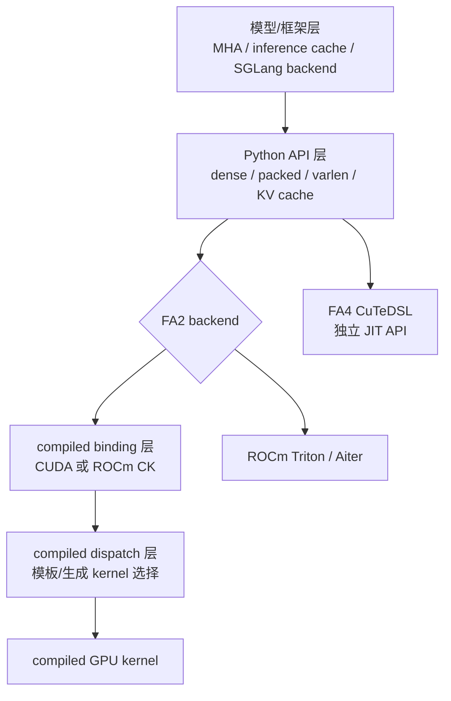

# FlashAttention 架构分层

## 读者任务

这篇解决“一个上层 attention 调用到底穿过哪些边界”的问题。读完后你应该能做到：

- 把模型层、Python API、backend 路由、compiled binding、kernel dispatch、GPU kernel 分清。
- 看到报错、profile 栈或编译日志时，先判断 backend，再判断问题在张量形态、extension ABI、模板分派还是 kernel 主循环。
- 知道 FA4 CuTeDSL/JIT 是旁路后端，不等同于 FA2 的 `flash_attn_2_cuda`。

## 先建立模型：公共入口之后先分 backend



这些层次不是文件目录的简单分层，而是责任边界：

| 层 | 消费什么 | 产出什么 | 常见问题 |
|----|----------|----------|----------|
| 模型/框架层 | hidden states、MHA 配置、inference cache | Q/K/V、mask、cache 参数 | GQA/MQA、RoPE、cache offset 错 |
| Python API 层 | PyTorch tensor 和用户参数 | autograd 状态、dense/varlen wrapped op 或 KV-cache 直调 | layout、varlen、compile/fake tensor、cache 状态 |
| Backend 路由 | 平台、环境变量、构建产物 | CUDA compiled、ROCm CK compiled 或 ROCm Triton | wheel/ABI、Aiter、错误外推 |
| Compiled binding 层 | extension 输入 | CUDA `Flash_*_params` 或 CK 对应参数契约 | dtype、device、stride、平台门禁 |
| Dispatch 层 | 参数包和 runtime 条件 | CUDA 模板实例、CK 生成 kernel 或 Triton config | head_dim、mask、功能组合、编译体积 |
| GPU kernel 层 | 指针、shape、编译期/运行时配置 | `out`、`softmax_lse`、可选调试状态 | 数值差异、LSE、mask、dropout、访存 |

## 模型层：先把语义压成 API 参数

模型层并不直接写 CUDA。它选择 FlashAttention 还是 reference attention，并把 `causal`、`softmax_scale`、dropout、ALiBi、window 等上层语义传给内部 attention 类。

```python
# 来源：flash_attn/modules/mha.py L448-L480
        inner_attn_cls = (
            partial(FlashSelfAttention, alibi_slopes=alibi_slopes, window_size=window_size)
            if use_flash_attn
            else SelfAttention
        )
        inner_cross_attn_cls = (
            partial(FlashCrossAttention, alibi_slopes=alibi_slopes, window_size=window_size)
            if use_flash_attn
            else CrossAttention
        )
        if not self.cross_attn:
            self.Wqkv = nn.Linear(embed_dim, qkv_dim, bias=qkv_proj_bias, **factory_kwargs)
        else:
            self.Wq = nn.Linear(embed_dim, embed_dim, bias=qkv_proj_bias, **factory_kwargs)
            self.Wkv = nn.Linear(embed_dim, kv_dim, bias=qkv_proj_bias, **factory_kwargs)
        if self.dwconv:
            if self.num_heads_kv == self.num_heads:
                self.dwconv_qkv = nn.Conv1d(
                    qkv_dim, qkv_dim, kernel_size=3, padding=2, groups=qkv_dim
                )
            else:
                self.dwconv_q = nn.Conv1d(
                    embed_dim, embed_dim, kernel_size=3, padding=2, groups=embed_dim
                )
                self.dwconv_kv = nn.Conv1d(kv_dim, kv_dim, kernel_size=3, padding=2, groups=kv_dim)
        self.inner_attn = inner_attn_cls(
            causal=causal,
            softmax_scale=softmax_scale,
            attention_dropout=dropout,
        )
        self.inner_cross_attn = inner_cross_attn_cls(
            causal=causal, softmax_scale=softmax_scale, attention_dropout=dropout
        )
```

读者抓手：`use_flash_attn` 是模型层的分叉，不是 kernel 层的分叉。如果模型还没有把 Q/K/V、head 数、cache offset 整对，底层 kernel 再快也只能放大错误。

## Python API 层：决定走哪个 dispatcher 入口

Python 层一方面暴露 dense、varlen、KV cache API，另一方面为 dense/varlen 适配 PyTorch 2.4+ 的 custom op dispatcher。KV-cache 在当前基线直接调用 `flash_attn_gpu.fwd_kvcache`，不经过同一 fake/custom-op 路径。

```python
# 来源：flash_attn/flash_attn_interface.py L147-L150
if torch.__version__ >= "2.4.0":
    _wrapped_flash_attn_forward = torch.ops.flash_attn._flash_attn_forward
else:
    _wrapped_flash_attn_forward = _flash_attn_forward
```

普通 dense API 的签名已经包含后续 dispatch 需要的大部分分叉条件：

```python
# 来源：flash_attn/flash_attn_interface.py L1156-L1168
def flash_attn_func(
    q,
    k,
    v,
    dropout_p=0.0,
    softmax_scale=None,
    causal=False,
    window_size=(-1, -1),  # -1 means infinite context window
    softcap=0.0, # 0.0 means deactivated
    alibi_slopes=None,
    deterministic=False,
    return_attn_probs=False,
):
```

读者抓手：这些 Python 参数会影响 backend 参数、返回协议与 kernel 选择，但后续机制取决于实际 backend。只有 CUDA compiled 路线才能直接套用下文的 `Flash_fwd_params` 与模板分派证据。

## CUDA compiled binding：把用户输入冻结成参数包

下面的 CUDA C++ 入口先做硬约束检查。这里的约束不是“风格要求”，而是该 CUDA kernel 的访存和模板假设能否成立；不能外推成 ROCm CK/Triton 的完整门禁。

```cpp
// 来源：csrc/flash_attn/flash_api.cpp L351-L381
mha_fwd(at::Tensor &q,         // batch_size x seqlen_q x num_heads x round_multiple(head_size, 8)
        const at::Tensor &k,         // batch_size x seqlen_k x num_heads_k x round_multiple(head_size, 8)
        const at::Tensor &v,         // batch_size x seqlen_k x num_heads_k x round_multiple(head_size, 8)
        std::optional<at::Tensor> &out_,             // batch_size x seqlen_q x num_heads x round_multiple(head_size, 8)
        std::optional<at::Tensor> &alibi_slopes_, // num_heads or batch_size x num_heads
        const float p_dropout,
        const float softmax_scale,
        bool is_causal,
        int window_size_left,
        int window_size_right,
        const float softcap,
        const bool return_softmax,
        std::optional<at::Generator> gen_) {

    // Otherwise the kernel will be launched from cuda:0 device
    at::cuda::CUDAGuard device_guard{q.device()};

    auto [cc_major, cc_minor] = get_compute_capability(get_current_device());
    bool is_sm8x_min = cc_major >= 8;
    TORCH_CHECK(is_sm8x_min, "FlashAttention only supports Ampere GPUs or newer.");

    auto q_dtype = q.dtype();
    TORCH_CHECK(q_dtype == torch::kFloat16 || q_dtype == torch::kBFloat16,
                "FlashAttention only support fp16 and bf16 data type");
    TORCH_CHECK(k.dtype() == q_dtype, "query and key must have the same dtype");
    TORCH_CHECK(v.dtype() == q_dtype, "query and value must have the same dtype");

    CHECK_DEVICE(q); CHECK_DEVICE(k); CHECK_DEVICE(v);

    TORCH_CHECK(q.stride(-1) == 1, "Input tensor must have contiguous last dimension");
    TORCH_CHECK(k.stride(-1) == 1, "Input tensor must have contiguous last dimension");
```

随后它把 tensor、shape、mask、dropout、softmax、LSE 指针都装入 `Flash_fwd_params`，再交给 `run_mha_fwd`。

```cpp
// 来源：csrc/flash_attn/flash_api.cpp L452-L470
    Flash_fwd_params params;
    set_params_fprop(params,
                     batch_size,
                     seqlen_q, seqlen_k,
                     seqlen_q_rounded, seqlen_k_rounded,
                     num_heads, num_heads_k,
                     head_size, head_size_rounded,
                     q, k, v, out,
                     /*cu_seqlens_q_d=*/nullptr,
                     /*cu_seqlens_k_d=*/nullptr,
                     /*seqused_k=*/nullptr,
                     return_softmax ? p.data_ptr() : nullptr,
                     softmax_lse.data_ptr(),
                     p_dropout,
                     softmax_scale,
                     window_size_left,
                     window_size_right,
                     softcap
                     );
```

读者抓手：对 CUDA compiled 路线，C++ binding 是“语义冻结点”：Python 参数到这里变成指针、stride、shape、flag 和 buffer 生命周期。ROCm CK 有自己的 binding/生成代码，Triton 路线则不经过这份 `flash_api.cpp`。

## CUDA Dispatch：运行时条件变成模板常量

FA2 的性能取舍是把许多分支提前实例化，而不是让 kernel 主循环里到处判断。

```cpp
// 来源：csrc/flash_attn/src/flash_fwd_launch_template.h L63-L79
    const int num_m_block = (params.seqlen_q + Kernel_traits::kBlockM - 1) / Kernel_traits::kBlockM;
    dim3 grid(num_m_block, params.b, params.h);
    const bool is_even_MN = params.cu_seqlens_q == nullptr && params.cu_seqlens_k == nullptr && params.seqlen_k % Kernel_traits::kBlockN == 0 && params.seqlen_q % Kernel_traits::kBlockM == 0;
    const bool is_even_K = params.d == Kernel_traits::kHeadDim;
    const bool return_softmax = params.p_ptr != nullptr;
    BOOL_SWITCH(is_even_MN, IsEvenMNConst, [&] {
        EVENK_SWITCH(is_even_K, IsEvenKConst, [&] {
            LOCAL_SWITCH((params.window_size_left >= 0 || params.window_size_right >= 0) && !Is_causal, Is_local, [&] {
                BOOL_SWITCH(return_softmax, ReturnSoftmaxConst, [&] {
                    ALIBI_SWITCH(params.alibi_slopes_ptr != nullptr, Has_alibi, [&] {
                        SOFTCAP_SWITCH(params.softcap > 0.0, Is_softcap, [&] {
                            // Will only return softmax if dropout, to reduce compilation time.
                            // If not IsEvenKConst, we also set IsEvenMNConst to false to reduce number of templates.
                            // If return_softmax, set IsEvenMNConst to false to reduce number of templates
                            // If head dim > 128, set IsEvenMNConst to false to reduce number of templates
                            // If Is_local, set Is_causal to false
                            auto kernel = &flash_fwd_kernel<Kernel_traits, Is_dropout && !Is_softcap, Is_causal, Is_local && !Is_causal, Has_alibi, IsEvenMNConst && IsEvenKConst && !Is_local && !Has_alibi && !ReturnSoftmaxConst && Kernel_traits::kHeadDim <= 128, IsEvenKConst && !ReturnSoftmaxConst && !Has_alibi, Is_softcap, ReturnSoftmaxConst && Is_dropout && !Is_softcap>;
```

读者抓手：CUDA 路线编译慢、wheel 大、`.cu` 文件多，与预实例化组合直接相关。排查时先问“这个功能是运行时字段，还是模板常量”，但不要把同一原因机械套给 CK 代码生成或 Triton autotune/JIT。

## CUDA kernel：tile 内维护未归一化状态

CUDA kernel 主循环的核心顺序是：`QK` 得到局部 score，先 softcap、再 mask，online softmax 更新行最大值/分母并重标定历史输出分子，随后把当前 tile 的未归一化指数权重 `rP` 乘以 V。此时还不是最终 probability，也不是最终归一化的 `O`。

```cpp
// 来源：csrc/flash_attn/src/flash_fwd_kernel.h L319-L347
        FLASH_NAMESPACE::gemm</*A_in_regs=*/Kernel_traits::Is_Q_in_regs>(
            acc_s, tSrQ, tSrK, tSsQ, tSsK, tiled_mma, smem_tiled_copy_Q, smem_tiled_copy_K,
            smem_thr_copy_Q, smem_thr_copy_K
        );
        // if (cute::thread0()) { print(acc_s); }
        if constexpr (Is_softcap){
            FLASH_NAMESPACE::apply_softcap(acc_s, params.softcap);
        }

        mask.template apply_mask<Is_causal, Is_even_MN>(
            acc_s, n_block * kBlockN, m_block * kBlockM + (tidx / 32) * 16 + (tidx % 32) / 4, kNWarps * 16
        );

        FLASH_NAMESPACE::cp_async_wait<0>();
        __syncthreads();
        if (n_block > n_block_min) {
            FLASH_NAMESPACE::copy</*Is_even_MN=*/true, Is_even_K>(gmem_tiled_copy_QKV, tKgK(_, _, _, n_block - 1), tKsK, tKVcKV, tKVpKV);
            // This cp_async_fence needs to be in the if block, otherwise the synchronization
            // isn't right and we get race conditions.
            cute::cp_async_fence();
        }

        // TODO: when we have key_padding_mask we'll need to Check_inf
        masking_step == 0
            ? softmax.template softmax_rescale_o</*Is_first=*/true,  /*Check_inf=*/Is_causal || Is_local>(acc_s, acc_o, params.scale_softmax_log2)
            : softmax.template softmax_rescale_o</*Is_first=*/false, /*Check_inf=*/Is_causal || Is_local>(acc_s, acc_o, params.scale_softmax_log2);

        // Convert acc_s from fp32 to fp16/bf16
        Tensor rP = FLASH_NAMESPACE::convert_type<Element>(acc_s);
```

最后 epilogue 同时完成输出归一化，并把在线状态转成每行 LSE。

```cpp
// 来源：csrc/flash_attn/src/flash_fwd_kernel.h L431-L433
    // Epilogue

    Tensor lse = softmax.template normalize_softmax_lse<Is_dropout>(acc_o, params.scale_softmax, params.rp_dropout);
```

读者抓手：FlashAttention 的“省显存”不靠近似，而是不物化完整 `Sq×Sk` 概率矩阵。主路径 tile 内短暂存在的是 score/未归一化指数权重；长期输出是 `out` 与每行 `softmax_lse`。测试模式可额外生成 `S_dmask`，multi-split 还会产生 partial O/LSE，不能把“绝不落任何中间态”当绝对命题。

## FA4 边界：同名包下的 CuTeDSL 路径

FA4 在同一个 `flash_attn` namespace 下暴露 CuTeDSL API，但它不是 FA2 `flash_attn_2_cuda` extension 的同一条实现。

```python
# 来源：flash_attn/cute/__init__.py L1-L18
"""Flash Attention CUTE (CUDA Template Engine) implementation."""

from importlib.metadata import PackageNotFoundError, version

try:
    __version__ = version("fa4")
except PackageNotFoundError:
    __version__ = "0.0.0"

from .interface import (
    flash_attn_func,
    flash_attn_varlen_func,
)

__all__ = [
    "flash_attn_func",
    "flash_attn_varlen_func",
]
```

读者抓手：看到 `flash_attn.cute` 时，要切换到 FA4/JIT 心理模型；看到 `flash_attn_2_cuda` 时，只能确认进入 compiled FA2 extension，仍要用 `torch.version.cuda/hip` 和构建配置区分 CUDA 与 ROCm CK。

## 运行验证

| 验证目标 | 操作 | 预期 |
|----------|------|------|
| 判断模型层是否切到 FlashAttention | 检查调用栈是否出现 `FlashSelfAttention` 或 `FlashCrossAttention` | 出现说明模型层已经选择 FA API |
| 判断 backend | 打印 `torch.version.cuda/hip`、`USE_TRITON_ROCM` 和 `flash_attn_gpu` | 明确属于 CUDA compiled、ROCm CK compiled 或 ROCm Triton |
| 判断是否进入 PyTorch custom op | backend 可加载后检查 PyTorch 版本与 `torch.ops.flash_attn._flash_attn_forward` | 2.4+ dense/varlen 走 custom op；旧版走 Python wrapper；KV-cache 不用此项验收 |
| 判断 CUDA binding 失败原因 | 仅在 CUDA compiled 路线看 dtype、device、stride、SM 检查 | 错误在 kernel launch 前失败；其他 backend 查对应入口 |
| 判断 CUDA dispatch 组合 | 用 head_dim、dtype、causal、local、ALiBi、softcap 对照模板开关 | 能定位到具体 specialization；不外推 CK/Triton |
| 判断 kernel 数值问题 | 固定 backend/shape/dtype 后对比 `out`、LSE 与 reference | 主路径不物化完整概率矩阵；测试/split 例外单独记录 |

当前环境无法加载 backend 时，执行静态替代：

```powershell
@'
import ast
from pathlib import Path
for path in [
    "flash-attn/flash-attention/flash_attn/flash_attn_interface.py",
    "flash-attn/flash-attention/flash_attn/modules/mha.py",
    "flash-attn/flash-attention/flash_attn/cute/__init__.py",
]:
    ast.parse(Path(path).read_text(encoding="utf-8"))
print("Python layer AST: PASS")
'@ | python -

rg -n 'set_params_fprop|BOOL_SWITCH|softmax_rescale_o|normalize_softmax_lse' flash-attn/flash-attention/csrc/flash_attn
```

预期 Python 层可解析，并能静态定位 CUDA 参数冻结、模板分派、在线更新和 epilogue。它不证明 runtime backend、ABI、数值或性能。

## 复盘

架构分层的核心判断是：FlashAttention 不是“Python 调用一个 CUDA 函数”这么简单。模型层先选择 attention 形态，Python API 管张量、autograd 与入口协议，backend 路由决定 compiled CUDA、compiled CK 或 Triton；只有进入具体 backend 后，才能讨论它的 binding、dispatch/JIT 与 tile 内计算闭环。
