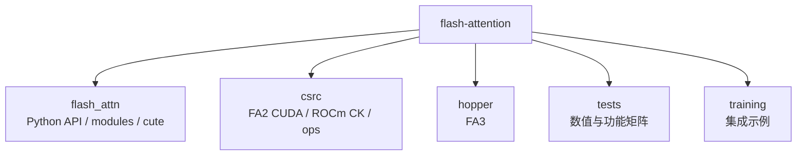

# FlashAttention 源码地图

## 读者任务

这篇用于“已知文件名，反查该读哪篇”。读完后你应该能做到：

- 看到 Python、C++、CUDA、Hopper、CuTeDSL 文件名时，判断它属于哪条阅读主线。
- 区分首轮必读文件、按需查阅文件和不建议逐个读的 generated/specialized 文件。
- 从 profile、编译日志、报错栈里的文件名跳回对应专题。

使用方式：先用 [[FlashAttention-架构分层]] 建立层次，再用本页反查文件。不要把本页当作“逐文件阅读顺序”。

## 主路径文件

| 文件/目录 | 职责 | 阅读入口 |
|-----------|------|----------|
| `README.md` | FA1/FA2 论文定位、FA3 beta、FA4 beta 与版本变更说明 | [[FlashAttention-版本演进全景]] |
| `flash_attn/__init__.py` | 包公开 API | [[FlashAttention-项目总览]] |
| `flash_attn/flash_attn_interface.py` | FA2 Python API、custom op、autograd | [[FlashAttention-Python-API]] |
| `flash_attn/bert_padding.py` | unpad/pad 与 `cu_seqlens` | [[FlashAttention-Python-API-数据流]] |
| `flash_attn/modules/mha.py` | MHA 模块集成 | [[FlashAttention-Python-API-核心概念]] |
| `csrc/flash_attn/flash_api.cpp` | pybind、参数检查、参数装配 | [[FlashAttention-Python-API-源码走读]] |
| `csrc/flash_attn/src/flash.h` | `Flash_fwd_params` / `Flash_bwd_params` | [[FlashAttention-FA2-Forward-核心概念]] · [[FlashAttention-Backward-源码走读]] |
| `csrc/flash_attn/src/flash_fwd_launch_template.h` | forward dispatch 与 kernel launch | [[FlashAttention-FA2-Forward-源码走读]] |
| `csrc/flash_attn/src/flash_fwd_kernel.h` | FA2 forward kernel 主循环 | [[FlashAttention-FA2-Forward-数据流]] |
| `csrc/flash_attn/src/flash_bwd_launch_template.h` | backward preprocess、seq-k parallel 与 convert launch | [[FlashAttention-Backward-源码走读]] |
| `csrc/flash_attn/src/flash_bwd_kernel.h` | FA2 backward 重算 softmax 与梯度 GEMM | [[FlashAttention-Backward-数据流]] |
| `csrc/flash_attn/src/flash_bwd_preprocess_kernel.h` | 计算 `D=sum(dO*O)` 与清理 `dQaccum` | [[FlashAttention-Backward-核心概念]] |
| `csrc/flash_attn/src/softmax.h` | online softmax 实现 | [[FlashAttention-Online-Softmax-源码走读]] |
| `csrc/flash_attn/src/mask.h` | causal/local/ALiBi mask | [[FlashAttention-FA2-Forward-排障指南]] |
| `hopper/flash_api.cpp` | FA3 Hopper C++ API 与 dispatch | [[FlashAttention-FA3-Hopper演进]] |
| `hopper/flash_fwd_launch_template.h` | FA3 forward launch、scheduler 与 FP8/static switch | [[FlashAttention-FA3-Hopper演进]] |
| `hopper/flash_fwd_kernel_sm90.h` | SM90 TMA/GMMA pipeline 与 tile scheduler | [[FlashAttention-FA3-Hopper演进]] |
| `hopper/tile_size.h` | FA3 tile size 选择策略 | [[FlashAttention-FA3-Hopper演进]] |
| `flash_attn/cute/README.md` | FA4 CuTeDSL beta 定位与安装入口 | [[FlashAttention-FA4-CuTeDSL演进]] |
| `flash_attn/cute/interface.py` | FA4 CuTeDSL API、JIT compile/cache | [[FlashAttention-FA4-CuTeDSL演进]] |
| `tests/test_flash_attn.py` | FA2 功能与数值测试矩阵 | [[FlashAttention-总结复盘]] |
| `tests/cute/` | FA4 CuTeDSL 测试矩阵 | [[FlashAttention-Hopper与CuTe-学习检查]] |

## 按症状反查

| 你看到的文件 | 通常意味着 | 先读 |
|--------------|------------|------|
| `flash_attn_interface.py` | Python API、autograd、custom op、fake tensor 或 KV cache wrapper | [[FlashAttention-Python-API]] |
| `flash_api.cpp` | C++ 参数检查、pybind、`Flash_fwd_params` 装配 | [[FlashAttention-架构分层]] |
| `flash_fwd_launch_template.h` | dtype/head_dim/causal/local/softcap 等 dispatch 组合 | [[FlashAttention-FA2-Forward-源码走读]] |
| `flash_fwd_kernel.h` | `QK → mask → online softmax → PV → LSE/O` 主循环 | [[FlashAttention-FA2-Forward-数据流]] |
| `softmax.h` | row max、row sum、LSE 的在线更新 | [[FlashAttention-Online-Softmax-源码走读]] |
| `mask.h` | causal、local、ALiBi 和边界 mask | [[FlashAttention-FA2-Forward-排障指南]] |
| `hopper/*` | FA3 Hopper beta、TMA/GMMA、FP8、scheduler | [[FlashAttention-FA3-Hopper演进]] |
| `flash_attn/cute/*` | FA4 CuTeDSL/JIT、compile key/cache | [[FlashAttention-FA4-CuTeDSL演进]] |

## 不建议首轮逐个读的文件

| 文件类型 | 原因 | 推荐方式 |
|----------|------|----------|
| `csrc/flash_attn/src/flash_fwd_hdim*.cu` | generated/specialized 实例多，结构重复 | 读 launch template 与实例命名规律 |
| `hopper/instantiations/*.cu` | 组合更多，主要承担显式实例化 | 用矩阵理解 dtype/head_dim/SM 组合 |
| `flash_attn/models/*.py` | 模型生态而非 attention kernel 主线 | 后置，按 GPT/BERT/Llama 需求查阅 |
| `training/` | 训练脚本示例，不是 kernel 原理主线 | 后置，理解集成方式即可 |

## 物理目录图

## 复盘

文件地图的核心用法是反查，不是替代导读路径。首轮阅读按 [[FlashAttention-学习路径]] 走；排障时再用本页把栈里的文件名映射到对应专题。
