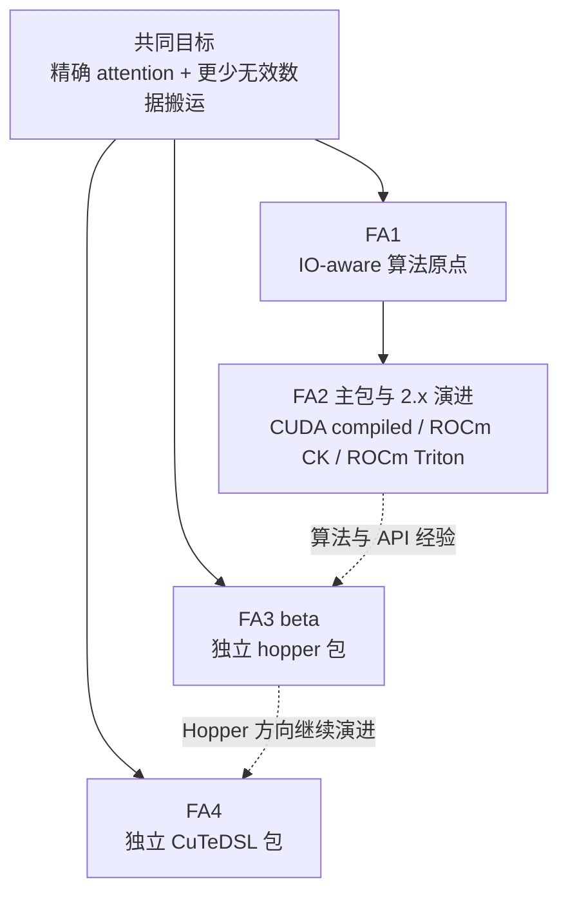

# FlashAttention 版本演进全景

## 读者任务

这篇回答一个更具体的问题：每一代相对上一代新增了什么，新增点会把读者带到哪条源码路径。读完后你应该能从一个需求出发选入口，而不是按版本号机械阅读。

## 总图：共同算法目标下的多条实现路径



| 代际 | 相对上一代的新增点 | 为什么值得单独读 | 读哪里 |
|------|--------------------|------------------|--------|
| FA1 | IO-aware exact attention、tile、online softmax、backward 重算 | 把“少存 `S/P`”变成 attention memory wall 的基本模型 | [[FlashAttention-算法原点]]、[[FlashAttention-Attention-IO]] |
| FA2 | 主包重写、work partitioning、varlen API，以及 CUDA compiled、ROCm CK、ROCm Triton/Aiter 后端 | 把算法原点变成公开 Python API 与多后端实现；不能把所有平台压成一条 C++/CUDA 链 | [[FlashAttention-Python-API]]、[[FlashAttention-FA2-Forward]] |
| FA2.1-2.7 | causal mask 语义、decode KV cache、local attention、ALiBi、paged KV、softcap、torch compile | 把 attention backend 从训练 forward 扩展到 serving 和模型变体 | [[FlashAttention-FA2版本演进]]、[[FlashAttention-KV-Cache]] |
| FA3 | Hopper beta、FP8 forward、H100/H800 要求、独立 `hopper/` 包 | 同一 attention 问题在 Hopper 硬件语义下重新组织 | [[FlashAttention-FA3-Hopper演进]] |
| FA4 | CuTeDSL、Hopper/Blackwell、`flash_attn.cute` API、按架构实现与 compile key/cache | 当前源码展示了另一套包、架构分派和编译缓存机制；首次编译与稳态成本要分别实测 | [[FlashAttention-FA4-CuTeDSL演进]] |

## 上游证据：版本边界不是读者猜的

README 把 FA1 和 FA2 的论文标题放在开头。这个证据支撑“FA1 是算法原点，FA2 是主包重写”的读法。

```markdown
# 来源：README.md L1-L15
# FlashAttention
This repository provides the official implementation of FlashAttention and
FlashAttention-2 from the
following papers.

**FlashAttention: Fast and Memory-Efficient Exact Attention with IO-Awareness**  
Tri Dao, Daniel Y. Fu, Stefano Ermon, Atri Rudra, Christopher Ré  
Paper: https://arxiv.org/abs/2205.14135  
IEEE Spectrum [article](https://spectrum.ieee.org/mlperf-rankings-2022) about our submission to the MLPerf 2.0 benchmark using FlashAttention.


**FlashAttention-2: Faster Attention with Better Parallelism and Work Partitioning**  
Tri Dao

Paper: https://tridao.me/publications/flash2/flash2.pdf
```

README 又把 FA3 和 FA4 单独列成发布块，说明后两者不是简单的 2.x changelog 项。

```markdown
# 来源：README.md L30-L45
## FlashAttention-3 beta release
FlashAttention-3 is optimized for Hopper GPUs (e.g. H100). 

Blogpost: https://tridao.me/blog/2024/flash3/

Paper: https://tridao.me/publications/flash3/flash3.pdf


This is a beta release for testing / benchmarking before we integrate that with
the rest of the repo.

Currently released:
- FP16 / BF16 forward and backward, FP8 forward

Requirements: H100 / H800 GPU, CUDA >= 12.3.
```

```markdown
# 来源：README.md L80-L82
## FlashAttention-4 (CuTeDSL)

FlashAttention-4 is written in CuTeDSL and optimized for Hopper and Blackwell GPUs (e.g. H100, B200).
```

## 三种证据不要混用

版本号只是时间坐标，不能独自证明当前执行路径。阅读时要先判断手里的证据回答哪类问题。

| 证据 | 能证明什么 | 不能直接推出什么 |
|------|------------|------------------|
| README 与 changelog | 某次发布公开声明了哪些能力、支持范围和迁移事项 | 当前基线每个输入最终走哪个 kernel；某条历史优化是否对所有 workload 生效 |
| 当前 `setup.py`、Python interface、C++/CUDA/CK/Triton/CuTe 源码 | 当前源码树有哪些包、路由、约束和实现分叉 | 某块硬件上的实际吞吐、瓶颈占比和首次编译耗时 |
| 当前 tests 与固定环境 profile | 被覆盖输入的行为，以及指定硬件、版本、shape 下的性能现象 | 未覆盖组合的普遍结论；跨 GPU、dtype、mask、长度分布的统一阈值 |

因此，下文的 2.0–2.7 表是“发布事件索引”；真正排查当前行为时，还要回到对应接口、实现与测试。

## 按需求选择阅读入口

| 你的问题 | 应读代际 | 原因 |
|----------|----------|------|
| 为什么 FlashAttention 能省显存 | FA1 | 这是 IO-aware exact attention 的基本不变量 |
| 为什么 API 有 dense、packed、varlen | FA2 | 这是主包工程化后的输入形态分化 |
| 为什么同一个 head_dim/dtype 有很多 `.cu` 文件 | FA2 | 这是静态 specialization 的性能取舍 |
| 为什么 decode 不只是普通 forward 小 batch | FA2.2+ | 2.2 的历史优化专门针对极短 query，并引入 split loading 与 combine；当前是否采用 combine 取决于实际分支 |
| 为什么 paged KV、softcap、ALiBi 进入 attention backend | FA2.3-2.7 | serving 和模型结构需求进入主包 |
| 为什么 H100 有单独路径 | FA3 | README 直接证明 Hopper/H100/H800 与 FP8 forward 的发布范围；TMA/GMMA 等机制须到 Hopper 源码专题逐项核对 |
| FA4 的 JIT/cache 在做什么 | FA4 | 当前 CuTe 源码可检查按架构实现、compile key 与 cache；设计动机和动态成本不能仅凭接口形态断言 |

## FA2 内部增量表

FA2 不是静止的一版。2.0 到 2.7 的 changelog 可以按“API 形态、mask 语义、推理、模型特性、编译生态”来读。

| 版本 | 新增能力 | 对阅读路径的影响 |
|------|----------|------------------|
| 2.0 | 主包重写；`unpadded` 改为 `varlen` | 先看 [[FlashAttention-Python-API]]，理解变长 token layout |
| 2.1 | `seqlen_q != seqlen_k` 时 causal mask 改为右下对齐 | decode/cross length 读 [[FlashAttention-KV-Cache-排障指南]] |
| 2.2 | changelog 声明小 query decode 优化，并引入 split loading、独立 combine kernel 与 `flash_attn_with_kvcache` | 读 [[FlashAttention-KV-Cache-源码走读]]，再区分当前 forced split、对齐后的 single-split、multi-split + combine |
| 2.3 | sliding window/local attention | 读 [[FlashAttention-FA2-Forward-排障指南]] |
| 2.4 | ALiBi、deterministic backward | 读 [[FlashAttention-Backward-排障指南]] |
| 2.5 | paged KV cache | 读 [[FlashAttention-KV-Cache-数据流]] |
| 2.6 | softcapping | 读 [[FlashAttention-FA2-Forward-排障指南]] |
| 2.7 | torch compile 兼容 | 读 [[FlashAttention-Python-API-排障指南]] |

关键源码证据集中在 README changelog：

```markdown
# 来源：README.md L450-L458
### 2.2: Optimize for inference

Optimize for inference (iterative decoding) when query has very small sequence
length (e.g., query sequence length = 1). The bottleneck here is to load KV
cache as fast as possible, and we split the loading across different thread
blocks, with a separate kernel to combine results.

See the function `flash_attn_with_kvcache` with more features for inference
(perform rotary embedding, updating KV cache inplace).
```

```markdown
# 来源：README.md L475-L485
### 2.5: Paged KV cache.

Support paged KV cache (i.e., [PagedAttention](https://arxiv.org/abs/2309.06180)).
Thanks to @beginlner for this contribution.

### 2.6: Softcapping.

Support attention with softcapping, as used in Gemma-2 and Grok models.
Thanks to @Narsil and @lucidrains for this contribution.

### 2.7: Compatibility with torch compile
```

## 每一代的失效边界

| 代际 | 好用的心理模型 | 失效边界 |
|------|----------------|----------|
| FA1 | 用 tile 和 online softmax 减少 HBM traffic | 不能解释 FA2 API、C++ dispatch、paged KV 等工程细节 |
| FA2 | 公开 API 先路由到 CUDA compiled、ROCm CK compiled 或 ROCm Triton/Aiter，再进入各自实现 | “Python → pybind/C++ → CUDA template”只适用于 CUDA compiled 分支，不能套在 ROCm Triton 上 |
| FA2.2+ | 极短 query decode 常要重点观察 KV cache 搬运与 split 决策 | 不能把所有推理 backend 都等同于 `flash_attn_with_kvcache`，也不能预设每次都启动 combine |
| FA3 | Hopper 专门路径 | 不能假设它已经替代默认 FA2 主包 |
| FA4 | 当前包包含 JIT/cache 与按架构实现 | 不能把设计动机写成上游事实，也不能把首次编译成本与稳态 kernel 性能混为一谈 |

## 运行验证

| 验证目标 | 操作 | 预期 |
|----------|------|------|
| 静态确认当前主包版本 | 查看仓库根 `flash_attn/__init__.py` 的 `__version__` | 当前基线声明 `2.8.4`；不要求本机已安装扩展 |
| 静态确认公开 API 与后端分叉 | 检查主包 `__init__.py`、`flash_attn_interface.py`、`setup.py` 以及 ROCm/CuTe 目录 | 能定位 dense、varlen、KV-cache 入口和 CUDA/CK/Triton/CuTe 路径；这不等于本机可运行 |
| 动态确认 FA2 主包 | 在已安装匹配 PyTorch、CUDA/ROCm 与扩展的环境中执行 `import flash_attn; print(flash_attn.__version__)` | 成功时版本与目标安装一致；导入失败先记录 ABI、扩展和驱动错误，不把它解释成算法错误 |
| 动态确认 FA3/FA4 | 分别按上游要求安装独立包后 import `flash_attn_3` 或 `flash_attn.cute` | 只有满足对应 GPU、CUDA 和依赖约束时才应通过；首次 JIT 与稳态运行分开计时 |
| 判断 decode 当前瓶颈与分支 | 固定 GPU、软件版本、batch、head、head_dim、KV 长度、page 配置和 split 设置后 profile | 先观察实际 kernel 序列和时间占比，再判断 KV load、single-split 或 multi-split combine 是否主导，不预设结论 |

## 复盘

这篇真正要记住的不是“新版线性替代旧版”，而是两层坐标：2.0–2.7 changelog 记录主包能力怎样进入公开发行，当前源码则决定这些能力今天落在哪条后端和执行分支。FA1 提供 IO-aware 算法原点；FA2 主包及其 2.x 演进承载训练、推理和模型特性；FA3 beta 与 FA4 CuTeDSL 又以独立包探索 Hopper/Blackwell 路径。遇到行为或性能问题时，先用版本事件找到入口，再用当前源码、测试和固定 workload profile 得出结论。
