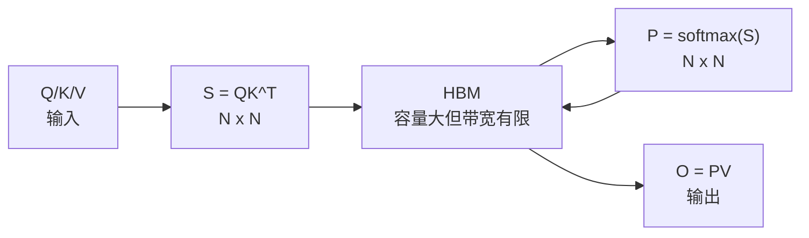
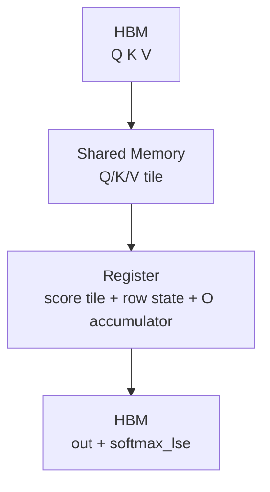

# FlashAttention 零基础先修

## 读者任务

这篇面向第一次读 attention kernel 的读者，先补三件事：

- 为什么标准 attention 的瓶颈不只是 FLOPs，而是 HBM traffic。
- 为什么 FlashAttention 可以不保存完整 `S=QK^T` 和 `P=softmax(S)`，仍然保持 exact attention。
- 为什么源码里反复出现 `softmax_lse`、`cu_seqlens`、`block_table`、`Flash_fwd_params` 这些“看起来不像公式”的工程对象。

读完后，你应该能用自己的话解释：一个 query 行如何分块看完所有 key block，并维护足够的信息得到和全量 softmax 一样的结果。

## 标准 attention 的内存账

标准 attention 可以写成：

```text
S = QK^T
P = softmax(S)
O = PV
```

如果 batch、head 暂时不看，序列长度是 `N`，那么 `S` 和 `P` 都是 `N x N`。当 `N` 变大，问题不是只多了矩阵乘法，还多了中间矩阵写入 HBM、再读回 HBM 的成本。



心理模型：标准 attention 像把每个中间账本都搬到仓库里，再从仓库搬出来继续算。FlashAttention 的目标是让大账本不进仓库，只保留每行必须带走的小摘要。

## FlashAttention 的分块直觉

FlashAttention 把 Q/K/V 切成 tile。每个 query tile 会逐块看 K/V：

1. 读一个 Q tile 和一个 K tile。
2. 算局部 score tile。
3. 用 online softmax 更新每行的 `row_max` 和 `row_sum`。
4. 把局部 probability tile 立刻乘 V tile，累积到 `acc_o`。
5. 进入下一个 K/V tile 前，只携带行级状态和输出累积。



关键变化是 `P` 的生命周期：它在 tile 内出现，马上被 `PV` 消费，不作为完整矩阵保存。

## 为什么仍然精确

softmax 每行需要两个全局量：

```text
m_i = max(score_i)
l_i = sum(exp(score_i - m_i))
```

分块时先看到一部分 key，得到旧的 `m_old/l_old/o_old`；再看到新 block，得到新的局部最大值。只要把旧分母和旧输出累积按 `m_old - m_new` 重新缩放，就能保持和一次性看完整行相同的 softmax 标尺。

这就是 online softmax 的直觉：不是近似，不是少看 key，而是每次新 block 改变最大值时，把历史状态搬到同一把尺子上。

## 源码证据：kernel 参数里保留的是摘要，不是完整矩阵

`Flash_fwd_params` 里有输出指针、可选 `P` 指针、`softmax_lse` 指针、shape、scale 和 `cu_seqlens`。这说明 kernel 的长期协议围绕 `out`、LSE 和边界数组，而不是完整 attention matrix。

```cpp
// 来源：csrc/flash_attn/src/flash.h L48-L75
struct Flash_fwd_params : public Qkv_params {

    // The O matrix (output).
    void * __restrict__ o_ptr;
    void * __restrict__ oaccum_ptr;

    // The stride between rows of O.
    index_t o_batch_stride;
    index_t o_row_stride;
    index_t o_head_stride;

    // The pointer to the P matrix.
    void * __restrict__ p_ptr;

    // The pointer to the softmax sum.
    void * __restrict__ softmax_lse_ptr;
    void * __restrict__ softmax_lseaccum_ptr;

    // The dimensions.
    int b, seqlen_q, seqlen_k, seqlen_knew, d, seqlen_q_rounded, seqlen_k_rounded, d_rounded, rotary_dim, total_q;

    // The scaling factors for the kernel.
    float scale_softmax;
    float scale_softmax_log2;

    // array of length b+1 holding starting offset of each sequence.
    int * __restrict__ cu_seqlens_q;
    int * __restrict__ cu_seqlens_k;
```

读者抓手：

- `o_ptr/oaccum_ptr` 是输出和 split/accumulation 相关状态。
- `p_ptr` 是可选路径，不是主线必须长期保存的完整 `P`。
- `softmax_lse_ptr` 是 forward 留给 backward 或调用方的行级摘要。
- `cu_seqlens_q/k` 是 varlen 场景的样本边界。
- `scale_softmax_log2` 说明 kernel 会用 log2/exp2 形式处理 softmax 标尺。

## 五个先修概念

| 概念 | 先理解什么 | 后续读哪里 |
|------|------------|------------|
| HBM / shared memory / register | 容量、带宽、生命周期不同 | [[FlashAttention-Attention-IO]] |
| Tile | 一次只处理局部 Q/K/V 块 | [[FlashAttention-FA2-Forward-数据流]] |
| Online softmax | 旧状态需要按新最大值重标定 | [[FlashAttention-Online-Softmax]] |
| LSE | 每个 query 行一个 logsumexp 摘要 | [[FlashAttention-关键概念]] |
| Varlen / KV cache | 输入形态会改变边界和读取方式 | [[FlashAttention-Python-API]]、[[FlashAttention-KV-Cache]] |

## 面向 AI Infra 的场景

| 场景 | FlashAttention 帮你看什么 |
|------|---------------------------|
| 训练 forward | `S/P` 不长期落 HBM，保存 `out/LSE/RNG` 给 backward |
| 训练 backward | 用 LSE 和输入重算局部 score，避免保存完整 `P` |
| 推理 prefill | 大块 prompt attention，接近训练 forward 的 IO 问题 |
| 推理 decode | `seqlen_q` 很小，瓶颈转向 KV cache load、paged KV、SplitKV |
| 长上下文 | 中间矩阵不能落 HBM，边界数组和 cache 组织变成系统问题 |
| 新硬件 | FA3/FA4 关注 Hopper/Blackwell 的 copy/MMA/JIT/cache 组织 |

## 自测

- 能画出 `QK → softmax → PV` 的标准 attention 内存账。
- 能解释为什么 FlashAttention 不保存完整 `P` 仍然是 exact attention。
- 能说出 `softmax_lse` 为什么是行级摘要。
- 能区分训练 full attention 和 decode KV cache 的瓶颈。
- 能指出下一步该读 [[FlashAttention-代际演进]]、[[FlashAttention-关键概念]] 或 [[FlashAttention-学习路径]] 中的哪一篇。

源码核对可以用：

```powershell
rg -n 'softmax_lse|cu_seqlens_q|cu_seqlens_k|scale_softmax_log2|p_ptr|oaccum_ptr' flash-attn/flash-attention/csrc/flash_attn/src/flash.h flash-attn/flash-attention/csrc/flash_attn/src/flash_fwd_kernel.h flash-attn/flash-attention/csrc/flash_attn/src/softmax.h
```

能命中这些字段，就说明本页用来解释“摘要状态替代完整矩阵”的源码抓手仍然有效。

下一步读 [[FlashAttention-代际演进]]。
