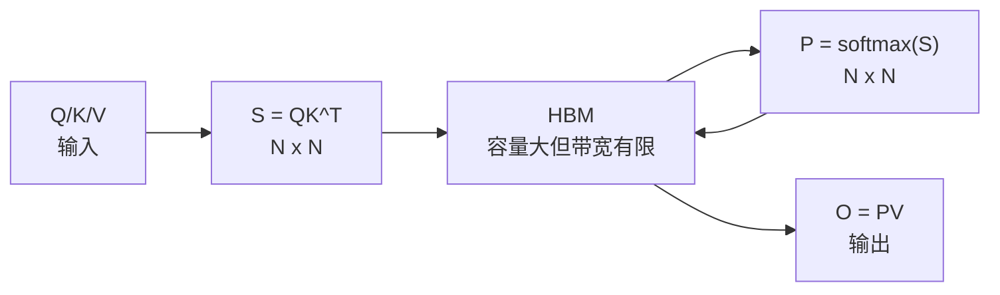
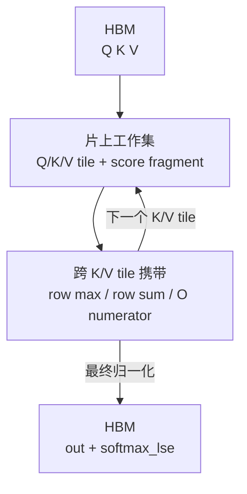

# FlashAttention 零基础先修

## 读者任务

这篇面向第一次读 attention kernel 的读者，先补三件事：

- 为什么标准 attention 的瓶颈不只是 FLOPs，而是 HBM traffic。
- 为什么 FlashAttention 可以不保存完整 `S=QK^T` 和 `P=softmax(S)`，仍然保持 exact attention。
- 为什么源码里反复出现 `softmax_lse`、`cu_seqlens`、`block_table`、`Flash_fwd_params` 这些“看起来不像公式”的工程对象。

读完后，你应该能用自己的话解释：一个 query 行如何分块看完所有 key block，只携带行级归一化状态和输出分子，最终得到数学上同一个 dense attention 结果；同时知道“exact”不代表浮点逐 bit 相同，也不代表把二次计算量降成线性。

## 标准 attention 的内存账

标准 attention 可以写成：

```text
S = QK^T
P = softmax(S)
O = PV
```

如果暂时忽略 batch 和 head，序列长度是 `N`，那么 `S` 和 `P` 都是 `N × N`。普通分阶段实现不仅要做二次规模的矩阵运算，还会把这些二次规模中间量写入 HBM，再为 softmax 或 `PV` 读回。FlashAttention 的关键收益来自改变数据搬运与中间态生命周期，而不是跳过任意 key，也不是把精确 dense attention 的算术复杂度改成线性。



心理模型：普通分阶段 attention 像把整张流水账送进远端仓库，每完成一道工序再搬回来。FlashAttention 尽量让 score/probability tile 在片上被立刻消费，只把每个 query 行的“小计”和输出写回。

这个类比的失效边界是：HBM、shared memory、register 的实际分工由具体 kernel、架构和 tile 配置决定；类比只描述生命周期，不替代对生成代码和 profile 的检查。

## FlashAttention 的分块直觉

FlashAttention 把 Q/K/V 切成 tile。每个 query tile 会逐块看 K/V：

1. 读一个 Q tile 和一个 K tile。
2. 算局部 score tile。
3. 用 online softmax 更新每行的 `row_max` 和 `row_sum`。
4. 把尚未最终归一化的指数权重与 V 相乘，累积输出分子 `acc_o`。
5. 进入下一个 K/V tile 前，只携带行级最大值、行级指数和与重标定后的输出分子。



关键变化是概率相关中间态的生命周期：局部指数权重在 tile 内产生并立即参与 `V` 累积，主计算路径不需要把完整 `N × N` 概率矩阵作为下一阶段输入长期保存。

## 为什么仍然精确

对一个 query 行，softmax 归一化至少需要行最大值与指数和：

```text
m_i = max(score_i)
l_i = sum(exp(score_i - m_i))
```

再把未归一化的输出分子记为：

```text
n_i = sum(exp(score_i - m_i) * V)
```

假设历史状态是 `(m, l, n)`，新 key block 的局部状态是 `(m_b, l_b, n_b)`，合并时使用同一把新标尺：

```text
m' = max(m, m_b)
l' = exp(m - m') * l + exp(m_b - m') * l_b
n' = exp(m - m') * n + exp(m_b - m') * n_b
O  = n' / l'
LSE = m' + log(l')
```

这就是 online softmax 的直觉：不是近似，也没有少看 key；每当新 block 改变最大值，就把历史分母和输出分子一起换算到新标尺。这里的“exact”指算法仍计算完整 dense attention，而非稀疏化或低秩近似；不同归约顺序仍可能带来正常的浮点舍入差异。

## 源码证据：主线输出、行级摘要与地址元数据

`Flash_fwd_params` 同时包含输出、累积缓冲、`softmax_lse`、shape、scale 与 `cu_seqlens`。它反映的是 kernel 调用协议：哪些结果要写回、变长序列怎样寻址、split 路径怎样暂存。字段名 `p_ptr` 不能单独证明主线会物化数学公式中的完整 `P`，还必须检查它何时非空、kernel 实际写入什么。

```cpp
// 来源：csrc/flash_attn/src/flash.h L48-L75
struct Flash_fwd_params : public Qkv_params {

    // The O matrix (output).
    void * __restrict__ o_ptr;
    void * __restrict__ oaccum_ptr;

    // The stride between rows of O.
    index_t o_batch_stride;
    index_t o_row_stride;
    index_t o_head_stride;

    // The pointer to the P matrix.
    void * __restrict__ p_ptr;

    // The pointer to the softmax sum.
    void * __restrict__ softmax_lse_ptr;
    void * __restrict__ softmax_lseaccum_ptr;

    // The dimensions.
    int b, seqlen_q, seqlen_k, seqlen_knew, d, seqlen_q_rounded, seqlen_k_rounded, d_rounded, rotary_dim, total_q;

    // The scaling factors for the kernel.
    float scale_softmax;
    float scale_softmax_log2;

    // array of length b+1 holding starting offset of each sequence.
    int * __restrict__ cu_seqlens_q;
    int * __restrict__ cu_seqlens_k;
```

逐个对象建立抓手：

- `o_ptr` 是最终输出；`oaccum_ptr`、`softmax_lseaccum_ptr` 服务于需要中间合并的路径，不能与最终输出混为一谈。
- `softmax_lse_ptr` 保存每个 query 行的 logsumexp 摘要，backward 可借它恢复统一归一化标尺。
- `cu_seqlens_q/k` 不是数值摘要，而是 varlen packed layout 的样本边界元数据。
- `scale_softmax_log2` 表明实现还维护以 2 为底的缩放形式；“为什么这样做”要到 softmax 内核结合指令实现继续读。
- `p_ptr` 是条件路径的开关。当前 dense C++ 接口只有请求 `return_softmax` 且 dropout 大于 0 时才分配对应缓冲；公开 Python API 返回的该调试张量也不能直接当作数学上的最终 `P`。

```cpp
// 来源：csrc/flash_attn/flash_api.cpp L441-L464
    auto softmax_lse = torch::empty({batch_size, num_heads, seqlen_q}, opts.dtype(at::kFloat));
    at::Tensor p;
    // Only return softmax if there's dropout to reduce compilation time
    if (return_softmax) {
        TORCH_CHECK(p_dropout > 0.0f, "return_softmax is only supported when p_dropout > 0.0");
        p = torch::empty({ batch_size, num_heads, seqlen_q_rounded, seqlen_k_rounded }, opts);
    }
    else {
        p = torch::empty({ 0 }, opts);
    }

    Flash_fwd_params params;
    set_params_fprop(params,
                     batch_size,
                     seqlen_q, seqlen_k,
                     seqlen_q_rounded, seqlen_k_rounded,
                     num_heads, num_heads_k,
                     head_size, head_size_rounded,
                     q, k, v, out,
                     /*cu_seqlens_q_d=*/nullptr,
                     /*cu_seqlens_k_d=*/nullptr,
                     /*seqused_k=*/nullptr,
                     return_softmax ? p.data_ptr() : nullptr,
                     softmax_lse.data_ptr(),
```

## 五个先修概念

| 概念 | 先理解什么 | 后续读哪里 |
|------|------------|------------|
| HBM / shared memory / register | 容量、带宽、生命周期不同 | [[FlashAttention-Attention-IO]] |
| Tile | 一次只处理局部 Q/K/V 块 | [[FlashAttention-FA2-Forward-数据流]] |
| Online softmax | 旧状态需要按新最大值重标定 | [[FlashAttention-Online-Softmax]] |
| LSE | 每个 query 行一个 logsumexp 摘要 | [[FlashAttention-关键概念]] |
| Varlen / KV cache | 输入形态会改变边界和读取方式 | [[FlashAttention-Python-API]]、[[FlashAttention-KV-Cache]] |

## 面向 AI Infra 的场景

| 场景 | FlashAttention 帮你看什么 |
|------|---------------------------|
| 训练 forward | `S/P` 不长期落 HBM，保存 `out/LSE/RNG` 给 backward |
| 训练 backward | 用 LSE 和输入重算局部 score，避免保存完整 `P` |
| 推理 prefill | 大块 prompt attention，接近训练 forward 的 IO 问题 |
| 推理 decode | `seqlen_q` 很小时重点检查 KV cache 读取、paged 寻址与 split 决策；实际瓶颈和是否出现 combine 由固定 workload profile 决定 |
| 长上下文 | 中间矩阵不能落 HBM，边界数组和 cache 组织变成系统问题 |
| 新硬件 | FA3/FA4 关注 Hopper/Blackwell 的 copy/MMA/JIT/cache 组织 |

## 自测与验证

- 能画出 `QK → softmax → PV` 的标准 attention 内存账。
- 能写出 `(m, l, n)` 的合并式，并解释为什么它不需要把完整 `P` 交给下一阶段。
- 能说出 `softmax_lse` 为什么是行级摘要。
- 能说明“exact”与“浮点逐 bit 相同”、以及“降低 HBM traffic”与“降低算术复杂度”的区别。
- 能区分训练 full attention 和 decode KV cache 的分析入口，而不预设后者必然由某个 kernel 主导。
- 能指出下一步该读 [[FlashAttention-代际演进]]、[[FlashAttention-关键概念]] 或 [[FlashAttention-学习路径]] 中的哪一篇。

无 GPU、无已编译扩展时，先做静态核对：

```powershell
rg -n 'softmax_lse|cu_seqlens_q|cu_seqlens_k|scale_softmax_log2|p_ptr|oaccum_ptr' flash-attn/flash-attention/csrc/flash_attn/src/flash.h flash-attn/flash-attention/csrc/flash_attn/flash_api.cpp
```

预期同时命中参数字段与 `return_softmax ? p.data_ptr() : nullptr`：前者确认协议对象仍存在，后者确认 `p_ptr` 是条件路径，不能仅凭字段名解释成主线必存的完整概率矩阵。若要做动态验证，则在匹配 PyTorch、GPU、驱动与已编译扩展的环境中比较普通 attention 与 FlashAttention 输出，并按项目测试容差判断；不要求逐 bit 相等。

下一步读 [[FlashAttention-代际演进]]。
