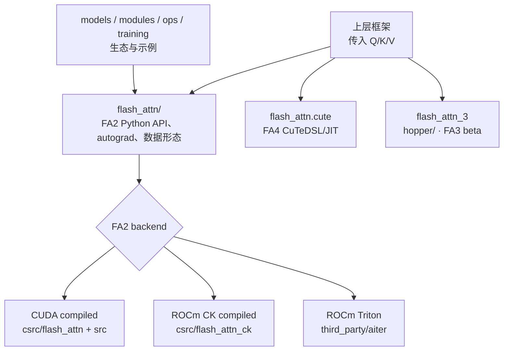

# FlashAttention 项目总览

> 源码基线：`flash-attn` commit `002cce0`

## 读者任务

这篇解决“第一次打开 FlashAttention 仓库该看哪里”的问题。读完后你应该能做到：

- 知道当前主线为什么从 FA2 主包开始，而不是在源码树里硬找一条 FA1 目录。
- 知道公开 API、CUDA/ROCm backend、compiled extension、FA3、FA4 分别在哪一层。
- 知道哪些目录是核心主线，哪些目录是模型生态、benchmark、test 或维护工具。
- 能从“我要改 API、改 forward、改 decode、改 Hopper/JIT”反推出入口文件。

先读 [[FlashAttention-代际演进]] 与 [[FlashAttention-版本演进全景]]，再读本页，会更容易理解为什么项目地图要按 Q/K/V 旅程组织，而不是按目录名字逐个解释。

## 先建立模型：一个 API 表面，多条 backend 路线



这个图有三个阅读边界：

| 边界 | 读者问题 | 源码入口 |
|------|----------|----------|
| Python API 边界 | Q/K/V 是 dense、packed、varlen 还是 KV cache | `flash_attn/__init__.py`、`flash_attn/flash_attn_interface.py` |
| FA2 backend 边界 | 当前是 CUDA extension、ROCm CK extension 还是 ROCm Triton；参数在哪一层被检查与分派 | `setup.py`、`flash_attn_interface.py`、`csrc/flash_attn*/`、`third_party/aiter/` |
| 新后端边界 | Hopper 或 CuTeDSL/JIT 是否改变主线路径 | `hopper/`、`flash_attn/cute/` |

## 上游证据：公开 API 告诉你先分输入形态

`flash_attn/__init__.py` 暴露的是读者最常接触的 API 表面。这里的重点不是函数数量，而是输入形态已经分成 dense、packed、varlen 和 KV cache。


```python
# 来源：flash_attn/__init__.py L1-L16
from pkgutil import extend_path

# look for every subdir with flash_attn base name such that fa2 and fa4 can be co-installed
__path__ = extend_path(__path__, __name__)

__version__ = "2.8.4"

from flash_attn.flash_attn_interface import (
    flash_attn_func,
    flash_attn_kvpacked_func,
    flash_attn_qkvpacked_func,
    flash_attn_varlen_func,
    flash_attn_varlen_kvpacked_func,
    flash_attn_varlen_qkvpacked_func,
    flash_attn_with_kvcache,
)
```

读者抓手：

- `flash_attn_func` 对应普通 Q/K/V 分离输入。
- `flash_attn_qkvpacked_func` 和 `flash_attn_kvpacked_func` 对应上层已经把张量打包的训练形态。
- `flash_attn_varlen_func` 系列对应 packed token 加 `cu_seqlens` 的变长形态。
- `flash_attn_with_kvcache` 对应 decode 时 KV cache 原地更新与读取。
- `extend_path` 说明 FA2 和 FA4 可以在同名 package 下共存，读目录时不能只假设一个 backend。

## 上游证据：FA2 先选构建目标与 backend

`setup.py` 先用 `BUILD_TARGET`、PyTorch extension 类型和环境变量决定 CUDA/ROCm，再在 ROCm 中选择 CK 或 Triton。Triton 路线安装 Aiter；CK 与 CUDA 才构建 compiled extension。

```python
# 来源：setup.py L42-L69
BUILD_TARGET = os.environ.get("BUILD_TARGET", "auto")

if BUILD_TARGET == "auto":
    if IS_HIP_EXTENSION:
        IS_ROCM = True
    else:
        IS_ROCM = False
else:
    if BUILD_TARGET == "cuda":
        IS_ROCM = False
    elif BUILD_TARGET == "rocm":
        IS_ROCM = True

PACKAGE_NAME = "flash_attn"

BASE_WHEEL_URL = (
    "https://github.com/Dao-AILab/flash-attention/releases/download/{tag_name}/{wheel_name}"
)

# FORCE_BUILD: Force a fresh build locally, instead of attempting to find prebuilt wheels
# SKIP_CUDA_BUILD: Intended to allow CI to use a simple `python setup.py sdist` run to copy over raw files, without any cuda compilation
FORCE_BUILD = os.getenv("FLASH_ATTENTION_FORCE_BUILD", "FALSE") == "TRUE"
SKIP_CUDA_BUILD = os.getenv("FLASH_ATTENTION_SKIP_CUDA_BUILD", "FALSE") == "TRUE"
# For CI, we want the option to build with C++11 ABI since the nvcr images use C++11 ABI
FORCE_CXX11_ABI = os.getenv("FLASH_ATTENTION_FORCE_CXX11_ABI", "FALSE") == "TRUE"
ROCM_BACKEND: Optional[Literal["triton", "ck"]] = None
if IS_ROCM:
    ROCM_BACKEND = "triton" if os.getenv("FLASH_ATTENTION_TRITON_AMD_ENABLE", "FALSE") == "TRUE" else "ck"
```

下面的 `flash_attn_2_cuda` 卡只证明 CUDA compiled 路线。源码把 head_dim、dtype、causal、standard/split/aligned split 组合拆成多个 `.cu` 编译单元，这解释了为什么 CUDA 编译与 profile 问题不能只看 Python wrapper。

```python
# 来源：setup.py L304-L330
    ext_modules.append(
        CUDAExtension(
            name="flash_attn_2_cuda",
            sources=[
                "csrc/flash_attn/flash_api.cpp",
                "csrc/flash_attn/src/flash_fwd_hdim32_fp16_sm80.cu",
                "csrc/flash_attn/src/flash_fwd_hdim32_bf16_sm80.cu",
                "csrc/flash_attn/src/flash_fwd_hdim64_fp16_sm80.cu",
                "csrc/flash_attn/src/flash_fwd_hdim64_bf16_sm80.cu",
                "csrc/flash_attn/src/flash_fwd_hdim96_fp16_sm80.cu",
                "csrc/flash_attn/src/flash_fwd_hdim96_bf16_sm80.cu",
                "csrc/flash_attn/src/flash_fwd_hdim128_fp16_sm80.cu",
                "csrc/flash_attn/src/flash_fwd_hdim128_bf16_sm80.cu",
                "csrc/flash_attn/src/flash_fwd_hdim192_fp16_sm80.cu",
                "csrc/flash_attn/src/flash_fwd_hdim192_bf16_sm80.cu",
                "csrc/flash_attn/src/flash_fwd_hdim256_fp16_sm80.cu",
                "csrc/flash_attn/src/flash_fwd_hdim256_bf16_sm80.cu",
                "csrc/flash_attn/src/flash_fwd_hdim32_fp16_causal_sm80.cu",
                "csrc/flash_attn/src/flash_fwd_hdim32_bf16_causal_sm80.cu",
                "csrc/flash_attn/src/flash_fwd_hdim64_fp16_causal_sm80.cu",
                "csrc/flash_attn/src/flash_fwd_hdim64_bf16_causal_sm80.cu",
                "csrc/flash_attn/src/flash_fwd_hdim96_fp16_causal_sm80.cu",
                "csrc/flash_attn/src/flash_fwd_hdim96_bf16_causal_sm80.cu",
                "csrc/flash_attn/src/flash_fwd_hdim128_fp16_causal_sm80.cu",
                "csrc/flash_attn/src/flash_fwd_hdim128_bf16_causal_sm80.cu",
                "csrc/flash_attn/src/flash_fwd_hdim192_fp16_causal_sm80.cu",
                "csrc/flash_attn/src/flash_fwd_hdim192_bf16_causal_sm80.cu",
```

读者抓手：CUDA 路线的 `flash_api.cpp` 是 pybind 入口，`src/flash_fwd_hdim*_*.cu` 是预实例化 kernel。ROCm CK 也把 extension 命名为 `flash_attn_2_cuda`，但源码来自 `csrc/flash_attn_ck/`；仅凭模块名不能判断实际 kernel 家族。ROCm Triton 则由 Aiter 提供，不经过这张 CUDA 源文件清单。

## 上游证据：FA3 和 FA4 是单独边界

FA3 在 README 中被定义为 Hopper beta release，并写明后续会再和主仓库其他部分整合。这说明 `hopper/` 不是普通 FA2 小版本目录。

```markdown
# 来源：README.md L39-L45
This is a beta release for testing / benchmarking before we integrate that with
the rest of the repo.

Currently released:
- FP16 / BF16 forward and backward, FP8 forward

Requirements: H100 / H800 GPU, CUDA >= 12.3.
```

FA4 则明确是 CuTeDSL 路径，面向 Hopper 和 Blackwell。

```markdown
# 来源：README.md L80-L82
## FlashAttention-4 (CuTeDSL)

FlashAttention-4 is written in CuTeDSL and optimized for Hopper and Blackwell GPUs (e.g. H100, B200).
```

## 源码地图

| 目录或文件 | 怎么读 | 先看哪篇 |
|------------|--------|----------|
| `flash_attn/__init__.py` | 公开 API 清单和 package 共存边界 | [[FlashAttention-Python-API]] |
| `flash_attn/flash_attn_interface.py` | Python wrapper、autograd、custom op、dense/varlen/KV cache API | [[FlashAttention-Python-API-源码走读]] |
| `flash_attn/bert_padding.py` | padded batch 到 packed token 的变换 | [[FlashAttention-Python-API-数据流]] |
| `csrc/flash_attn/flash_api.cpp` | pybind 入口、shape/dtype 检查、参数装配 | [[FlashAttention-FA2-Forward-源码走读]] |
| `csrc/flash_attn/src/` | FA2 forward/backward kernel specialization | [[FlashAttention-FA2-Forward]]、[[FlashAttention-Backward]] |
| `csrc/flash_attn_ck/` | ROCm CK 后端 | 需要 AMD 后端时再读 |
| `third_party/aiter/` | ROCm Triton backend 的构建依赖与 kernel 提供方 | 使用 `FLASH_ATTENTION_TRITON_AMD_ENABLE=TRUE` 时阅读 |
| `hopper/` | FA3 Hopper beta、TMA/GMMA/FP8 相关路径 | [[FlashAttention-FA3-Hopper演进]] |
| `flash_attn/cute/` | FA4 CuTeDSL/JIT API 与编译缓存 | [[FlashAttention-FA4-CuTeDSL演进]] |
| `flash_attn/models/`、`modules/`、`ops/`、`training/` | 模型生态、fused ops、训练脚本 | 读完 kernel 主线后按需回看 |
| `tests/`、`benchmarks/` | correctness 和性能验证入口 | [[FlashAttention-FA2-Forward-学习检查]] |

## 按任务选入口

| 你要做什么 | 先读 | 判断标准 |
|------------|------|----------|
| 理解为什么省显存 | [[FlashAttention-Attention-IO-核心概念]]、[[FlashAttention-Online-Softmax-核心概念]] | 能解释为什么不保存完整 `P` |
| 追一条 Python 调用 | [[FlashAttention-Python-API-源码走读]] | 能说出 wrapper 是否 copy、保存什么 autograd 状态 |
| 改 forward kernel | [[FlashAttention-FA2-Forward-源码走读]] | 能从 API 参数追到 `Flash_fwd_params` 和 dispatch |
| 改 backward | [[FlashAttention-Backward-源码走读]] | 能说出 forward 保存 `out/LSE/RNG` 后 backward 如何重算 |
| 排查 decode 性能 | [[FlashAttention-KV-Cache-源码走读]] | 能区分 cache load、forced split、aligned single-split 与 multi-split combine，并用固定 workload 验证 |
| 研究 Hopper/Blackwell | [[FlashAttention-Hopper与CuTe]] | 能区分 FA3 beta 与 FA4 CuTeDSL/JIT |

## 运行验证

| 验证目标 | 操作 | 预期现象 |
|----------|------|----------|
| 确认源码基线版本 | `rg -n '__version__' flash-attn/flash-attention/flash_attn/__init__.py` | 静态看到 `2.8.4`；不要求本机已安装包 |
| 确认 dense 与 KV cache API 可 import | `python -c "from flash_attn import flash_attn_func, flash_attn_with_kvcache"` | 依赖与所选 backend 可加载时成功；失败按 CUDA/CK/Triton 分支排查 |
| 确认 FA2 backend | 打印 `torch.version.cuda/hip`、`USE_TRITON_ROCM` 与 `flash_attn_gpu` | 结果与 CUDA compiled、ROCm CK compiled 或 ROCm Triton 三者之一一致 |
| 确认读的是 FA3/FA4 还是 FA2 | 查看 import 路径和安装包：`hopper`、`flash_attn.cute`、`flash_attn_2_cuda` | 三者不是同一条后端路径 |

## 复盘

读 FlashAttention 项目地图时，不要把所有目录压成“attention 实现”。更实用的切法是：

- `flash_attn/` 负责用户 API、autograd 和数据形态。
- `csrc/flash_attn/` 负责 FA2 CUDA compiled extension、参数包、dispatch 和 specialization。
- `csrc/flash_attn_ck/` 与 `third_party/aiter/` 分别负责 ROCm CK 与 Triton 路线。
- `hopper/` 负责 FA3 Hopper beta。
- `flash_attn/cute/` 负责 FA4 CuTeDSL/JIT。
- `models/modules/ops/training/tests/benchmarks` 是生态、验证和性能辅助，服务主线但不是第一轮阅读入口。
