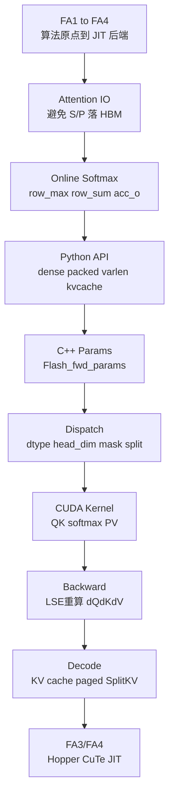

# FlashAttention 总结复盘

> 用 AI infra 视角把 FlashAttention 串成一条线：代际演进 → memory wall → online softmax → kernel specialization → KV cache → 新 GPU 后端。

## 你为什么要读

总结 FlashAttention 不能只背“少读写 HBM”这一句。真正的收官标准是：能从 attention 数学走到 online softmax 状态，再从 Python API 走到 C++ dispatch 和 kernel tile。本页用复盘问题把这些层重新扣在一起，也明确哪些结论属于 FA2、Hopper 路径或 KV cache 特例。

## 复盘路径

| 文档 | 复盘问题 |
| ------ | ---------- |
| [[FlashAttention-代际演进]] | FA1 到 FA4 的问题重心如何变化 |
| [[FlashAttention-版本演进全景]] | 每一代相对上一代新增了什么、解决了什么 |
| [[FlashAttention-算法原点]] | FA1 为什么把标准 attention 改写成 IO-aware exact attention |
| [[FlashAttention-Attention-IO]] | 标准 attention 为什么被 HBM traffic 卡住 |
| [[FlashAttention-Online-Softmax]] | 分块后如何保持 softmax 精确 |
| [[FlashAttention-Python-API]] | 上层框架如何进入 CUDA extension |
| [[FlashAttention-FA2版本演进]] | FA2 为什么是主包重写，2.0 到 2.7 扩展了哪些能力 |
| [[FlashAttention-FA2-Forward]] | FA2 forward 如何执行 tile attention |
| [[FlashAttention-Backward]] | FA2 backward 如何用 `O/LSE/RNG` 重算 softmax 并得到梯度 |
| [[FlashAttention-KV-Cache]] | decode serving 为什么需要 KV cache 专门路径 |
| [[FlashAttention-FA3-Hopper演进]] | FA3 如何把主线推进到 Hopper TMA/GMMA 与 FP8 |
| [[FlashAttention-FA4-CuTeDSL演进]] | FA4 如何把后端推进到 CuTeDSL/JIT 与编译缓存 |
| [[FlashAttention-Hopper与CuTe]] | FA3/FA4 为什么适配新 GPU 与 JIT 编译 |

## 一张总图

## 必须掌握的六句话

1. FA1 是 IO-aware exact attention 的算法原点；当前源码主线主要从 FA2、FA3、FA4 展开。
2. FlashAttention 的核心不是少算 attention，而是避免把 `S=QK^T` 和 `P=softmax(S)` 完整写入 HBM。
3. Online softmax 让每个 query 行在分块扫描 K/V 时维护 `row_max`、`row_sum` 和 `acc_o`，从而得到与全量 softmax 等价的结果。
4. Python API 的 `causal/window/ALiBi/softcap/dropout/varlen/KV cache` 参数最终会影响 C++ 参数和 CUDA template dispatch。
5. Backward 不保存完整 attention matrix，而是保存 `O/LSE/RNG`，在反向 tile 内重算 `P` 并计算 `dQ/dK/dV`。
6. 训练/prefill 与 decode 是不同 attention workload；decode 需要 KV cache、paged KV、SplitKV 和 `seqlen_q=1` 优化。
7. FA3/FA4 不是原理变化，而是为了新 GPU 架构、新特性组合和更可维护的 kernel 编译路径。

## AI infra 对照

| 系统层 | 你应该能联系到 |
|--------|----------------|
| Slime | RL rollout 依赖 serving 引擎，不直接实现 attention kernel |
| SGLang | serving forward 需要 attention backend，KV cache 管理与 decode kernel 强相关 |
| FlashAttention | attention backend 的底层 IO-aware kernel 案例 |
| GPU | HBM/SRAM/register/Tensor Core 决定 kernel 设计 |

## 自测总题

- [ ] 不看源码，能画出 `flash_attn_func → custom_op → flash_attn_2_cuda.fwd → mha_fwd → run_mha_fwd → flash_fwd_kernel`。
- [ ] 能说明 FA1、FA2、FA3、FA4 分别解决什么层面的问题。
- [ ] 能逐代说出 FA2 相对 FA1、FA3 相对 FA2、FA4 相对 FA3 的增量，而不是把四代都笼统归为“更快”。
- [ ] 能解释为什么 `softmax_lse`、`out` 和 `rng_state` 足够支持 backward 重算。
- [ ] 能口述 `D=sum(dO*O)`、`dS=P*(dO V^T-D)` 到 `dQ/dK/dV` 的反向链路。
- [ ] 能说明 varlen 的 `cu_seqlens` 和 paged KV 的 `block_table` 分别解决什么问题。
- [ ] 能解释为什么 kernel dispatch 维度会导致编译实例数量很多。
- [ ] 能说清楚 FA4 JIT cache 对生产 warmup 的影响。

## 入口回跳

[[FlashAttention学习指南]] · [[FlashAttention-学习路径]] · [[FlashAttention-前向全链路]] · [[knowledge_maps/三框架知识地图]]
