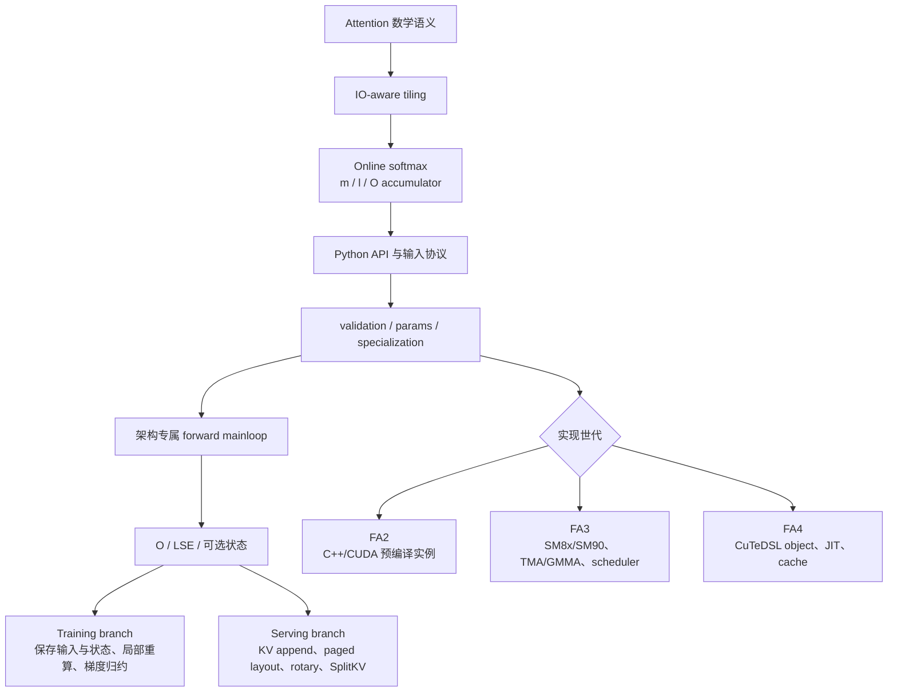
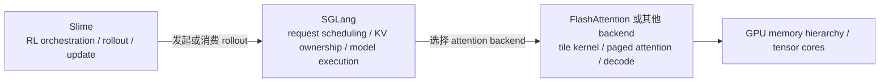

# FlashAttention 总结复盘

> 收官不是背出“少读写 HBM”，而是能从数学不变量推到对象生命周期，再从 workload 与硬件条件推到具体实现路径。

## 你为什么要读

FlashAttention 最容易形成两种半懂：一种只会讲 IO-aware 与 online softmax，落不到源码对象；另一种能追 CUDA 模板，却说不清为什么数值仍然 exact。真正的理解必须把三次变换扣在一起：

1. 数学变换：全量 softmax 改写为可分块合并的 running state；
2. 存储变换：完整 S/P 的 HBM 生命周期改写为 tile 与少量 per-row state；
3. 执行变换：动态 workload 被归一化、分派或 JIT 成具体架构实例。

## 最终心智模型

图里有两个分叉，而不是一条版本流水线：training 与 serving 是 workload 分支；FA2/FA3/FA4 是实现/发行分支。同一次系统可能长期保留多条路线。

## 七个不变量

无论读 FA2、FA3 还是 FA4，先检查以下判断是否仍成立：

1. 数学目标仍是 exact attention；优化不能偷偷改变 mask、softmax 或归一化语义。
2. 完整 `S=QK^T` 与 `P=softmax(S)` 不应成为长生命周期 HBM 中间量。
3. 对一个 query 行，跨 K/V tile 合并必须维护等价的 running max、normalizer 与输出 accumulator。
4. `O` 与 LSE 是 forward→backward 的关键状态，但实际 backward 还需要 Q/K/V、dO，以及按路径保存的 RNG/aux 状态；不能把三项简化成完整保存集。
5. API shape/stride/varlen/paged 协议必须在进入 kernel 前变成明确 params 或 call ABI。
6. dtype、head dim、mask、GQA、arch、SplitKV 等条件会改变实例；版本号本身不决定最终 kernel。
7. 正确性、路径与性能是三种证据：reference 数值相等不证明走了目标 kernel，走了目标 kernel也不自动证明更快。

## 三本核心推导

### 一、从全量 attention 到 online state

对每个 Q tile，kernel 逐块消费 K/V。新 tile 带来局部 score、局部最大值与局部指数和；旧 accumulator 必须先按新旧最大值差重标定，再把新贡献并入。最终 LSE 把最大值与 normalizer 压成稳定的 per-row 表示。

你应能解释：

- 为什么减最大值避免指数溢出；
- 为什么最大值改变时旧 `O` 不能原样相加；
- 为什么不同 K/V tile 的合并顺序仍保持同一数学结果（允许浮点舍入差）；
- 为什么 mask 必须在对应 score tile 上参与同一状态更新。

回看：[[FlashAttention-Online-Softmax-核心概念]]、[[FlashAttention-Online-Softmax-数据流]]。

### 二、从数学状态到内存层级

FlashAttention 的性能因果链不是“融合后 launch 少”，而是：tile 让 Q/K/V 的局部数据在更快层级复用，online state 避免完整 S/P 写回 HBM，epilogue 只写最终 O/LSE 或必要 partial。

你应能给每个对象标位置与生命周期：

| 对象 | 典型角色 | 必问边界 |
|---|---|---|
| Q/K/V tile | 当前 mainloop 输入 | global→shared/register 的 copy/layout 是什么 |
| score fragment | QK 局部结果 | mask/softcap/scale 在何时作用 |
| running `m/l` | 每行 online softmax 状态 | 跨 tile 怎样合并、精度类型是什么 |
| O accumulator | P×V 的未最终写回结果 | 何时重标定、何时转输出 dtype |
| LSE | forward 输出/反向重算辅助 | shape/layout 与 varlen 语义是什么 |
| partial O/LSE | SplitKV workspace | 谁分配、split stride、何时 combine |

回看：[[FlashAttention-Attention-IO-核心概念]]、[[FlashAttention-FA2-Forward-数据流]]。

### 三、从 workload 到实例

同样的 attention 公式会因为输入协议与硬件变成不同程序：

- FA2：Python/custom-op→extension→C++ params→static template dispatch→预编译 CUDA kernel；
- FA3：更宽 serving schema→paged/split/GQA heuristic→static switch→SM8x 或 SM90 mainloop→tile scheduler→可选 combine；
- FA4：Python validation→compile key→arch-specific program object→`cute.compile`→compiled callable→内存/持久化 cache。

回看：[[FlashAttention-阅读方法]]、[[FlashAttention-FA3-Hopper演进]]、[[FlashAttention-FA4-CuTeDSL演进]]。

## Training 分支

Backward 的核心不是“把 forward 倒放”：它利用 Q/K/V、O、LSE、dO 与按路径保存的 RNG/aux state，在 tile 内重建必要的概率信息，再形成 dS、dQ、dK、dV。不同梯度的并行所有权与归约方向不同，决定了 workspace、atomic、deterministic 路径和性能边界。

必须能回答：

- 为什么不保存完整 P，而选择局部重算；
- `D = rowsum(dO * O)` 在 dS 公式中扮演什么角色；
- dQ 与 dK/dV 为什么可能需要不同的归约策略；
- dropout 开启时 RNG state 如何参与重放一致性；
- deterministic 选项约束了什么，代价在哪里验证。

主线：[[FlashAttention-Backward]] → [[FlashAttention-Backward-数据流]] → [[FlashAttention-Backward-学习检查]]。

## Serving 分支

Serving 不是“把 training 的 batch 改小”。prefill 仍可能是长序列大 tile 工作；decode 的 Q 通常很短，但 speculative/multi-token 场景不保证永远等于 1。KV-cache 路径又引入四类独立机制：

1. KV append：把新 token 的 K/V 写入可变 cache；
2. paged KV：通过 page/block table 做逻辑序列到物理存储的地址翻译；
3. rotary/cache position：新旧 token 必须使用一致的位置语义；
4. SplitKV：把同一 query 对 K/V 范围拆分，物化 partial O/LSE，再数值 combine。

必须能区分 `cu_seqlens` 与 `block_table`：前者描述 ragged batch 边界，后者描述分页 KV 地址映射。二者解决的不是同一问题。

主线：[[FlashAttention-KV-Cache]] → [[FlashAttention-KV-Cache-数据流]] → [[FlashAttention-KV-Cache-学习检查]]。

## FA2、FA3、FA4 不是“越来越快”的排行榜

| 世代 | 主要实现形态 | 关键增量 | 不能外推的结论 |
|---|---|---|---|
| FA1 | IO-aware 算法原点 | exact tiled attention 与 IO 分析 | 当前仓库主路径不等同于 FA1 原实现 |
| FA2 | 主包 C++/CUDA 模板实例 | 更好的 work partition、功能/架构覆盖与工程化 API | 不能只凭 FA2 名称推断某 shape 最优 |
| FA3 | `hopper/` 发行路径，当前含 SM8x/SM90 | serving schema、heuristic、SM90 条件 TMA/GMMA、warp specialization、scheduler、FP8 forward | README 的 H100 beta 条件不等于当前 live forward 全边界 |
| FA4 | 独立 CuTeDSL/JIT 包 | program object、compile key、按需编译、双层 cache、Blackwell/扩展 feature 表达 | 支持某 arch family 不代表 feature matrix 对称；默认也不会跨进程持久化 |

性能结论必须附 hardware、CUDA/Torch/包版本、dtype、shape、mask/layout、warmup 与实际入口。没有这些条件，“FA4 比 FA3 快”不是可审计结论。

## 最常见的八个误解

1. “FlashAttention 是近似 attention。”——核心路径目标是 exact attention，浮点实现允许正常舍入误差。
2. “少 FLOPs 是主要来源。”——主线是减少中间量 HBM traffic，某些路径还会用重算换存储。
3. “online softmax 只保存一个最大值。”——还需要 normalizer 与输出 accumulator 的一致重标定。
4. “varlen 就是 padding mask。”——`cu_seqlens` 是 ragged 边界协议，和一般 mask 不是同一对象。
5. “KV cache 等于 paged KV。”——cache 可连续或分页；page table 是一种物理布局协议。
6. “SplitKV 只是调度参数。”——多 split 会引入 partial O/LSE 与 combine 生命周期。
7. “FA3 全部使用 TMA。”——SM90 下 Q/KV 的 TMA 都有条件，PackGQA/paged non-TMA 可改走 cp.async。
8. “FA4 默认有跨进程磁盘 cache。”——默认是进程内 cache，持久化必须显式开启并受 fingerprint/key/锁约束。

## 与 SGLang、Slime 的边界

这张图表示一种常见集成关系，不是所有部署的强制拓扑：

- Slime 负责 RL 训练/rollout 编排、权重与样本生命周期，不直接实现 FlashAttention kernel；
- SGLang 负责请求、batch、KV cache 所有权、模型执行与 backend 选择，不等于 FlashAttention 本身；
- FlashAttention 负责某类 attention 执行内核，不负责全局请求调度或 RL 算法；
- GPU 架构决定 backend 能利用的搬运、矩阵与同步原语。

真正的迁移能力是：在 SGLang 性能或数值问题中，能判断故障属于 scheduler/KV ownership、backend contract，还是 FlashAttention kernel；在 Slime rollout 问题中，能先分清样本/权重/服务状态，再决定是否下钻 attention。

## 收官答辩

不看笔记完成以下六项：

1. 画出数学→online state→内存层级→API/params→kernel→training/serving 分支总图。
2. 手算两个 K/V tile 的 online softmax 合并，解释 O accumulator 为什么要重标定。
3. 任选 `flash_attn_func`，追到 FA2 extension/C++ dispatch/kernel checkpoint，列出 shape、stride、所有权和保存状态。
4. 解释 backward 的保存/重算边界，并写出 `D`、dS、dQ/dK/dV 的依赖关系。
5. 设计一个 KV-cache 回读实验，分别覆盖 append、paged mapping、rotary position 与 SplitKV combine。
6. 比较 FA3 与 FA4：一个用 static specialization + SM90 pipeline/scheduler，一个用 program object + JIT/cache；同时写出各自不能外推的能力结论。

通过标准：每个箭头能落到对象，每个对象能说明所有权和生命周期，每个版本判断能落到 baseline/arch/dtype/feature/grad，每个性能结论都带环境与 workload。

## 入口回跳

若答辩卡住，按失败类型回跳：

- 数学/IO：[[FlashAttention-算法原点]]、[[FlashAttention-Attention-IO]]、[[FlashAttention-Online-Softmax]]
- API/对象链：[[FlashAttention-Python-API]]、[[FlashAttention-前向全链路]]、[[FlashAttention-阅读方法]]
- forward/backward：[[FlashAttention-FA2-Forward]]、[[FlashAttention-Backward]]
- serving：[[FlashAttention-KV-Cache]]
- 新架构/JIT：[[FlashAttention-Hopper与CuTe]]
- 全库关系：[[knowledge_maps/三框架知识地图]]

源码基线为 `002cce0`。升级 upstream 后，先重新确认真实包入口、live arch 门禁、dispatch/key 与测试矩阵，再迁移本文结论。
