# KV-Cache · 数据流

## 读者任务

这一篇只看对象怎样移动：当前 `q`、新 `k/v`、历史 cache、`cache_seqlens`、`block_table`、partial buffer 在一次 decode 调用中各自什么时候被读、什么时候被写、什么时候只作为元数据存在。

## 生命周期总图

```mermaid
flowchart LR
    Runtime["上层 runtime<br/>分配 cache slot/block"] --> API["Python API<br/>contiguous + 默认参数"]
    API --> CPP["C++ 入口<br/>shape/dtype/addressing"]
    CPP --> Params["Flash_fwd_params<br/>指针/stride/长度"]
    Params --> Split["splitKV launch<br/>可能分裂 K/V"]
    Split --> Append["Append_KV 分支<br/>写新 K/V"]
    Append --> Cache["K/V cache<br/>更新后状态"]
    Cache --> Attn["attention loop<br/>QK + softmax + PV"]
    Attn --> Partial["可选 partial O/LSE"]
    Partial --> Combine["combine kernel"]
    Attn --> Out["out"]
    Combine --> Out
```



主线里只有两个持久状态：`k_cache/v_cache` 和上层 runtime 维护的 cache 元数据。`q`、新 `k/v`、partial buffer、`softmax_lse` 都是本次调用内的对象。

## 对象 1：`cache_seqlens` 是长度状态

`cache_seqlens` 从 Python 传入 C++ 后进入 `params.cu_seqlens_k`。在 KV cache 路径里，kernel 通过 `BlockInfo` 把它解释为每条序列已有的 cache 长度，再把 `seqlen_knew` 加进去得到本次 attention 可见的 K 长度。

```cpp
// 来源：csrc/flash_attn/src/block_info.h L16-L24
__device__ BlockInfo(const Params &params, const int bidb)
    : sum_s_q(!Varlen || params.cu_seqlens_q == nullptr ? -1 : params.cu_seqlens_q[bidb])
    , sum_s_k(!Varlen || params.cu_seqlens_k == nullptr || !params.is_seqlens_k_cumulative ? -1 : params.cu_seqlens_k[bidb])
    , actual_seqlen_q(!Varlen || params.cu_seqlens_q == nullptr ? params.seqlen_q : params.cu_seqlens_q[bidb + 1] - sum_s_q)
    , leftpad_k(params.leftpad_k == nullptr ? 0 : params.leftpad_k[bidb])
    , seqlen_k_cache((!Varlen || params.cu_seqlens_k == nullptr ? params.seqlen_k : (params.is_seqlens_k_cumulative ? params.cu_seqlens_k[bidb + 1] - sum_s_k : params.cu_seqlens_k[bidb])) - leftpad_k)
    , actual_seqlen_k(params.seqused_k ? params.seqused_k[bidb] - leftpad_k : seqlen_k_cache + (params.knew_ptr == nullptr ? 0 : params.seqlen_knew))
```

数据含义：

- `seqlen_k_cache` 是 append 前历史 cache 的有效长度。
- `actual_seqlen_k` 是本次 attention 看到的有效 K 长度。
- `leftpad_k` 会把 dense cache 的逻辑起点向右移动。

失败模式：

- `cache_seqlens` 偏小：新 K/V 可能覆盖历史 token，attention 少看历史。
- `cache_seqlens` 偏大：新 K/V 写到错误位置，attention 可能读到未初始化 cache。
- leftpad 与长度状态不一致：mask 和 K/V 地址会对不上。

## 对象 2：新 K/V 只在 append 分支写入

新 K/V 进入 C++ 后变成 `params.knew_ptr/vnew_ptr` 与 stride。kernel 只有在 `Append_KV` 模板分支下才会把它们复制进 cache。

```cpp
// 来源：csrc/flash_attn/flash_api.cpp L1355-L1387
at::Tensor k, v, k_padded, v_padded;
if (k_.has_value()) {
    TORCH_CHECK(v_.has_value(), "If key is supplied, value must also be passed in");
    TORCH_CHECK(seqlens_k_.has_value(), "If key is supplied, seqlens_k must also be passed in");
    TORCH_CHECK(seqlen_q <= seqlen_k, "If key is supplied, it must have seqlen <= the seqlen of the KV cache");
    k = k_.value();
    v = v_.value();
    TORCH_CHECK(k.dtype() == q_dtype, "Key must have the same dtype as query");
    TORCH_CHECK(v.dtype() == q_dtype, "Value must have the same dtype as query");
    CHECK_DEVICE(k); CHECK_DEVICE(v);
    TORCH_CHECK(k.stride(-1) == 1, "Key tensor must have contiguous last dimension");
    TORCH_CHECK(v.stride(-1) == 1, "Value tensor must have contiguous last dimension");
    int seqlen_knew = k.size(1);
    CHECK_SHAPE(k, batch_size, seqlen_knew, num_heads_k, head_size_og);
    CHECK_SHAPE(v, batch_size, seqlen_knew, num_heads_k, head_size_og);
```

```cpp
// 来源：csrc/flash_attn/src/flash_fwd_launch_template.h L113-L120
BOOL_SWITCH(params.num_splits > 1, Split, [&] {
    BOOL_SWITCH(params.knew_ptr != nullptr, Append_KV, [&] {
        ALIBI_SWITCH(params.alibi_slopes_ptr != nullptr, Has_alibi, [&] {
            SOFTCAP_SWITCH(params.softcap > 0.0, Is_softcap, [&] {
                auto kernel = &flash_fwd_splitkv_kernel<
                    Kernel_traits,
                    Is_causal,
                    Is_local && !Is_causal,
```

数据含义：

- `params.knew_ptr != nullptr` 是 append 的真实开关。
- `k/v` 不存在时，这一路完全是 read-only cache attention。
- `k/v` 存在时，kernel 先写 cache，再从更新后的 cache 读 K/V 做 attention。

## 对象 3：RoPE 跟随 append 位置

RoPE 指针在 C++ 入口写入 params，kernel 只在 append 分支里用它旋转新 K，并在加载 Q 时按相同位置语义旋转当前 Q。

```cpp
// 来源：csrc/flash_attn/flash_api.cpp L1408-L1429
if (rotary_cos_.has_value()) {
    TORCH_CHECK(k_.has_value(), "If rotary cos/sin are provided, new key / value to be appended to KV cache must also be provided");
    auto rotary_cos = rotary_cos_.value();
    CHECK_DEVICE(rotary_cos);
    params.rotary_dim = rotary_cos.size(1) * 2;
    TORCH_CHECK(params.rotary_dim <= head_size, "rotary_dim must be <= headdim");
    TORCH_CHECK(params.rotary_dim % 16 == 0, "Only rotary dimensions divisible by 16 are currently supported");
    const int seqlen_ro = rotary_cos.size(0);
    TORCH_CHECK(seqlen_ro >= seqlen_k, "cos/sin seqlen must be at least the seqlen of KV cache");
    CHECK_SHAPE(rotary_cos, seqlen_ro, params.rotary_dim / 2);
    CHECK_CONTIGUOUS(rotary_cos);
    TORCH_CHECK(rotary_cos.scalar_type() == q_dtype, "rotary_cos must have the same dtype as query");
```

```cpp
// 来源：csrc/flash_attn/src/flash_fwd_kernel.h L785-L820
if (!Append_KV || params.rotary_dim == 0) {
    FLASH_NAMESPACE::copy<Is_even_MN, Is_even_K>(gmem_tiled_copy_QKV, tQgQ, tQsQ, tQcQ, tQpQ,
                                       binfo.actual_seqlen_q - m_block * kBlockM);
} else {
    const index_t row_offset_cossin = (binfo.seqlen_k_cache + (params.leftpad_k == nullptr ? 0 : params.leftpad_k[bidb]) + (Is_causal || Is_local ? m_block * kBlockM : 0)) * (params.rotary_dim / 2);
    Tensor gCos = make_tensor(make_gmem_ptr(reinterpret_cast<Element *>(params.rotary_cos_ptr) + row_offset_cossin),
                              Shape<Int<kBlockM>, Int<kHeadDim / 2>>{},
                              make_stride(Is_causal || Is_local ? params.rotary_dim / 2 : 0, _1{}));
    Tensor gSin = make_tensor(make_gmem_ptr(reinterpret_cast<Element *>(params.rotary_sin_ptr) + row_offset_cossin),
                              Shape<Int<kBlockM>, Int<kHeadDim / 2>>{},
                              make_stride(Is_causal || Is_local ? params.rotary_dim / 2 : 0, _1{}));
```

数据含义：

- RoPE 的位置来自 `seqlen_k_cache`，也就是 append 前长度。
- causal/local 时，多个 query token 使用递增位置。
- 非 causal 且非 local 时，Q 的 RoPE row stride 为 0，表示所有 query token 使用同一位置。

## 对象 4：paged KV 改写 K/V 物理地址

无 paged KV 时，kernel 用 batch stride 和 row stride 线性定位 K/V。启用 paged KV 后，`block_table` 参与初始地址计算和每次 K/V tile 推进。

```cpp
// 来源：csrc/flash_attn/src/flash_fwd_kernel.h L582-L594
const int bidb_cache = params.cache_batch_idx == nullptr ? bidb : params.cache_batch_idx[bidb];
const int *block_table = params.block_table == nullptr ? nullptr : params.block_table + bidb * params.block_table_batch_stride;
const int block_table_idx = block_table == nullptr ? 0 : (n_block_max - 1) * kBlockN / params.page_block_size;
const int block_table_offset = block_table == nullptr ? 0 : (n_block_max - 1) * kBlockN - block_table_idx * params.page_block_size;
const index_t row_offset_k = block_table == nullptr
    ? binfo.k_offset(params.k_batch_stride, params.k_row_stride, bidb_cache)
      + (n_block_max - 1) * kBlockN * params.k_row_stride + (bidh / params.h_h_k_ratio) * params.k_head_stride
    : block_table[block_table_idx] * params.k_batch_stride + block_table_offset * params.k_row_stride + (bidh / params.h_h_k_ratio) * params.k_head_stride;
```

```cpp
// 来源：csrc/flash_attn/src/flash_fwd_kernel.h L943-L950
if (block_table == nullptr) {
    tVgV.data() = tVgV.data() + (-int(kBlockN * params.v_row_stride));
} else {
    const int block_table_idx_cur = (n_block + 1) * kBlockN / params.page_block_size;
    const int block_table_offset_cur = (n_block + 1) * kBlockN - block_table_idx_cur * params.page_block_size;
    const int block_table_idx_next = n_block * kBlockN / params.page_block_size;
    const int block_table_offset_next = n_block * kBlockN - block_table_idx_next * params.page_block_size;
    tVgV.data() = tVgV.data() + (block_table[block_table_idx_next] - block_table[block_table_idx_cur]) * params.v_batch_stride + (block_table_offset_next - block_table_offset_cur) * params.v_row_stride;
}
```

数据含义：

- dense cache 的 batch remap 走 `cache_batch_idx`。
- paged cache 的物理 block 走 `block_table`。
- 同一个 kernel loop 在两种模式下只差地址推进方式，attention 数学主线不变。

## 对象 5：SplitKV partial buffer 只在 split 数大于 1 时出现

SplitKV 把 K/V sequence 维切成多个 split。每个 split 先得到自己的 partial output 和 LSE，最后 combine kernel 合并。

```cpp
// 来源：csrc/flash_attn/flash_api.cpp L314-L325
if (p_dropout == 0.0f) {
    if (num_splits < 1) {
        params.num_splits = num_splits_heuristic(batch_size * num_heads * num_m_blocks, num_sm * 2, num_n_blocks, 128);
    }
    if (params.num_splits > 1) {
        softmax_lse_accum = torch::empty({params.num_splits, batch_size, num_heads, max_seqlen_q}, opts.dtype(at::kFloat));
        out_accum = torch::empty({params.num_splits, batch_size, num_heads, max_seqlen_q, head_size_rounded}, opts.dtype(at::kFloat));
        params.softmax_lseaccum_ptr = softmax_lse_accum.data_ptr();
        params.oaccum_ptr = out_accum.data_ptr();
    }
    TORCH_CHECK(params.num_splits <= 128, "num_splits > 128 not supported");
}
```

```cpp
// 来源：csrc/flash_attn/src/flash_fwd_launch_template.h L136-L150
if (params.num_splits > 1) {
    constexpr static int kBlockM = Kernel_traits::kHeadDim % 128 == 0 ? 4 : (Kernel_traits::kHeadDim % 64 == 0 ? 8 : 16);
    dim3 grid_combine((params.b * params.h * params.seqlen_q + kBlockM - 1) / kBlockM);
    EVENK_SWITCH(is_even_K, IsEvenKConst, [&] {
        if (params.num_splits <= 2) {
            flash_fwd_splitkv_combine_kernel<Kernel_traits, kBlockM, 1, IsEvenKConst><<<grid_combine, Kernel_traits::kNThreads, 0, stream>>>(params);
        } else if (params.num_splits <= 4) {
            flash_fwd_splitkv_combine_kernel<Kernel_traits, kBlockM, 2, IsEvenKConst><<<grid_combine, Kernel_traits::kNThreads, 0, stream>>>(params);
        } else if (params.num_splits <= 8) {
            flash_fwd_splitkv_combine_kernel<Kernel_traits, kBlockM, 3, IsEvenKConst><<<grid_combine, Kernel_traits::kNThreads, 0, stream>>>(params);
```

数据含义：

- `num_splits=1`：没有 partial buffer，也没有 combine。
- `num_splits=0`：自动选择，可能变成 1，也可能大于 1。
- `num_splits>1`：多一次 partial 写回和 combine，换取长 K/V 上更多并行度。

## 交互边界

- Python API 不管理 cache 容量，只把 `cache_seqlens` 和地址表传下去。
- C++ 入口不分配 runtime cache，只校验 dtype、shape、stride、互斥关系，并把指针写进 params。
- CUDA kernel 不知道请求调度，只按 params 读写物理地址。
- 测试不只比输出，还在 append 场景读回 cache，验证状态更新。

```python
# 来源：tests/test_flash_attn.py L2118-L2138
if new_kv:
    if paged_kv_block_size is None:
        k_cache_select = (
            k_cache if not has_batch_idx else k_cache[cache_batch_idx.to(dtype=torch.long)]
        )
        v_cache_select = (
            v_cache if not has_batch_idx else v_cache[cache_batch_idx.to(dtype=torch.long)]
        )
    else:
        k_cache_select = rearrange(
            k_cache_paged[block_table.to(dtype=torch.long).flatten()],
            "(b nblocks) block_size ... -> b (nblocks block_size) ...",
            b=batch_size,
        )[:, :seqlen_k]
    assert torch.allclose(k_cache_select, k_cache_ref, rtol=1e-3, atol=1e-3)
    assert torch.equal(v_cache_select, v_cache_ref)
```

## 读图复盘

如果你只记一条线：`cache_seqlens` 决定旧长度，新 K/V 通过 `knew_ptr/vnew_ptr` 写入 cache，paged KV 通过 `block_table` 改变 K/V 地址，SplitKV 可能把长 K/V 拆成 partial attention 再合并。
