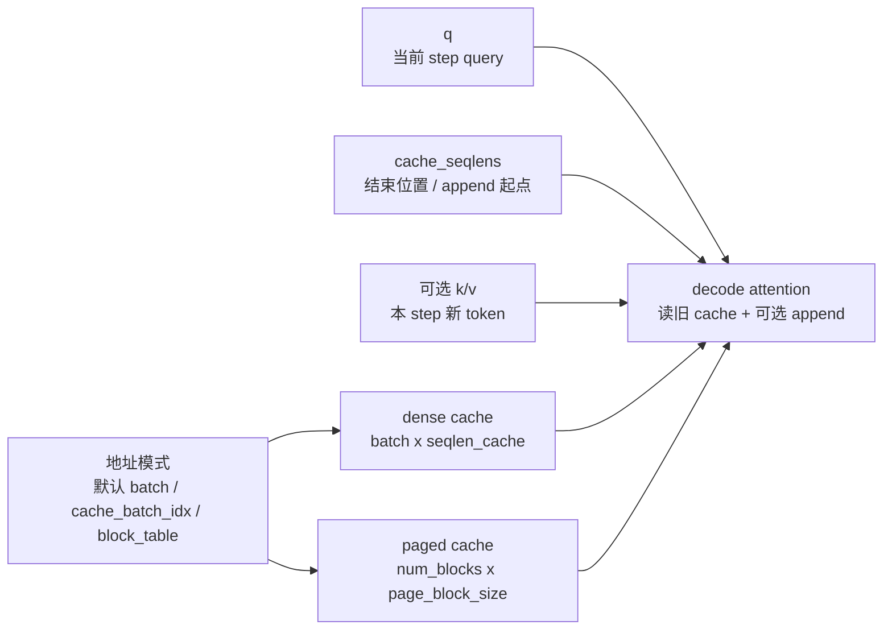

# KV-Cache · 核心概念

## 读者任务

这一篇先不追 CUDA 细节，只建立 decode cache 的对象模型。你需要能回答：为什么 prefill 和 decode 不是同一个 workload，`cache_seqlens` 为什么既是状态边界又是写入坐标，以及 dense cache、batch remap、leftpad、paged KV 中哪些能组合、哪些被明确禁止。

## 先建立模型

把一次 decode step 想成一张账本：

- 上层 runtime 维护账本：哪条请求占哪个 cache 槽位，已经写到第几个 token，paged KV 时逻辑 token 对应哪个物理 block。
- FlashAttention 执行账本：按 `cache_seqlens` 确定 cache 的结束位置与 append 起点；若有 leftpad，再减去 `cache_leftpad` 得到逻辑可见旧长度。它按 `k/v` 判断是否追加新 token，按 dense slot、`cache_batch_idx` 或 `block_table` 找到物理位置，然后计算当前 `q` 对更新后 K/V 的 attention。



这个模型的失效边界也很重要：FlashAttention 不是 cache manager。它不会替上层决定是否还有可写空间，也不会把 paged KV 和 dense leftpad 两套地址解释合并成一种新语义。

## Prefill 和 decode 的压力不同

Prefill 处理的是 prompt 内部的 full attention，`seqlen_q` 和 `seqlen_k` 往往都长，主要压力来自长序列 QK/PV 和 IO。Decode 通常每步只有少量 query，却要读取较长的历史有效范围——若启用 local window，则是被窗口裁剪后的范围——因此 cache 读取、寻址、长 K 并行组织和调度开销更显眼。

`flash_attn_with_kvcache` 的 docstring 直接把目标场景写成 incremental decoding：传入上一轮 cache，用本轮新 K/V 原地更新，并对更新后的 cache 做 attention。

```python
# 来源：flash_attn/flash_attn_interface.py L1507-L1514
    If k and v are not None, k_cache and v_cache will be updated *inplace* with the new values from
    k and v. This is useful for incremental decoding: you can pass in the cached keys/values from
    the previous step, and update them with the new keys/values from the current step, and do
    attention with the updated cache, all in 1 kernel.

    If you pass in k / v, you must make sure that the cache is large enough to hold the new values.
    For example, the KV cache could be pre-allocated with the max sequence length, and you can use
    cache_seqlens to keep track of the current sequence lengths of each sequence in the batch.
```

读源码时要把这句话当成模块契约：一次调用既可以只读历史 cache，也可以追加新 K/V 后再算 attention；但 cache 容量是调用者的责任。

## 五个核心对象

`q` 是当前 step 的 query，shape 是 `(batch_size, seqlen, nheads, headdim)`。Decode 常见 `seqlen=1`，但 API 允许多 token query。

`k_cache/v_cache` 是历史状态。无 `block_table` 时是 dense cache；有 `block_table` 时是 paged cache。

```python
# 定位：flash_attn/flash_attn_interface.py L1548-L1568（shape 摘要；完整原文见终审源码走读）
q: (batch_size, seqlen, nheads, headdim)
k_cache: (batch_size_cache, seqlen_cache, nheads_k, headdim) if there's no block_table,
    or (num_blocks, page_block_size, nheads_k, headdim) if there's a block_table (i.e. paged KV cache)
    page_block_size must be a multiple of 256.
v_cache: (batch_size_cache, seqlen_cache, nheads_k, headdim) if there's no block_table,
    or (num_blocks, page_block_size, nheads_k, headdim) if there's a block_table (i.e. paged KV cache)
k [optional]: (batch_size, seqlen_new, nheads_k, headdim). If not None, we concatenate
    k with k_cache, starting at the indices specified by cache_seqlens.
```

`cache_seqlens` 的稳妥叫法是“每条序列当前 cache 结束位置”。没有 leftpad 时，它也等于已有 token 数；有 leftpad 时，append 仍从 `cache_seqlens` 写入，但逻辑可见旧长度是 `cache_seqlens - cache_leftpad`。attention 最终看见的是这个逻辑旧长度再加本轮新增长度。

```cpp
// 来源：csrc/flash_attn/src/block_info.h L16-L24
    __device__ BlockInfo(const Params &params, const int bidb)
        : sum_s_q(!Varlen || params.cu_seqlens_q == nullptr ? -1 : params.cu_seqlens_q[bidb])
        , sum_s_k(!Varlen || params.cu_seqlens_k == nullptr || !params.is_seqlens_k_cumulative ? -1 : params.cu_seqlens_k[bidb])
        , actual_seqlen_q(!Varlen || params.cu_seqlens_q == nullptr ? params.seqlen_q : params.cu_seqlens_q[bidb + 1] - sum_s_q)
        // If is_seqlens_k_cumulative, then seqlen_k is cu_seqlens_k[bidb + 1] - cu_seqlens_k[bidb].
        // Otherwise it's cu_seqlens_k[bidb], i.e., we use cu_seqlens_k to store the sequence lengths of K.
        , leftpad_k(params.leftpad_k == nullptr ? 0 : params.leftpad_k[bidb])
        , seqlen_k_cache((!Varlen || params.cu_seqlens_k == nullptr ? params.seqlen_k : (params.is_seqlens_k_cumulative ? params.cu_seqlens_k[bidb + 1] - sum_s_k : params.cu_seqlens_k[bidb])) - leftpad_k)
        , actual_seqlen_k(params.seqused_k ? params.seqused_k[bidb] - leftpad_k : seqlen_k_cache + (params.knew_ptr == nullptr ? 0 : params.seqlen_knew))
```

`cache_batch_idx` 是 dense cache 的 batch remap。它把当前 batch 的第 `i` 条请求映射到 cache 里的另一个 batch slot。

`block_table` 是 paged KV 的地址表。它把每条序列的逻辑 block 序号映射到物理 block。

这五个对象里，最容易误读的是 `cache_seqlens`。它不是普通 shape 信息，而是 decode 状态和写入坐标：错了会把新 token 写到错误位置，或让 attention 看见错误区间。若不传它且不 append，kernel 会按本次 cache 张量可表达的完整 K 长度解释有效范围；若要 append，C++ 明确要求必须传入。

## 地址模式只能选清楚

C++ 入口先识别是否启用 paged KV。只要传入 `block_table`，就禁止 `cache_batch_idx`，并检查 `block_table` 的 device、dtype 和最后一维连续。

```cpp
// 来源：csrc/flash_attn/flash_api.cpp L1247-L1255
    at::Tensor block_table;
    const bool paged_KV = block_table_.has_value();
    if (paged_KV) {
        TORCH_CHECK(!cache_batch_idx_.has_value(), "Paged KVcache does not support cache_batch_idx");
        block_table = block_table_.value();
        CHECK_DEVICE(block_table);
        TORCH_CHECK(block_table.dtype() == torch::kInt32, "block_table must have dtype torch.int32");
        TORCH_CHECK(block_table.stride(-1) == 1, "block_table must have contiguous last dimension");
    }
```

```cpp
// 来源：csrc/flash_attn/flash_api.cpp L1264-L1268
    const int max_num_blocks_per_seq = !paged_KV ? 0 : block_table.size(1);
    const int num_blocks = !paged_KV ? 0 : kcache.size(0);
    const int page_block_size = !paged_KV ? 1 : kcache.size(1);
    TORCH_CHECK(!paged_KV || page_block_size % 256 == 0, "Paged KV cache block size must be divisible by 256");
    const int seqlen_k = !paged_KV ? kcache.size(1) : max_num_blocks_per_seq * page_block_size;
```

这里的心理模型是：地址解释必须先选清楚。dense cache 可以默认按 batch 读，也可以用 `cache_batch_idx` remap，还可以用 `cache_leftpad` 表示有效区间从哪里开始；paged KV 则通过 `block_table` 解释逻辑到物理 block 的映射。当前 C++ 直接拒绝 paged KV 与 `cache_batch_idx` 或 leftpad 同时出现，而不是尝试组合两套协议。

```cpp
// 来源：csrc/flash_attn/flash_api.cpp L1398-L1405
    if (leftpad_k_.has_value()) {
        TORCH_CHECK(!paged_KV, "We don't support Paged KV and leftpad_k running at the same time yet");
        auto leftpad_k = leftpad_k_.value();
        TORCH_CHECK(leftpad_k.dtype() == torch::kInt32, "leftpad_k must have dtype int32");
        CHECK_DEVICE(leftpad_k);
        CHECK_CONTIGUOUS(leftpad_k);
        CHECK_SHAPE(leftpad_k, batch_size);
        params.leftpad_k = static_cast<int *>(leftpad_k.data_ptr());
```

## RoPE 绑定写入位置

KV cache API 的 RoPE 不是“拿任意 q/k 旋转一下”。docstring 明确说，新 K 按 `cache_seqlens`、`cache_seqlens + 1` 等位置旋转；Q 的位置还取决于 causal/local 语义。

```python
# 来源：flash_attn/flash_attn_interface.py L1516-L1521
    Also apply rotary embedding if rotary_cos and rotary_sin are passed in. The key @k will be
    rotated by rotary_cos and rotary_sin at indices cache_seqlens, cache_seqlens + 1, etc.
    If causal or local (i.e., window_size != (-1, -1)), the query @q will be rotated by rotary_cos
    and rotary_sin at indices cache_seqlens, cache_seqlens + 1, etc.
    If not causal and not local, the query @q will be rotated by rotary_cos and rotary_sin at
    indices cache_seqlens only (i.e. we consider all tokens in @q to be at position cache_seqlens).
```

C++ 还把“必须同时 append”“rotary dim”“位置表覆盖范围”变成硬校验：

```cpp
// 来源：csrc/flash_attn/flash_api.cpp L1408-L1426
    if (rotary_cos_.has_value()) {
        TORCH_CHECK(k_.has_value(), "If rotary cos/sin are provided, new key / value to be appended to KV cache must also be provided");
        auto rotary_cos = rotary_cos_.value();
        CHECK_DEVICE(rotary_cos);
        params.rotary_dim = rotary_cos.size(1) * 2;
        TORCH_CHECK(params.rotary_dim <= head_size, "rotary_dim must be <= headdim");
        TORCH_CHECK(params.rotary_dim % 16 == 0, "Only rotary dimensions divisible by 16 are currently supported");
        const int seqlen_ro = rotary_cos.size(0);
        TORCH_CHECK(seqlen_ro >= seqlen_k, "cos/sin seqlen must be at least the seqlen of KV cache");
        CHECK_SHAPE(rotary_cos, seqlen_ro, params.rotary_dim / 2);
        CHECK_CONTIGUOUS(rotary_cos);
        TORCH_CHECK(rotary_cos.scalar_type() == q_dtype, "rotary_cos must have the same dtype as query");

        TORCH_CHECK(rotary_sin_.has_value(), "If rotary cos is provided, rotary sin must also be provided");
        auto rotary_sin = rotary_sin_.value();
        CHECK_DEVICE(rotary_sin);
        CHECK_SHAPE(rotary_sin, seqlen_ro, params.rotary_dim / 2);
        CHECK_CONTIGUOUS(rotary_sin);
        TORCH_CHECK(rotary_sin.scalar_type() == q_dtype, "rotary_cos must have the same dtype as query");
```

所以 RoPE 的排障入口不是先看数学公式，而是先看位置：`cache_seqlens` 是否表示 append 前长度，`causal/window_size` 是否符合这次 query 的位置语义，`rotary_cos/sin` 的长度是否覆盖 cache 最大位置。

## MQA/GQA 改变的是 head 映射

KV cache 支持 MQA/GQA：KV heads 可以少于 Q heads，但 Q head 数必须能被 KV head 数整除。

```python
# 来源：flash_attn/flash_attn_interface.py L1525-L1528
    Supports multi-query and grouped-query attention (MQA/GQA) by passing in KV with fewer heads
    than Q. Note that the number of heads in Q must be divisible by the number of heads in KV.
    For example, if Q has 6 heads and K, V have 2 heads, head 0, 1, 2 of Q will attention to head
    0 of K, V, and head 3, 4, 5 of Q will attention to head 1 of K, V.
```

这解释了为什么 decode 单步会有 GQA 专门优化：如果 `seqlen_q=1`，Q 的 group 维可以被拿来增加并行行数，但这个变换必须保持 Q head 到 KV head 的映射不变。

## SplitKV 要分成两层理解

“走 split kernel”与“把 K/V 真正切成多份”不是同一件事：

| 层次 | 含义 |
|------|------|
| kernel 族选择 | 只要 append、`cache_batch_idx` 或 paged KV 任一存在，就强制进入 splitKV kernel 族，因为普通 forward kernel 不承载这些 cache 语义 |
| 实际 split 数 | `num_splits=0` 交给 heuristic；最终等于 1 时走 aligned single-split；大于 1 时才产生 partial O/LSE 并启动 combine |

```cpp
// 来源：csrc/flash_attn/flash_api.cpp L1457-L1460
    auto stream = at::cuda::getCurrentCUDAStream().stream();
    // Only split kernel supports appending to KV cache, or indexing to the cache with cache_batch_idx,
    // or paged KV cache
    run_mha_fwd(params, stream, /*force_split_kernel=*/k_.has_value() || cache_batch_idx_.has_value() || paged_KV);
```

```cpp
// 来源：csrc/flash_attn/src/flash_fwd_launch_template.h L185-L191
    if (params.num_splits == 1) {
        // Defined in flash_fwd_split_align_*.cu; declared extern in the main
        // flash_fwd_split_*.cu so this call does not re-instantiate the tree here.
        run_mha_fwd_splitkv_align<T, Headdim, Is_causal>(params, stream);
        return;
    }
    run_flash_splitkv_fwd<Flash_fwd_kernel_traits<Headdim, kBlockM, kBlockN, 4, false, false, T>, Is_causal>(params, stream);
```

因此，`num_splits==1` 不能被解释成“回到普通 forward kernel”，也不能被解释成“仍有一组 partial buffer 等待 combine”。它是 aligned split kernel 的单份执行。只有 `num_splits>1` 才有中间结果和额外 HBM traffic。是否值得 multi-split 必须固定 GPU、batch、Q/K 长度、head 数、head dim、dtype、cache layout 和计时方法实测，不能从“decode Q 很短”直接推出固定加速。

## 这条路径没有 backward

`flash_attn_with_kvcache` 明确不支持 backward。原因不是 attention 不能求导，而是这个 API 的系统职责是 serving decode：它包含 in-place cache update、地址 remap、paged KV、SplitKV 等推理 runtime 语义。

```python
# 来源：flash_attn/flash_attn_interface.py L1542-L1546
    If window_size != (-1, -1), implements sliding window local attention. Query at position i
    will only attend to keys between
    [i + seqlen_k - seqlen_q - window_size[0], i + seqlen_k - seqlen_q + window_size[1]] inclusive.

    Note: Does not support backward pass.
```

训练长上下文要读普通 dense/varlen forward 和 backward；serving decode 才进入这一组笔记。

## 最小不变量

- `k_cache/v_cache` 和 `q` dtype 一致，最后一维 contiguous。
- `num_heads` 必须能被 `num_heads_k` 整除。
- paged KV 的 `page_block_size` 必须是 256 的倍数。
- append 新 K/V 时必须同时传 `k`、`v` 和 `cache_seqlens`。
- 有 leftpad 时，`cache_seqlens` 是物理结束位置，逻辑旧长度是 `cache_seqlens - cache_leftpad`。
- paged KV 不能与 `cache_batch_idx` 或 `cache_leftpad` 同时使用。
- 上层必须保证 `cache_seqlens + seqlen_new` 不超过 dense cache 容量，或 paged KV 的 block table 已覆盖可写物理 block；backend 不负责扩容。
- 传 RoPE 时必须传新 K/V；`rotary_dim <= head_dim` 且能被 16 整除，cos/sin 的序列维必须覆盖 C++ 计算出的 cache 长度。它旋转的是本次新增 K 和当前 Q，不会重写历史 cache。
- 若 `cache_batch_idx` 出现重复值并同时 append，多个逻辑请求会竞争同一物理 slot，接口不保证由哪一个写入者获胜。

## 运行验证

KV cache 路径可以直接从 `flash_attn_with_kvcache` 的签名和 docstring 验证：它同时定义了 dense/paged cache、in-place append、RoPE 位置和无 backward 语义。

```powershell
rg -n -A 100 '^def flash_attn_with_kvcache' flash-attn/flash-attention/flash_attn/flash_attn_interface.py
rg -n 'Paged KVcache does not support|leftpad_k running at the same time|force_split_kernel|num_splits == 1|rotary_dim must|seqlen_ro' flash-attn/flash-attention/csrc/flash_attn/flash_api.cpp flash-attn/flash-attention/csrc/flash_attn/src/flash_fwd_launch_template.h
```

预期同时看到：Python docstring 的 inplace/容量/无 backward 契约；C++ 对 paged + remap、paged + leftpad 的拒绝；RoPE 维度与长度检查；`force_split_kernel` 条件；以及 `num_splits==1` 的 aligned dispatch。只看到函数签名而没有这些约束，不能算读通对象模型。
