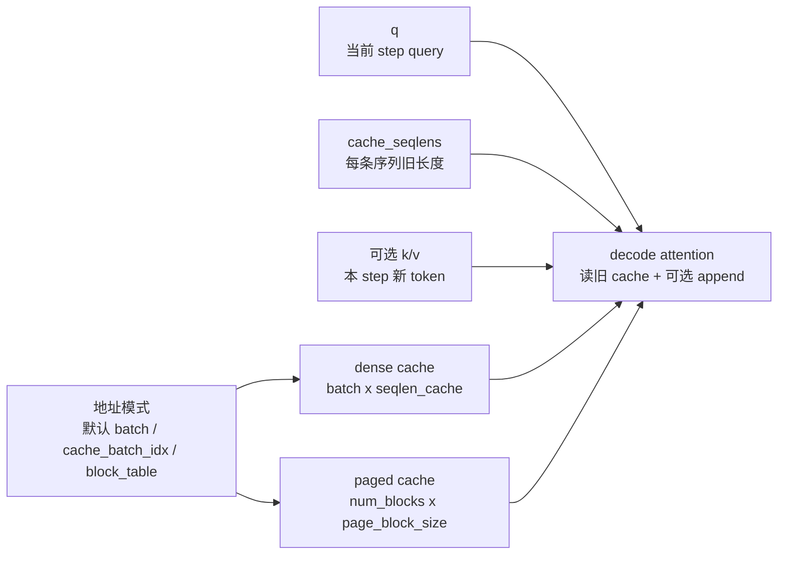

# KV-Cache · 核心概念

## 读者任务

这一篇先不追 CUDA 细节，只建立 decode cache 的对象模型。你需要能回答：为什么 prefill 和 decode 不是同一个 workload，`cache_seqlens` 为什么是状态边界，dense cache、batch remap、leftpad、paged KV 为什么不能随便叠加。

## 先建立模型

把一次 decode step 想成一张账本：

- 上层 runtime 维护账本：哪条请求占哪个 cache 槽位，已经写到第几个 token，paged KV 时逻辑 token 对应哪个物理 block。
- FlashAttention 执行账本：按 `cache_seqlens` 知道旧 cache 有多长，按 `k/v` 知道这一步要不要追加新 token，按 `block_table` 或 `cache_batch_idx` 找到物理位置，然后计算当前 `q` 对更新后 K/V 的 attention。



这个模型的失效边界也很重要：FlashAttention 不是 cache manager。它不会替上层决定是否还有可写空间，也不会把 paged KV 和 dense leftpad 两套地址解释合并成一种新语义。

## Prefill 和 decode 的压力不同

Prefill 处理的是 prompt 内部的 full attention，`seqlen_q` 和 `seqlen_k` 往往都长，主要压力来自长序列 QK/PV 和 IO。Decode 通常每步只有少量 query，但必须读完整历史 KV cache，压力转移到 cache 读取、寻址、长上下文并行度和调度开销。

`flash_attn_with_kvcache` 的 docstring 直接把目标场景写成 incremental decoding：传入上一轮 cache，用本轮新 K/V 原地更新，并对更新后的 cache 做 attention。

```python
# 来源：flash_attn/flash_attn_interface.py L1507-L1514
If k and v are not None, k_cache and v_cache will be updated *inplace* with the new values from
k and v. This is useful for incremental decoding: you can pass in the cached keys/values from
the previous step, and update them with the new keys/values from the current step, and do
attention with the updated cache, all in 1 kernel.

If you pass in k / v, you must make sure that the cache is large enough to hold the new values.
```

读源码时要把这句话当成模块契约：一次调用既可以只读历史 cache，也可以追加新 K/V 后再算 attention；但 cache 容量是调用者的责任。

## 五个核心对象

`q` 是当前 step 的 query，shape 是 `(batch_size, seqlen, nheads, headdim)`。Decode 常见 `seqlen=1`，但 API 允许多 token query。

`k_cache/v_cache` 是历史状态。无 `block_table` 时是 dense cache；有 `block_table` 时是 paged cache。

```python
# 来源：flash_attn/flash_attn_interface.py L1548-L1568
q: (batch_size, seqlen, nheads, headdim)
k_cache: (batch_size_cache, seqlen_cache, nheads_k, headdim) if there's no block_table,
    or (num_blocks, page_block_size, nheads_k, headdim) if there's a block_table (i.e. paged KV cache)
    page_block_size must be a multiple of 256.
v_cache: (batch_size_cache, seqlen_cache, nheads_k, headdim) if there's no block_table,
    or (num_blocks, page_block_size, nheads_k, headdim) if there's a block_table (i.e. paged KV cache)
k [optional]: (batch_size, seqlen_new, nheads_k, headdim). If not None, we concatenate
    k with k_cache, starting at the indices specified by cache_seqlens.
```

`cache_seqlens` 是每条序列已有 cache 长度。append 时，新 K/V 从这个位置写入；attention 看到的是旧长度加上本轮新增长度。

`cache_batch_idx` 是 dense cache 的 batch remap。它把当前 batch 的第 `i` 条请求映射到 cache 里的另一个 batch slot。

`block_table` 是 paged KV 的地址表。它把每条序列的逻辑 block 序号映射到物理 block。

这五个对象里，最容易误读的是 `cache_seqlens`。它不是普通 shape 信息，而是 decode 状态：错了就会把新 token 写到错误位置，或者让 attention 看见不该看的 cache 区间。

## 地址模式只能选清楚

C++ 入口先识别是否启用 paged KV。只要传入 `block_table`，就禁止 `cache_batch_idx`，并检查 `block_table` 的 device、dtype 和最后一维连续。

```cpp
// 来源：csrc/flash_attn/flash_api.cpp L1247-L1268
at::Tensor block_table;
const bool paged_KV = block_table_.has_value();
if (paged_KV) {
    TORCH_CHECK(!cache_batch_idx_.has_value(), "Paged KVcache does not support cache_batch_idx");
    block_table = block_table_.value();
    CHECK_DEVICE(block_table);
    TORCH_CHECK(block_table.dtype() == torch::kInt32, "block_table must have dtype torch.int32");
    TORCH_CHECK(block_table.stride(-1) == 1, "block_table must have contiguous last dimension");
}

const int max_num_blocks_per_seq = !paged_KV ? 0 : block_table.size(1);
const int num_blocks = !paged_KV ? 0 : kcache.size(0);
const int page_block_size = !paged_KV ? 1 : kcache.size(1);
TORCH_CHECK(!paged_KV || page_block_size % 256 == 0, "Paged KV cache block size must be divisible by 256");
```

这里的心理模型是：地址解释不能叠两套。dense cache 可以默认按 batch 读，也可以用 `cache_batch_idx` remap，还可以用 `cache_leftpad` 表示左 padding；paged KV 则通过 `block_table` 解释逻辑到物理 block 的映射。两套模式混用会让同一个 token 的物理位置没有唯一解释。

## RoPE 绑定写入位置

KV cache API 的 RoPE 不是“拿任意 q/k 旋转一下”。docstring 明确说，新 K 按 `cache_seqlens`、`cache_seqlens + 1` 等位置旋转；Q 的位置还取决于 causal/local 语义。

```python
# 来源：flash_attn/flash_attn_interface.py L1516-L1521
Also apply rotary embedding if rotary_cos and rotary_sin are passed in. The key @k will be
rotated by rotary_cos and rotary_sin at indices cache_seqlens, cache_seqlens + 1, etc.
If causal or local (i.e., window_size != (-1, -1)), the query @q will be rotated by rotary_cos
and rotary_sin at indices cache_seqlens, cache_seqlens + 1, etc.
If not causal and not local, the query @q will be rotated by rotary_cos and rotary_sin at
indices cache_seqlens only (i.e. we consider all tokens in @q to be at position cache_seqlens).
```

所以 RoPE 的排障入口不是先看数学公式，而是先看位置：`cache_seqlens` 是否表示 append 前长度，`causal/window_size` 是否符合这次 query 的位置语义，`rotary_cos/sin` 的长度是否覆盖 cache 最大位置。

## MQA/GQA 改变的是 head 映射

KV cache 支持 MQA/GQA：KV heads 可以少于 Q heads，但 Q head 数必须能被 KV head 数整除。

```python
# 来源：flash_attn/flash_attn_interface.py L1525-L1528
Supports multi-query and grouped-query attention (MQA/GQA) by passing in KV with fewer heads
than Q. Note that the number of heads in Q must be divisible by the number of heads in KV.
For example, if Q has 6 heads and K, V have 2 heads, head 0, 1, 2 of Q will attention to head
0 of K, V, and head 3, 4, 5 of Q will attention to head 1 of K, V.
```

这解释了为什么 decode 单步会有 GQA 专门优化：如果 `seqlen_q=1`，Q 的 group 维可以被拿来增加并行行数，但这个变换必须保持 Q head 到 KV head 的映射不变。

## 这条路径没有 backward

`flash_attn_with_kvcache` 明确不支持 backward。原因不是 attention 不能求导，而是这个 API 的系统职责是 serving decode：它包含 in-place cache update、地址 remap、paged KV、SplitKV 等推理 runtime 语义。

```python
# 来源：flash_attn/flash_attn_interface.py L1542-L1546
If window_size != (-1, -1), implements sliding window local attention. Query at position i
will only attend to keys between
[i + seqlen_k - seqlen_q - window_size[0], i + seqlen_k - seqlen_q + window_size[1]] inclusive.

Note: Does not support backward pass.
```

训练长上下文要读普通 dense/varlen forward 和 backward；serving decode 才进入这一组笔记。

## 最小不变量

- `k_cache/v_cache` 和 `q` dtype 一致，最后一维 contiguous。
- `num_heads` 必须能被 `num_heads_k` 整除。
- paged KV 的 `page_block_size` 必须是 256 的倍数。
- append 新 K/V 时必须同时传 `k`、`v` 和 `cache_seqlens`。
- 上层必须保证 `cache_seqlens + seqlen_new` 不超过 dense cache 容量，或 paged KV 的 block table 已覆盖可写物理 block。
- 传 RoPE 时必须传新 K/V；它旋转的是本次新增 K 和当前 Q，不会重写历史 cache。

## 运行验证

KV cache 路径可以直接从 `flash_attn_with_kvcache` 的签名和 docstring 验证：它同时定义了 dense/paged cache、in-place append、RoPE 位置和无 backward 语义。

```powershell
rg -n 'def flash_attn_with_kvcache|flash_attn_with_kvcache|k_cache|v_cache|cache_seqlens|block_table|cache_batch_idx|rotary_cos|rotary_sin|num_heads_k|page_block_size|Does not support backward|seqlen_q' flash-attn/flash-attention/flash_attn/flash_attn_interface.py
```

读输出时先看函数参数，确认 `k_cache/v_cache/cache_seqlens/block_table` 的组合；再看 docstring 中对 paged KV、`page_block_size`、MQA/GQA 和 RoPE 的说明。最后确认 `Does not support backward`，避免把 serving decode API 当训练 attention 路径使用。

