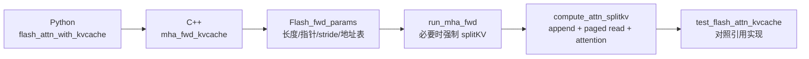

# KV-Cache · 源码走读

## 读者任务

这一篇沿一次 decode step 走源码：上层 runtime 已经分配好 cache，本轮传入 `q`，可选传入新 `k/v`，FlashAttention 要把新 K/V 写进 cache，再让当前 Q 对更新后的历史做 attention。

读完后你应该能回答：

- Python API 为什么把 cache update 和 attention 放进一次 extension 调用。
- C++ 入口怎样确认 dense cache、batch remap、leftpad、paged KV 的地址模式。
- `Flash_fwd_params` 里哪些字段把 decode 状态传给 CUDA kernel。
- append 和 paged addressing 真正在 kernel 内如何影响读写。
- 用哪个 upstream test 验证你的理解。

## 长文读法

这篇按“一次 decode 调用同时更新 cache 并完成 attention”读：Python 入口保留 `flash_attn_with_kvcache` 的单调用语义，C++ 入口校验 dense / batch remap / leftpad / paged KV 的地址模式，`Flash_fwd_params` 把新 K/V、长度、block table 和 SplitKV 信息传给 kernel，CUDA kernel 先把新 K/V 写入 cache，再从更新后的历史里读 K/V 做 attention。

| 读者任务 | 先读 | 要抓住的判断 |
|----------|------|--------------|
| 第一次建立 KV cache decode 主线 | 贯穿场景、第一步到第三步 | 上层 runtime 已分配 cache，FlashAttention 负责在同一调用里 append 新 K/V 并计算当前 Q |
| 排查 Python 参数或布局错误 | 第一步、第二步 | Python 只做 contiguous 和默认值归一化，dtype、shape、paged / batch_idx 互斥主要在 C++ 拦截 |
| 理解 `Flash_fwd_params` 里的 decode 字段 | 第三步 | `seqlen_knew`、`knew/vnew`、`cache_batch_idx`、`leftpad_k`、`block_table` 是 kernel 地址语义的关键 |
| 判断为什么强制走 SplitKV | 第四步 | append、`cache_batch_idx` 或 paged KV 都需要 split kernel；`num_splits==1` 仍是 aligned split kernel，但不需要 partial buffer 和 combine |
| 排查 append 后 attention 没看到新 token | 第五步 | kernel 先写新 K/V，再同步后读 cache；如果这条顺序错，当前步看不到刚追加的历史 |
| 理解 paged KV 指针推进 | 第六步 | paged 模式不按连续 batch slot 前进，而是通过 `block_table` 和 page offset 计算 K/V 地址 |
| 找测试覆盖组合 | 第七步 | upstream test 覆盖 MHA/MQA/GQA、new_kv、paged、leftpad、RoPE、ALiBi、causal/local；但当前参数矩阵没有启用 `cache_batch_idx`，且显式跳过 leftpad + paged |

读的时候把“cache 的物理地址”和“attention 的逻辑长度”分开：前者由 dense slot、batch remap 或 block table 决定，后者由 `cache_seqlens`、leftpad 和新 K/V 长度共同决定。

## 贯穿场景

假设 batch 里有两条请求，每条已经有一段历史 KV cache。本轮 decode 有当前 `q`，也可能有本轮新算出的 `k/v`。如果是 dense cache，物理地址来自 batch slot 和 `cache_seqlens`；如果是 paged KV，物理地址来自 `block_table`。



这条主线不按文件顺序展开，而按责任边界展开。

## 第一步：Python 入口保留一次调用语义

**系统压力：** 增量解码要求“写入本轮 K/V”和“让本轮 Q 看见更新后的 cache”共享同一套长度与地址语义。若拆成两个独立调用，上层还要自行保证写入完成、RoPE 位置、cache length 与 attention 可见范围一致。

**设计选择：** `flash_attn_with_kvcache` 把当前 `q`、历史 cache、新 K/V、RoPE、地址模式、window、ALiBi、SplitKV 参数一起传给 `flash_attn_gpu.fwd_kvcache`。Python 层只做布局归一化和默认值设置。

**源码证据：**

```python
# 来源：flash_attn/flash_attn_interface.py L1593-L1627
    assert k_cache.stride(-1) == 1, "k_cache must have contiguous last dimension"
    assert v_cache.stride(-1) == 1, "v_cache must have contiguous last dimension"
    q, k, v = [maybe_contiguous(x) for x in (q, k, v)]
    if softmax_scale is None:
        softmax_scale = q.shape[-1] ** (-0.5)
    if cache_seqlens is not None and isinstance(cache_seqlens, int):
        cache_seqlens = torch.full(
            (q.shape[0],), cache_seqlens, dtype=torch.int32, device=k_cache.device
        )
        cache_seqlens = maybe_contiguous(cache_seqlens)
    cache_batch_idx = maybe_contiguous(cache_batch_idx)
    block_table = maybe_contiguous(block_table)
    out, softmax_lse = flash_attn_gpu.fwd_kvcache(
        q,
        k_cache,
        v_cache,
        k,
        v,
        cache_seqlens,
        rotary_cos,
        rotary_sin,
        cache_batch_idx,
        cache_leftpad,
        block_table,
        alibi_slopes,
        None,
        softmax_scale,
        causal,
        window_size[0],
        window_size[1],
        softcap,
        rotary_interleaved,
        num_splits,
    )
    return (out, softmax_lse) if return_softmax_lse else out
```

**执行逻辑：**

- cache 的最后一维必须 contiguous，因为底层 kernel 按 head dimension 连续加载。
- `cache_seqlens` 如果是一个整数，会被扩成 batch 维 int32 tensor，后续 C++ 和 CUDA 都按 per-request 长度读取。
- `cache_batch_idx` 和 `block_table` 在 Python 侧只做 contiguous 处理，真正的互斥和 shape 校验留给 C++。
- extension 调用无论如何都返回 `out, softmax_lse`；`return_softmax_lse` 只控制 Python 最后一行如何打包返回值，不是一个 kernel 分流开关。

**不变量与失败模式：**

- 如果 `k_cache/v_cache` 最后一维不连续，Python 层直接失败。
- 如果 `cache_seqlens` 设备或 dtype 不对，C++ 层会继续拦截。
- 如果用户同时传 `block_table` 和 `cache_batch_idx`，Python 不拦，C++ 拦。

**读者抓手：** Python 入口的关键不是“参数很多”，而是它保持了“一次调用内完成 cache update + attention”的语义。

## 第二步：C++ 入口先确定地址模式

**系统压力：** KV cache 的错误地址很难靠数值检查发现。dense batch slot、`cache_batch_idx`、leftpad、paged block table 都会影响同一个 token 的物理位置，必须在 kernel 前约束清楚。

**设计选择：** `mha_fwd_kvcache` 先检查设备、dtype、stride，再用 `block_table_.has_value()` 判断是否进入 paged KV。paged KV 下禁止 `cache_batch_idx`，并要求 `block_table` 是 CUDA 上的 int32 contiguous-last-dim tensor。

**源码证据：**

```cpp
// 来源：csrc/flash_attn/flash_api.cpp L1247-L1255
    at::Tensor block_table;
    const bool paged_KV = block_table_.has_value();
    if (paged_KV) {
        TORCH_CHECK(!cache_batch_idx_.has_value(), "Paged KVcache does not support cache_batch_idx");
        block_table = block_table_.value();
        CHECK_DEVICE(block_table);
        TORCH_CHECK(block_table.dtype() == torch::kInt32, "block_table must have dtype torch.int32");
        TORCH_CHECK(block_table.stride(-1) == 1, "block_table must have contiguous last dimension");
    }
```

**执行逻辑：**

- `CUDAGuard` 确保 launch 发生在 `q` 所在 device。
- dtype 只接受 fp16/bf16，并要求 cache 与 query 一致。
- `paged_KV` 是后续 shape、capacity 解释和 kernel addressing 的分支条件。
- paged KV 与 `cache_batch_idx` 互斥。直觉上二者都参与逻辑 batch 到物理 cache 的寻址，但这里的硬结论来自入口的显式 `TORCH_CHECK`，不是仅靠类比推导。

**不变量与失败模式：**

- `block_table` dtype 错会直接报错。
- 同时传 paged KV 和 `cache_batch_idx` 会直接报错。
- `leftpad_k` 与 paged KV 也被当前 C++ 入口显式拒绝；这不是“测试暂未覆盖但也许支持”。
- 地址模式一旦在这里选错，后续 kernel 会按错误物理位置读写。

**读者抓手：** 读 KV cache 代码时，第一问永远是“这次调用是哪种地址模式”，不是先问 attention mask。

## 第三步：C++ 把 decode 状态写进 params

**系统压力：** CUDA kernel 不能拿 Python 对象做判断，它只看指针、stride、长度和少量布尔模板分支。C++ 入口必须把 decode 状态压进 `Flash_fwd_params`。

**设计选择：** C++ 用 `set_params_fprop` 初始化普通 forward 参数，再把新 K/V 指针、`cache_seqlens`、leftpad、RoPE、`cache_batch_idx`、paged KV block table 继续填进去。

**源码证据：**

```cpp
// 定位：csrc/flash_attn/src/flash.h L66-L105（字段摘要）
int b, seqlen_q, seqlen_k, seqlen_knew, d, seqlen_q_rounded, seqlen_k_rounded, d_rounded, rotary_dim, total_q;
int * __restrict__ cu_seqlens_q;
int * __restrict__ cu_seqlens_k;
int * __restrict__ leftpad_k;
int * __restrict__ seqused_k;
void * __restrict__ knew_ptr;
void * __restrict__ vnew_ptr;
index_t knew_batch_stride;
index_t vnew_batch_stride;
index_t knew_row_stride;
index_t vnew_row_stride;
index_t knew_head_stride;
index_t vnew_head_stride;
void * __restrict__ rotary_cos_ptr;
void * __restrict__ rotary_sin_ptr;
int * __restrict__ cache_batch_idx;
int * __restrict__ block_table;
index_t block_table_batch_stride;
int page_block_size;
```

**源码证据：**

```cpp
// 定位：csrc/flash_attn/flash_api.cpp L1355-L1397（控制流摘要；精确语义见下方原文卡）
at::Tensor k, v, k_padded, v_padded;
if (k_.has_value()) {
    TORCH_CHECK(v_.has_value(), "If key is supplied, value must also be passed in");
    TORCH_CHECK(seqlens_k_.has_value(), "If key is supplied, seqlens_k must also be passed in");
    TORCH_CHECK(seqlen_q <= seqlen_k, "If key is supplied, it must have seqlen <= the seqlen of the KV cache");
    k = k_.value();
    v = v_.value();
    TORCH_CHECK(k.dtype() == q_dtype, "Key must have the same dtype as query");
    TORCH_CHECK(v.dtype() == q_dtype, "Value must have the same dtype as query");
    CHECK_DEVICE(k); CHECK_DEVICE(v);
    TORCH_CHECK(k.stride(-1) == 1, "Key tensor must have contiguous last dimension");
    TORCH_CHECK(v.stride(-1) == 1, "Value tensor must have contiguous last dimension");
    int seqlen_knew = k.size(1);
    CHECK_SHAPE(k, batch_size, seqlen_knew, num_heads_k, head_size_og);
    CHECK_SHAPE(v, batch_size, seqlen_knew, num_heads_k, head_size_og);
    params.seqlen_knew = seqlen_knew;
    params.knew_ptr = k_padded.data_ptr();
    params.vnew_ptr = v_padded.data_ptr();
    params.knew_batch_stride = k_padded.stride(0);
    params.vnew_batch_stride = v_padded.stride(0);
    params.knew_row_stride = k_padded.stride(-3);
    params.vnew_row_stride = v_padded.stride(-3);
    params.knew_head_stride = k_padded.stride(-2);
    params.vnew_head_stride = v_padded.stride(-2);
}

if (seqlens_k_.has_value()) {
    auto seqlens_k = seqlens_k_.value();
    TORCH_CHECK(seqlens_k.dtype() == torch::kInt32, "seqlens_k must have dtype int32");
    CHECK_DEVICE(seqlens_k);
    CHECK_CONTIGUOUS(seqlens_k);
    CHECK_SHAPE(seqlens_k, batch_size);
    params.cu_seqlens_k = static_cast<int *>(seqlens_k.data_ptr());
}
```

压缩图只用于看字段关系；下面两张原文卡分别钉住 append 的输入契约与 `cache_seqlens` 的解释开关：

```cpp
// 来源：csrc/flash_attn/flash_api.cpp L1355-L1369
    at::Tensor k, v, k_padded, v_padded;
    if (k_.has_value()) {
        TORCH_CHECK(v_.has_value(), "If key is supplied, value must also be passed in");
        TORCH_CHECK(seqlens_k_.has_value(), "If key is supplied, seqlens_k must also be passed in");
        TORCH_CHECK(seqlen_q <= seqlen_k, "If key is supplied, it must have seqlen <= the seqlen of the KV cache");
        k = k_.value();
        v = v_.value();
        TORCH_CHECK(k.dtype() == q_dtype, "Key must have the same dtype as query");
        TORCH_CHECK(v.dtype() == q_dtype, "Value must have the same dtype as query");
        CHECK_DEVICE(k); CHECK_DEVICE(v);
        TORCH_CHECK(k.stride(-1) == 1, "Key tensor must have contiguous last dimension");
        TORCH_CHECK(v.stride(-1) == 1, "Value tensor must have contiguous last dimension");
        int seqlen_knew = k.size(1);
        CHECK_SHAPE(k, batch_size, seqlen_knew, num_heads_k, head_size_og);
        CHECK_SHAPE(v, batch_size, seqlen_knew, num_heads_k, head_size_og);
```

```cpp
// 来源：csrc/flash_attn/flash_api.cpp L1389-L1397
    if (seqlens_k_.has_value()) {
        auto seqlens_k = seqlens_k_.value();
        TORCH_CHECK(seqlens_k.dtype() == torch::kInt32, "seqlens_k must have dtype int32");
        CHECK_DEVICE(seqlens_k);
        CHECK_CONTIGUOUS(seqlens_k);
        CHECK_SHAPE(seqlens_k, batch_size);
        params.cu_seqlens_k = static_cast<int *>(seqlens_k.data_ptr());
    }
    params.is_seqlens_k_cumulative = !(seqlens_k_.has_value());
```

**执行逻辑：**

- `k_.has_value()` 是 append 的入口。
- 传新 K 必须同时传 V 和 `seqlens_k_`，否则 kernel 不知道写入起点。
- `params.knew_ptr` 非空以后，CUDA launch 会走 `Append_KV` 分支。
- `params.cu_seqlens_k` 在 KV cache 路径里存的是每条序列当前 cache 长度，不是 varlen forward 的累计前缀和；`params.is_seqlens_k_cumulative` 后面会告诉 kernel 如何解释。

**不变量与失败模式：**

- 新 K/V shape 必须是 `[batch, seqlen_knew, kv_heads, head_dim]`。
- C++ 检查基本 shape 和 stride，也检查 query 长度不超过 cache 的静态长度，但这里没有逐条验证 `cache_seqlens[i] + seqlen_knew <= cache capacity`；容量责任由 API 文档明确交给调用方。
- 如果 `cache_seqlens` 与上层 cache manager 的真实写入位置不一致，append 会写错位置，attention 也会读错有效长度。

**读者抓手：** `Flash_fwd_params` 可以看成 decode step 的执行票据。后续 kernel 不再知道 Python 参数名，只看这些字段。

## 第四步：SplitKV 是 cache 语义的分流口

**系统压力：** Decode 可能只有很短的 Q，却要扫描很长的 K/V。实现允许沿 K/V 范围拆分工作；与此同时，append、`cache_batch_idx`、paged KV 这些 cache-specific 语义只在 splitKV kernel 路径实现。实际是否更快取决于 GPU、形状、dtype、布局和 split 决策，源码本身不承诺固定收益。

**设计选择：** C++ 总是先配置 splitKV 参数和可能的 partial buffer；当存在 append、cache remap 或 paged KV 时，调用 `run_mha_fwd` 时强制 split kernel。

**源码证据：**

```cpp
// 定位：csrc/flash_attn/flash_api.cpp L299-L328（控制流摘要；精确分配条件见下方原文卡）
std::tuple<at::Tensor, at::Tensor> set_params_splitkv(Flash_fwd_params &params, const int batch_size,
    const int num_heads, const int head_size, const int max_seqlen_k, const int max_seqlen_q,
    const int head_size_rounded, const float p_dropout,
    const int num_splits, const int num_sm, struct c10::TensorOptions opts) {

    const int block_n = head_size <= 64 ? 256 : (head_size <= 128 ? 128 : 64);
    const int num_n_blocks = (max_seqlen_k + block_n - 1) / block_n;
    const int num_m_blocks = (max_seqlen_q + 64 - 1) / 64;
    params.num_splits = num_splits;
    at::Tensor softmax_lse_accum;
    at::Tensor out_accum;

    if (p_dropout == 0.0f) {
        if (num_splits < 1) {
            params.num_splits = num_splits_heuristic(batch_size * num_heads * num_m_blocks, num_sm * 2, num_n_blocks, 128);
        }
        if (params.num_splits > 1) {
            softmax_lse_accum = torch::empty({params.num_splits, batch_size, num_heads, max_seqlen_q}, opts.dtype(at::kFloat));
            out_accum = torch::empty({params.num_splits, batch_size, num_heads, max_seqlen_q, head_size_rounded}, opts.dtype(at::kFloat));
            params.softmax_lseaccum_ptr = softmax_lse_accum.data_ptr();
            params.oaccum_ptr = out_accum.data_ptr();
        }
        TORCH_CHECK(params.num_splits <= 128, "num_splits > 128 not supported");
    }
```

```cpp
// 来源：csrc/flash_attn/flash_api.cpp L314-L325
    if (p_dropout == 0.0f) {  // SplitKV is not implemented for dropout
        if (num_splits < 1) {
            // We multiply number of SMs by 2 to hard-code the fact that we're using 128 threads per block.
            params.num_splits = num_splits_heuristic(batch_size * num_heads * num_m_blocks, num_sm * 2, num_n_blocks, 128);
        }
        if (params.num_splits > 1) {
            softmax_lse_accum = torch::empty({params.num_splits, batch_size, num_heads, max_seqlen_q}, opts.dtype(at::kFloat));
            out_accum = torch::empty({params.num_splits, batch_size, num_heads, max_seqlen_q, head_size_rounded}, opts.dtype(at::kFloat));
            params.softmax_lseaccum_ptr = softmax_lse_accum.data_ptr();
            params.oaccum_ptr = out_accum.data_ptr();
        }
        TORCH_CHECK(params.num_splits <= 128, "num_splits > 128 not supported");
```

**源码证据：**

```cpp
// 定位：csrc/flash_attn/flash_api.cpp L1442-L1460（调用骨架；强制条件见下方原文卡）
at::Tensor softmax_lse_accum, out_accum;
std::tie(softmax_lse_accum, out_accum) = set_params_splitkv(
    params, batch_size, num_heads, head_size, seqlen_k, seqlen_q,
    head_size_rounded, /*dropout*/ 0.f, num_splits, get_num_sm(get_current_device()), opts);

if (paged_KV) {
    params.block_table = block_table.data_ptr<int>();
    params.block_table_batch_stride = block_table.stride(0);
}
params.page_block_size = page_block_size;

set_params_alibi(params, alibi_slopes_, batch_size, num_heads);

auto stream = at::cuda::getCurrentCUDAStream().stream();
run_mha_fwd(params, stream, /*force_split_kernel=*/k_.has_value() || cache_batch_idx_.has_value() || paged_KV);
```

```cpp
// 来源：csrc/flash_attn/flash_api.cpp L1457-L1460
    auto stream = at::cuda::getCurrentCUDAStream().stream();
    // Only split kernel supports appending to KV cache, or indexing to the cache with cache_batch_idx,
    // or paged KV cache
    run_mha_fwd(params, stream, /*force_split_kernel=*/k_.has_value() || cache_batch_idx_.has_value() || paged_KV);
```

强制进入 split kernel 不等于“必然切成多份”。当最终 `num_splits==1` 时，dispatch 选择 aligned split kernel 并直接返回：

```cpp
// 来源：csrc/flash_attn/src/flash_fwd_launch_template.h L180-L191
void run_mha_fwd_splitkv_dispatch(Flash_fwd_params &params, cudaStream_t stream) {
    constexpr static int kBlockM = 64;
    // TD [2023-08-28]: nvcc segfaults for headdim 96 with block size 64 x 256,
    // and for headdim 192 with block size 64 x 128.
    constexpr static int kBlockN = Headdim <= 64 ? 256 : (Headdim <= 128 ? 128 : 64);
    if (params.num_splits == 1) {
        // Defined in flash_fwd_split_align_*.cu; declared extern in the main
        // flash_fwd_split_*.cu so this call does not re-instantiate the tree here.
        run_mha_fwd_splitkv_align<T, Headdim, Is_causal>(params, stream);
        return;
    }
    run_flash_splitkv_fwd<Flash_fwd_kernel_traits<Headdim, kBlockM, kBlockN, 4, false, false, T>, Is_causal>(params, stream);
```

**执行逻辑：**

- `num_splits=0` 会触发 heuristic，而不是固定为不 split。
- 如果实际 split 数大于 1，需要 `softmax_lse_accum` 和 `out_accum` 保存每个 split 的 partial 结果。
- `num_splits==1` 使用 aligned split kernel，既不分配 partial buffer，也不会启动 combine kernel；combine 只在 `params.num_splits > 1` 时发生。
- paged KV 的 `block_table` 指针和 page size 在 launch 前写入 params。
- append、cache remap、paged KV 任一存在都会强制 split kernel。

**不变量与失败模式：**

- `num_splits` 过大直接报错。
- 只有 `num_splits>1` 的 multi-split 才增加 partial buffer 和 combine，因此这时才引入额外 HBM 读写；aligned single-split 没有这笔中间结果开销。
- 如果忘记强制 split kernel，append 或 paged addressing 就可能落到不支持这些语义的普通 forward 路径。

**读者抓手：** 看到 `num_splits=0` 不要理解成“不切分”，而是“让 backend 根据 workload 自动决定”。

## 第五步：kernel 里先写新 K/V，再读更新后的 cache

**系统压力：** 如果本轮传入新 K/V，attention 必须看到更新后的 cache。写入位置还要分别兼容 dense cache（可带 leftpad）或 paged KV，并处理 RoPE、MQA/GQA；当前实现不允许 leftpad 与 paged KV 同时出现。

**设计选择：** splitKV kernel 用 `BlockInfo` 解释当前 batch 的有效长度。`actual_seqlen_k` 等于旧 cache 长度加上新 K/V 长度。`Append_KV` 分支先把新 K/V 写进 cache，再同步，随后同一 kernel 继续从 cache 读取 K/V 做 attention。

**源码证据：**

```cpp
// 定位：csrc/flash_attn/src/block_info.h L16-L35（字段摘要；长度公式见下方原文卡）
__device__ BlockInfo(const Params &params, const int bidb)
    : sum_s_q(!Varlen || params.cu_seqlens_q == nullptr ? -1 : params.cu_seqlens_q[bidb])
    , sum_s_k(!Varlen || params.cu_seqlens_k == nullptr || !params.is_seqlens_k_cumulative ? -1 : params.cu_seqlens_k[bidb])
    , actual_seqlen_q(!Varlen || params.cu_seqlens_q == nullptr ? params.seqlen_q : params.cu_seqlens_q[bidb + 1] - sum_s_q)
    , leftpad_k(params.leftpad_k == nullptr ? 0 : params.leftpad_k[bidb])
    , seqlen_k_cache((!Varlen || params.cu_seqlens_k == nullptr ? params.seqlen_k : (params.is_seqlens_k_cumulative ? params.cu_seqlens_k[bidb + 1] - sum_s_k : params.cu_seqlens_k[bidb])) - leftpad_k)
    , actual_seqlen_k(params.seqused_k ? params.seqused_k[bidb] - leftpad_k : seqlen_k_cache + (params.knew_ptr == nullptr ? 0 : params.seqlen_knew))
    {
    }

template <typename index_t>
__forceinline__ __device__ index_t k_offset(const index_t batch_stride, const index_t row_stride, const int bidb) const {
    return sum_s_k == -1 ? bidb * batch_stride + leftpad_k * row_stride : uint32_t(sum_s_k + leftpad_k) * row_stride;
}
```

```cpp
// 来源：csrc/flash_attn/src/block_info.h L16-L24
    __device__ BlockInfo(const Params &params, const int bidb)
        : sum_s_q(!Varlen || params.cu_seqlens_q == nullptr ? -1 : params.cu_seqlens_q[bidb])
        , sum_s_k(!Varlen || params.cu_seqlens_k == nullptr || !params.is_seqlens_k_cumulative ? -1 : params.cu_seqlens_k[bidb])
        , actual_seqlen_q(!Varlen || params.cu_seqlens_q == nullptr ? params.seqlen_q : params.cu_seqlens_q[bidb + 1] - sum_s_q)
        // If is_seqlens_k_cumulative, then seqlen_k is cu_seqlens_k[bidb + 1] - cu_seqlens_k[bidb].
        // Otherwise it's cu_seqlens_k[bidb], i.e., we use cu_seqlens_k to store the sequence lengths of K.
        , leftpad_k(params.leftpad_k == nullptr ? 0 : params.leftpad_k[bidb])
        , seqlen_k_cache((!Varlen || params.cu_seqlens_k == nullptr ? params.seqlen_k : (params.is_seqlens_k_cumulative ? params.cu_seqlens_k[bidb + 1] - sum_s_k : params.cu_seqlens_k[bidb])) - leftpad_k)
        , actual_seqlen_k(params.seqused_k ? params.seqused_k[bidb] - leftpad_k : seqlen_k_cache + (params.knew_ptr == nullptr ? 0 : params.seqlen_knew))
```

**源码证据：** 写入循环与同步屏障的原文分别如下。第一张卡证明 V、新 K（或旋转后的新 K）被写进 cache；第二张卡证明写完以后才允许同一 CTA 重新读取 K/V：

```cpp
// 来源：csrc/flash_attn/src/flash_fwd_kernel.h L730-L741
        const int n_block_copy_min = std::max(n_block_min, binfo.seqlen_k_cache / kBlockN);
        auto tKgK_data = tKgK.data();
        auto tVgV_data = tVgV.data();
        for (int n_block = n_block_max - 1; n_block >= n_block_copy_min; n_block--) {
            FLASH_NAMESPACE::copy_w_min_idx<Is_even_K>(
                tVgVnew, tVgV, tKVcKV, tKVpKV, binfo.actual_seqlen_k - n_block * kBlockN, binfo.seqlen_k_cache - n_block * kBlockN
            );
            tVgVnew.data() = tVgVnew.data() + (-int(kBlockN * params.vnew_row_stride));
            if (params.rotary_dim == 0) {
                FLASH_NAMESPACE::copy_w_min_idx<Is_even_K>(
                    tKgKnew, tKgK, tKVcKV, tKVpKV, binfo.actual_seqlen_k - n_block * kBlockN, binfo.seqlen_k_cache - n_block * kBlockN
                );
```

```cpp
// 来源：csrc/flash_attn/src/flash_fwd_kernel.h L778-L783
        }
        // Need this before we can read in K again, so that we'll see the updated K values.
        __syncthreads();
        tKgK.data() = tKgK_data;
        tVgV.data() = tVgV_data;
    }
```

**执行逻辑：**

- `BlockInfo` 把 `cache_seqlens` 解释成旧 cache 长度。
- `actual_seqlen_k` 把新 K/V 长度并入本次 attention 的可见 K 长度。
- append 分支从新 K/V 指针读数据，写到 cache 的当前写入位置。
- 若启用 RoPE，新 K 在写入 cache 时被旋转。
- `__syncthreads()` 之后，后续 attention 读取能看到刚写入的 K/V。

**不变量与失败模式：**

- 上层必须保证写入范围已经分配；kernel 只按给定指针和长度写。
- `cache_seqlens` 错会同时破坏写入位置和 attention 可见长度。
- RoPE 只应用于本次新 K 和当前 Q，不会重旋历史 cache。

**读者抓手：** append 不是 Python 预处理，也不是 C++ 单独 kernel；它是 splitKV kernel 内部 attention 前的一段写 cache 逻辑。

## 第六步：paged KV 直接改变 K/V 指针推进

**系统压力：** Paged KV 中逻辑上连续的 token 可能分布在不连续的物理 block。kernel 不能简单用 `row_stride` 线性后退，必须按 `block_table` 找下一块。

**设计选择：** kernel 为当前 batch 取出 `block_table` 行。初始 K/V 地址由当前 `n_block` 对应的物理 block 和 offset 计算；循环推进到上一个 K/V tile 时，如果有 `block_table`，就用相邻逻辑 block 的物理 block 差值更新指针。

**源码证据：**

```cpp
// 来源：csrc/flash_attn/src/flash_fwd_kernel.h L582-L594
    // We move K and V to the last block.
    const int bidb_cache = params.cache_batch_idx == nullptr ? bidb : params.cache_batch_idx[bidb];
    const int *block_table = params.block_table == nullptr ? nullptr : params.block_table + bidb * params.block_table_batch_stride;
    const int block_table_idx = block_table == nullptr ? 0 : (n_block_max - 1) * kBlockN / params.page_block_size;
    const int block_table_offset = block_table == nullptr ? 0 : (n_block_max - 1) * kBlockN - block_table_idx * params.page_block_size;
    const index_t row_offset_k = block_table == nullptr
        ? binfo.k_offset(params.k_batch_stride, params.k_row_stride, bidb_cache)
          + (n_block_max - 1) * kBlockN * params.k_row_stride + (bidh / params.h_h_k_ratio) * params.k_head_stride
        : block_table[block_table_idx] * params.k_batch_stride + block_table_offset * params.k_row_stride + (bidh / params.h_h_k_ratio) * params.k_head_stride;
    const index_t row_offset_v = block_table == nullptr
        ? binfo.k_offset(params.v_batch_stride, params.v_row_stride, bidb_cache)
          + (n_block_max - 1) * kBlockN * params.v_row_stride + (bidh / params.h_h_k_ratio) * params.v_head_stride
        : block_table[block_table_idx] * params.v_batch_stride + block_table_offset * params.v_row_stride + (bidh / params.h_h_k_ratio) * params.v_head_stride;
```

V 与 K 的推进分别由下面两张原文卡证明：

```cpp
// 来源：csrc/flash_attn/src/flash_fwd_kernel.h L859-L870
        // Advance gV
        if (masking_step > 0) {
            if (block_table == nullptr) {
                tVgV.data() = tVgV.data() + (-int(kBlockN * params.v_row_stride));
            } else {
                const int block_table_idx_cur = (n_block + 1) * kBlockN / params.page_block_size;
                const int block_table_offset_cur = (n_block + 1) * kBlockN - block_table_idx_cur * params.page_block_size;
                const int block_table_idx_next = n_block * kBlockN / params.page_block_size;
                const int block_table_offset_next = n_block * kBlockN - block_table_idx_next * params.page_block_size;
                tVgV.data() = tVgV.data() + (block_table[block_table_idx_next] - block_table[block_table_idx_cur]) * params.v_batch_stride + (block_table_offset_next - block_table_offset_cur) * params.v_row_stride;
            }
            FLASH_NAMESPACE::copy</*Is_even_MN=*/true, Is_even_K>(gmem_tiled_copy_QKV, tVgV, tVsV, tKVcKV, tKVpKV);
```

```cpp
// 来源：csrc/flash_attn/src/flash_fwd_kernel.h L898-L909
        if (n_block > n_block_min) {
            // Advance gK
            if (block_table == nullptr) {
                tKgK.data() = tKgK.data() + (-int(kBlockN * params.k_row_stride));
            } else {
                const int block_table_idx_cur = n_block * kBlockN / params.page_block_size;
                const int block_table_offset_cur = n_block * kBlockN - block_table_idx_cur * params.page_block_size;
                const int block_table_idx_next = (n_block - 1) * kBlockN / params.page_block_size;
                const int block_table_offset_next =(n_block - 1) * kBlockN - block_table_idx_next * params.page_block_size;
                tKgK.data() = tKgK.data() + (block_table[block_table_idx_next] - block_table[block_table_idx_cur]) * params.k_batch_stride + (block_table_offset_next - block_table_offset_cur) * params.k_row_stride;
            }
            FLASH_NAMESPACE::copy</*Is_even_MN=*/true, Is_even_K>(gmem_tiled_copy_QKV, tKgK, tKsK, tKVcKV, tKVpKV);
```

**执行逻辑：**

- dense cache 下，K/V 指针按 row stride 线性移动。
- paged KV 下，逻辑 block 序号先查 `block_table` 得到物理 block，再加 page 内 offset。
- 循环向前推进时，指针变化由物理 block 差值和 page 内 offset 差值共同决定。

**不变量与失败模式：**

- `block_table` 必须覆盖本次 attention 可能访问的逻辑 block。
- `page_block_size` 必须和 cache layout 一致，且 C++ 已要求是 256 的倍数。
- 如果上层释放或复用物理 block 早于 kernel 完成，kernel 会按旧表读错数据。

**读者抓手：** Paged KV 的本质不是换了一个 cache shape，而是 kernel 里 K/V 指针推进方式从线性地址变成查表地址。

## 第七步：测试矩阵把生产组合拉到一起

**系统压力：** KV cache 的 bug 往往只在组合开关下出现，例如 paged KV + RoPE、leftpad + local window、MQA/GQA + long context、`num_splits=0` heuristic。

**设计选择：** `test_flash_attn_kvcache` 构造随机 cache、可选新 K/V、可选 RoPE、paged KV、leftpad、ALiBi、causal/local、MQA/GQA 和 split 数，并和 PyTorch 引用实现比较输出；若有新 K/V，还验证 cache 真的被更新。

**源码证据：**

```python
# 定位：tests/test_flash_attn.py L1858-L1907（参数矩阵摘要；跳过条件见下方原文卡）
@pytest.mark.parametrize("dtype", [torch.float16])
@pytest.mark.parametrize("num_splits", [1, 0])
@pytest.mark.parametrize("mha_type", ["mha", "mqa", "gqa"])
@pytest.mark.parametrize("new_kv", [False, True])
@pytest.mark.parametrize("alibi", [False, True])
@pytest.mark.parametrize("local", [False, True])
@pytest.mark.parametrize("causal", [False, True])
@pytest.mark.parametrize("seqlen_new_eq_seqlen_q", [True, False])
@pytest.mark.parametrize("rotary_interleaved", [False, True])
@pytest.mark.parametrize("rotary_fraction", [0.0, 0.5, 1.0])
@pytest.mark.parametrize("paged_kv_block_size", [None, 256])
@pytest.mark.parametrize("has_leftpad", [False, True])
@pytest.mark.parametrize("has_batch_idx", [False])
@pytest.mark.parametrize("d", [32, 59, 64, 80, 128, 256])
def test_flash_attn_kvcache(
```

参数表面上出现 `has_batch_idx` 和 `has_leftpad`，不等于所有笛卡尔积都被执行。当前文件把 `has_batch_idx` 固定为 `False`，函数体还显式跳过两种 paged 组合：

```python
# 来源：tests/test_flash_attn.py L1925-L1932
    if seqlen_q > seqlen_k and new_kv:
        pytest.skip()
    if not new_kv and rotary_fraction > 0.0:
        pytest.skip()
    if has_batch_idx and paged_kv_block_size is not None:
        pytest.skip()
    if has_leftpad and paged_kv_block_size is not None:
        pytest.skip()
```

**源码证据：** 测试先构造更新后的 reference cache，再用同一组参数调用 KV-cache API：

```python
# 来源：tests/test_flash_attn.py L2047-L2072
    if new_kv:
        update_mask = torch.logical_and(
            cache_seqlens_expanded <= arange, arange < cache_seqlens_expanded + seqlen_new
        )
        k_cache_ref[update_mask] = rearrange(k_ro, "b s ... -> (b s) ...")
        v_cache_ref[update_mask] = rearrange(v, "b s ... -> (b s) ...")
    k_cache_rep = repeat(k_cache_ref, "b s h d -> b s (h g) d", g=nheads // nheads_k)
    v_cache_rep = repeat(v_cache_ref, "b s h d -> b s (h g) d", g=nheads // nheads_k)
    out = flash_attn_with_kvcache(
        q,
        k_cache if paged_kv_block_size is None else k_cache_paged,
        v_cache if paged_kv_block_size is None else v_cache_paged,
        k,
        v,
        rotary_cos=cos,
        rotary_sin=sin,
        cache_seqlens=cache_seqlens,
        cache_batch_idx=cache_batch_idx,
        cache_leftpad=cache_leftpad,
        block_table=block_table,
        causal=causal,
        window_size=window_size,
        rotary_interleaved=rotary_interleaved,
        alibi_slopes=alibi_slopes,
        num_splits=num_splits,
    )
```

测试随后从 dense 或 paged cache 回读，并同时检查 cache 本体与 attention 输出：

```python
# 来源：tests/test_flash_attn.py L2118-L2140
    if new_kv:
        if paged_kv_block_size is None:
            k_cache_select = (
                k_cache if not has_batch_idx else k_cache[cache_batch_idx.to(dtype=torch.long)]
            )
            v_cache_select = (
                v_cache if not has_batch_idx else v_cache[cache_batch_idx.to(dtype=torch.long)]
            )
        else:
            k_cache_select = rearrange(
                k_cache_paged[block_table.to(dtype=torch.long).flatten()],
                "(b nblocks) block_size ... -> b (nblocks block_size) ...",
                b=batch_size,
            )[:, :seqlen_k]
            v_cache_select = rearrange(
                v_cache_paged[block_table.to(dtype=torch.long).flatten()],
                "(b nblocks) block_size ... -> b (nblocks block_size) ...",
                b=batch_size,
            )[:, :seqlen_k]
        assert torch.allclose(k_cache_select, k_cache_ref, rtol=1e-3, atol=1e-3)
        assert torch.equal(v_cache_select, v_cache_ref)
    mult = 3 if not alibi else 5
    assert (out - out_ref).abs().max().item() <= mult * (out_pt - out_ref).abs().max().item() + 1e-5
```

**执行逻辑：**

- 测试先在 Python 里构造“应该更新后的 cache”。
- `flash_attn_with_kvcache` 返回输出后，测试和 reference attention 比较。
- 如果发生 append，测试再从 dense cache 或 paged cache 里读回，确认 cache 被写成 reference。

**不变量与失败模式：**

- 测试显式跳过 paged KV 与 leftpad、paged KV 与 batch idx 的组合；C++ 入口也显式拒绝这两种组合。当前参数装饰器还把 `has_batch_idx` 固定为 `False`，所以本测试并没有实际覆盖 dense `cache_batch_idx` remap。
- 测试覆盖 `num_splits=0`，说明自动 split 是受支持路径。
- 如果你改 cache addressing，必须同时看输出 correctness 和 cache update correctness。

## 接口边界：这条路径刻意不替上层做什么

源码走读最容易在“kernel 做了什么”上写得很满，却漏掉 API 明确不负责的部分。这个入口还有四条必须带走的边界：

1. **它是原地更新。** 传入新 `k/v` 时，`k_cache/v_cache` 会被 inplace 修改，并在同一 kernel 内对更新后的 cache 做 attention（`flash_attn_interface.py L1507-L1510`）。调用方不能把 cache 当成纯输入。
2. **容量由调用方保证。** 文档直接要求调用方确保 cache 足够容纳新值（`flash_attn_interface.py L1512-L1514`）；C++ 不会为每条请求动态扩容，也没有逐条容量兜底。
3. **它不支持 backward。** API 文档在 `flash_attn_interface.py L1546` 明示这一点；这条 serving 路径不能因为输入 tensor 带梯度就被理解成训练算子。
4. **重复 remap 的写入者不确定。** 如果 `cache_batch_idx` 有重复值且同时 append，新值可能来自任一重复索引对应的请求（`flash_attn_interface.py L1563-L1566`）。读共享 cache 可以是有意的，多个写者抢同一 slot 则不是确定性更新协议。

还有一个常被忽略的实现边角：当原始 head dimension 不是 8 的倍数时，C++ 先构造 padded 的 Q/cache/new K/V；append 完成后，再把 padded cache 裁回原始维度并复制回调用方 cache（`flash_api.cpp L1302-L1311`、`L1370-L1376`、`L1462-L1469`）。因此“cache 原地更新”仍成立，但这条少见分支会多一次 cache copy，不能把常规路径的内存行为无条件外推到它。

## 运行验证

在安装好 FlashAttention 的 CUDA 环境里，可以只跑 KV cache 测试：

```powershell
Push-Location flash-attn\flash-attention
pytest tests/test_flash_attn.py -q -s -k test_flash_attn_kvcache
Pop-Location
```

预期现象：

- 通过的组合会打印 output diff，并通过和 reference/PyTorch 的误差断言。
- paged KV 与 leftpad、paged KV 与 batch idx 这类组合会被测试跳过或由 C++ 入口拒绝。
- 如果手动把 `paged_kv_block_size` 改成非 256 倍数，C++ 应报 page block size 约束错误。

这项是 GPU 动态验收：需要可加载的 FlashAttention CUDA extension、兼容的 PyTorch/CUDA 与 Ampere 或更新 GPU。当前 Windows 工作区缺少可用 extension 与完整测试依赖时，只能做静态替代，不能把“文件可解析”冒充 kernel correctness：

```powershell
@'
import ast
from pathlib import Path
ast.parse(Path("flash-attn/flash-attention/tests/test_flash_attn.py").read_text(encoding="utf-8"))
print("AST parse: PASS")
'@ | python -
```

静态替代的预期只有 `AST parse: PASS`；它证明测试文件语法可读，不证明 GPU 数值、原地 cache 更新或 paged 寻址正确。

## 复盘

- KV cache API 的第一职责是 serving decode，不是训练 attention 的小变体。
- `cache_seqlens` 同时决定 append 写入位置和本次 attention 可见长度。
- `block_table` 让 K/V 指针推进变成查表过程，因此不能和 dense batch remap 混用。
- SplitKV 既承载沿 K/V 范围拆分的执行方式，也是 append、remap、paged KV 的 kernel 承载路径；强制 split kernel 与 `num_splits>1` 是两件事。
- `cache_leftpad + paged KV`、`cache_batch_idx + paged KV` 在当前 C++ 入口被明确拒绝；`test_flash_attn_kvcache` 也没有实际覆盖 dense batch remap。
- KV-cache API 不支持 backward；容量、slot 生命周期与重复写者冲突由上层 cache manager 负责。
- 修改这个路径时，必须同时验证输出和 cache 本体是否被正确更新。
