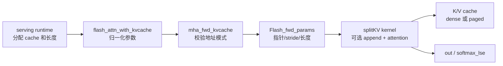

# KV-Cache

> 这一组笔记只解决一个问题：一次 serving decode step 里，FlashAttention 如何把“写入新 K/V、读取历史 cache、可选 RoPE、paged addressing、SplitKV”合成一次 backend 调用。

## 你为什么要读

如果你在看 SGLang、vLLM 或自己的推理 runtime，KV cache 很容易被误解成一个普通 tensor。本专题要建立的模型是：上层 runtime 负责分配和调度 cache，FlashAttention 负责在一次 decode attention 中按给定地址读写它。

读完后你应该能处理三类问题：

- 第一次读：能区分 prefill full attention 和 decode cache attention，知道 `q`、`k_cache`、`v_cache`、`cache_seqlens`、`block_table` 分别代表什么。
- 正在排障：能定位 paged KV、`cache_batch_idx`、`cache_leftpad`、RoPE、`num_splits` 这些开关为什么会互斥、报错或影响输出。
- 准备改代码：能沿 `flash_attn_with_kvcache` 追到 C++ params 和 splitKV kernel，知道哪些不变量必须由上层 runtime 保证。

## 主线图



这条线的关键是边界：FlashAttention 不决定哪条请求占哪个 cache slot，也不为每条请求重新分配 block；它只相信调用者传入的长度、batch index 或 block table，然后在 kernel 中完成读写。

## 三个最容易混淆的边界

| 容易混淆 | 正确区分 |
|----------|----------|
| 逻辑长度 vs. 物理地址 | `cache_seqlens` 决定旧 cache 长度与 append 起点；dense slot、`cache_batch_idx` 或 `block_table` 决定数据落在哪块物理内存 |
| 强制 split kernel vs. multi-split | append、batch remap、paged KV 会强制进入 split kernel 族；但最终 `num_splits==1` 仍是 aligned single-split，没有 partial buffer 和 combine |
| backend 原地更新 vs. backend 管理容量 | backend 会 inplace 写 cache，却不会扩容、分配 slot、解决重复写者冲突；这些属于上层 cache manager |

当前基线还明确拒绝 `cache_leftpad + paged KV` 与 `cache_batch_idx + paged KV`，并且 KV-cache API 不支持 backward。把这些当成接口边界，比把它们误判成“尚未优化的组合”更准确。

## 源码范围

- `flash_attn_with_kvcache` 把 decode cache 语义暴露给 Python 调用者，并说明 in-place append、容量责任、RoPE 位置和 `num_splits` 语义。

```python
# 来源：flash_attn/flash_attn_interface.py L1507-L1512
    If k and v are not None, k_cache and v_cache will be updated *inplace* with the new values from
    k and v. This is useful for incremental decoding: you can pass in the cached keys/values from
    the previous step, and update them with the new keys/values from the current step, and do
    attention with the updated cache, all in 1 kernel.

    If you pass in k / v, you must make sure that the cache is large enough to hold the new values.
```

- `mha_fwd_kvcache` 是 C++ 边界：它决定 dense cache、batch remap、paged KV、leftpad、RoPE、SplitKV 是否能组合。

```cpp
// 来源：csrc/flash_attn/flash_api.cpp L1247-L1255
    at::Tensor block_table;
    const bool paged_KV = block_table_.has_value();
    if (paged_KV) {
        TORCH_CHECK(!cache_batch_idx_.has_value(), "Paged KVcache does not support cache_batch_idx");
        block_table = block_table_.value();
        CHECK_DEVICE(block_table);
        TORCH_CHECK(block_table.dtype() == torch::kInt32, "block_table must have dtype torch.int32");
        TORCH_CHECK(block_table.stride(-1) == 1, "block_table must have contiguous last dimension");
    }
```

- `Flash_fwd_params` 是跨 C++/CUDA 的参数包，里面同时保存新 K/V 指针、RoPE 指针、cache remap、block table 和 page size。

```cpp
// 来源：csrc/flash_attn/src/flash.h L83-L105
    // The K_new and V_new matrices.
    void * __restrict__ knew_ptr;
    void * __restrict__ vnew_ptr;

    // The stride between rows of the Q, K and V matrices.
    index_t knew_batch_stride;
    index_t vnew_batch_stride;
    index_t knew_row_stride;
    index_t vnew_row_stride;
    index_t knew_head_stride;
    index_t vnew_head_stride;

    // The cos and sin matrices for rotary embedding.
    void * __restrict__ rotary_cos_ptr;
    void * __restrict__ rotary_sin_ptr;

    // The indices to index into the KV cache.
    int * __restrict__ cache_batch_idx;

    // Paged KV cache
    int * __restrict__ block_table;
    index_t block_table_batch_stride;
    int page_block_size;
```

## 阅读顺序

1. [[FlashAttention-KV-Cache-核心概念]]：先建立 decode step 的对象模型，重点看 `cache_seqlens`、地址模式和容量责任。
2. [[FlashAttention-KV-Cache-源码走读]]：沿一次调用从 Python 进入 C++，再落到 splitKV kernel。
3. [[FlashAttention-KV-Cache-数据流]]：把 cache update、RoPE、paged addressing，以及仅在 multi-split 时存在的 partial buffer 串成生命周期。
4. [[FlashAttention-KV-Cache-排障指南]]：按症状找源码入口，例如 paged KV 互斥、RoPE 报错、长上下文性能下降。
5. [[FlashAttention-KV-Cache-学习检查]]：用源码定位和测试命令验收自己是否真的读通。

## 和其他专题的关系

- 从 [[FlashAttention-Attention-IO]] 继承的是 IO-aware attention 的基本约束：不要物化完整 attention 矩阵，尽量让 Q/K/V tile 在合适层级流动。
- 从 [[FlashAttention-FA2-Forward]] 继承的是 forward kernel 的参数包和 launch 分发。
- KV cache 路径新增的是 serving decode 语义：cache 是跨 step 保存的状态，backend 每次只处理当前 step 的读写。
