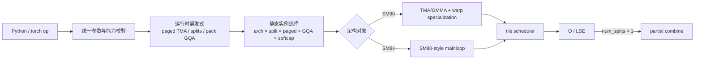

# FlashAttention FA3 Hopper 演进

## 读者任务

读完后，你应能准确回答三件事：FA3 最初为什么被称为 Hopper beta；当前 baseline 为什么又出现 SM8x 路径；Hopper 真正带来的增量究竟落在 API、静态分派、TMA/GMMA mainloop、调度和 SplitKV 的哪些对象上。

先记住一个总判断：**“FA3”是仓库实现世代与发行边界，“SM90 TMA/GMMA”是其中一个架构路径，二者不能画等号。**

## 先把时间轴与执行轴分开

原始发布说明先把 FA3 定位为针对 Hopper 优化的实现。

```markdown
<!-- 来源：README.md L30-L31 -->
## FlashAttention-3 beta release
FlashAttention-3 is optimized for Hopper GPUs (e.g. H100). 
```

同一发布段落把它称为 beta，并给出 H100/H800、CUDA 12.3+、FP16/BF16 forward/backward 与 FP8 forward 的发布契约。

```markdown
<!-- 来源：README.md L39-L47 -->
This is a beta release for testing / benchmarking before we integrate that with
the rest of the repo.

Currently released:
- FP16 / BF16 forward and backward, FP8 forward

Requirements: H100 / H800 GPU, CUDA >= 12.3.

We highly recommend CUDA 12.8 for best performance.
```

但当前 `hopper/flash_api.cpp` 的 live forward 门禁已经允许 Ampere 或更新架构；Ampere/Ada 只接受 FP16/BF16。

```cpp
// 来源：hopper/flash_api.cpp L710-L720
auto dprops = at::cuda::getCurrentDeviceProperties();
bool is_sm8x = dprops->major >= 8;
TORCH_CHECK(is_sm8x, "FlashAttention only supports Ampere GPUs or newer.");

auto q_type = q.scalar_type();
TORCH_CHECK(q_type == at::ScalarType::Half || q_type == at::ScalarType::BFloat16 || q_type == at::ScalarType::Float8_e4m3fn,
            "FlashAttention only supports fp16, bf16, and fp8_e4m3 data type");
if (dprops->major < 9) {
    TORCH_CHECK(q_type == at::ScalarType::Half || q_type == at::ScalarType::BFloat16,
                "FlashAttention on Ampere/Ada cards only supports fp16 and bf16 data type");
}
```

这不是文档互相矛盾，而是两个不同问题：README 记录 beta 发布契约；当前源码决定这次构建实际接受什么。做版本判断时，至少同时写明 Git baseline、包入口、GPU 和 dtype。

## FA2 到 FA3：不是换公式，而是重做执行映射

FA2 已经解决“如何用 tiling + online softmax 避免物化完整注意力矩阵”。FA3 没有推翻这条数学主线，而是把一次 attention 重新映射到更宽的系统边界：



因此，“FA3 比 FA2 多了 TMA”只说中了一个局部。更完整的增量是：入口承接 serving 状态，启发式把动态 workload 压成有限状态，模板分派把状态变成 kernel 类型，SM90 mainloop 再利用 Hopper 机制执行。

## 增量一：入口同时承接训练张量与 serving 状态

FA3 的 torch schema 不只收 `q/k/v`。它还显式接收追加 KV、变长边界、paged KV、batch 重映射、RoPE、FP8 descale、scheduler metadata、SplitKV 和 PackGQA。

```cpp
// 来源：hopper/flash_api.cpp L1673-L1708
TORCH_LIBRARY(flash_attn_3, m) {
    m.def("fwd("
        "Tensor q,"
        "Tensor k,"
        "Tensor v,"
        "Tensor(k_new!)? k_new = None,"
        "Tensor(v_new!)? v_new = None,"
        "Tensor? q_v = None,"
        "Tensor(out!)? out = None,"
        "Tensor? cu_seqlens_q = None,"
        "Tensor? cu_seqlens_k = None,"
        "Tensor? cu_seqlens_k_new = None,"
        "Tensor? seqused_q = None,"
        "Tensor? seqused_k = None,"
        "int? max_seqlen_q = None,"
        "int? max_seqlen_k = None,"
        "Tensor? page_table = None,"
        "Tensor? kv_batch_idx = None,"
        "Tensor? leftpad_k = None,"
        "Tensor? rotary_cos = None,"
        "Tensor? rotary_sin = None,"
        "Tensor? seqlens_rotary = None,"
        "Tensor? q_descale = None,"
        "Tensor? k_descale = None,"
        "Tensor? v_descale = None,"
        "float? softmax_scale = None,"
        "bool is_causal = False,"
        "int window_size_left = -1,"
        "int window_size_right = -1,"
        "int attention_chunk = 0,"
        "float softcap = 0.0,"
        "bool is_rotary_interleaved = False,"
        "Tensor? scheduler_metadata = None,"
        "int num_splits = 0,"
        "bool? pack_gqa = None,"
        "int sm_margin = 0) -> (Tensor(out!), Tensor, Tensor, Tensor)");
```

源码对象的变化比参数数量更重要：`page_table` 描述逻辑页到物理 KV block 的映射，`k_new/v_new` 让本次调用同时承担 cache append，`scheduler_metadata` 允许调用者提供调度结果。FA3 的边界已经从“纯 attention 算子”向“可服务化 attention 执行单元”扩张。

## 增量二：先用启发式决定策略，再做模板分派

`num_splits=0` 与 `pack_gqa=None` 不是直接传给 kernel 的“自动值”。C++ 入口会先计算 paged KV 是否适合 TMA，再确定 split 数和 PackGQA；后者依赖前者。

```cpp
// 来源：hopper/flash_api.cpp L977-L992
bool const use_prepare_varlen = is_varlen;
params.prepare_varlen_pdl = use_prepare_varlen && params.b <= PREPARE_VARLEN_MAX_BATCHES_1CTA;
// Temporarily set num_splits_dynamic_ptr to 1 since get_num_splits checks it
params.num_splits_dynamic_ptr = !use_prepare_varlen ? nullptr : reinterpret_cast<int*>(1);

params.pagedkv_tma = get_pagedkv_tma(params);
params.num_splits = num_splits <= 0 ? get_num_splits(params) : num_splits;
// Always enable PackGQA for Split, and get_pack_gqa requires params.num_splits to decide
params.pack_gqa = pack_gqa_.has_value() ? pack_gqa_.value() : get_pack_gqa(params);

// This needs to be set after get_num_splits
at::Tensor tile_count_semaphore;  // Contains the semaphore and optionally num_splits_dynamic
// We don't use the persistent scheduler if Split and not Varlen
bool const scheduler_needs_semaphore = params.arch >= 90
    ? (((params.is_causal || params.is_local) && (params.num_splits == 1)) || is_varlen)
    : ((params.is_causal && !is_varlen) || (is_varlen && params.num_splits > 1));
```

这段揭示了正确的阅读顺序：

1. workload 与硬件状态先进入 heuristic；
2. heuristic 产生 `pagedkv_tma/num_splits/pack_gqa`；
3. 这些值再决定模板实例与调度资源。

所以性能排查不能只比较输入 shape，还要记录最终策略值。

## 增量三：动态状态被压进有限的静态实例空间

真正 launch 前，FA3 依次对 arch、是否多 split、paged KV 是否走 non-TMA、PackGQA 和 softcap 做 static switch。

```cpp
// 来源：hopper/flash_api.cpp L367-L380
void run_mha_fwd(Flash_fwd_params &params, cudaStream_t stream) {
    // HEADDIM_SWITCH(params.d, [&] {
    //     run_mha_fwd_<cutlass::half_t, kHeadSize>(params, stream);
    // });
    TORCH_CHECK(params.num_splits >= 1);
    ARCH_SWITCH(params.arch, Arch, [&] {
        SPLIT_SWITCH(params.num_splits > 1, Split, [&] {
            PAGEDKV_SWITCH(params.page_table && !params.pagedkv_tma, PagedKVNonTMA, [&] {
                PACKGQA_SWITCH(params.pack_gqa, PackGQA_, [&] {
                    // Always enable PackGQA for Sm8x or PagedKVNonTMA or Split to reduce compilation
                    static constexpr bool PackGQA = PackGQA_ || Arch < 90 || PagedKVNonTMA || Split;
                    SOFTCAP_SWITCH(params.softcap > 0.0, Has_softcap, [&] {
                        run_mha_fwd_constexpr<Arch, Split, PagedKVNonTMA, PackGQA, Has_softcap>(params, stream);
                    });
```

这里的“组合爆炸”不是抽象编译术语：每个布尔轴都可能改变数据搬运、shared-memory layout、scheduler 或 epilogue。代码还会强制 SM8x、PagedKVNonTMA、Split 使用 PackGQA，以减少需要编译的组合数。这是编译规模与运行策略之间的显式折中。

## 增量四：SM90 的 TMA 是条件路径，不是固定标签

SM90 mainloop 把 Q 与 KV 的搬运策略分别编码。PackGQA 会关闭 Q 的 TMA；paged KV non-TMA 会关闭 K/V 的 TMA。

```cpp
// 来源：hopper/mainloop_fwd_sm90_tma_gmma_ws.hpp L53-L59
static constexpr bool Split = Split_;
static constexpr bool V_colmajor = V_colmajor_;
static constexpr bool Transpose_V = Is_FP8 && !V_colmajor;
static constexpr bool Use_TMA_Q = !PackGQA;
static constexpr bool Use_TMA_KV = !PagedKVNonTMA;
static_assert(Use_TMA_KV || CUTE_STATIC_V(size(ClusterShape{})) == 1, "If not using TMA for KV, ClusterShape must be 1");
static_assert(Use_TMA_KV || !V_colmajor, "If not using TMA for KV, V_colmajor is not supported");
```

这意味着“FA3=全部 TMA”是错误心理模型。更准确的说法是：SM90 路径优先把适合规则 tile 搬运的部分交给 TMA；GQA packing 或不规则分页迫使某些输入回到 cp.async/non-TMA 路线。

## 增量五：GMMA 与 warp specialization 形成生产者—消费者流水线

mainloop 用 GMMA selector 构造 PV 的 tiled MMA。

```cpp
// 来源：hopper/mainloop_fwd_sm90_tma_gmma_ws.hpp L102-L110
using TiledMmaPV = decltype(cute::make_tiled_mma(
    std::conditional_t<
        !MmaPV_is_RS,
        decltype(cute::GMMA::ss_op_selector<Element, Element, ElementAccum,
                 TileShape_MNK_PV, GMMA::Major::K, MmaMajorV>()),
        decltype(cute::GMMA::rs_op_selector<Element, Element, ElementAccum,
                 TileShape_MNK_PV, GMMA::Major::K, MmaMajorV>())
    >{},
    AtomLayoutPV{}));
```

随后代码根据 tiled MMA 计算 MMA warp-group 数，并让搬运条件决定 producer 是一个 warp 还是一个 warp-group。

```cpp
// 来源：hopper/mainloop_fwd_sm90_tma_gmma_ws.hpp L119-L125
static constexpr int NumMmaThreadsQK = size(TiledMmaQK{});
static constexpr int NumMmaThreads = size(TiledMmaPV{});
static constexpr int NumProducerThreads = !Transpose_V && Use_TMA_KV && Use_TMA_Q ? cutlass::NumThreadsPerWarp : cutlass::NumThreadsPerWarpGroup;
static_assert(NumMmaThreadsQK % cutlass::NumThreadsPerWarpGroup == 0);
static_assert(NumMmaThreads % cutlass::NumThreadsPerWarpGroup == 0);
static constexpr int NumMmaWarpGroups = NumMmaThreads / cutlass::NumThreadsPerWarpGroup;
static_assert(NumMmaWarpGroups == 1 || NumMmaWarpGroups == 2 || NumMmaWarpGroups == 3);
```

“warp specialization”不是泛指多 warp 并行，而是让不同线程组承担不同角色：producer 推进异步搬运与 pipeline 状态，consumer 等待数据、执行 GMMA、更新 online softmax 和累积输出。角色分离的收益来自搬运与计算重叠；代价是 barrier、pipeline state 与 shared-memory 生命周期更复杂。

## 增量六：scheduler 处理的是 tile 工作，而不只是 grid 大小

launch template 先根据 Q tile 与 GQA 计算 `num_blocks_m`，再把 heads、batch、splits、序列信息、semaphore 和可选预计算数组交给 tile scheduler；最后 scheduler 与 mainloop/epilogue 一起组成 kernel params。

```cpp
// 来源：hopper/flash_fwd_launch_template.h L148-L172
int qhead_per_khead = !PackGQA ? 1 : cutlass::ceil_div(params.h, params.h_k);
int num_blocks_m = cutlass::ceil_div(params.seqlen_q * qhead_per_khead, get<0>(TileShape_MNK{}));
num_blocks_m = cutlass::round_up(num_blocks_m, size<0>(ClusterShape{}));
typename flash::TileSchedulerArguments scheduler_args {
    num_blocks_m, !PackGQA ? params.h : params.h_k, params.b, params.num_splits,
    params.h / params.h_k,
    params.seqlen_q,
    params.seqlen_k, params.d, params.dv, sizeof(Element), 
    params.tile_count_semaphore, params.cu_seqlens_q, params.seqused_q,
    params.num_splits_dynamic_ptr,
    params.num_m_blocks_ptr,
    params.varlen_batch_idx_ptr,
    params.num_nheads_in_l2_ptr
};

if (Varlen && !params.skip_scheduler_metadata_computation) {
    prepare_varlen_num_blocks(params, stream, PackGQA, kBlockM, kBlockN, Arch >= 90 && params.prepare_varlen_pdl /*enable_pdl*/);
    CHECK_CUDA_KERNEL_LAUNCH();
}

int device;
CHECK_CUDA(cudaGetDevice(&device));
typename AttnKernel::Params kernel_params = AttnKernel::to_underlying_arguments({
    mainloop_args, epilogue_args, {device, params.num_sm}, scheduler_args
});
```

因此 scheduler metadata 的价值不是“少传几个 shape”，而是把变长 batch、split 和 L2/SM 利用相关的工作分配从数学循环中抽离，成为可单独准备和复用的执行计划。

## 增量七：SplitKV 是 partial 物化与同调用 combine

当 `num_splits > 1`，入口分配 FP32 partial output 与 partial LSE；普通与 varlen layout 不同，但 split 维都在最外层。

```cpp
// 来源：hopper/flash_api.cpp L1092-L1113
at::Tensor out_accum, softmax_lse_accum;
auto outaccum_type = at::ScalarType::Float;
if (params.num_splits > 1) {
    TORCH_CHECK(params.num_splits <= 256, "num_splits > 256 not supported");
    if (!is_varlen_q) {
        out_accum = torch::empty({params.num_splits, batch_size, num_heads, seqlen_q, head_size_v}, opts.dtype(outaccum_type));
        softmax_lse_accum = torch::empty({params.num_splits, batch_size, num_heads, seqlen_q}, opts.dtype(at::kFloat));
        params.oaccum_batch_stride = out_accum.stride(1);
        params.lseaccum_batch_stride = softmax_lse_accum.stride(1);
    } else {
        out_accum = torch::empty({params.num_splits, num_heads, total_q, head_size_v}, opts.dtype(outaccum_type));
        softmax_lse_accum = torch::empty({params.num_splits, num_heads, total_q}, opts.dtype(at::kFloat));
    }
    params.is_fp32 = false;
    params.oaccum_ptr = out_accum.data_ptr();
    params.softmax_lseaccum_ptr = softmax_lse_accum.data_ptr();
    params.oaccum_split_stride = out_accum.stride(0);
    params.oaccum_row_stride = out_accum.stride(-2);
    params.oaccum_head_stride = out_accum.stride(-3);
    params.lseaccum_split_stride = softmax_lse_accum.stride(0);
    params.lseaccum_head_stride = softmax_lse_accum.stride(-2);
}
```

主 kernel 返回后，同一次 forward 在 `num_splits > 1` 时立刻调用 combine；`num_splits == 1` 不走这一步。

```cpp
// 来源：hopper/flash_api.cpp L1167-L1186
if (total_q > 0 && (total_k + params.total_knew) > 0 && num_heads_k > 0) {
    auto stream = at::cuda::getCurrentCUDAStream().stream();
    run_mha_fwd(params, stream);
    if (params.num_splits > 1) {
        if (out_type == at::ScalarType::BFloat16) {
            // Since we want output in BF16. Otherwise fwd_combine will output to FP16
            params.is_bf16 = true;
        }
        // Unless there's seqused_q, for the purpose of attn_combine, we can just treat it as batch=1
        // and seqlen = total_q, and don't need to dispatch to Varlen there.
        // However, with dynamic split, each row needs to know which batch it belongs to
        // to read the number of splits, so we just use the varlen version of combine kernel.
        // if (is_varlen_q && !seqused_q_.has_value()) {
        // if (is_varlen_q) {
        //     params.b = 1;
        //     params.seqlen_q = total_q;
        // }
        // This will zero out the semaphore if needed
        run_mha_fwd_combine(params, stream, true /*enable_pdl*/);
    } else if (scheduler_needs_semaphore && params.skip_scheduler_metadata_computation) {
```

这解释了 SplitKV 的真实代价：它增加并行机会，也引入 partial buffer、额外显存流量、combine kernel 和 semaphore 生命周期。是否更快取决于 shape、并行度与硬件，不能只凭“split 更多”下结论。

## FP8：输出类型改变，实例仍锁定 SM90 路线

FP8 不只是输入元素变小。当前 dispatch 对 E4M3 使用显式 `run_mha_fwd_<90, ...>` 实例，输出则在入口被要求为 BF16；同时还存在 descale tensor 与 V layout 分支。

```cpp
// 来源：hopper/flash_api.cpp L854-L864
int const alignment = q_type == torch::kFloat8_e4m3fn ? 16 : 8;
TORCH_CHECK(head_size % alignment == 0, "head_size should be a multiple of " + std::to_string(alignment));
TORCH_CHECK(head_size_v % alignment == 0, "head_size_v should be a multiple of " + std::to_string(alignment));

auto opts = q.options();
auto out_type = q_type == at::ScalarType::Float8_e4m3fn ? at::ScalarType::BFloat16 : q_type;
at::Tensor out;
if (out_.has_value()) {
    out = out_.value();
    TORCH_CHECK(out.scalar_type() == out_type, "For FP16/BF16 input, output must have the same dtype as inputs. For FP8 input, output must have dtype BF16");
    CHECK_DEVICE(out);
```

模板分派进一步把 E4M3 实例锁到架构参数 90。

```cpp
// 来源：hopper/flash_api.cpp L335-L360
} else {
    #ifndef FLASHATTENTION_DISABLE_FP8
    #ifndef FLASHATTENTION_DISABLE_HDIM64
    if (params.d <= 64) { return run_mha_fwd_<90, cutlass::float_e4m3_t, 64, 64, Split, PagedKVNonTMA, Has_softcap, PackGQA>(params, stream); }
    #endif
    #ifndef FLASHATTENTION_DISABLE_HDIM96
    if (params.d <= 96) { return run_mha_fwd_<90, cutlass::float_e4m3_t, 96, 96, Split, PagedKVNonTMA, Has_softcap, PackGQA>(params, stream); }
    #endif
    #ifndef FLASHATTENTION_DISABLE_HDIM128
    if (params.d <= 128) { return run_mha_fwd_<90, cutlass::float_e4m3_t, 128, 128, Split, PagedKVNonTMA, Has_softcap, PackGQA>(params, stream); }
    #endif
    #ifndef FLASHATTENTION_DISABLE_HDIM192
    if (params.d <= 192) {
        #ifndef FLASHATTENTION_DISABLE_HDIMDIFF192
        if constexpr (Arch == 90) {
            if (params.dv <= 128) {
                return run_mha_fwd_<90, cutlass::float_e4m3_t, 192, 128, Split, PagedKVNonTMA, Has_softcap, PackGQA>(params, stream);
            }
        }
        #endif
        return run_mha_fwd_<90, cutlass::float_e4m3_t, 192, 192, Split, PagedKVNonTMA, Has_softcap, PackGQA>(params, stream);
    }
    #endif
    #ifndef FLASHATTENTION_DISABLE_HDIM256
    if (params.d <= 256) { return run_mha_fwd_<90, cutlass::float_e4m3_t, 256, 256, Split, PagedKVNonTMA, Has_softcap, PackGQA>(params, stream); }
    #endif
```

这里应只得出源码事实：FP8 的模板架构参数固定为 90。它不能单独证明任意未来 GPU 的性能或兼容性；运行支持仍要结合入口校验、编译目标和真实测试。

## 最小静态验证

在仓库根目录运行：

```powershell
rg -n 'FlashAttention only supports Ampere|Ampere/Ada cards' flash-attn/flash-attention/hopper/flash_api.cpp
rg -n 'get_pagedkv_tma|get_num_splits|get_pack_gqa' flash-attn/flash-attention/hopper/flash_api.cpp
rg -n 'ARCH_SWITCH|SPLIT_SWITCH|PAGEDKV_SWITCH|PACKGQA_SWITCH' flash-attn/flash-attention/hopper/flash_api.cpp
rg -n 'Use_TMA_Q|Use_TMA_KV|NumProducerThreads|GMMA::' flash-attn/flash-attention/hopper/mainloop_fwd_sm90_tma_gmma_ws.hpp
rg -n 'out_accum|softmax_lse_accum|run_mha_fwd_combine' flash-attn/flash-attention/hopper/flash_api.cpp
```

预期：五组命中分别对应 live 架构门禁、策略计算、静态分派、SM90 搬运/计算角色，以及 SplitKV partial/combine。若某一组在未来 baseline 消失，应先更新心智模型，不要机械保留本文结论。

## 复盘

FA3 的演进可以压成一条因果链：**更丰富的 serving/training 状态进入统一入口，运行时启发式把 workload 归约为有限策略，模板分派选择 SM8x 或 SM90 对象，SM90 再用条件化 TMA、GMMA 与 warp specialization 重叠搬运和计算，tile scheduler 分配工作，SplitKV 则以 partial buffer + combine 换并行度。**

下一步沿真实控制流阅读 [[FlashAttention-Hopper与CuTe-源码走读]]；遇到 import、arch、cache 或能力边界问题，回到 [[FlashAttention-Hopper与CuTe-排障指南]]。
