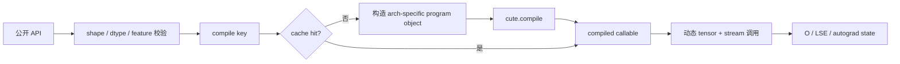

# FlashAttention FA4 CuTeDSL 演进

## 读者任务

读完后，你应能把 FA4 相对 FA3 的变化说成一条完整生命周期，而不是一句“从 CUDA 改成 Python”：用户调用先归一化为一个静态 `compile_key`，再构造架构专属 program object；cache miss 时由 CuTeDSL 编译，随后用本次动态 tensor/stream 调用已编译对象。你还应能区分进程内 cache、可选磁盘 cache 与源码指纹失效。

## 一句话总模型：从预编译实例库转向按需程序生成

FA3 的核心形态是 C++/CUDA 模板与 static switch：构建产物中已经包含一组可选 kernel 实例。FA4 把同样的 specialization 意图提升到 Python/CuTeDSL 对象层，再按实际 feature 组合生成可执行对象。



算法主线没有因此改变：仍然是 tile attention、online softmax 与 IO-aware 数据复用。变化的是“谁描述程序、何时实例化、怎样复用实例、失败在哪一层暴露”。

## 增量一：FA4 有独立发行边界

FA4 README 把它定义为 Hopper/Blackwell 的 CuTeDSL 实现，并给出独立的 `flash-attn-4` 安装入口。

````markdown
<!-- 来源：flash_attn/cute/README.md L1-L15 -->
# FlashAttention-4 (CuTeDSL)

FlashAttention-4 is a CuTeDSL-based implementation of FlashAttention for Hopper and Blackwell GPUs.

## Installation

```sh
pip install flash-attn-4
```

If you're on CUDA 13, install with the `cu13` extra for best performance:

```sh
pip install "flash-attn-4[cu13]"
```
````

“独立包”意味着上层必须显式导入新入口；仓库中存在 FA4 代码，并不会让 FA2/FA3 调用透明切换。它还把 CuTeDSL、CUTLASS Python 与 TVM-FFI 等工具链依赖带进部署边界。

## 增量二：公开名字很少，语义面并不小

包级入口只导出 fixed-length 与 varlen 两个函数。

```python
# 来源：flash_attn/cute/__init__.py L10-L18
from .interface import (
    flash_attn_func,
    flash_attn_varlen_func,
)

__all__ = [
    "flash_attn_func",
    "flash_attn_varlen_func",
]
```

但 fixed-length API 已承接 QV/MLA、top-k gather、learnable sink、SplitKV、PackGQA、score/mask modifier、aux state、block sparsity 与 LSE 返回；最终通过 `FlashAttnFunc.apply` 接入 autograd。

```python
# 来源：flash_attn/cute/interface.py L2709-L2732
def flash_attn_func(
    q: torch.Tensor,
    k: torch.Tensor,
    v: torch.Tensor,
    qv: Optional[torch.Tensor] = None,
    gather_kv_indices: Optional[torch.Tensor] = None,
    softmax_scale: Optional[float] = None,
    causal: bool = False,
    window_size: Tuple[Optional[int], Optional[int]] = (None, None),
    learnable_sink: Optional[torch.Tensor] = None,
    softcap: float = 0.0,
    num_splits: int = 1,
    pack_gqa: Optional[bool] = None,
    deterministic: bool = False,
    score_mod: Optional[Callable] = None,
    score_mod_bwd: Optional[Callable] = None,
    mask_mod: Optional[Callable] = None,
    aux_tensors: Optional[list] = None,
    aux_scalars: Optional[tuple] = None,
    block_sparse_tensors: Optional[BlockSparseTensorsTorch] = None,
    block_sparse_tensors_bwd: Optional[BlockSparseTensorsTorch] = None,
    return_lse: bool = False,
):
    return FlashAttnFunc.apply(
```

这是一种“窄命名、宽协议”的 API：函数数量少，但每个 feature 都可能改变校验、program object、compile key、保存的 autograd 状态和 backward 覆盖范围。只数导出符号会严重低估复杂度。

## 增量三：README 定位与 live arch 分派必须分开读

README 说 Hopper/Blackwell，是发行定位；当前 forward 的 live 校验却接受 8.x、9.x、10.x、11.x、12.x，并在 Python 层检查 GQA、head dim、FP8 与梯度边界。

```python
# 来源：flash_attn/cute/interface.py L446-L466
arch = _get_device_arch() if _arch is None else _arch
assert arch // 10 in [8, 9, 10, 11, 12], "Unsupported compute capability. Supported: 8.x, 9.x, 10.x, 11.x, 12.x"
assert num_head % num_head_kv == 0, "num_head must be divisible by num_head_kv"
alignment = 16 // v.element_size()
if arch // 10 not in [8, 12]:
    _validate_head_dims(head_dim, head_dim_v, arch // 10, alignment)
if softmax_scale is None:
    softmax_scale = (
        1.0 / math.sqrt(head_dim) if qv is None or q is None
        else 1.0 / math.sqrt(head_dim + head_dim_v)
    )
if softcap == 0.0:
    softcap = None
qhead_per_kvhead = num_head // num_head_kv
if pack_gqa is None:
    pack_gqa = qhead_per_kvhead > 1

is_fp8 = v.dtype in (torch.float8_e4m3fn, torch.float8_e5m2)
requires_grad = any(t is not None and t.requires_grad for t in [q, k, v, qv])
if is_fp8 and requires_grad:
    raise NotImplementedError("FA4 CuTe FP8 backward is not supported yet (forward-only).")
```

“支持某个 compute capability”也不等于该架构拥有统一 feature set。SM80、SM90、SM100/110、SM120 会构造不同对象，并在各分支拒绝尚未实现的组合。能力结论必须写成 `baseline × arch × dtype × feature × grad` 五元组。

## 增量四：program object 是 specialization recipe

SM80 与 SM90 分支创建不同类；它们把 dtype/head dim/GQA/mask/tile 等静态选择封装进对象。这里的对象不是输出 tensor，也不是已经运行的 kernel，而是交给 `cute.compile` 的程序描述。

```python
# 来源：flash_attn/cute/interface.py L823-L866
if arch // 10 == 8:
    assert page_table is None, "paged KV not supported on SM 8.0"
    assert not is_split_kv, "SplitKV not supported on SM 8.0"
    fa_fwd = FlashAttentionForwardSm80(
        dtype,
        head_dim,
        head_dim_v,
        qhead_per_kvhead,
        is_causal=causal,
        is_local=local,
        pack_gqa=pack_gqa,
        tile_m=tile_m,
        tile_n=tile_n,
        num_stages=1,
        num_threads=num_threads,
        Q_in_regs=False,
        score_mod=score_mod,
        mask_mod=mask_mod,
        has_aux_tensors=aux_tensors is not None,
    )
elif arch // 10 == 9:
    assert not is_split_kv, "SplitKV not supported on SM 9.0"
    fa_fwd = FlashAttentionForwardSm90(
        dtype,
        head_dim,
        head_dim_v,
        qhead_per_kvhead,
        is_causal=causal,
        is_local=local,
        pack_gqa=pack_gqa,
        tile_m=tile_m,
        tile_n=tile_n,
        # num_stages=1,
        num_stages=2,
        num_threads=num_threads,
        Q_in_regs=False,
        intra_wg_overlap=intra_wg_overlap,
        mma_pv_is_rs=mma_pv_is_rs,
        mask_mod=mask_mod,
        score_mod=score_mod,
        has_aux_tensors=aux_tensors is not None,
        q_subtile_factor=q_subtile_factor,
        paged_kv_non_tma=page_size not in [None, tile_n],
    )
```

SM100/110 又会在 MLA、专用 head-dim 256 和通用 forward 对象之间选择，并把 persistent scheduler、2CTA、CLC 等策略固化为构造参数。

```python
# 来源：flash_attn/cute/interface.py L909-L939
flash_fwd_obj_cls = (
    BlackwellFusedMultiHeadAttentionForward
    if use_dedicated_hd256_kernel
    else FlashAttentionForwardSm100
)

fa_fwd = flash_fwd_obj_cls(
    head_dim,
    head_dim_v,
    qhead_per_kvhead=qhead_per_kvhead,
    is_causal=causal,
    is_local=local,
    is_split_kv=is_split_kv,
    pack_gqa=pack_gqa,
    m_block_size=tile_m,
    n_block_size=tile_n,
    q_stage=q_stage,
    is_persistent=not causal
        and not local
        and cu_seqlens_q is None
        and seqused_q is None
        and not is_split_kv,
    score_mod=score_mod,
    mask_mod=mask_mod,
    has_aux_tensors=aux_tensors is not None,
    paged_kv_non_tma=page_size not in [None, tile_n],
    is_varlen_q=cu_seqlens_q is not None or seqused_q is not None,
    q_subtile_factor=q_subtile_factor,
    use_2cta_instrs=use_2cta_instrs,
    use_clc_scheduler=use_clc_scheduler,
)
```

相较 FA3 的 C++ 模板参数，FA4 没有消灭 specialization；它只是把 specialization recipe 变成可检查、可组合的 Python 对象，再交给 DSL 编译器。

## 增量五：`compile_key` 是静态程序族的身份证

FA4 不按“每次 tensor 都编译一次”。它先把会改变生成代码或调用 ABI 的特征折叠成 tuple：dtype、head dims、GQA ratio、mask/modifier hash、feature 是否存在、tile、线程数、SplitKV、arch、paged non-TMA、调度策略等。

```python
# 来源：flash_attn/cute/interface.py L718-L765
compile_key = (
    dtype,
    head_dim,
    head_dim_v,
    qhead_per_kvhead,
    causal,
    score_mod_hash,
    mask_mod_hash,
    use_block_sparsity,
    block_sparse_broadcast_pattern,
    aux_tensor_metadata,
    aux_scalar_metadata,
    lse is None,
    cu_seqlens_q is None,
    cu_seqlens_k is None,
    seqused_q is None,
    seqused_k is None,
    page_table is not None,
    window_size_left is not None,
    window_size_right is not None,
    learnable_sink is not None,
    q_descale is not None,
    k_descale is not None,
    v_descale is not None,
    block_sparse_tensors is None or block_sparse_tensors.cu_total_m_blocks is None,
    block_sparse_tensors is None or block_sparse_tensors.cu_block_idx_offsets is None,
    tile_m,
    tile_n,
    q_stage,
    num_threads,
    is_split_kv,
    pack_gqa,
    arch,
    page_size not in [None, tile_n],  # paged KV non-TMA
    use_2cta_instrs,
    q_subtile_factor,
    mma_pv_is_rs,
    intra_wg_overlap,
    use_clc_scheduler,
    q is not None,
    qv is not None,
    p is not None,
    row_max is not None,
    gather_kv_length,
    sparse_kv,
    disable_sparse_kv_bitmask,
    fa_logging.get_fa_log_level(),
)
```

两点尤其值得注意：

- 原始 `seqlen_q/seqlen_k` 没有直接进入 key，存在性、tile 和派生策略才是这里的静态边界；因此不能把任意序列长度变化都归因成新编译。
- 日志级别也进入 key。切换 FA logging level 可能形成另一份 cache entry，这是读接口文档看不出来的部署细节。

## 增量六：compile 与 call 是两个阶段

cache miss 时，代码把 PyTorch tensor 转成 CuTe tensor 描述，构造 program object 后调用 `cute.compile`，将结果写入 cache。

```python
# 来源：flash_attn/cute/interface.py L767-L785
if compile_key not in _flash_attn_fwd.compile_cache:
    (
        cu_seqlens_q_tensor,
        cu_seqlens_k_tensor,
        seqused_q_tensor,
        seqused_k_tensor,
        learnable_sink_tensor,
    ) = [
        to_cute_tensor(t, assumed_align=4, leading_dim=0)
        if t is not None
        else None
        for t in (cu_seqlens_q, cu_seqlens_k, seqused_q, seqused_k, learnable_sink)
    ]
    page_table_tensor = (
        to_cute_tensor(page_table, assumed_align=4, leading_dim=1)
        if page_table is not None
        else None
    )
    q_tensor, k_tensor, v_tensor, o_tensor = [
```

```python
# 来源：flash_attn/cute/interface.py L1008-L1017
if arch // 10 in [10, 11]:
    compile_args.append(descale_tensors_tensor)
compile_args.extend([
    sparse_tensors,
    AuxData(cute_aux_tensors, aux_scalars),
])
compile_args.append(current_stream)
_flash_attn_fwd.compile_cache[compile_key] = cute.compile(
    *compile_args, options="--enable-tvm-ffi"
)
```

命中后则直接取出 callable，用本次真实 tensor、标量和 stream 执行。编译参数描述 ABI/静态结构，调用参数提供动态地址与值；混淆二者会误解为什么有些 shape 变化复用 kernel、有些 feature 切换会重新编译。

```python
# 来源：flash_attn/cute/interface.py L1019-L1037
if not is_fake_mode():
    q_call, k_call, v_call, qv_call = [
        t.detach() if t is not None else None
        for t in (q, k, v, qv)
    ]
    if is_fp8:
        # need uint8 workaround until we pin torch >= 2.11.0 where fp8 export is supported
        q_call, k_call, v_call, qv_call = [
            t.view(torch.uint8) if t is not None else None
            for t in (q_call, k_call, v_call, qv_call)
        ]
    descale_tensors = (
        DescaleTensors(q_descale=q_descale, k_descale=k_descale, v_descale=v_descale)
        if q_descale is not None or k_descale is not None or v_descale is not None
        else None
    )
    if qv is not None:
        _flash_attn_fwd.compile_cache[compile_key](
            q_call,
```

## 增量七：默认 cache 只活在进程里

forward、backward、pre/postprocess 和 combine 各自通过名字创建独立 cache。默认工厂返回普通 `JITCache`；只有 `FLASH_ATTENTION_CUTE_DSL_CACHE_ENABLED=1` 才启用磁盘持久化，并按源码/ABI fingerprint 隔离目录。

```python
# 来源：flash_attn/cute/cache_utils.py L264-L281
def get_jit_cache(name: str | None = None) -> JITCache:
    """
    JIT cache factory.
    `name` is an optional identifier to create subdirectories to manage cache.

    When persistent caching is enabled, artifacts are namespaced under a
    source fingerprint directory so that code or dependency changes
    automatically invalidate stale entries.
    """
    if CUTE_DSL_CACHE_ENABLED:
        path = get_cache_path() / _compute_source_fingerprint()
        if name:
            path = path / name
        fa_log(1, f"Creating persistent JIT cache at {path}")
        return JITPersistentCache(path)
    else:
        fa_log(1, "Persistent cache disabled, using in-memory JIT cache")
        return JITCache()
```

持久化 cache 仍先查进程内字典，再在共享锁下尝试加载对象文件；写入则使用独占锁。它不是“把 Python dict 放到磁盘”，而是以内存索引包住可加载的编译对象。

```python
# 来源：flash_attn/cute/cache_utils.py L173-L201
class JITPersistentCache(JITCache):
    """
    In-memory cache for compiled functions, which is also backed by persistent storage.
    Use cutedsl ahead-of-time (AOT) compilation, only supporting enable_tvm_ffi=True
    """

    EXPORT_FUNCTION_PREFIX = "func"
    LOCK_TIMEOUT_SECONDS = 15

    def __init__(self, cache_path: Path):
        super().__init__()
        cache_path.mkdir(parents=True, exist_ok=True)
        self.cache_path: Path = cache_path

    def __setitem__(self, key: CompileKeyType, fn: JitCompiledFunction) -> None:
        JITCache.__setitem__(self, key, fn)
        self._try_export_to_storage(key, fn)

    def __getitem__(self, key: CompileKeyType) -> CallableFunction:
        # Use __contains__ to try populating in-memory cache with persistent storage
        self.__contains__(key)
        return JITCache.__getitem__(self, key)

    def __contains__(self, key: CompileKeyType) -> bool:
        # Checks in-memory cache first, then tries loading from storage.
        # When returning True, guarantees the in-memory cache is populated.
        if JITCache.__contains__(self, key):
            return True
        return self._try_load_from_storage(key)
```

生产上真正要管理的是：预热哪些 key、每个进程是否重复编译、cache 目录是否共享且可写、代码/依赖升级是否生成新 fingerprint，以及冷启动延迟是否纳入容量规划。shape bucketing 只有在它减少真实 key 集合时才有意义。

## FA3 与 FA4 的精确对照

| 问题 | FA3 | FA4 |
|---|---|---|
| specialization 表达 | C++ 模板参数与 static switch | Python/CuTeDSL program object 与 compile key |
| 实例生成时机 | 主要在扩展构建期 | 首次遇到 key 时按需编译 |
| 运行选择 | C++ dispatch 到已编译实例 | Python 先查 cache，再调用 compiled callable |
| 扩展新 feature | 修改模板、实例与构建矩阵 | 修改对象、key、编译 ABI 与 forward/backward 路径 |
| 主要部署压力 | 构建时间、二进制体积、实例覆盖 | 冷编译、cache 数量、多进程复用、源码指纹失效 |
| 共通不变量 | tile attention、online softmax、架构/feature 特化、严格能力边界 | tile attention、online softmax、架构/feature 特化、严格能力边界 |

FA4 的灵活性不是免费的：复杂性从“预先编译多少实例”迁移为“如何定义 key、何时编译、怎样缓存、forward/backward 是否对称”。

## 最小静态验证

```powershell
rg -n 'def flash_attn_func|FlashAttnFunc.apply' flash-attn/flash-attention/flash_attn/cute/interface.py
rg -n 'compile_key =|get_fa_log_level' flash-attn/flash-attention/flash_attn/cute/interface.py
rg -n 'FlashAttentionForwardSm80|FlashAttentionForwardSm90|FlashAttentionForwardSm100|FlashAttentionForwardSm120' flash-attn/flash-attention/flash_attn/cute/interface.py
rg -n 'cute.compile|compile_cache\[compile_key\]' flash-attn/flash-attention/flash_attn/cute/interface.py
rg -n 'CUTE_DSL_CACHE_ENABLED|source fingerprint|JITPersistentCache|FileLock' flash-attn/flash-attention/flash_attn/cute/cache_utils.py
```

预期：五组命中依次证明公开 API/autograd、静态 key、架构对象、compile/call 生命周期和双层 cache。它们只能验证结构；真实冷启动、跨进程复用与 kernel 性能仍需在目标 CUDA/GPU 环境测量。

## 复盘

FA4 的本质增量是：**把 kernel specialization 从预编译 C++ 实例库迁移为 `program object + compile key + compiled callable + cache` 的运行时系统。** 这让新架构和 feature 组合更容易表达，却把 cache 正确性、冷启动、ABI、能力矩阵与 forward/backward 对称性提升为一等工程问题。

沿完整对象生命周期继续读 [[FlashAttention-Hopper与CuTe-源码走读]]；部署或能力故障使用 [[FlashAttention-Hopper与CuTe-排障指南]]。
