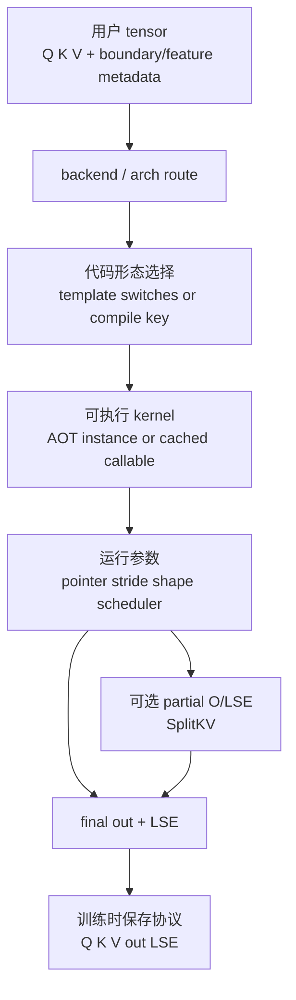
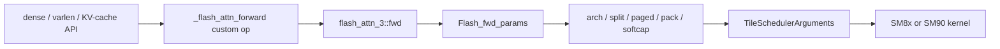
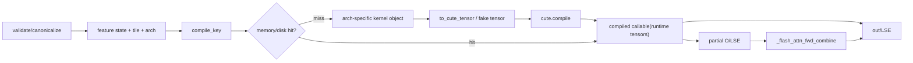

# FlashAttention Hopper 与 CuTe 数据流

## 读者任务

这篇沿对象生命周期回答两条问题：

- FA3 中，公开 Python API、custom op、dispatcher schema、`Flash_fwd_params`、scheduler metadata、final/partial O-LSE 怎样交接？
- FA4 中，runtime tensor 怎样先形成代码生成 key，再变成 CuTe tensor、compiled callable、final/partial O-LSE，并进入 backward？

重点不是“换了新 GPU，Q/K/V 公式也换了”，而是同一 attention 数学对象在 API、编译、调度与运行阶段多了哪些 carrier，以及哪些对象只在 split、fake、FP8、MLA 或持久化 cache 分支出现。

## 总图：数据流与代码流同时前进



要同时维护两本账：tensor/metadata 在运行时怎样流动，哪些 feature 会改变即将执行的代码形态。

## FA3 第零步：CUDA compiled 与 HIP Triton 先分叉

FA3 Python interface 不是无条件进入 C++/CUDA。HIP 环境下如果没有 compiled extension，会警告并切到 Triton/Aiter；CUDA 路径则直接 import `_C` 注册 `torch.ops.flash_attn_3`，没有同样的 fallback。

```python
# 来源：hopper/flash_attn_interface.py L11-L28
USE_TRITON_ROCM = os.getenv("FLASH_ATTENTION_TRITON_AMD_ENABLE", "FALSE") == "TRUE"
if not USE_TRITON_ROCM and getattr(torch.version, 'hip', None) is not None:
    try:
        import flash_attn_3._C
    except ImportError:
        warnings.warn("flash_attn_3._C (which has ROCm/HIP kernels) not found, falling back to Triton implementation")
        USE_TRITON_ROCM = True

if USE_TRITON_ROCM:
    from aiter.ops.triton._triton_kernels.flash_attn_triton_amd import flash_attn_3 as flash_attn_3_gpu
else:
    # isort: off
    # We need to import the CUDA kernels after importing torch
    import flash_attn_3._C # Registers operators with PyTorch

    # isort: on

    flash_attn_3_gpu = torch.ops.flash_attn_3
```

因此下文的 `Flash_fwd_params → CUTLASS/SM90` 只描述 compiled CUDA 路径；HIP Triton 的对象链不能套用这些 C++ 类型。

## FA3 compiled forward：四层 carrier



### 1. Python wrapper 规范化布局

`maybe_contiguous` 只在最后一维 stride 不满足时复制；V 还允许一种 column-major 形态。`cu_seqlens`、`seqused`、page table、rotary 与 descale tensor 随后原样作为协议对象传给 backend。

### 2. Backend 返回 final 与 partial 两套槽位

```python
# 来源：hopper/flash_attn_interface.py L107-L150
    out, softmax_lse, out_accum, softmax_lse_accum = flash_attn_3_gpu.fwd(
        q,
        k,
        v,
        k_new,
        v_new,
        qv,
        out_,
        cu_seqlens_q,
        cu_seqlens_k,
        cu_seqlens_k_new,
        seqused_q,
        seqused_k,
        max_seqlen_q,
        max_seqlen_k,
        page_table,
        kv_batch_idx,
        leftpad_k,
        rotary_cos,
        rotary_sin,
        seqlens_rotary,
        q_descale,
        k_descale,
        v_descale,
        softmax_scale,
        causal,
        window_size_left,
        window_size_right,
        attention_chunk,
        softcap,
        rotary_interleaved,
        scheduler_metadata,
        num_splits,
        pack_gqa,
        sm_margin,
    )

    if out_accum is None:
        out_accum = torch.tensor([], device=out.device)

    if softmax_lse_accum is None:
        softmax_lse_accum = torch.tensor([], device=out.device)

    return out, softmax_lse, out_accum, softmax_lse_accum
```

对象语义：

| 对象 | dense shape | varlen shape | 生命周期 |
|------|-------------|--------------|----------|
| `out` | `(B, Sq, Hq, Dv)` | `(total_q, Hq, Dv)` | 已 combine 的最终输出 |
| `softmax_lse` | `(B, Hq, Sq)` | `(Hq, total_q)` | 最终每行 LSE，训练时进入 backward 协议 |
| `out_accum` | split 时 `(num_splits, B, Hq, Sq, Dv)` | split 时 `(num_splits, Hq, total_q, Dv)` | FP32 partial output；非 split 被 Python 规范成空 tensor |
| `softmax_lse_accum` | split 时 `(num_splits, B, Hq, Sq)` | split 时 `(num_splits, Hq, total_q)` | partial LSE；非 split 被规范成空 tensor |

C++ `mha_fwd` 在 `num_splits > 1` 时分配 partial buffer、先运行 attention，再运行 combine，最终仍返回 `out/LSE`。partial 槽位用于调试、显式 combine 或上层特殊交接，不能误认成最终输出。

### 3. 参数包同时承载数值、地址与调度状态

`Flash_fwd_params` 不只是 Q/K/V 指针。它还包含 stride、dense/varlen 边界、page table、append KV、rotary、descale、split、partial buffer、scheduler semaphore/metadata 与 arch/SM 数。launch template 再把它拆成 `mainloop_args`、`epilogue_args` 和 `TileSchedulerArguments`。

### 4. fake path 只构造协议形状

FA3 fake forward 不执行 attention；它根据 dense/varlen、FP8 输出 dtype 与 `num_splits` 构造 final/partial tensor 元数据。当前 fake path 对 `num_splits <= 0` 的 heuristic 模式显式报错，所以“真实路径支持 auto split”不能推出 compile/export fake 路径也支持。

### 5. backward 与 KV-cache 的边界

dense/varlen autograd 保存 Q/K/V、out、LSE 并调用 `_flash_attn_backward`。当前 wrapper 对 `attention_chunk != 0` 的 backward 显式断言失败；`flash_attn_with_kvcache` 文档则明确无 backward。不要从 forward schema 功能集合反推训练梯度覆盖。

## FA4 forward：key 先决定代码，tensor 后喂给 callable



### 1. validation 产生规范状态

interface 先确定 arch、head/head_v、dtype、GQA ratio、dense/varlen/page、causal/local、FP8、split、tile、2CTA、稀疏与 MLA 状态。这里产生的很多布尔量不是运行数据，而是 compile key 的组成部分。

### 2. miss 时才构造并编译 kernel object

不同 arch 会创建 `FlashAttentionForwardSm80`、`Sm90`、`Sm100`/MLA/hd256 或 `Sm120` 对象。随后把 tensor 转成 CuTe 描述，调用 `cute.compile`，将 callable 写回该 key。

```python
# 来源：flash_attn/cute/interface.py L1015-L1017
            _flash_attn_fwd.compile_cache[compile_key] = cute.compile(
                *compile_args, options="--enable-tvm-ffi"
            )
```

### 3. hit/miss 最终都调用同一个 cache 槽位

真实模式下，runtime tensor 会 detach；FP8 暂时 view 成 `uint8` 规避 export 限制。callable 接收 Q/K/V、final 或 partial O/LSE、边界、page table、窗口、descale、稀疏与 aux data。split 路径执行完 callable 后再 combine。

```python
# 来源：flash_attn/cute/interface.py L1089-L1102
            _flash_attn_fwd.compile_cache[compile_key](*call_args)
    if is_split_kv:
        _flash_attn_fwd_combine(
            out_partial,
            lse_partial.transpose(-1, -2),
            out,
            lse.transpose(-1, -2) if lse is not None else None,
            cu_seqlens_q,
            seqused_q,
        )
    return out, lse, p, row_max


_flash_attn_fwd.compile_cache = get_jit_cache("fwd")
```

`p/row_max` 不是通用 attention-map 返回值；它们只在当前 sparse MLA backward 所需条件下分配。普通路径返回这两个槽位为 `None`。

## FA4 cache：默认只在进程内，持久化需要显式开启

`get_jit_cache` 有两种实现：

- 默认 `FLASH_ATTENTION_CUTE_DSL_CACHE_ENABLED=0`：普通 `JITCache`，只在当前进程内保存 callable。
- 显式设为 `1`：`JITPersistentCache`，对象文件按 source fingerprint 与 cache 名称分目录，使用文件锁协调并发进程。

```python
# 来源：flash_attn/cute/cache_utils.py L264-L281
def get_jit_cache(name: str | None = None) -> JITCache:
    """
    JIT cache factory.
    `name` is an optional identifier to create subdirectories to manage cache.

    When persistent caching is enabled, artifacts are namespaced under a
    source fingerprint directory so that code or dependency changes
    automatically invalidate stale entries.
    """
    if CUTE_DSL_CACHE_ENABLED:
        path = get_cache_path() / _compute_source_fingerprint()
        if name:
            path = path / name
        fa_log(1, f"Creating persistent JIT cache at {path}")
        return JITPersistentCache(path)
    else:
        fa_log(1, "Persistent cache disabled, using in-memory JIT cache")
        return JITCache()
```

source fingerprint 覆盖 CuTe Python 源文件、Python minor、CUTLASS 与 `tvm_ffi` 版本。它降低旧对象误复用风险，但不等于跨环境二进制兼容承诺；持久化加载、锁超时、目录权限和 cache 清理都属于新的运维边界。

## FP8 对象变化

| 路径 | 输入 | 输出/保存 | backward |
|------|------|-----------|----------|
| FA3 compiled forward | FP8 E4M3；Ampere/Ada 明确拒绝，dispatch 使用 Arch 90 specialization | final out 为 BF16；可有 Q/K/V descale 与 split partial FP32 | FA3 backward 只接受 FP16/BF16 |
| FA4 forward | E4M3/E5M2，但当前只允许 SM100 | final out 为 BF16；runtime call 临时 view 为 `uint8`；descale 可参与 | requires-grad 时直接抛 `NotImplementedError` |

FP8 “输出转 BF16”是 dtype 协议，不等于数值误差已满足某个固定阈值；仍需用指定 scaling、shape 与 reference 测试。

## 运行验证

无独立包/GPU 时：

```powershell
rg -n 'flash_attn_3_gpu =|flash_attn_3_gpu\.fwd|out_accum|softmax_lse_accum|register_fake' flash-attn/flash-attention/hopper/flash_attn_interface.py
rg -n 'compile_key =|cute\.compile|compile_cache\[compile_key\]|_flash_attn_fwd_combine' flash-attn/flash-attention/flash_attn/cute/interface.py
rg -n 'CUTE_DSL_CACHE_ENABLED|JITPersistentCache|source_fingerprint|Persistent cache disabled' flash-attn/flash-attention/flash_attn/cute/cache_utils.py
```

预期定位 FA3 backend 分叉与四返回槽、FA4 compile/call/combine 生命周期、以及默认内存 cache/可选磁盘 cache。静态命中不证明运行正确。

动态实验应记录：包/backend、arch、`num_splits`、是否 fake/compile、持久化开关、cache 路径、首次/同进程命中/新进程磁盘命中三类耗时，并检查 final 与 partial tensor shape。没有这些上下文，不写“cache 生效”或“SplitKV 更快”。

## 复盘

FA3 的主要 carrier 是 custom op、dispatcher schema、`Flash_fwd_params`、scheduler metadata 与 final/partial O-LSE；FA4 又增加 compile key、arch-specific kernel object、CuTe tensor、compiled callable 和可选持久化 cache。数学主线没变，变化的是“谁拥有形状、特性、代码形态和中间 buffer”的责任边界。
