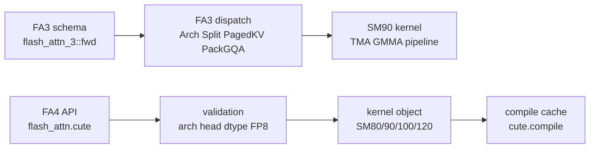

# Hopper与CuTe · 源码走读

## 读者任务

这篇沿“同一个 attention 算子如何在新 GPU 路径上被选择和编译”读源码：先看 FA3 如何用 C++ schema 暴露 Hopper 参数，再看 FA4 如何在 Python 层校验能力、选择 kernel object、编译并缓存。

## 长文读法

这篇按两条新 GPU 路径对照读：FA3 用 C++ schema 暴露 Hopper 入口，再通过 arch、SplitKV、PagedKV、PackGQA、softcap 等 template switch 进入 SM90 launch；FA4 则在 Python 层先校验 arch、dtype、head dim、FP8 等能力，再按 SM80/90/100/120 选择 kernel object，并用 `cute.compile` 缓存编译结果。

| 你的任务 | 先读 | 抓住什么 |
|----------|------|----------|
| 分清 FA3 / FA4 边界 | 主线地图、1、5 | FA3 是 Hopper C++/CUDA 路径，FA4 是 CuTeDSL/JIT 路径 |
| 排查 FA3 参数能力 | 1 | schema 本身就是功能地图，集中暴露 varlen、paged KV、RoPE、SplitKV、GQA 等 |
| 排查 FA3 dispatch | 2 到 3 | arch 和特性 switch 决定 template 实例与 launch 形态 |
| 理解 SM90 pipeline | 4 | producer / consumer、TMA descriptor 和 barrier 是 Hopper 主线 |
| 排查 FA4 能力校验 | 5 | arch、head dim、dtype、FP8 backward 等限制在 Python 层先挡住 |
| 排查 FA4 编译慢或缓存 | 6 到 7 | kernel object 由 arch 与特性选择，`compile_key` 决定是否复用 JIT 编译 |

## 主线地图



## 1. FA3 schema 是功能地图

FA3 的 dispatcher schema 把普通 Q/K/V、新 KV 写入、varlen、paged KV、RoPE、descale、scheduler metadata、SplitKV 和 GQA packing 放在一个入口里。

```cpp
// 来源：hopper/flash_api.cpp L1674-L1708
m.def("fwd("
    "Tensor q,"
    "Tensor k,"
    "Tensor v,"
    "Tensor(k_new!)? k_new = None,"
    "Tensor(v_new!)? v_new = None,"
    "Tensor? q_v = None,"
    "Tensor(out!)? out = None,"
    "Tensor? cu_seqlens_q = None,"
    "Tensor? cu_seqlens_k = None,"
    "Tensor? cu_seqlens_k_new = None,"
    "Tensor? seqused_q = None,"
    "Tensor? seqused_k = None,"
    "int? max_seqlen_q = None,"
    "int? max_seqlen_k = None,"
    "Tensor? page_table = None,"
    "Tensor? kv_batch_idx = None,"
    "Tensor? leftpad_k = None,"
    "Tensor? rotary_cos = None,"
    "Tensor? rotary_sin = None,"
    "Tensor? seqlens_rotary = None,"
    "Tensor? q_descale = None,"
    "Tensor? k_descale = None,"
    "Tensor? v_descale = None,"
    "float? softmax_scale = None,"
    "bool is_causal = False,"
    "int window_size_left = -1,"
    "int window_size_right = -1,"
    "int attention_chunk = 0,"
    "float softcap = 0.0,"
    "bool is_rotary_interleaved = False,"
    "Tensor? scheduler_metadata = None,"
    "int num_splits = 0,"
    "bool? pack_gqa = None,"
    "int sm_margin = 0) -> (Tensor(out!), Tensor, Tensor, Tensor)");
```

读这段时要把 schema 当成系统边界：FA3 不只是 full attention，还要承载 serving 侧 KV cache、paged layout、FP8 descale 和动态调度元数据。

## 2. FA3 dispatch 仍靠 C++ template switch

schema 进入实现后，`run_mha_fwd` 根据 arch、SplitKV、paged KV、PackGQA、softcap 选择 constexpr 实例。

```cpp
// 来源：hopper/flash_api.cpp L367-L383
void run_mha_fwd(Flash_fwd_params &params, cudaStream_t stream) {
    TORCH_CHECK(params.num_splits >= 1);
    ARCH_SWITCH(params.arch, Arch, [&] {
        SPLIT_SWITCH(params.num_splits > 1, Split, [&] {
            PAGEDKV_SWITCH(params.page_table && !params.pagedkv_tma, PagedKVNonTMA, [&] {
                PACKGQA_SWITCH(params.pack_gqa, PackGQA_, [&] {
                    static constexpr bool PackGQA = PackGQA_ || Arch < 90 || PagedKVNonTMA || Split;
                    SOFTCAP_SWITCH(params.softcap > 0.0, Has_softcap, [&] {
                        run_mha_fwd_constexpr<Arch, Split, PagedKVNonTMA, PackGQA, Has_softcap>(params, stream);
                    });
                });
            });
        });
    });
}
```

所以 FA3 的工程风格仍是“C++ 参数结构 + static switch + CUDA/CUTLASS kernel”。区别在于它的 switch 维度已经围绕 Hopper serving 现实扩展。

## 3. Hopper launch 选择 SM90 mainloop 与调度元数据

FA3 launch template 根据 arch 选择 SM90 或 SM80 mainloop，并把 tile shape、cluster shape、scheduler args 一起装入 CUTLASS kernel。

```cpp
// 来源：hopper/flash_fwd_launch_template.h L28-L56
template <int Arch, int kHeadDim, int kHeadDimV, int ClusterM, typename Element, typename ElementOut,
          bool Is_causal, bool Is_local, bool Has_softcap, bool Varlen, bool PagedKVNonTMA, bool AppendKV, bool HasQv,
          bool PackGQA, bool Split, bool V_colmajor>
void run_flash_fwd(Flash_fwd_params &params, cudaStream_t stream) {
    static constexpr bool Is_FP8 = cute::is_same_v<Element, cutlass::float_e4m3_t> || cute::is_same_v<Element, cutlass::float_e5m2_t>;
    using ArchTag = std::conditional_t<Arch >= 90, cutlass::arch::Sm90, cutlass::arch::Sm80>;
    static constexpr std::tuple<int, int, bool, bool> kBlockMN_RS_IntraWGOverlap =
        tile_size_fwd_sm90(/* 省略 head dim、dtype 与选项参数 */);
    static constexpr int kBlockM = Arch >= 90 ? std::get<0>(kBlockMN_RS_IntraWGOverlap) : std::get<0>(kBlockMN_kNWarps_Stages_RS);
    static constexpr int kBlockN = Arch >= 90 ? std::get<1>(kBlockMN_RS_IntraWGOverlap) : std::get<1>(kBlockMN_kNWarps_Stages_RS);
    using CollectiveMainloop = std::conditional_t<
        Arch >= 90,
        flash::CollectiveMainloopFwdSm90</* 省略模板参数 */>,
        flash::CollectiveMainloopFwdSm80</* 省略模板参数 */>
    >;
```

调度元数据进入 kernel params：

```cpp
// 来源：hopper/flash_fwd_launch_template.h L151-L198
typename flash::TileSchedulerArguments scheduler_args {
    num_blocks_m, !PackGQA ? params.h : params.h_k, params.b, params.num_splits,
    params.h / params.h_k,
    params.seqlen_q,
    params.seqlen_k, params.d, params.dv, sizeof(Element),
    params.tile_count_semaphore, params.cu_seqlens_q, params.seqused_q,
    params.num_splits_dynamic_ptr,
    params.num_m_blocks_ptr,
    params.varlen_batch_idx_ptr,
    params.num_nheads_in_l2_ptr
};
typename AttnKernel::Params kernel_params = AttnKernel::to_underlying_arguments({
    mainloop_args, epilogue_args, {device, params.num_sm}, scheduler_args
});
dim3 grid_dims = AttnKernel::get_grid_shape(kernel_params);
dim3 block_dims = AttnKernel::get_block_shape();
int smem_size = AttnKernel::SharedStorageSize;
CHECK_CUTLASS(cutlass::kernel_launch<AttnKernel>(grid_dims, block_dims, smem_size, stream, kernel_params,
                                   Arch >= 90 && Varlen && !params.skip_scheduler_metadata_computation && params.prepare_varlen_pdl));
```

这里能看到 FA3 的“系统味道”：kernel 不是只拿 Q/K/V 计算，还显式接收 varlen、split、head layout、scheduler metadata。

## 4. SM90 kernel 把 producer/consumer pipeline 显式化

SM90 kernel 类型中暴露 TMA、mainloop、epilogue、producer threads 等派生能力。运行时初始化 barrier，并按 warp group 划分 producer/consumer。

```cpp
// 来源：hopper/flash_fwd_kernel_sm90.h L45-L62
static constexpr bool Use_TMA_Q = CollectiveMainloop::Use_TMA_Q;
static constexpr bool Use_TMA_KV = CollectiveMainloop::Use_TMA_KV;
static constexpr bool Use_TMA_O = CollectiveEpilogue::Use_TMA_O;
static constexpr bool PackGQA = CollectiveMainloop::PackGQA;
static constexpr int NumProducerThreads = CollectiveMainloop::NumProducerThreads;
using TileShape_MNK_PV = typename CollectiveMainloop::TileShape_MNK_PV;
using TiledMmaPV = typename CollectiveMainloop::TiledMmaPV;
using ArchTag = typename CollectiveMainloop::ArchTag;
using ClusterShape = typename CollectiveMainloop::ClusterShape;
using MainloopArguments = typename CollectiveMainloop::Arguments;
using MainloopParams = typename CollectiveMainloop::Params;
using BarrierQ = std::conditional_t<Use_TMA_Q, cutlass::arch::ClusterTransactionBarrier, cutlass::arch::ClusterBarrier>;
```

```cpp
// 来源：hopper/flash_fwd_kernel_sm90.h L197-L223
int const warp_idx = cutlass::canonical_warp_idx_sync();
if (warp_idx == 0 && lane_predicate) {
    CollectiveMainloop::prefetch_tma_descriptors(params.mainloop);
    CollectiveEpilogue::prefetch_tma_descriptors(params.epilogue);
}
int warp_group_idx = cutlass::canonical_warp_group_idx();
if (warp_idx == 0 && lane_predicate) {
    shared_storage.pipelines.barrier_Q.init(Use_TMA_Q ? 1 : NumProducerThreads);
    if constexpr (HasQv) {
        shared_storage.pipelines.barrier_Qv.init(Use_TMA_Q ? 1 : NumProducerThreads);
    }
    shared_storage.pipelines.barrier_O.init(size(ClusterShape{}) * (Use_TMA_O ? 1 : NumMmaThreads));
}
PipelineParamsK pipeline_params_k;
pipeline_params_k.role = warp_group_idx == 0
    ? MainloopPipelineK::ThreadCategory::Producer
    : MainloopPipelineK::ThreadCategory::Consumer;
```

这就是 Hopper 增量的核心：load、compute、store 不再只是普通 block 内顺序逻辑，而是围绕 TMA/GMMA pipeline 组织。

## 5. FA4 Python interface 先做能力校验

FA4 `_flash_attn_fwd` 先判断当前 arch、head 维、GQA 比例、FP8/backward 边界，并预分配输出和 LSE。

```python
# 来源：flash_attn/cute/interface.py L446-L516
arch = _get_device_arch() if _arch is None else _arch
assert arch // 10 in [8, 9, 10, 11, 12], "Unsupported compute capability. Supported: 8.x, 9.x, 10.x, 11.x, 12.x"
assert num_head % num_head_kv == 0, "num_head must be divisible by num_head_kv"
alignment = 16 // v.element_size()
if arch // 10 not in [8, 12]:
    _validate_head_dims(head_dim, head_dim_v, arch // 10, alignment)
if softmax_scale is None:
    softmax_scale = (
        1.0 / math.sqrt(head_dim) if qv is None or q is None
        else 1.0 / math.sqrt(head_dim + head_dim_v)
    )
is_fp8 = v.dtype in (torch.float8_e4m3fn, torch.float8_e5m2)
requires_grad = any(t is not None and t.requires_grad for t in [q, k, v, qv])
if is_fp8 and requires_grad:
    raise NotImplementedError("FA4 CuTe FP8 backward is not supported yet (forward-only).")
```

这一步把“不能跑”的组合挡在 JIT 前，错误信息比底层编译失败更直接。

## 6. FA4 把 kernel 形态变成对象

根据 `arch // 10`，FA4 创建不同 kernel object，并在每个分支中明确拒绝当前架构不支持的特性。

```python
# 来源：flash_attn/cute/interface.py L823-L961
if arch // 10 == 8:
    assert page_table is None, "paged KV not supported on SM 8.0"
    assert not is_split_kv, "SplitKV not supported on SM 8.0"
    fa_fwd = FlashAttentionForwardSm80(
        # 省略张量、stride、shape、dtype 与运行选项参数
    )
elif arch // 10 == 9:
    assert not is_split_kv, "SplitKV not supported on SM 9.0"
    fa_fwd = FlashAttentionForwardSm90(
        # 省略张量、stride、shape、dtype 与运行选项参数
    )
elif arch // 10 in [10, 11]:
    if qv is not None:
        fa_fwd = FlashAttentionMLAForwardSm100(
            # 省略 MLA 构造参数
        )
    else:
        flash_fwd_obj_cls = (
            BlackwellFusedMultiHeadAttentionForward
            if use_dedicated_hd256_kernel
            else FlashAttentionForwardSm100
        )
        fa_fwd = flash_fwd_obj_cls(
            # 省略通用 forward 构造参数
        )
elif arch // 10 == 12:
    assert not use_block_sparsity, "Block sparsity not supported on SM 12.0"
    assert page_table is None, "Paged KV not supported on SM 12.0 in this PR"
    assert not is_split_kv, "SplitKV not supported on SM 12.0 in this PR"
    fa_fwd = FlashAttentionForwardSm120(
        # 省略张量、stride、shape、dtype 与运行选项参数
    )
```

这和 FA2 的 C++ template switch 是同一类选择问题，但位置从 C++ 编译单元移动到了 Python/CuTeDSL 层。

## 7. JIT compile cache 是 FA4 的性能边界

compile key 未命中时，FA4 将 PyTorch tensor 转为 CuTe tensor，组装 kernel object 和参数，然后调用 `cute.compile`。

```python
# 来源：flash_attn/cute/interface.py L767-L1017
if compile_key not in _flash_attn_fwd.compile_cache:
    (
        cu_seqlens_q_tensor,
        cu_seqlens_k_tensor,
        seqused_q_tensor,
        seqused_k_tensor,
        learnable_sink_tensor,
    ) = [
        to_cute_tensor(t, assumed_align=4, leading_dim=0)
        if t is not None
        else None
        for t in (cu_seqlens_q, cu_seqlens_k, seqused_q, seqused_k, learnable_sink)
    ]
    q_tensor, k_tensor, v_tensor, o_tensor = [
        to_cute_tensor(t) for t in (q, k, v, out if not is_split_kv else out_partial)
    ]
    compile_args = [
        fa_fwd,
        q_tensor,
        k_tensor,
        v_tensor,
        o_tensor,
        lse_tensor,
        softmax_scale,
        cu_seqlens_q_tensor,
        cu_seqlens_k_tensor,
        seqused_q_tensor,
        seqused_k_tensor,
        page_table_tensor,
        window_size_left,
        window_size_right,
        learnable_sink_tensor,
    ]
    _flash_attn_fwd.compile_cache[compile_key] = cute.compile(
        *compile_args, options="--enable-tvm-ffi"
    )
```

这个设计避免了预编译所有组合，但生产环境要关注 warmup、shape bucketing、compile key 稳定性和多进程 cache 复用。

## 8. 运行验证

先做静态检查，确认三层入口仍然存在：

```powershell
rg -n "run_mha_fwd|SM90|num_splits|is_causal" flash-attn/flash-attention/hopper/flash_api.cpp flash-attn/flash-attention/hopper/flash_fwd_launch_template.h
rg -n "TMA|GMMA|Scheduler|Flash_fwd_kernel_traits" flash-attn/flash-attention/hopper/flash_fwd_kernel_sm90.h
rg -n "_get_device_arch|_validate_head_dims|FlashAttentionForwardSm90|cute.compile|compile_cache" flash-attn/flash-attention/flash_attn/cute/interface.py
```

预期现象：

- Hopper C++ 路径能看到 `run_mha_fwd` 到 SM90 launch 的分发，说明 FA3 仍是独立 beta 路径。
- SM90 kernel 头文件能看到 TMA/GMMA 和 scheduler 相关对象，说明 Hopper 增量主要是硬件 pipeline 组织。
- CuTe interface 能看到 arch/head-dim 校验、SM90 kernel object 和 `compile_cache`，说明 FA4 的主要边界在 Python/CuTeDSL JIT 层。

有 Hopper 或更新 GPU 时再跑实际 kernel benchmark；没有对应硬件时，不要把 import 失败或 arch assert 当成算法错误。

## 复盘

- FA3 是 Hopper beta C++/CUDA 路径，重点是 TMA/GMMA、FP8 forward、paged KV 与 scheduler metadata。
- FA4 是 CuTeDSL/JIT 路径，重点是 Python validation、kernel object、compile cache。
- 两者都服务同一 attention 算法；差别在硬件映射和工程组织。
