# FlashAttention Hopper 与 CuTe 源码走读

## 读者任务

这篇不按文件顺序扫代码，而是跟踪“一次 attention 调用怎样变成某个可执行 kernel”：

- FA3：backend 分叉 → Python custom op → C++ validation/params → heuristic/static switch → launch/scheduler → SM90 producer/consumer/mainloop → SplitKV combine。
- FA4：Python validation → compile key → arch-specific kernel object → CuTe tensor/compile → memory/disk cache → runtime callable → optional combine/backward。

每个 checkpoint 只回答一个判断。读完后，你应该能从一次错误或 profile 反推应停在哪一层，而不是在 `hopper/` 和 `flash_attn/cute/` 里全局搜索同一个关键词。

## 路线总图

```mermaid
flowchart TB
    subgraph FA3["FA3 compiled CUDA 主线"]
        A0["Python backend route"] --> A1["custom op / torch.ops schema"]
        A1 --> A2["C++ validate + Flash_fwd_params"]
        A2 --> A3["paged TMA / split / pack heuristics"]
        A3 --> A4["static switches + launch types"]
        A4 --> A5["scheduler + SM90 producer/consumer"]
        A5 --> A6["final or partial O/LSE + combine"]
    end
    subgraph FA4["FA4 CuTeDSL 主线"]
        B0["validate + canonical feature state"] --> B1["compile key"]
        B1 --> B2{"cache hit?"}
        B2 -->|"miss"| B3["kernel object + cute.compile"]
        B2 -->|"hit"| B4["cached callable"]
        B3 --> B4
        B4 --> B5["final or partial O/LSE + combine"]
    end
```



FA3 的 HIP Triton/Aiter 分支不会进入下述 C++/SM90 对象链；FA4 也不是 FA3 C++ 类型的 Python 包装。先判 backend，再读内部。

## Checkpoint 0：FA3 import 决定有没有 C++ schema

```python
# 来源：hopper/flash_attn_interface.py L11-L28
USE_TRITON_ROCM = os.getenv("FLASH_ATTENTION_TRITON_AMD_ENABLE", "FALSE") == "TRUE"
if not USE_TRITON_ROCM and getattr(torch.version, 'hip', None) is not None:
    try:
        import flash_attn_3._C
    except ImportError:
        warnings.warn("flash_attn_3._C (which has ROCm/HIP kernels) not found, falling back to Triton implementation")
        USE_TRITON_ROCM = True

if USE_TRITON_ROCM:
    from aiter.ops.triton._triton_kernels.flash_attn_triton_amd import flash_attn_3 as flash_attn_3_gpu
else:
    # isort: off
    # We need to import the CUDA kernels after importing torch
    import flash_attn_3._C # Registers operators with PyTorch

    # isort: on

    flash_attn_3_gpu = torch.ops.flash_attn_3
```

判断：

- CUDA compiled 路径 import `_C`，由 `TORCH_LIBRARY` 注册 `flash_attn_3::fwd/bwd/...`。
- HIP 环境才有“compiled import 失败 → Triton/Aiter”的自动 fallback。
- CUDA import 失败时，调用尚未进入 schema、params 或 kernel；先查包和 ABI。

## Checkpoint 1：Python custom op 把对象送入 backend

`_flash_attn_forward` 先规范化最后一维布局，再把 dense/varlen、append KV、paged KV、rotary、descale、scheduler、split 和 PackGQA 参数一起传给 `flash_attn_3_gpu.fwd`。backend 返回 final `out/LSE` 和可选 partial `out_accum/LSE_accum`；Python 把缺失 partial 统一成空 tensor，以稳定 custom-op 返回结构。

这一步的排障问题是：参数有没有传到 backend、fake/custom-op shape 是否与真实返回一致。它还没有回答最终选择哪个 arch kernel。

## Checkpoint 2：C++ 先拒绝错误设备、dtype、stride

```cpp
// 来源：hopper/flash_api.cpp L710-L735
    auto dprops = at::cuda::getCurrentDeviceProperties();
    bool is_sm8x = dprops->major >= 8;
    TORCH_CHECK(is_sm8x, "FlashAttention only supports Ampere GPUs or newer.");

    auto q_type = q.scalar_type();
    TORCH_CHECK(q_type == at::ScalarType::Half || q_type == at::ScalarType::BFloat16 || q_type == at::ScalarType::Float8_e4m3fn,
                "FlashAttention only supports fp16, bf16, and fp8_e4m3 data type");
    if (dprops->major < 9) {
        TORCH_CHECK(q_type == at::ScalarType::Half || q_type == at::ScalarType::BFloat16,
                    "FlashAttention on Ampere/Ada cards only supports fp16 and bf16 data type");
    }
    TORCH_CHECK(k.scalar_type() == q_type, "query and key must have the same dtype");
    TORCH_CHECK(v.scalar_type() == q_type, "query and value must have the same dtype");

    CHECK_DEVICE(q); CHECK_DEVICE(k); CHECK_DEVICE(v);

    TORCH_CHECK(q.stride(-1) == 1, "Input tensor must have contiguous last dimension");
    TORCH_CHECK(k.stride(-1) == 1, "Input tensor must have contiguous last dimension");
    TORCH_CHECK(v.stride(-1) == 1, "Input tensor must have contiguous last dimension");

    at::Tensor page_table;
    const bool paged_KV = page_table_.has_value();
    if (paged_KV) {
        page_table = page_table_.value();
        CHECK_DEVICE(page_table);
        TORCH_CHECK(page_table.dtype() == torch::kInt32, "page_table must have dtype torch.int32");
```

判断：当前 `hopper/` forward 入口并非 H100-only；Ampere 或更新可进入，但 Ampere/Ada 明确拒绝 FP8。发布时 README 的 Hopper beta 定位与当前源码接受范围要分开记录。

之后 C++ 继续核验 dense/varlen/page shape、head ratio、head_dim、output dtype、append KV、rotary、batch mapping 等，再把指针、stride、边界和特性写入 `Flash_fwd_params`。出现 shape/dtype 错误时不要直接读 mainloop。

## Checkpoint 3：运行时输入先收敛成三个关键决策

在真正 static dispatch 前，当前 C++ 会根据 page/tile/leftpad/append 条件决定 paged KV 是否适合 TMA，用 heuristic 或显式值决定 split 数，再决定是否 PackGQA。

```cpp
// 来源：hopper/flash_api.cpp L977-L988
    bool const use_prepare_varlen = is_varlen;
    params.prepare_varlen_pdl = use_prepare_varlen && params.b <= PREPARE_VARLEN_MAX_BATCHES_1CTA;
    // Temporarily set num_splits_dynamic_ptr to 1 since get_num_splits checks it
    params.num_splits_dynamic_ptr = !use_prepare_varlen ? nullptr : reinterpret_cast<int*>(1);

    params.pagedkv_tma = get_pagedkv_tma(params);
    params.num_splits = num_splits <= 0 ? get_num_splits(params) : num_splits;
    // Always enable PackGQA for Split, and get_pack_gqa requires params.num_splits to decide
    params.pack_gqa = pack_gqa_.has_value() ? pack_gqa_.value() : get_pack_gqa(params);

    // This needs to be set after get_num_splits
    at::Tensor tile_count_semaphore;  // Contains the semaphore and optionally num_splits_dynamic
```

这三个决策相互依赖：`pagedkv_tma` 影响 tile/dispatch，split 会强制 PackGQA 的模板口径，varlen 还会引入动态 split 与 scheduler metadata。不要把 `num_splits=0` 理解成“不 split”，它表示交给 heuristic；fake path 当前反而不支持该模式。

## Checkpoint 4：static switch 选择代码形态

```cpp
// 来源：hopper/flash_api.cpp L367-L385
void run_mha_fwd(Flash_fwd_params &params, cudaStream_t stream) {
    // HEADDIM_SWITCH(params.d, [&] {
    //     run_mha_fwd_<cutlass::half_t, kHeadSize>(params, stream);
    // });
    TORCH_CHECK(params.num_splits >= 1);
    ARCH_SWITCH(params.arch, Arch, [&] {
        SPLIT_SWITCH(params.num_splits > 1, Split, [&] {
            PAGEDKV_SWITCH(params.page_table && !params.pagedkv_tma, PagedKVNonTMA, [&] {
                PACKGQA_SWITCH(params.pack_gqa, PackGQA_, [&] {
                    // Always enable PackGQA for Sm8x or PagedKVNonTMA or Split to reduce compilation
                    static constexpr bool PackGQA = PackGQA_ || Arch < 90 || PagedKVNonTMA || Split;
                    SOFTCAP_SWITCH(params.softcap > 0.0, Has_softcap, [&] {
                        run_mha_fwd_constexpr<Arch, Split, PagedKVNonTMA, PackGQA, Has_softcap>(params, stream);
                    });
                });
            });
        });
    });
}
```

判断：arch、是否多 split、paged non-TMA、PackGQA、softcap 已进入编译期类型；dtype/head_dim 又在 `run_mha_fwd_constexpr` 继续选择实例。这里解释“为什么两个相似 shape 启动不同 kernel”，但不能单独解释 tile、scheduler 或 mainloop 内部指令。

## Checkpoint 5：launch 把类型选择转成三组参数

`run_flash_fwd` 根据 arch 选择 SM90 或 SM80 collective，结合 tile、cluster、causal/local、varlen、append、split、V layout 选择 mainloop/epilogue；scheduler 则在 single-tile、static/dynamic persistent、varlen persistent 之间选择。

最终有三组 carrier：

| carrier | 内容 | 消费者 |
|---------|------|--------|
| `mainloop_args` | Q/K/V/Knew/Vnew/Qv、page/rotary/descale、window、split、边界 | load + QK/PV + online softmax |
| `epilogue_args` | final/partial O、final/partial LSE、输出 stride | epilogue/store/combine |
| `scheduler_args` | block 数、head/batch、split、SM、varlen metadata/semaphore | tile scheduler |

`AttnKernel::to_underlying_arguments` 把三者转成 device params；`get_grid_shape/get_block_shape` 与 `SharedStorageSize` 决定 launch。SM90 且 varlen metadata 未预计算时还可能使用 PDL 依赖启动。

## Checkpoint 6：SM90 kernel 外壳分角色，mainloop 做实际计算

SM90 kernel 外壳初始化 TMA descriptor/barrier/pipeline，并把 warp group 0 分给 producer、其余 warp group 分给 consumer：

- producer：循环从 scheduler 领取 work tile，处理 append KV 协调，调用 `mainloop.load` 预取 Q/K/V。
- consumer：初始化 MMA/softmax，调用 `mainloop.mma`，然后由 epilogue 写 final 或 partial O/LSE。

真正的 TMA/GMMA 在 `mainloop_fwd_sm90_tma_gmma_ws.hpp`：

- `Use_TMA_Q = !PackGQA`。
- `Use_TMA_KV = !PagedKVNonTMA`。
- paged non-TMA 时 K/V 使用 `cp.async` 管理器。
- QK/PV/QV 使用 `GMMA::ss_op_selector` 或 `rs_op_selector`。
- 每个 K block 依次执行 score、softcap、mask、online softmax、PV 累积；最终 `softmax.finalize/rescale_o` 交给 epilogue。

这也是重要的文件边界：`flash_fwd_kernel_sm90.h` 是编排外壳，不能替代 mainloop 文件来证明具体 TMA/GMMA 与 softmax 顺序。

## Checkpoint 7：SplitKV 先写 partial，再在同一 forward 内 combine

```cpp
// 来源：hopper/flash_api.cpp L1092-L1113
    at::Tensor out_accum, softmax_lse_accum;
    auto outaccum_type = at::ScalarType::Float;
    if (params.num_splits > 1) {
        TORCH_CHECK(params.num_splits <= 256, "num_splits > 256 not supported");
        if (!is_varlen_q) {
            out_accum = torch::empty({params.num_splits, batch_size, num_heads, seqlen_q, head_size_v}, opts.dtype(outaccum_type));
            softmax_lse_accum = torch::empty({params.num_splits, batch_size, num_heads, seqlen_q}, opts.dtype(at::kFloat));
            params.oaccum_batch_stride = out_accum.stride(1);
            params.lseaccum_batch_stride = softmax_lse_accum.stride(1);
        } else {
            out_accum = torch::empty({params.num_splits, num_heads, total_q, head_size_v}, opts.dtype(outaccum_type));
            softmax_lse_accum = torch::empty({params.num_splits, num_heads, total_q}, opts.dtype(at::kFloat));
        }
        params.is_fp32 = false;
        params.oaccum_ptr = out_accum.data_ptr();
        params.softmax_lseaccum_ptr = softmax_lse_accum.data_ptr();
        params.oaccum_split_stride = out_accum.stride(0);
        params.oaccum_row_stride = out_accum.stride(-2);
        params.oaccum_head_stride = out_accum.stride(-3);
        params.lseaccum_split_stride = softmax_lse_accum.stride(0);
        params.lseaccum_head_stride = softmax_lse_accum.stride(-2);
    }
```

```cpp
// 来源：hopper/flash_api.cpp L1167-L1186
    if (total_q > 0 && (total_k + params.total_knew) > 0 && num_heads_k > 0) {
        auto stream = at::cuda::getCurrentCUDAStream().stream();
        run_mha_fwd(params, stream);
        if (params.num_splits > 1) {
            if (out_type == at::ScalarType::BFloat16) {
                // Since we want output in BF16. Otherwise fwd_combine will output to FP16
                params.is_bf16 = true;
            }
            // Unless there's seqused_q, for the purpose of attn_combine, we can just treat it as batch=1
            // and seqlen = total_q, and don't need to dispatch to Varlen there.
            // However, with dynamic split, each row needs to know which batch it belongs to
            // to read the number of splits, so we just use the varlen version of combine kernel.
            // if (is_varlen_q && !seqused_q_.has_value()) {
            // if (is_varlen_q) {
            //     params.b = 1;
            //     params.seqlen_q = total_q;
            // }
            // This will zero out the semaphore if needed
            run_mha_fwd_combine(params, stream, true /*enable_pdl*/);
        } else if (scheduler_needs_semaphore && params.skip_scheduler_metadata_computation) {
```

判断：多 split 会物化 FP32 partial O 和 partial LSE，这是“不落任何中间态”的明确例外；combine 使用 log-sum-exp 规则产生最终 O/LSE。`num_splits==1` 不启动该 combine，不能预设所有 decode 都出现 combine kernel。

## Checkpoint 8：FA4 先算 key，miss 才构造 CuTe 对象

FA4 `_flash_attn_fwd` 先把 arch、dtype/head、mask、varlen/paged、split、tile、scheduler、MLA/稀疏等状态规范化并组成 `compile_key`。只有 key 不在 cache 时才把边界 tensor 转成 CuTe tensor：

```python
# 来源：flash_attn/cute/interface.py L767-L785
    if compile_key not in _flash_attn_fwd.compile_cache:
        (
            cu_seqlens_q_tensor,
            cu_seqlens_k_tensor,
            seqused_q_tensor,
            seqused_k_tensor,
            learnable_sink_tensor,
        ) = [
            to_cute_tensor(t, assumed_align=4, leading_dim=0)
            if t is not None
            else None
            for t in (cu_seqlens_q, cu_seqlens_k, seqused_q, seqused_k, learnable_sink)
        ]
        page_table_tensor = (
            to_cute_tensor(page_table, assumed_align=4, leading_dim=1)
            if page_table is not None
            else None
        )
        q_tensor, k_tensor, v_tensor, o_tensor = [
```

随后按 arch 构造不同对象。以 SM80/SM90 为例：

```python
# 来源：flash_attn/cute/interface.py L823-L858
        if arch // 10 == 8:
            assert page_table is None, "paged KV not supported on SM 8.0"
            assert not is_split_kv, "SplitKV not supported on SM 8.0"
            fa_fwd = FlashAttentionForwardSm80(
                dtype,
                head_dim,
                head_dim_v,
                qhead_per_kvhead,
                is_causal=causal,
                is_local=local,
                pack_gqa=pack_gqa,
                tile_m=tile_m,
                tile_n=tile_n,
                num_stages=1,
                num_threads=num_threads,
                Q_in_regs=False,
                score_mod=score_mod,
                mask_mod=mask_mod,
                has_aux_tensors=aux_tensors is not None,
            )
        elif arch // 10 == 9:
            assert not is_split_kv, "SplitKV not supported on SM 9.0"
            fa_fwd = FlashAttentionForwardSm90(
                dtype,
                head_dim,
                head_dim_v,
                qhead_per_kvhead,
                is_causal=causal,
                is_local=local,
                pack_gqa=pack_gqa,
                tile_m=tile_m,
                tile_n=tile_n,
                # num_stages=1,
                num_stages=2,
                num_threads=num_threads,
                Q_in_regs=False,
```

SM100/110 又会在 MLA、hd256 dedicated、通用 forward 之间分叉；SM120 当前显式拒绝 paged KV、SplitKV 和 block sparsity。这里的 assert 是组合边界，不是 CuTeDSL 编译器随机失败。

## Checkpoint 9：FA4 compile、call、combine 是三段

miss 路径把 kernel object 和 fake/CuTe tensor 交给 `cute.compile`，将返回 callable 放入 cache。真实运行时再用 runtime tensor 调用该 callable；SplitKV 时 callable 写 partial O/LSE，随后 `_flash_attn_fwd_combine` 生成最终输出。

cache 还要拆成两层：

- 默认：进程内 `JITCache`，进程退出后不复用。
- `FLASH_ATTENTION_CUTE_DSL_CACHE_ENABLED=1`：`JITPersistentCache`，按 CuTe 源码、Python minor、CUTLASS、`tvm_ffi` source fingerprint 分目录，并用文件锁保护对象导入/导出。

所以“第二次调用”必须说明是同进程 memory hit，还是新进程 disk hit。首次 JIT、磁盘加载和稳态 kernel 不能混成一个延迟数字。

## Checkpoint 10：forward 能到达不等于 backward 覆盖

FA4 autograd 保存 Q/K/V/Qv、out、LSE，以及 sparse MLA 需要的 `p/row_max/gather indices`。普通 backward 当前接受 arch 9/10/11/12 和 FP16/BF16；FP8 requires-grad 在 forward validation 阶段直接拒绝。不同 arch 对 deterministic、score/mask mod、block sparsity、varlen 和 hd256 还有额外限制。

FA3 也有类似边界：dense/varlen 有 backward，但 KV-cache API 无 backward，`attention_chunk` backward 当前会在 wrapper assert。任何 feature 支持表都应按 forward/backward 分列。

## 排障反查表

| 症状 | 停在哪个 checkpoint | 首要证据 |
|------|---------------------|----------|
| import `_C` 失败 | 0 | CUDA/HIP、包、ABI、fallback 条件 |
| dtype/shape/page 报错 | 2 | C++ `TORCH_CHECK` 与 Python validation |
| 预期 TMA 却看到 cp.async | 3、6 | `pagedkv_tma`、page_size/tile、`PagedKVNonTMA` |
| kernel 名称与预期不同 | 3、4、5 | split/pack/softcap/arch/head_dim 与 scheduler |
| 多出 partial buffer/combine | 7 | 实际 `num_splits` 与 heuristic |
| FA4 首次慢 | 8、9 | compile key miss、`cute.compile`、cache 类型 |
| 相同 shape 仍重新编译 | 8 | callable hash、feature presence、tile/arch/scheduler 等 key 字段 |
| forward 成功、backward 失败 | 10 | dtype/arch/feature 的 backward 专属限制 |

## 运行验证

静态验证：

```powershell
rg -n 'flash_attn_3_gpu =|custom_op\("flash_attn_3|flash_attn_3_gpu\.fwd' flash-attn/flash-attention/hopper/flash_attn_interface.py
rg -n 'get_pagedkv_tma|get_num_splits|get_pack_gqa|ARCH_SWITCH|run_mha_fwd_combine' flash-attn/flash-attention/hopper/flash_api.cpp
rg -n 'UsePersistentScheduler|FlashAttnFwdSm90|TileSchedulerArguments' flash-attn/flash-attention/hopper/flash_fwd_launch_template.h
rg -n 'Use_TMA_Q|Use_TMA_KV|GMMA::(ss|rs)_op_selector|online_softmax' flash-attn/flash-attention/hopper/mainloop_fwd_sm90_tma_gmma_ws.hpp
rg -n 'compile_key =|FlashAttentionForwardSm(80|90|100|120)|cute\.compile|_flash_attn_fwd_combine|get_jit_cache' flash-attn/flash-attention/flash_attn/cute/interface.py
```

预期依次覆盖 backend/custom-op、FA3 heuristic/static dispatch/combine、launch scheduler、SM90 实际 load/MMA/softmax，以及 FA4 key/object/compile/combine/cache。静态命中不证明动态可用或性能。

有匹配环境时，至少保存一次调用的：backend、arch、dtype/head、dense/varlen/page、mask、split、PackGQA、kernel sequence、partial shape、cache hit 类型、首次与稳态耗时。缺少这些上下文时，不给出跨版本性能结论。

## 复盘

源码走读的主线不是 FA3/FA4 文件名，而是所有权迁移：Python 拥有 API/autograd，C++ 或 Python validation 拥有组合合法性，template switch 或 compile key 拥有代码形态，scheduler/mainloop 拥有 tile 执行，epilogue/combine 拥有 final O/LSE，cache 拥有 compiled callable 的复用。沿这条所有权链读，才能把 import、编译、数值和性能问题分开。
