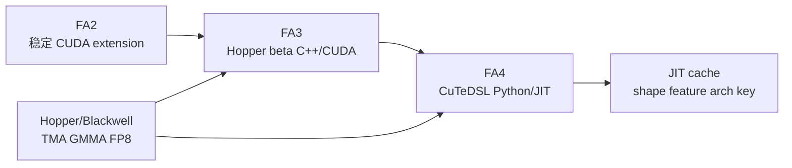

# Hopper与CuTe

> 这组笔记回答一个后继演进问题：FA2 已经能跑高性能 attention，为什么仓库还要有 FA3 Hopper beta 和 FA4 CuTeDSL/JIT 路径？

## 读者任务

| 任务 | 读完能做什么 |
|------|--------------|
| 区分版本边界 | 说明 FA2 稳定主包、FA3 Hopper beta、FA4 CuTeDSL 包分别解决什么问题 |
| 读新 GPU 路径 | 找到 FA3 的 Hopper schema、template dispatch、SM90 TMA/GMMA mainloop |
| 排查 FA4 JIT | 从 arch override、head/dtype validation、kernel object、compile cache 定位问题 |
| 评估生产风险 | 解释 JIT cache miss、shape bucketing、FP8 forward-only、unsupported feature 断言的影响 |

## 首次阅读路径

| 顺序 | 文件 | 读法 |
|------|------|------|
| 1 | [[FlashAttention-Hopper与CuTe-核心概念]] | 先建立 FA2/FA3/FA4 三层边界 |
| 2 | [[FlashAttention-Hopper与CuTe-源码走读]] | 读 FA3 C++ schema 到 FA4 Python JIT 的主线 |
| 3 | [[FlashAttention-Hopper与CuTe-数据流]] | 对齐 arch、kernel object、compile key、runtime args |
| 4 | [[FlashAttention-Hopper与CuTe-排障指南]] | 用症状表排查路径选择、FP8、SplitKV、cache miss |
| 5 | [[FlashAttention-FA3-Hopper演进]] | 深入 FA3 相对 FA2 的 Hopper/TMA/GMMA 增量 |
| 6 | [[FlashAttention-FA4-CuTeDSL演进]] | 深入 FA4 相对 FA3 的 CuTeDSL/JIT 增量 |
| 7 | [[FlashAttention-Hopper与CuTe-学习检查]] | 做可执行边界检查和口述验收 |

## 源码范围

| 路径 | 作用 |
|------|------|
| `README.md` | FA3 beta 定位、H100/H800 与 CUDA 要求 |
| `hopper/flash_api.cpp` | FA3 PyTorch dispatcher schema 与 arch/SplitKV/paged KV/PackGQA/softcap dispatch |
| `hopper/flash_fwd_launch_template.h` | FA3 tile size、mainloop/epilogue 组合、scheduler metadata、FP8 输出类型 |
| `hopper/flash_fwd_kernel_sm90.h` | SM90 TMA/GMMA pipeline、producer/consumer 角色 |
| `flash_attn/cute/README.md` | FA4 CuTeDSL 包定位和安装入口 |
| `flash_attn/cute/__init__.py` | FA4 公开 API 面 |
| `flash_attn/cute/interface.py` | FA4 arch detection、validation、kernel object dispatch、compile cache |

## 主线图

核心判断：FA3/FA4 不改变 FlashAttention 的 IO-aware attention 和 online softmax 原理；它们改变的是新硬件上的 kernel 组织方式、dispatch 位置和编译策略。
