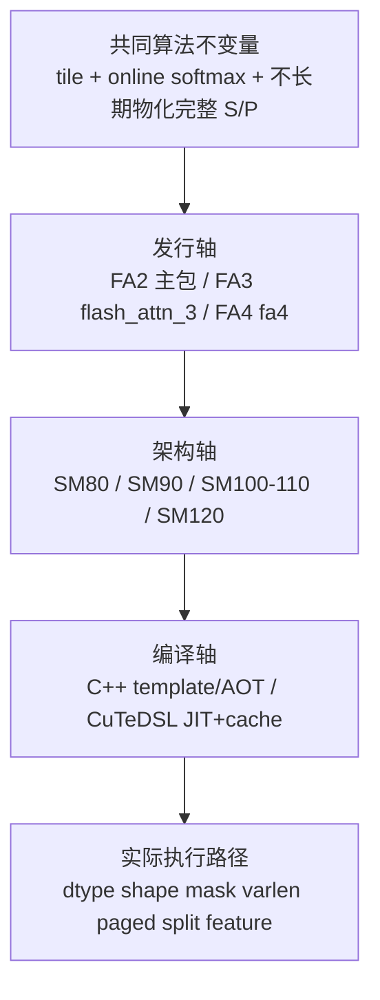

# FlashAttention Hopper 与 CuTe

## 读者任务

这组笔记回答的不是“新版为什么一定比旧版快”，而是三个更可验证的问题：

- 发行边界：FA2 主包、FA3 `flash_attn_3`、FA4 `flash-attn-4`/`flash_attn.cute` 是什么关系？
- 架构边界：当前源码怎样在 SM80、SM90、SM100/110、SM120 之间选择实现？
- 编译边界：FA3 的 C++/CUDA 模板实例化与 FA4 的 CuTeDSL JIT/cache 分别把组合决策放在哪里？

读完后，你应该能先判断包、GPU arch 和输入特性，再进入正确的 schema、dispatch、kernel object 或 compile key；不会仅凭“Hopper”“TMA”“CuTe”几个词推断实际执行路径。

## 三轴心理模型



这三轴不能压成 `FA2 → FA3 → FA4` 的简单替代链：

| 层次 | 发布时的公开定位 | 当前基线源码能直接证明什么 | 不能直接推出什么 |
|------|------------------|----------------------------|------------------|
| FA2 | 主包与 2.x 演进 | CUDA compiled、ROCm CK compiled、ROCm Triton/Aiter 等后端仍有各自路径 | FA3/FA4 已自动取代所有 FA2 调用 |
| FA3 | README 称 Hopper beta，列出 H100/H800、CUDA 12.3+、FP8 forward | `hopper/flash_api.cpp` 当前注册 `fwd`、`bwd`、`fwd_combine`、scheduler metadata；入口检查 Ampere 或更新架构，FP8 仍只对 Hopper forward 开放 | 所有 FA3 分支都使用 TMA；README 发布说明等于当前每个源码约束 |
| FA4 | README 称面向 Hopper/Blackwell 的 CuTeDSL 独立包 | 当前 forward 分派覆盖 SM8x、SM90、SM100/110、SM120；backward 入口当前接受 SM90、SM100/110、SM120。SplitKV、paged KV、稀疏和 MLA 也各有条件路径 | 所有 arch 与特性可任意组合；JIT cache 命中必然更快；CuTeDSL 只是 FA3 的语法翻译 |

## 第一条主线：先看公开操作，不按目录名猜能力

当前 FA3 C++ 扩展注册了四个 CUDA 操作，而不是只有一个 Hopper forward。

```cpp
// 来源：hopper/flash_api.cpp L1764-L1769
TORCH_LIBRARY_IMPL(flash_attn_3, CUDA, m) {
    m.impl("fwd", &mha_fwd);
    m.impl("bwd", &mha_bwd);
    m.impl("fwd_combine", &mha_combine);
    m.impl("get_scheduler_metadata", &mha_fwd_get_scheduler_metadata);
}
```

读者抓手：目录叫 `hopper/`、发布叫 FA3 beta，不等于当前文件只能处理 SM90。真正的边界要继续看入口的 device/dtype 校验、`ARCH_SWITCH`、tile 选择和具体 mainloop。反过来，接口接受 Ampere 也不代表 Ampere 会进入 SM90 kernel。

## 第二条主线：SM90 不是“所有数据都走 TMA”

SM90 mainloop 把 TMA 和 GMMA 选择写进编译期类型：PackGQA 会改变 Q 的加载方式，paged KV non-TMA 会让 K/V 改走其他加载路径；QK 与 PV 又根据 SS/RS 组合选择 GMMA atom。

```cpp
// 来源：hopper/mainloop_fwd_sm90_tma_gmma_ws.hpp L48-L66
    static constexpr bool Varlen = Varlen_;
    static constexpr bool PagedKVNonTMA = PagedKVNonTMA_;
    static constexpr bool AppendKV = AppendKV_;
    static constexpr bool HasQv = HasQv_;
    static constexpr bool PackGQA = PackGQA_;
    static constexpr bool Split = Split_;
    static constexpr bool V_colmajor = V_colmajor_;
    static constexpr bool Transpose_V = Is_FP8 && !V_colmajor;
    static constexpr bool Use_TMA_Q = !PackGQA;
    static constexpr bool Use_TMA_KV = !PagedKVNonTMA;
    static_assert(Use_TMA_KV || CUTE_STATIC_V(size(ClusterShape{})) == 1, "If not using TMA for KV, ClusterShape must be 1");
    static_assert(Use_TMA_KV || !V_colmajor, "If not using TMA for KV, V_colmajor is not supported");
    static constexpr bool SameHeadDim = get<2>(TileShape_MNK{}) == kHeadDimV;
    static constexpr bool LargeHeadDimV = kHeadDimV > 256;

    static_assert(ArchTag::kMinComputeCapability >= 90);

    static constexpr cute::GMMA::Major MmaMajorV = !Is_FP8 && !V_colmajor ? GMMA::Major::MN : GMMA::Major::K;
    static constexpr cute::GMMA::Major TmaMajorV = !V_colmajor ? GMMA::Major::MN : GMMA::Major::K;
```

SM90 kernel 外壳负责 persistent scheduler、producer/consumer warp-group、pipeline/barrier、寄存器重分配与 epilogue 交接；真正的 TMA tensor、GMMA selector、online-softmax 主循环在 `mainloop_fwd_sm90_tma_gmma_ws.hpp`。因此阅读顺序应是 launch 组合 → kernel 编排 → mainloop load/MMA，而不是在一个文件里寻找全部机制。

## 第三条主线：FA4 的 arch override 与编译目标是两件事

FA4 明确区分“选择哪条 kernel 路径”的 `FLASH_ATTENTION_ARCH` 与“编译目标”的 `CUTE_DSL_ARCH`。CPU-only compile 也必须同时提供两者，不能把 override 当成硬件模拟器。

```python
# 来源：flash_attn/cute/interface.py L76-L92
@lru_cache(maxsize=None)
def _get_device_arch():
    """Cached device arch check.

    Override with FLASH_ATTENTION_ARCH (e.g. 'sm_80' or '80') to select which
    kernel path to use (SM80/SM90/SM100/SM120) independently of the compilation
    target (CUTE_DSL_ARCH).

    For CPU-only compilation (no GPU), set both:
      FLASH_ATTENTION_ARCH=sm_80  (kernel selection)
      CUTE_DSL_ARCH=sm_80         (compilation target)
    """
    arch_override = os.environ.get("FLASH_ATTENTION_ARCH", None)
    if arch_override is not None:
        return _parse_arch_str(arch_override)
    major, minor = torch.cuda.get_device_capability()
    return major * 10 + int(minor)
```

当前 interface 随后按 arch 构造不同 kernel object：SM80、SM90、SM100/110、SM120 不是同一个对象改个参数；各自的 head_dim、paged KV、SplitKV、稀疏、FP8、2CTA 等限制也不同。

## 第四条主线：compile key 是“代码形状契约”

FA4 forward cache key 不是“完整 runtime tensor shape 的序列化”。batch/seqlen 可由动态 tensor 承载，而 dtype、head_dim、Q/K/V head 关系、mask/score callable hash、稀疏广播模式、LSE 是否存在、varlen 元数据种类、paged KV、tile、split、arch、TMA/cp.async 分叉、2CTA、scheduler、MLA/sparse MLA 状态与日志级别会进入代码生成契约。

```python
# 来源：flash_attn/cute/interface.py L718-L765
    compile_key = (
        dtype,
        head_dim,
        head_dim_v,
        qhead_per_kvhead,
        causal,
        score_mod_hash,
        mask_mod_hash,
        use_block_sparsity,
        block_sparse_broadcast_pattern,
        aux_tensor_metadata,
        aux_scalar_metadata,
        lse is None,
        cu_seqlens_q is None,
        cu_seqlens_k is None,
        seqused_q is None,
        seqused_k is None,
        page_table is not None,
        window_size_left is not None,
        window_size_right is not None,
        learnable_sink is not None,
        q_descale is not None,
        k_descale is not None,
        v_descale is not None,
        block_sparse_tensors is None or block_sparse_tensors.cu_total_m_blocks is None,
        block_sparse_tensors is None or block_sparse_tensors.cu_block_idx_offsets is None,
        tile_m,
        tile_n,
        q_stage,
        num_threads,
        is_split_kv,
        pack_gqa,
        arch,
        page_size not in [None, tile_n],  # paged KV non-TMA
        use_2cta_instrs,
        q_subtile_factor,
        mma_pv_is_rs,
        intra_wg_overlap,
        use_clc_scheduler,
        q is not None,
        qv is not None,
        p is not None,
        row_max is not None,
        gather_kv_length,
        sparse_kv,
        disable_sparse_kv_bitmask,
        fa_logging.get_fa_log_level(),
    )
```

这解释了为什么“shape 看起来一样”仍可能重新编译：只要上述代码生成语义之一改变，就可能产生新 key。它也给出失效边界：key 相同只说明复用同一已编译 callable，不证明运行时 shape、数据分布或显存访问成本相同。

## 七篇的分工

| 顺序 | 文件 | 读完必须回答 |
|------|------|--------------|
| 1 | [[FlashAttention-Hopper与CuTe-核心概念]] | TMA、GMMA、warp specialization、persistent scheduler、JIT key 分别属于哪一层 |
| 2 | [[FlashAttention-Hopper与CuTe-源码走读]] | FA3 schema 如何到 launch/kernel/mainloop，FA4 API 如何到 kernel object/compile/cache/call |
| 3 | [[FlashAttention-Hopper与CuTe-数据流]] | arch、特性开关、partial O/LSE、runtime tensor 与 compiled callable 怎样交接 |
| 4 | [[FlashAttention-Hopper与CuTe-排障指南]] | import、arch、shape、unsupported feature、cache miss、first-run latency 怎样分层排查 |
| 5 | [[FlashAttention-FA3-Hopper演进]] | README 发布边界与当前 FA3 源码能力有哪些差异，SM90 增量落在哪里 |
| 6 | [[FlashAttention-FA4-CuTeDSL演进]] | CuTeDSL 相对 C++ 模板把哪些决策移到 Python/JIT，哪些算法不变量没变 |
| 7 | [[FlashAttention-Hopper与CuTe-学习检查]] | 能否用静态命令与条件化动态实验独立证明上述判断 |

## 共享源码阅读地图

| 路径 | 本组使用方式 |
|------|--------------|
| `README.md` | 只证明 FA3/FA4 发布时的公开定位、硬件/软件要求，不替代当前源码行为 |
| `hopper/flash_api.cpp` | 当前 FA3 schema、输入校验、arch/dtype 分派、paged/append/split、partial buffer 与 backward |
| `hopper/flash_fwd_launch_template.h` | tile、mainloop/epilogue、scheduler、cluster 与 launch 的类型组合 |
| `hopper/flash_fwd_kernel_sm90.h` | SM90 kernel 外壳、producer/consumer warp-group、pipeline/barrier、persistent work loop |
| `hopper/mainloop_fwd_sm90_tma_gmma_ws.hpp` | TMA/cp.async 条件加载、GMMA selector、mask/softcap/online-softmax、QK/PV 主循环与 append KV |
| `flash_attn/cute/README.md` | FA4 独立包的安装和最小公开用法 |
| `flash_attn/cute/__init__.py` | 当前公开导出只有 dense 与 varlen 两个函数 |
| `flash_attn/cute/interface.py` | arch override、validation、kernel object 选择、forward/backward/MLA/SplitKV 与多组 JIT cache |

## 生产判断表

| 现象 | 先看什么 | 不要先下什么结论 |
|------|----------|------------------|
| FA3 import 失败 | 独立包安装、CUDA/PyTorch ABI、extension 加载 | “Hopper kernel 数值有 bug” |
| FA4 首次调用慢 | compile key 是否首次出现、编译日志、首次与稳态计时 | “attention 算法退化” |
| 相同 shape 又编译 | callable hash、varlen/paged/split、arch、tile、scheduler、日志级别等 key 字段 | “cache 完全失效” |
| paged KV 没看到 TMA | page size 与 tile_n、`PagedKVNonTMA`、arch/feature 约束 | “没有进入 Hopper 路径” |
| FP8 backward 报错 | FA3/FA4 的包与 arch；当前 FA4 CuTe FP8 仅在 SM100 forward 开放，requires-grad 会显式拒绝 | “所有 FP8 都不支持” |
| SplitKV 没有 combine | 实际 `num_splits`、arch、varlen、head_dim 差异和 heuristic | “decode 一定会 combine” |

## 运行验证

无匹配 GPU 或未安装独立包时，先做静态验证：

```powershell
rg -n 'm\.impl\("(fwd|bwd|fwd_combine|get_scheduler_metadata)' flash-attn/flash-attention/hopper/flash_api.cpp
rg -n 'Use_TMA_Q|Use_TMA_KV|GMMA::(ss|rs)_op_selector|PagedKVNonTMA' flash-attn/flash-attention/hopper/mainloop_fwd_sm90_tma_gmma_ws.hpp
rg -n 'FLASH_ATTENTION_ARCH|CUTE_DSL_ARCH|compile_key =|get_jit_cache|arch // 10' flash-attn/flash-attention/flash_attn/cute/interface.py
```

预期分别命中 FA3 四个 CUDA operation、SM90 的条件 TMA/GMMA 路径，以及 FA4 的 arch override、编译目标、cache key 和按架构分派。静态命中不证明包可导入、GPU 数值正确或性能更快。

动态验证必须记录 GPU 型号/SM、CUDA、PyTorch、包版本、输入 shape/dtype/mask/page/split，并把首次 JIT 与至少一次 cache-hit 稳态调用分开。当前机器若没有匹配 GPU 或独立包，结论应停在静态可证范围。

## 复盘

Hopper/CuTe 专题的总判断是：算法不变量仍是 tile、online softmax 与受控中间态；变化发生在架构能力、并行角色、加载/MMA 原语、scheduler 和代码生成位置。任何“FA3/FA4 更快”“Hopper 都走 TMA”“相同 shape 必然 cache hit”的句子，都必须附带当前包、arch、特性组合和实测 workload 才成立。
