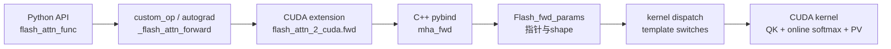

# 阅读方法

> 读 FlashAttention 不要从 generated kernel 文件数量开始，而要从 attention 的 IO 形态开始。

## 你为什么要读

FlashAttention 的文件树很容易把新人带进 generated kernel 的迷宫，但入口其实只有三问：数据搬了几次、softmax 状态怎么续上、硬件条件如何决定 dispatch。本页先把这三问钉牢，再把原理、API、内核、推理和新架构串成一条可反复回看的路线。

## 阅读主线

| 层次 | 要回答的问题 | 推荐入口 |
|------|--------------|----------|
| 原理 | 为什么标准 attention 会被 HBM traffic 卡住 | [[FlashAttention-Attention-IO]] |
| 数值 | 分块后 softmax 为什么仍然精确 | [[FlashAttention-Online-Softmax]] |
| 接口 | 上层框架如何表达普通、packed、varlen、KV cache | [[FlashAttention-Python-API]] |
| 内核 | 参数如何变成 template specialization | [[FlashAttention-FA2-Forward]] |
| 推理 | decode、SplitKV、paged KV 为什么特殊 | [[FlashAttention-KV-Cache]] |
| 新架构 | Hopper/Blackwell 为什么引入新路径 | [[FlashAttention-Hopper与CuTe]] |

## 三个固定问题

每读一个函数，都问三件事：

1. **它搬了什么数据？** `Q/K/V/O/LSE` 在 HBM、shared memory、register 之间如何流动。
2. **它保存了什么状态？** 是否保存完整 attention matrix，还是只保存 `softmax_lse`、随机数状态、cache metadata。
3. **它专门化了什么条件？** dtype、head_dim、causal、local、ALiBi、softcap、dropout、SplitKV、paged KV。

## 一条调用链



这条链路不是“包装层很多”，而是把 PyTorch 张量语义、C++ 参数校验、CUDA template specialization 和 GPU 执行模型逐层分离。先从公开入口分清 dense、packed、varlen 和 KV cache，再进入 `flash_attn_2_cuda` 与具体 kernel，读者才不会把 API 形态、训练形态、推理形态混在一起。

源码证据先看包级导出：

```python
# 来源：flash_attn/__init__.py L8-L16
from flash_attn.flash_attn_interface import (
    flash_attn_func,
    flash_attn_kvpacked_func,
    flash_attn_qkvpacked_func,
    flash_attn_varlen_func,
    flash_attn_varlen_kvpacked_func,
    flash_attn_varlen_qkvpacked_func,
    flash_attn_with_kvcache,
)
```

这里能直接看到 7 个常用入口：`flash_attn_func` 是 dense 基线，`*_packed_func` 合并 Q/K/V 或 K/V 存储，`*_varlen_*` 处理变长 batch，`flash_attn_with_kvcache` 服务 decode 阶段。后续每个专题都围绕这些入口如何变成参数包、dispatch 条件和 kernel 行为展开。

## AI infra 读法

| 场景 | 关注点 | 对应专题 |
|------|--------|----------|
| 训练 prefill | activation memory、dropout、backward 重算 | [[FlashAttention-Online-Softmax-排障指南]] |
| serving prefill | 长 prompt 吞吐、head_dim、causal mask | [[FlashAttention-FA2-Forward-数据流]] |
| decode | `seqlen_q=1`、KV cache 读带宽、小 batch 利用率 | [[FlashAttention-KV-Cache-核心概念]] |
| 长上下文 | SplitKV、paged KV、combine kernel | [[FlashAttention-KV-Cache-源码走读]] |
| 新 GPU | TMA/GMMA、persistent scheduling、JIT cache | [[FlashAttention-Hopper与CuTe-核心概念]] |

## 自测

读完本页后，任选一个公开 API，例如 `flash_attn_func` 或 `flash_attn_with_kvcache`，沿“Python API → custom op → C++ 参数包 → dispatch → kernel”说出每层负责什么。若只能停在 Python 函数签名，先补 [[FlashAttention-Python-API]]；若能追到 `Flash_fwd_params` 和 template switch，再进入 [[FlashAttention-FA2-Forward]]。
