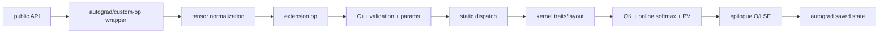

# FlashAttention 阅读方法

> 不从 generated kernel 数量开始，也不从最长的 CUDA 文件开始；先选执行路线，再跟一个对象穿过边界。

## 你为什么要读

FlashAttention 难读，不是因为 attention 公式长，而是同一个概念会以多种形态出现：Python tensor、C++ pointer/stride、模板常量、shared-memory tile、register accumulator、partial buffer 和 autograd state。若按文件树浏览，你会认识很多名字，却不知道它们是否属于同一次调用。

本页提供一套可迁移到 FA2、FA3、FA4 的方法：**路线选择 → 贯穿对象 → 五本账 → checkpoint 取证 → 静态/动态验证 → 复盘。**

## 第一步：先选路线，不要假设只有一条调用链

当前仓库至少要区分三种实现世代与两种业务生命周期：

| 维度 | 路线 | 典型入口 | 不应混入的假设 |
|---|---|---|---|
| 实现 | FA2 | `flash_attn_func` → `flash_attn_2_cuda` | 不自动代表 FA3/FA4 |
| 实现 | FA3 | `hopper/flash_attn_interface.py` → `flash_attn_3` op | HIP fallback 不能外推到 CUDA |
| 实现 | FA4 | `flash_attn.cute` → program object/JIT cache | 不是 FA2 extension 的普通 flag |
| 业务 | training | forward → 保存状态 → backward 重算/归约 | 不等同于 KV-cache decode |
| 业务 | serving | prefill/decode → KV append/page table/SplitKV | 不等同于训练 dropout/backward |

先记录五项上下文：包与模块路径、Git baseline、GPU arch、dtype/shape、调用的公开符号。缺一项，后续“这个 kernel 为什么被选中”都可能没有唯一答案。

## 第二步：选一个贯穿对象

不要试图同时跟完所有 tensor。每次只选一个对象或状态：

- 追 `Q`：适合理解 dense/varlen layout、tile 划分、Q residency 与 GQA packing；
- 追 `K/V`：适合理解 paged KV、cache append、TMA/cp.async 与 SplitKV；
- 追 `m/l/LSE`：适合理解 online softmax、跨 tile 合并与 backward 重算；
- 追 `O`：适合理解 accumulator 重标定、epilogue、partial output 与 combine；
- 追 `compile_key`：适合理解 FA4 specialization、cold start 和 cache 复用；
- 追 `dQ` 或 `dK/dV`：适合理解 backward 的不同归约与并行所有权。

贯穿对象一旦选定，就沿“谁创建→谁持有→谁修改→shape/stride 如何变→何时失效”记录。Walkthrough 的主线应是对象生命周期，不是文件打开顺序。

## 第三步：维护五本账

每到一个 checkpoint，都回答同一组问题：

| 账本 | 问题 | 常见证据 |
|---|---|---|
| 数学账 | 这个对象对应 attention 的什么量？等价性靠什么不变量？ | online max/sum、LSE、重标定公式 |
| 内存账 | 它在 HBM、shared memory、register 还是 workspace？活多久？ | allocation、layout、tile storage、epilogue |
| 所有权账 | 谁分配、谁可原地修改、谁负责回收或回写？ | mutability schema、autograd ctx、cache append、partial buffer |
| 分派账 | 哪些动态值被归一化成什么最终实例？ | dtype/head dim/mask/arch/split/GQA static switch 或 compile key |
| 验证账 | 怎样证明数值、路径和性能判断？ | reference、断点/log、profiler、固定 workload A/B |

原稿常见的失败方式是只记第三问“专门化了什么”。但对 KV cache 和 backward，所有权错误往往比模板条件更致命；对 FA4，compile key 是否正确比单个 kernel 类名更关键。

## 第四步：从公开入口建立路线分叉

FA2 包级导出已经提示了主要输入协议：dense、KV-packed、QKV-packed、varlen 与 KV cache。

```python
# 来源：flash_attn/__init__.py L8-L16
from flash_attn.flash_attn_interface import (
    flash_attn_func,
    flash_attn_kvpacked_func,
    flash_attn_qkvpacked_func,
    flash_attn_varlen_func,
    flash_attn_varlen_kvpacked_func,
    flash_attn_varlen_qkvpacked_func,
    flash_attn_with_kvcache,
)
```

这里不能只数出七个函数，还要给它们分协议：

- `packed` 改变 tensor 组织，不自动等于 varlen；
- `varlen` 用 `cu_seqlens` 描述 ragged batch 边界；
- `with_kvcache` 引入可变 cache 状态、page table、append/rotary/SplitKV 等 serving 语义；
- 普通 `flash_attn_func` 才是最适合建立 dense baseline 的入口。

从一个入口出发，先抄下完整签名与返回值，再查它调用的下一个符号。不要用“名字看起来相似”连接调用链。

## 第五步：把一条链拆成 checkpoint

以 FA2 dense forward 为例，推荐 checkpoint 是：



Python wrapper 的正式证据表明，它先把 Q/K/V 调整为末维连续，再调用 extension forward，接回 O、LSE、可选 softmax/dropout 信息与 RNG state。

```python
# 来源：flash_attn/flash_attn_interface.py L84-L114
@_torch_custom_op_wrapper("flash_attn::_flash_attn_forward", mutates_args=(), device_types="cuda")
def _flash_attn_forward(
    q: torch.Tensor,
    k: torch.Tensor,
    v: torch.Tensor,
    dropout_p: float,
    softmax_scale: float,
    causal: bool,
    window_size_left: int,
    window_size_right: int,
    softcap: float,
    alibi_slopes: Optional[torch.Tensor],
    return_softmax: bool
) -> Tuple[torch.Tensor, torch.Tensor, torch.Tensor, torch.Tensor]:
    q, k, v = [maybe_contiguous(x) for x in (q, k, v)]
    out, softmax_lse, S_dmask, rng_state = flash_attn_gpu.fwd(
        q,
        k,
        v,
        None,
        alibi_slopes,
        dropout_p,
        softmax_scale,
        causal,
        window_size_left,
        window_size_right,
        softcap,
        return_softmax,
        None,
    )
    return out, softmax_lse, S_dmask, rng_state
```

这张卡只证明 Python→extension 边界。它不能证明 C++ 如何校验 head dim，也不能证明 kernel 如何做 online softmax；后两项必须在各自 checkpoint 另找证据。每张源码卡只承担一个判断，能显著减少“引用是真的、结论却跨层外推”的问题。

## 第六步：进入 kernel 时按类型读，不按行号读

CUDA/CuTe kernel 建议按六类对象定位：

1. Params：运行时 pointer、shape、stride、mask、semaphore；
2. Traits/config：tile、warps、stages、dtype、arch；
3. Layout/copy：global→shared→register 的映射与向量化/alignment；
4. Scheduler：哪个 CTA/warp-group 处理哪个 `(batch, head, q_tile, split)`；
5. Mainloop：QK、mask、online softmax、P×V 与 pipeline/barrier；
6. Epilogue/combine：O/LSE 写回、partial 合并、类型转换与 semaphore 清理。

遇到模板嵌套时，先把最终常量写成一行实例账，例如：

```text
arch=90, dtype=bf16, head_dim=128, causal=true,
PackGQA=false, Split=false, PagedKVNonTMA=false,
Use_TMA_Q=true, Use_TMA_KV=true
```

然后只展开这一条路径。先理解一个实例，再比较另一个布尔轴变化了哪些 type/layout/pipeline；不要一上来穷举所有组合。

## 第七步：FA2、FA3、FA4 使用不同的“下一跳”

| 路线 | Python 之后优先找什么 | kernel 前最后一个关键对象 |
|---|---|---|
| FA2 | `flash_attn_gpu.fwd` 的 C++ binding 与 `Flash_fwd_params` | C++ template dispatch 选出的 kernel traits |
| FA3 | `flash_attn_3` schema、heuristic 与 static switches | SM8x/SM90 kernel params + tile scheduler args |
| FA4 | `_flash_attn_fwd` validation、`compile_key`、arch-specific object | `cute.compile` 返回并缓存的 callable |

FA4 不应硬套“Python→pybind→预编译 kernel”路线；FA3 也不应只看 README 的 Hopper beta 标签而忽略当前 SM8x live path。版本名是导航提示，不是执行证据。

## 第八步：用静态证据先确认路径

在没有 GPU 或依赖不全时，至少完成：

```powershell
rg -n 'def flash_attn_func|def flash_attn_with_kvcache|flash_attn_gpu\.fwd' flash-attn/flash-attention/flash_attn/flash_attn_interface.py
rg -n 'TORCH_LIBRARY\(flash_attn_3|ARCH_SWITCH|SPLIT_SWITCH' flash-attn/flash-attention/hopper/flash_api.cpp
rg -n 'Use_TMA_Q|Use_TMA_KV|GMMA::|cp.async' flash-attn/flash-attention/hopper/mainloop_fwd_sm90_tma_gmma_ws.hpp
rg -n 'compile_key =|cute.compile|compile_cache\[compile_key\]' flash-attn/flash-attention/flash_attn/cute/interface.py
rg -n 'CUTE_DSL_CACHE_ENABLED|JITPersistentCache|_compute_source_fingerprint' flash-attn/flash-attention/flash_attn/cute/cache_utils.py
```

预期：分别命中 FA2 API/extension、FA3 schema/dispatch、SM90 条件搬运/GMMA、FA4 compile/call 与持久化 cache。静态命中证明“路径存在”，不证明目标环境一定执行它。

## 第九步：动态验证遵循最小扰动

动态验证按风险从低到高：

1. 打印模块 `__file__`、包版本、Torch/CUDA、device capability；
2. 固定一个极小 shape，与 PyTorch/reference 比 O/LSE/梯度；
3. 一次只改一个轴：causal、varlen、GQA、head dim、dtype、SplitKV；
4. 记录最终 dispatch/key，而不是只记录输入；
5. warmup 后测 steady state，另记 cold compile/build 时间；
6. profiler 验证 kernel 名、launch 数、HBM traffic 与间隙。

没有 GPU 时，明确写“动态未验证”；不要用静态源码推断具体吞吐、占用率或性能阈值。

## 按场景选择专题

| 场景 | 先追的对象 | 对应专题 |
|---|---|---|
| training forward | Q tile、`m/l/O`、LSE | [[FlashAttention-FA2-Forward-数据流]] |
| training backward | LSE、RNG、dQ 与 dK/dV accumulator | [[FlashAttention-Backward-数据流]] |
| serving prefill | 长 Q/K tile、causal/varlen dispatch | [[FlashAttention-FA2-Forward-源码走读]] |
| decode | cache row/page、append token、rotary position | [[FlashAttention-KV-Cache-数据流]] |
| SplitKV | partial O/LSE、split stride、combine | [[FlashAttention-KV-Cache-源码走读]] |
| Hopper SM90 | TMA Q/KV、producer/consumer、GMMA、scheduler | [[FlashAttention-FA3-Hopper演进]] |
| CuTeDSL serving | compile key、program object、callable、cache | [[FlashAttention-FA4-CuTeDSL演进]] |

## 最终自测

任选一个公开 API，提交一页 trace sheet：

```text
公开符号与真实模块路径：
输入 shape / stride / dtype / arch：
贯穿对象：
Python 归一化：
C++/DSL 参数对象：
最终 dispatch 或 compile key：
kernel/mainloop checkpoint：
输出与保存状态：
静态证据：
动态/reference 证据：
尚未验证的边界：
```

通过标准：每个箭头都有真实调用或对象证据；每个性能判断都绑定环境/workload；每个源码卡只证明一个结论；遇到 FA3/FA4 能主动切换路线。若只能列文件名，回到 [[FlashAttention学习指南]] 的第二遍；若链路已清楚但无法验证，进入对应专题的学习检查与排障指南。
