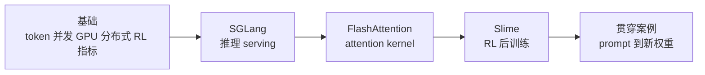

# AI Infra 源码学习库

> 从请求、训练样本和 Q/K/V tensor 出发，理解 LLM serving、RL 后训练与 GPU attention kernel。

## 读完能做什么

本页不负责讲完三个框架，而是帮你在两分钟内选路：从零学习走课程，需要排障按症状进入专题，准备改源码则先建立对象生命周期和证据边界。

## 第一次进入

从 [[AI-Infra入门课程]] 开始。课程先补齐公共基础，再走三条短主线，最后用一个 prompt 到新权重的案例把三库连接起来。

| 目标 | 入口 |
|------|------|
| 从零入门 AI Infra | [[AI-Infra入门课程]] |
| 查看联合路线 | [[knowledge_maps/AI-Infra联合学习路径]] |
| 追踪一个 prompt 到新权重 | [[从Prompt到新权重]] |
| 做实验 | [[knowledge_maps/实验与检查.base]] |
| 按主题查资料 | [[knowledge_maps/知识地图首页]] |

## 三个框架

### SGLang · 推理 Serving

一个 HTTP 请求如何变成 token、batch、GPU forward 和流式响应。

[[推理Serving主线]] · [[SGLang学习指南]] · [[SGLang-生产排障]]

### Slime · RL 后训练

一组 prompt 如何变成 Sample、训练 batch、loss、optimizer step 和新权重。

[[RL训练闭环主线]] · [[Slime学习指南]] · [[Slime-分布式权重同步]]

### FlashAttention · Attention Kernel

Q/K/V 如何从 Python API 进入 C++/CUDA/CuTe，并通过 tile 与 online softmax 减少 HBM traffic。

这条路线用于建立 attention kernel 心智模型；它不表示 SGLang 在任意版本、硬件和配置下都必然分派到本仓库的 FlashAttention 实现。判断真实 backend 必须回到运行时配置、dispatch 分支和 profiler 证据。

[[Attention算子主线]] · [[FlashAttention学习指南]] · [[FlashAttention性能实验]]

## 按任务进入

| 当前任务 | 先看 |
|----------|------|
| 理解整体架构 | [[knowledge_maps/三框架知识地图]] |
| 排查推理延迟或 OOM | [[SGLang-生产排障]] |
| 排查 rollout、loss 或旧权重 | [[Slime-RL训练全链路]] · [[knowledge_maps/排障指南.base]] |
| 排查 attention 数值或性能 | [[FlashAttention-FA2-Forward-排障指南]] · [[FlashAttention性能实验]] |
| 准备修改源码 | [[knowledge_maps/源码走读.base]] |
| 检查是否学会 | [[课程完成标准]] |

## 使用 Obsidian

- 推荐把本页、[[AI-Infra入门课程]] 和当前实验加入 Bookmarks。
- 在专题页打开 Backlinks 或 Local Graph，优先看一到两跳关系。
- 使用 `framework`、`topic`、`type`、`learning_role` 属性和 Bases 过滤内容。
- 文件名只表达语义，不包含维护批次号；目录负责归档，双链负责知识关系。

## 版本

| 框架 | 源码基线 |
|------|----------|
| SGLang | `70df09b` |
| Slime | `22cdc6e1` |
| FlashAttention | `002cce0` |

维护规范：[[maintenance/Obsidian知识库规范]] · [[maintenance/源码阅读写作标准]]
