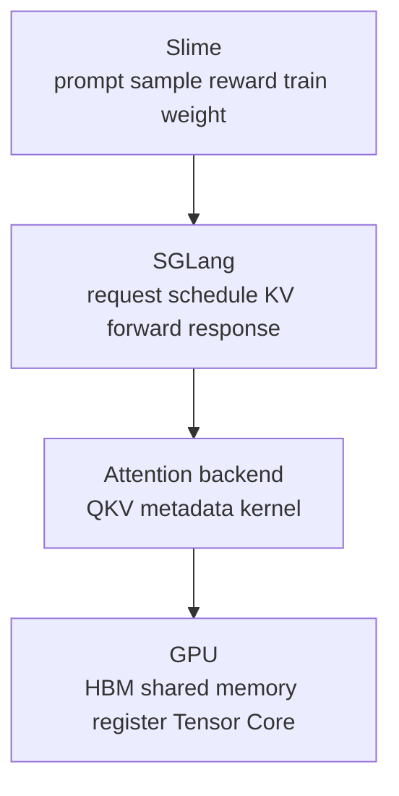

# AI Infra 联合学习路径

## 学习目标

SGLang、Slime 和 FlashAttention 分别覆盖 serving runtime、RL 后训练闭环和 attention kernel。联合学习不是把三个目录依次读完，而是先建立公共基础，再沿对象生命周期进入深度专题。

三者对应三种观察尺度：Slime 看一轮策略如何更新，SGLang 看一条请求如何服务，FlashAttention 看一次算子如何搬运 tensor。联合阅读的目标，是能在尺度之间缩放：既看得见整条闭环，也能在需要时落到一个字段、一次 collective 或一个 register accumulator。

## 三层系统模型

## 从零路径

### 基础层

[[LLM推理与Token]] → [[并发进程与背压]] → [[GPU内存与算子]] → [[分布式通信与并行]] → [[RL后训练数学基础]] → [[性能指标与实验方法]]

### 系统层

[[推理Serving主线]] → [[Attention算子主线]] → [[RL训练闭环主线]]

### 联合层

[[从Prompt到新权重]] → [[跨库一致性实验]] → [[课程完成标准]]

这条核心路径适合两到四周完成。三库深度专题是后续参考层，不把“读完全部文档”作为入门完成标准。

## 已有背景的路径

| 背景 | 推荐入口 |
|------|----------|
| 熟悉 serving | [[Attention算子主线]] → [[RL训练闭环主线]] |
| 熟悉训练 | [[推理Serving主线]] → [[从Prompt到新权重]] |
| 熟悉 CUDA | [[推理Serving主线]] → [[SGLang-Attention]] → [[FlashAttention-KV-Cache]] |
| 正在生产排障 | [[SGLang-生产排障]] → [[排障指南.base]] |
| 准备改框架源码 | [[源码走读.base]] → 对应数据流和学习检查 |

## 深度专题

- SGLang：[[SGLang-请求调度]] · [[SGLang-模型执行]] · [[SGLang-内存与Attention]] · [[SGLang-高级特性]]
- Slime：[[Slime-Ray编排]] · [[Slime-Rollout生成]] · [[Slime-训练后端]] · [[Slime-权重同步]]
- FlashAttention：[[FlashAttention-Attention-IO]] · [[FlashAttention-FA2-Forward]] · [[FlashAttention-Backward]] · [[FlashAttention-KV-Cache]]

## 实验路径

[[SGLang服务实验]] → [[FlashAttention性能实验]] → [[Slime闭环实验]] → [[跨库一致性实验]]

每次实验先记录模型、硬件、版本、workload 和单一变量，再记录预期与实际。没有 GPU 时完成静态定位；有 GPU 时补运行数据。

## 导航

[[index]] · [[AI-Infra入门课程]] · [[三框架知识地图]] · [[知识地图首页]]
