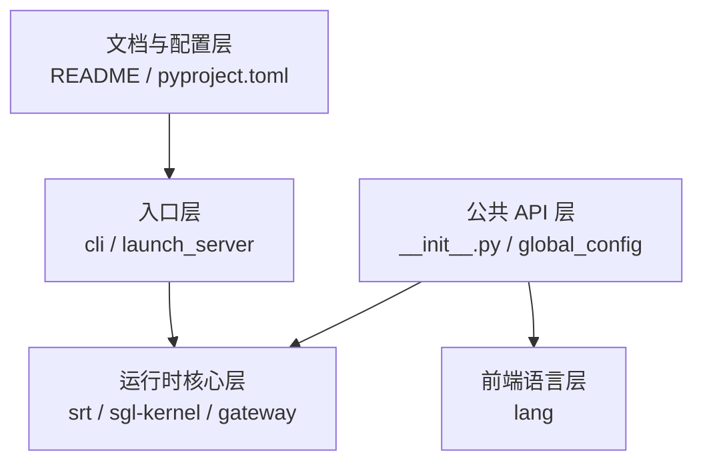

# 阅读方法论 · 核心概念

## 用户故事：新人第一次打开 SGLang 文档

### Persona

**小周**，刚入职的后端实习生，负责把 SGLang 接入内部推理平台。第一次 clone 仓库，面对 monorepo 里 `srt`、`lang`、`sgl-kernel` 一堆目录，不知道从哪里读起。

### 时间线

| 时刻 | 事件 |
|------|------|
| T0 | 打开 README，看到 Runtime 与 Frontend 两个词，不确定日常「跑服务」对应哪一层 |
| T1 | 浏览 `python/sglang/` 目录树，发现 `launch_server.py` 与 `cli/` 并存 |
| T2 | 执行 `sglang --help`，确认 `sglang serve` 是推荐入口 |
| T3 | 按 [[PLAN]] 从本模块建立五层架构地图，再进入 启动链路 启动链路 |

**Explain：** 本模块是 **sglang_reading 全局入口**：不深入 Scheduler 或 KV Cache，只回答「SGLang 是什么、代码分几层、CLI 从哪进」。后续全部专题均在此地图之上展开；读任何模块前先确认它在五层架构中的位置。

**Code：**

```python
# 来源：python/sglang/__init__.py L78-L79
ServerArgs = LazyImport("sglang.srt.server_args", "ServerArgs")
Engine = LazyImport("sglang.srt.entrypoints.engine", "Engine")
```

**Comment：** `LazyImport` 说明 Frontend 与 Runtime 可分离加载——仅写 DSL 脚本不必 import torch。本模块只需记住 **SRT = `srt/` = 推理运行时**。

### 如果…会怎样（调试）

| 现象 | 可能原因 | 排查 |
|------|----------|------|
| 把 `lang/` 当服务端读 | 混淆 Frontend DSL 与 Runtime | 确认目标：跑服务 → 读 `srt/` + 启动链路–HTTP Server |
| 找不到 GPU 调度代码 | 在 `cli/` 层找 Scheduler | Scheduler 在 `srt/managers/`，入口在启动链路 |
| 与 vLLM 概念对不上 | 用 BlockManager 心智套 RadixAttention | 读 §9 框架对比表，再进RadixAttention |

---

## 1. SGLang 是什么

**Explain：** SGLang（Structured Generation Language）是 LMSYS 主导的开源**大模型推理服务框架**。它同时提供：

- **Backend（Runtime）**：高性能服务引擎，对标 vLLM、TensorRT-LLM
- **Frontend（Language）**：结构化生成 DSL，对标 Guidance、LMQL

官方 README 对 Runtime 的核心能力概括如下：

**Code：**

```markdown
# 来源：README.md L61-L70（About 节摘录）
## About
SGLang is a high-performance serving framework for large language models and multimodal models.
It is designed to deliver low-latency and high-throughput inference across a wide range of setups, from a single GPU to large distributed clusters.
Its core features include:

- **Fast Runtime**: Provides efficient serving with RadixAttention for prefix caching, a zero-overhead CPU scheduler, prefill-decode disaggregation, speculative decoding, continuous batching, paged attention, tensor/pipeline/expert/data parallelism, structured outputs, chunked prefill, quantization (FP4/FP8/INT4/AWQ/GPTQ), and multi-LoRA batching.
- **Broad Model Support**: Supports a wide range of language models (Llama, Qwen, DeepSeek, Kimi, GLM, GPT, Gemma, Mistral, etc.), embedding models (e5-mistral, gte, mcdse), reward models (Skywork), and diffusion models (WAN, Qwen-Image), with easy extensibility for adding new models. Compatible with most Hugging Face models and OpenAI APIs.
- **Extensive Hardware Support**: Runs on NVIDIA GPUs (GB200/B300/H100/A100/Spark/5090), AMD GPUs (MI355/MI300), Intel Xeon CPUs, Google TPUs, Ascend NPUs, and more.
- **Active Community**: SGLang is open-source and supported by a vibrant community with widespread industry adoption, powering over 400,000 GPUs worldwide.
- **RL & Post-Training Backbone**: SGLang is a proven rollout backend used for training many frontier models, with native RL integrations and adoption by well-known post-training frameworks such as [**AReaL**](https://github.com/inclusionAI/AReaL), [**Miles**](https://github.com/radixark/miles), [**slime**](https://github.com/THUDM/slime), [**Tunix**](https://github.com/google/tunix), [**verl**](https://github.com/volcengine/verl) and more.
```

**Comment：**

- **RadixAttention**：基于 Radix Tree 的前缀 KV 缓存共享（RadixAttention 详述）。
- **Continuous batching**：调度器动态合并请求（Scheduler–调度策略 详述）。
- **PD disaggregation**：Prefill 与 Decode 节点分离部署（PD 分离 详述）。
- 你日常说的「跑 SGLang 服务」，主要指 **Runtime（`python/sglang/srt`）**。

---

## 2. 架构位置（知识图谱分层）

SGLang 的五层架构如下：



| 层级 | 目录/文件 | 本阅读项目中的专题 |
|------|-----------|-------------------|
| 文档与配置 | `README.md`, `pyproject.toml` | **01（本模块）** |
| 入口 | `cli/`, `launch_server.py` | 02–03 |
| 公共 API | `__init__.py`, `global_config.py` | 01 + 28 |
| 运行时核心 | `srt/`, `sgl-kernel/` | 06–26 |
| 前端语言 | `lang/` | 28 |

---

## 3. Monorepo 顶层目录

**Explain：** SGLang 不是单一 Python 包，而是 **monorepo**。Python 包只是其中一部分。

**Code：**

```markdown
# 来源：python/sglang/README.md L1-L18（Code Structure 全文）
# Code Structure

- `eval`: The evaluation utilities.
- `lang`: The frontend language.
- `multimodal_gen`: Inference framework for accelerated image/video generation.
- `srt`: The backend engine for running local models. (SRT = SGLang Runtime).
- `test`: The test utilities.
- `api.py`: The public APIs.
- `bench_offline_throughput.py`: Benchmark the performance in the offline mode.
- `bench_one_batch.py`: Benchmark the latency of running a single static batch without a server.
- `bench_one_batch_server.py`: Benchmark the latency of running a single batch with a server.
- `bench_serving.py`: Benchmark online serving with dynamic requests.
- `check_env.py`: Check the environment variables and dependencies.
- `global_config.py`: The global configs and constants.
- `launch_server.py`: The entry point for launching a local server.
- `profiler.py`: The profiling entry point to send profile requests.
- `utils.py`: Common utilities.
- `version.py`: Version info.
```

**Comment：**

| 顶层目录 | 语言 | 职责 |
|----------|------|------|
| `python/sglang/srt/` | Python | **推理运行时核心**（Scheduler、KV Cache、ModelRunner） |
| `python/sglang/lang/` | Python | 前端 DSL（`gen`, `select`, `user` 等） |
| `python/sglang/multimodal_gen/` | Python | 扩散模型（图像/视频）推理 |
| `sgl-kernel/` | CUDA/C++ | 自定义 GPU 算子 |
| `sgl-model-gateway/` | Rust | 模型网关、gRPC 路由 |
| `rust/sglang-grpc/` | Rust | gRPC 核心（通过 PyO3 编入 Python） |
| `proto/` | Protobuf | 跨语言接口定义 |

**关键缩写：** **SRT = SGLang Runtime**，后续文档中的「运行时」均指 `srt`。

---

## 4. Python 包入口与依赖信号

**Explain：** `pyproject.toml` 声明包名、Python 版本、重量级依赖，以及 **CLI 脚本注册点**。

**Code：**

```toml
# 来源：python/pyproject.toml L5-L9, L178-L180
[project]
name = "sglang"
dynamic = ["version"]
description = "SGLang is a fast serving framework for large language models and vision language models."
readme = "README.md"
```

**Comment：**

- 安装后 shell 中的 `sglang` 命令 → `sglang.cli.main:main`。
- 依赖列表（同文件 L18–88）揭示技术栈：`torch`, `flashinfer`, `fastapi`, `uvicorn`, `transformers`, `sglang-kernel` 等。
- `[project.optional-dependencies]` 中 `diffusion`、`ray` 为可选能力（CLI serve 会按模型类型动态加载）。

---

## 5. 双入口：CLI vs 模块

**Explain：** 存在两条启动服务的入口，**推荐 CLI**。

**Code：**

```python
# 来源：python/sglang/launch_server.py L54-L60
if __name__ == "__main__":
    warnings.warn(
        "'python -m sglang.launch_server' is still supported, but "
        "'sglang serve' is the recommended entrypoint.\n"
        "  Example: sglang serve --model-path <model> [options]",
        UserWarning,
        stacklevel=1,
```

**Comment：**

| 方式 | 命令 | 说明 |
|------|------|------|
| 推荐 | `sglang serve --model-path ...` | 经 `cli/serve.py`，可自动识别 diffusion |
| 兼容 | `python -m sglang.launch_server ...` | 直接进 `launch_server`，仅 LLM 路径 |

---

## 6. 公共 API：`import sglang` 得到什么

**Explain：** `__init__.py` 分三类导出：**Frontend 语言 API**、**Backend 连接 API**、**Runtime 引擎 API（LazyImport）**。

**Code：**

```python
# 来源：python/sglang/__init__.py L34-L59, L78-L79（摘录）
# Frontend Language APIs
from sglang.global_config import global_config
from sglang.lang.api import (
    Engine,
    Runtime,
    assistant,
    assistant_begin,
    assistant_end,
    flush_cache,
    function,
    gen,
    gen_int,
    gen_string,
    get_server_info,
    image,
    select,
    separate_reasoning,
    set_default_backend,
    system,
    system_begin,
    system_end,
    user,
    user_begin,
    user_end,
    video,
)
```

**Comment：**

- **Frontend**：`sgl.gen("...")`, `sgl.user("...")` 等，连接远程或本地 Runtime 编写程序。
- **LazyImport**：推迟导入 `srt`，避免仅使用 Frontend 时加载 torch/CUDA。
- 注意：`lang.api.Engine` 与 `srt.entrypoints.engine.Engine` 同名不同物——后者通过 LazyImport 覆盖为 Runtime Engine（见 `__all__`）。

---

## 7. Frontend 全局配置

**Code：**

```python
# 来源：python/sglang/global_config.py L6-L29
class GlobalConfig:
    """
    Store some global constants.
    """

    def __init__(self):
        # Verbosity level
        # 0: do not output anything
        # 2: output final text after every run
        self.verbosity = 0

        # Default backend of the language
        self.default_backend = None

        # Output tokenization configs
        self.skip_special_tokens_in_output = True
        self.spaces_between_special_tokens_in_out = True

        # Language frontend interpreter optimization configs
        self.enable_precache_with_tracing = True
        self.enable_parallel_encoding = True


global_config = GlobalConfig()
```

**Comment：** 仅影响 **Frontend 解释器**行为，与服务端 `ServerArgs` 无关。文件头注释标明未来将迁移到 `sglang.srt.environ`。

---

## 8. 本 sglang_reading 项目的阅读方法

| 原则 | 做法 |
|------|------|
| 只读 sglang_reading | 所有源码已内嵌，无需打开 `sglang/` |
| ETC 三段式 | 每节：Explain → Code → Comment |
| 渐进式阅读 | 按 [[PLAN]] 与 [[04-导读路径]] 顺序；后专题引用前专题结论 |
| 概念索引 | 架构图见各专题文档与 [[07-总结与索引-00-MOC]] |

**零基础读者：** 若你不确定「推理服务」「Runtime」「CLI 入口」分别指什么，先读 [[00-零基础先修|00-零基础先修]]，再按本模块 [[00-方法论-00-MOC|README]] 的五件套顺序阅读。本模块只需建立全局地图——不必安装 GPU 或跑通完整服务；文末 [[00-方法论-04-关键问题|04-关键问题 §验证建议]] 提供三条零成本自检命令。

**下一专题预告：** 启动链路 将展开 `prepare_server_args`、`run_server` 四条分支，以及 `sglang serve` 完整 argv 解析。

---

## 9. 框架对比：SGLang vs vLLM

**Explain：** 两者都是开源 LLM 推理服务 Runtime，目标均为高吞吐、低延迟。差异主要在**前缀缓存抽象**、**调度循环设计**与 **Prefill-Decode 部署模型**——读 SGLang 源码前先建立这张对照表，可避免「用 vLLM 心智模型硬套 RadixAttention」。

| 维度 | SGLang | vLLM |
|------|--------|------|
| **前缀 KV 复用** | RadixAttention：Radix Tree + `extra_key` 命名空间，支持 node split、HiCache 分层 | PagedAttention + BlockManager：block 级前缀哈希，Automatic Prefix Caching（APC） |
| **Continuous batching** | `event_loop_overlap`：`run_batch` 与 `process_batch_result` 错开一轮；`PrefillAdder` 动态组 batch | `Scheduler` iteration：waiting/running swap；chunked prefill 与 decode 交错 |
| **PD 分离** | 一等公民：`DisaggregationMode` + `PrefillBootstrapQueue` / Decode 四队列；KV 经 Mooncake/NIXL RDMA | 社区/实验性 disaggregated prefill（版本演进中）；生态以 unified 部署为主 |
| **调度-计算重叠** | 默认 overlap；`is_disable_overlap_for_batch` 在 grammar+spec 等场景强制 sync | 类似 async scheduling；无完全相同的 `result_queue` 语义 |
| **结构化输出** | Frontend DSL + grammar bitmask 与 Scheduler 深度集成 | Guided decoding / logits processor 路径 |

**三个设计追问（读对比表时自问）：**

1. **前缀共享粒度：** 你的 workload 是「多租户同 system prompt」还是「长文档 RAG 片段复用」？前者 Radix `extra_key` 隔离 LoRA/adapter 更自然；后者需比较 Radix 树突变成本 vs vLLM block hash 命中率。
2. **TTFT vs 吞吐：** 连续两个 prefill batch 时 SGLang 可关 overlap 换首包延迟——你的 SLA 是 p99 TTFT 还是 tokens/s？
3. **是否 PD：** 若 prefill 与 decode 负载峰值错开（聊天高峰 decode 多、批处理高峰 prefill 多），PD + KV transfer 的 TCO 才值得；见 PD 分离 决策框架。

---

## 设计追问

### Q1：为什么 SGLang 把 Radix Tree 放在 Scheduler 之前，而不是 Attention kernel 内？

**Explain：** RadixCache 是**请求级**前缀索引，与具体 Attention backend（FlashInfer、Triton）解耦。Scheduler 在组 batch 前 `match_prefix`，把命中 token 的 KV slot 直接挂到 `Req.prefix_indices`，forward 时跳过已缓存段。这样 MLA/Mamba/SWA 等变体只需换 KV pool 布局，不必改 Radix 匹配逻辑。

**Code：**

```python
# 来源：python/sglang/srt/mem_cache/radix_cache.py L355-L359
    def match_prefix(self, params: MatchPrefixParams) -> MatchResult:
        """Find the longest cached prefix of ``key`` in the radix tree.

        The logical namespace for prefix matching is determined by both the
        token id sequence and the optional ``extra_key`` carried by ``RadixKey``.
```

**Comment：** vLLM 的 APC 在 block allocator 层做哈希；SGLang 在 mem_cache 层做树匹配——读代码时先找 `SchedulePolicy` 谁调 `match_prefix`，再找 `insert` 何时写回。

---

### Q2：`disable_overlap_schedule` 关掉后损失多少性能？

**Explain：** Overlap 让 CPU 侧 `process_batch_result`（更新 Req、grammar、ZMQ 回包）与 GPU `run_batch` 并行。关闭后走 `event_loop_normal`，逻辑更易调试但 GPU 可能在等 CPU。生产默认开 overlap；仅调试 race、grammar 或 PP 兼容性问题时才关。

**Code：**

```python
# 来源：python/sglang/srt/managers/scheduler.py L343-L344
        self.enable_overlap = not server_args.disable_overlap_schedule and not use_mlx()
        self.enable_overlap_mlx = not server_args.disable_overlap_schedule and use_mlx()
```

**Comment：** `--disable-overlap-schedule` 与 `is_disable_overlap_for_batch`（单轮临时 sync）是两层开关——前者全局，后者 per-batch。

---

### Q3：Monorepo 里为什么要单独维护 `sgl-kernel` 和 `sgl-model-gateway`？

**Explain：** Python Runtime 负责调度与模型图；CUDA/C++ kernel 负责 fused GEMM、MoE、quant 等热点算子，独立编译可缩短 Python 包迭代周期。Rust gateway 处理多模型路由、gRPC/HTTP fan-out，与 GIL 重的 TokenizerManager 进程隔离。这是「Python 编排 + 原生性能层」的典型分层。

**Code：**

```toml
# 来源：python/pyproject.toml L18-L88（依赖摘录）
dependencies = [
  "aiohttp",
  "anthropic>=0.20.0",
  "apache-tvm-ffi==0.1.11",
  "av ; sys_platform == 'linux' and (platform_machine == 'aarch64' or platform_machine == 'arm64' or platform_machine == 'armv7l')",
  "blobfile==3.0.0",
  "build",
  "compressed-tensors",
  "cuda-python>=13.0",
  "datasets",
  "decord2 ; sys_platform == 'linux' and (platform_machine == 'aarch64' or platform_machine == 'arm64' or platform_machine == 'armv7l')",
  "distro",
  "easydict",  # Required by remote model code (e.g. DeepSeek-OCR) loaded via trust_remote_code; validated by transformers 5.4+ check_imports
  "einops",
  "fastapi",
  "flash-attn-4==4.0.0b15",
  "flashinfer_cubin==0.6.12",
  "flashinfer_python[cu13]==0.6.12", # keep it aligned with jit-cache version in Dockerfile
  "gguf",
  "interegular",
  "IPython",
  "kernels>=0.14.1,<0.15",
  "llguidance>=0.7.11,<0.8.0",
  "mistral_common>=1.11.5",
  "modelscope",
  "msgspec",
  "ninja",
  "numpy",
  "nvidia-cutlass-dsl[cu13]==4.5.2",
  "nvidia-mathdx==25.6.0",
  "nvidia-ml-py",
  "openai==2.6.1",
  "openai-harmony==0.0.4",
  "orjson",
  "outlines==0.1.11",
  "packaging",
  "partial_json_parser",
  "pillow",
  "prometheus-client>=0.20.0",
  "psutil",
  "py-spy",
  "pybase64",
  "pydantic",
  "python-multipart",
  "pyzmq>=25.1.2",
  "quack-kernels>=0.4.1",
  "requests",
  "scipy",
  "sentencepiece",
  "setproctitle",
  "sgl-deep-gemm==0.1.4",
  "sglang-kernel==0.4.4",
  "smg-grpc-servicer>=0.5.0",
  "soundfile==0.13.1",
  "tiktoken",
  "tilelang==0.1.11",
  "timm==1.0.16",
  "tokenspeed_mla==0.1.7",
  "torch==2.11.0",
  "torch_memory_saver>=0.0.9.post1",
  "torchao==0.17.0",
  "torchaudio==2.11.0",
  "torchcodec==0.11.1 ; sys_platform != 'linux' or (sys_platform == 'linux' and platform_machine != 'aarch64' and platform_machine != 'arm64' and platform_machine != 'armv7l')", # torchcodec 0.11.1 for torch 2.11.x (0.10 is ABI-incompatible: references the pre-2.11 c10::MessageLogger ctor signature). Not available on Linux ARM.
  "torchvision",
  "tqdm",
  "transformers==5.12.1",
  "uvicorn",
  "uvloop",
  "watchfiles",
  "xgrammar==0.2.1",
  "zstandard",
```

**Comment：** 读 `srt/layers/` 时看到 `@triton.jit` 或 `sgl_kernel` import，即跨语言边界；sgl-kernel 专讲 kernel 与 Runtime 的 ABI。
