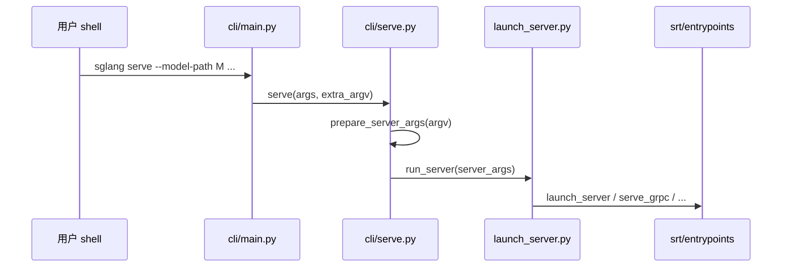

# 阅读方法论：数据流与交互

> 对齐 understand-explain：**外部连接 + 数据流**

---

## 1. 架构位置

本模块覆盖知识图谱中的 **文档层 → 入口层 → 公共 API 层**，尚未进入 `srt` 内部进程模型（从 TokenizerManager 起）。



---

## 2. 输入 / 输出

| 阶段 | 输入 | 输出 | 定义位置 |
|------|------|------|----------|
| CLI 解析 | `sys.argv` | `args.subcommand`, `extra_argv` | `cli/main.py` |
| 模型类型 | `extra_argv` 中的 `--model-type` | `model_type`, `filtered_argv` | `cli/serve.py` |
| 参数对象 | `filtered_argv` | `ServerArgs` 实例 | `srt/server_args.py`（[[02-启动链路-01-核心概念|启动链路 详述]]） |
| 服务进程 | `ServerArgs` | 监听 HTTP/gRPC 端口 | `srt/entrypoints/*`（HTTP Server–gRPC/Proto） |

**Explain：** `ServerArgs` 是全局配置单例的 dataclass——CLI 每个 flag 对应一个字段，`prepare_server_args` 解析 argv 后 `__post_init__` 做交叉校验。本模块只需知道「argv 在此变成对象」；字段含义见 启动链路。

**Code：**

```python
# 来源：python/sglang/srt/server_args.py L375-L398（节选）
class ServerArgs:
    """Server-wide configuration for SGLang.

    Adding new arguments
    --------------------
    1. **Place the field in the right section.** Arguments are grouped by
       comment blocks (``# Model and tokenizer``, ``# LoRA``, etc.).
       Add new fields to the matching section, or create a new section
       with a ``# ---`` banner when none fits.

    2. **Use the ``A[T, ...]`` annotation.**  ``A`` is an alias for
       ``typing.Annotated``.  The primary CLI flag is auto-derived from the
       field name (``tp_size`` → ``--tp-size``).  Use ``aliases`` for
       longer alternate names
       (``aliases=["--tensor-parallel-size"]``)::

           # Bare string — simplest form (just help text):
           host: A[str, "The host of the HTTP server."] = "127.0.0.1"
           trust_remote_code: A[bool, "Whether to allow custom models."] = False

           # Arg(...) — when you need choices, aliases, type_parser, etc.:
           load_format: A[str, Arg(help="...", choices=CHOICES)] = "auto"
           model_path: A[str, Arg(help="...", aliases=["--model"])]

```

**Code：**

```python
# 来源：python/sglang/cli/serve.py L124-L128
            from sglang.srt.server_args import prepare_server_args

            server_args = prepare_server_args(dispatch_argv)

            run_server(server_args)
```

**Comment：** `dispatch_argv` 是剥掉 `--model-type` 后的 argv，与 `python -m sglang.launch_server` 的 `sys.argv[1:]` 等价。

---

## 3. 上下游连接（知识图谱 edges）

| 上游 | 下游 | 关系 | 代码体现 |
|------|------|------|----------|
| `pyproject.toml` | `cli/main.py` | configures | `[project.scripts]` 注册 |
| `cli/main.py` | `cli/serve.py` | calls | `serve(args, extra_argv)` |
| `cli/serve.py` | `launch_server.py` | calls | `run_server(server_args)` |
| `launch_server.py` | `srt/*` | depends_on | 延迟 import 各 entrypoint |
| `__init__.py` | `lang/*` | imports | Frontend API |
| `__init__.py` | `srt/*` | LazyImport | Engine, ServerArgs |

---

## 4. 典型数据流：从命令到 HTTP 服务（默认路径）

### 步骤 1 — 用户命令

```bash
sglang serve --model-path meta-llama/Llama-3.1-8B-Instruct --port 30000
```

### 步骤 2 — CLI 分发（内嵌源码）

**Code：**

```python
# 来源：python/sglang/cli/main.py L37-L40
    if args.subcommand == "serve":
        from sglang.cli.serve import serve

        serve(args, extra_argv)
```

**Comment：** `extra_argv` ≈ `['--model-path', 'meta-llama/...', '--port', '30000']`。

### 步骤 3 — 判定 LLM 并解析参数

**Code：**

```python
# 来源：python/sglang/cli/serve.py L96-L101, L121-L128
        if model_type == "auto":
            is_diffusion_model = get_is_diffusion_model(model_path)
            if is_diffusion_model:
                logger.info("Diffusion model detected")
        else:
            is_diffusion_model = model_type == "diffusion"
```

**Comment：** `get_is_diffusion_model` 读模型 config 判断架构类型。

### 步骤 4 — 选择 HTTP 入口

**Code：**

```python
# 来源：python/sglang/launch_server.py L47-L51
    else:
        # Default mode: HTTP mode.
        from sglang.srt.entrypoints.http_server import launch_server

        launch_server(server_args)
```

**Comment：** 此后进入 FastAPI/uvicorn 与 TokenizerManager 进程树（[[03-HTTP-Server-00-MOC|HTTP Server HTTP Server]]、[[06-TokenizerManager-00-MOC|TokenizerManager TokenizerManager]]）。本模块数据流在 **HTTP 监听启动前** 结束；请求进入 GPU 的路径见 [[全链路请求追踪]]。

### 步骤 5 — 进程清理（退出时）

**Code：**

```python
# 来源：python/sglang/cli/serve.py L129-L130
    finally:
        kill_process_tree(os.getpid(), include_parent=False)
```

**Comment：** SGLang 使用多进程架构；主进程退出时必须回收 scheduler/worker 子进程。

---

## 5. Frontend 与 Runtime 两条使用路径

| 路径 | 用户操作 | 代码入口 | 数据去向 |
|------|----------|----------|----------|
| **服务模式** | `sglang serve` | CLI → launch_server → srt | HTTP 请求 → Scheduler |
| **编程 Frontend** | `import sglang as sgl` | `__init__.py` → lang.api | 经 RuntimeEndpoint 发 HTTP 到已启动服务 |
| **编程 Runtime** | `Engine(...)` LazyImport | srt.entrypoints.engine | 进程内嵌引擎，无独立 HTTP |

**Code（Frontend 连接远程服务）：**

```python
# 来源：python/sglang/__init__.py L60, L104
from sglang.lang.backend.runtime_endpoint import RuntimeEndpoint
```

**Comment：** Frontend 不嵌入 torch 推理，而是把 `gen()` 等调用翻译成对 Runtime HTTP API 的请求。

---

## 6. 与 monorepo 其他组件的边界

| 组件 | 与本模块入口的关系 |
|------|------------------|
| `sgl-kernel` | 被 `srt/layers` 在 import 时加载，不在 launch 路径同步初始化 |
| `sgl-model-gateway` | 可选；`grpc_mode` 或 SMG 部署时使用 |
| `multimodal_gen` | `cli/serve` 检测 diffusion 时切换，与 LLM 路径互斥 |
| `proto/` | gRPC 消息定义，gRPC/Proto |

---

## 7. 本模块数据流一句话

> **`sglang serve` 把 shell argv 变成 `ServerArgs`，再经 `run_server` 四选一进入 srt 的 HTTP/gRPC/Ray/Encoder 入口；默认 HTTP。**
