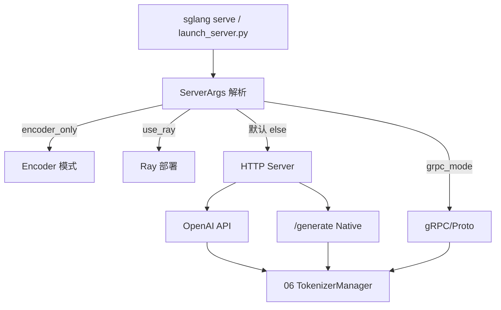

# 阶段 I · 启动与入口（启动链路–gRPC/Proto）

> **你只需阅读本目录，不必打开 `sglang/` 源码。** 
> 内嵌代码对应 sglang Git commit `70df09b`。

---

## 本阶段解决什么问题

用户执行 `sglang serve` 或调用 `Engine()` 之后，**进程如何拉起、HTTP/gRPC 请求从哪条路由进入 TokenizerManager？** 四个模块从 CLI 到 API 兼容层完整覆盖。

| 模块 | 模块 | 一句话 |
|------|------|--------|
| [[02-启动链路-00-MOC|启动链路]] | CLI + ServerArgs | `run_server` 四条分支、子进程拓扑 |
| [[03-HTTP-Server-00-MOC|HTTP Server]] | FastAPI 入口 | `/generate`、lifespan、`_global_state` |
| [[04-OpenAI-API-00-MOC|OpenAI API]] | 兼容层 | `/v1/chat/completions`、模板与格式转换 |
| [[05-gRPC-Proto-00-MOC|gRPC/Proto]] | gRPC 模式 | Rust servicer、Proto、与 HTTP 互斥/并存 |

---

## 端到端启动与路由

**Explain：** 绝大多数部署走 HTTP 默认分支；OpenAI 兼容路由与 Native `/generate` **共用**底层 `tokenizer_manager.generate_request`，Scheduler 无感知差异。

---

## 阶段 I 验收

能口述：**用户执行 `sglang serve` → HTTP 收到第一个 token** 的完整路径：

1. `launch_server.py` / CLI 解析 `ServerArgs`
2. `_launch_subprocesses` 拉起 Scheduler、Detokenizer 等子进程
3. FastAPI `lifespan` 初始化 TokenizerManager
4. POST `/v1/chat/completions` → Serving 层 → `generate_request`
5. 流式 SSE 首 chunk 返回（详见 [[全链路请求追踪|全链路请求追踪]]）

---

## 推荐阅读顺序

| 顺序 | 模块 | 必读文件 |
|------|------|----------|
| 1 | 启动链路 | [[02-启动链路-02-源码走读|02-源码走读]] |
| 2 | HTTP Server | [[03-HTTP-Server-01-核心概念|01-核心概念]] + [[03-HTTP-Server-02-源码走读|02-源码走读]] |
| 3 | OpenAI API | 若需 OpenAI SDK 兼容 |
| 4 | gRPC/Proto | 若需 gRPC 内网低延迟 |

零基础读者可先读 [[00-零基础先修|00-零基础先修]]，再读本阶段 02→03。

---

## 模块导航

| 模块 | 目录 | 状态 |
|------|------|------|
| 启动链路 | [[02-启动链路-00-MOC|启动链路]] | ✅ |
| HTTP Server | [[03-HTTP-Server-00-MOC|HTTP Server]] | ✅ |
| OpenAI API | [[04-OpenAI-API-00-MOC|OpenAI API]] | ✅ |
| gRPC/Proto | [[05-gRPC-Proto-00-MOC|gRPC Proto]] | ✅ |

← [[00-方法论-00-MOC|00-方法论]] · → [[02-请求调度-00-MOC|阶段 II：请求调度]]
