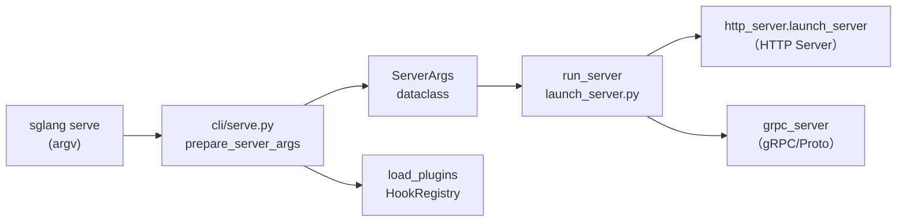

# 启动链路与 CLI

> **阶段 I · 启动与入口** | 状态：已完成 | Git：`70df09b83363e0127b43c83a6007d3938f815b2d` 
> **源码范围：** `launch_server.py`、`cli/`、`srt/server_args.py`、`srt/plugins/`

---

## 本模块在架构中的位置

启动链路是 SGLang 的 **「用户命令 → 运行中服务」** 第一跳。用户执行 `sglang serve --model-path M` 时，`cli/main.py` 路由到 `cli/serve.py`，经 `prepare_server_args` 把数百 CLI 参数收敛为 `ServerArgs` dataclass，再调用 `launch_server.py` 的 `run_server` 按 flags 四路分发：encoder_only → gRPC/HTTP encoder、grpc_mode → gRPC LLM、use_ray → Ray、**默认 HTTP**。`load_plugins()` 在引擎启动前加载 HookRegistry，确保扩展在 Scheduler/ModelRunner 初始化前生效。



---

## 零基础一句话

**像「餐厅开门营业 checklist」**：从挂招牌（CLI 解析）到通水通电（加载插件）再到选择堂食/外卖通道（HTTP/gRPC/Ray），最后才迎接第一位客人。

---

## 用户场景

**Persona：** DevOps 工程师小魏编写 systemd 单元文件启动 SGLang，需要理解 `sglang serve` 与旧 `python -m sglang.launch_server` 的关系、`ServerArgs` 中 `--tp-size`/`--mem-fraction-static` 等关键参数的解析位置，以及 `--grpc-mode` 与默认 HTTP 的分支差异。她还需知道插件目录如何通过环境变量注入。

---

## 五件套阅读顺序

| 顺序 | 文件 | 一句话说明 |
|------|------|------------|
| 01 | [[02-启动链路-01-核心概念]] | CLI 子命令、ServerArgs、启动模式、插件框架 |
| 启动链路 | [[02-启动链路-02-源码走读]] | **主文档**：argv → ServerArgs → run_server 按调用顺序精读 |
| HTTP Server | [[02-启动链路-03-数据流与交互]] | argv → ServerArgs → 四路分发的数据流 |
| OpenAI API | [[02-启动链路-04-关键问题]] | FAQ、易错点、与旧入口对比 |
| ✓ | [[02-启动链路-05-checkpoint]] | 验收：能否口述 serve 命令到 HTTP launch 的路径 |

---

## 核心源码锚点

**Explain：** 启动链路 的核心是「CLI 参数 → `ServerArgs` → `run_server` 四路分发」。下面这段 `run_server` 是整个 LLM 启动链路的**最后一跳**——它根据 flags 延迟 import 对应入口，默认走 HTTP。

**Code：**

```python
# 来源：python/sglang/launch_server.py L15-L51
def run_server(server_args):
    """Run the server based on server_args.grpc_mode and server_args.encoder_only."""
    if server_args.encoder_only:
        # For encoder disaggregation
        if server_args.grpc_mode:
            from sglang.srt.disaggregation.encode_grpc_server import (
                serve_grpc_encoder,
            )

            asyncio.run(serve_grpc_encoder(server_args))
        else:
            from sglang.srt.disaggregation.encode_server import launch_server

            launch_server(server_args)
    elif server_args.grpc_mode:
        # TODO: Once the native Rust gRPC server starts alongside HTTP in the
        # default path below (controlled by SGLANG_ENABLE_GRPC / SGLANG_GRPC_PORT),
        # remove this legacy SMG path and the grpc_mode flag.
        from sglang.srt.entrypoints.grpc_server import serve_grpc

        asyncio.run(serve_grpc(server_args))
    elif server_args.use_ray:
        # Ray mode: HTTP mode with Ray backend.
        try:
            from sglang.srt.ray.http_server import launch_server
        except ImportError:
            raise ImportError(
                "Ray is required for --use-ray mode. "
                "Install it with: pip install 'sglang[ray]'"
            )

        launch_server(server_args)
    else:
        # Default mode: HTTP mode.
        from sglang.srt.entrypoints.http_server import launch_server

        launch_server(server_args)
```

**Comment：**

- 判断顺序：`encoder_only` → `grpc_mode` → `use_ray` → **默认 HTTP**。
- 所有分支都使用**延迟 import**，避免未使用的依赖（FastAPI、gRPC、Ray）拖慢启动。
- HTTP 分支的 `launch_server` 来自 `srt.entrypoints.http_server`——**HTTP Server** 展开进程树与 FastAPI 挂载。
- `cli/serve.py` 在调用 `run_server` 前会先 `load_plugins()`，确保 Hook 在引擎启动前生效。

---

## 验证建议

1. **CLI：** `sglang serve --model-path meta-llama/Llama-3.1-8B-Instruct --log-level debug`，日志应出现 `ServerArgs` 解析与 `run_server` HTTP 分支 import。
2. **日志：** 搜索 `launch_server` / `load_plugins` / `HookRegistry`；gRPC 模式可见 `serve_grpc` 相关 import trace。

---

## 阅读路径

← [[00-方法论-00-MOC|项目总览与阅读方法论]] 
→ [[03-HTTP-Server-00-MOC|HTTP Server 入口]]
