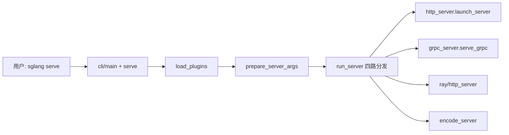

# 启动链路与 CLI · 核心概念

> 本节说明本模块在全局架构中的位置与设计动机。

---

## 用户故事：DevOps 配错 `--model-path` 启动失败

### Persona

**老王**，平台 DevOps，第一次在 K8s 里部署 SGLang。Helm values 里 `--model-path` 写成了容器内不存在的挂载路径，Pod CrashLoopBackOff。

### 时间线

| 时刻 | 事件 |
|------|------|
| T0 | `sglang serve --model-path /models/wrong-name` 启动，进程在权重加载阶段退出 |
| T1 | 查日志发现 HuggingFace / 本地路径解析失败，回溯到 `prepare_server_args` |
| T2 | 确认 `ServerArgs.model_path` 与 volume mount 一致，改用正确 repo ID 或本地目录 |
| T3 | 服务正常 listen `:30000`，进入 HTTP Server HTTP 路由验证 |

**Explain：** 启动链路本模块范围是 **argv → ServerArgs → run_server 四路分发**，不做推理。`--model-path` 在 `ServerArgs` dataclass 中定义，经 `prepare_server_args(sys.argv[1:])` 解析；`cli/serve.py` 还会在解析前用 `get_model_path` 判断 LLM vs diffusion 分流。路径错误通常在 **权重加载前** 就暴露，而非 HTTP 层。

**Code：**

```python
## 来源：python/sglang/srt/server_args.py L393-L401
           trust_remote_code: A[bool, "Whether to allow custom models."] = False

           # Arg(...) — when you need choices, aliases, type_parser, etc.:
           load_format: A[str, Arg(help="...", choices=CHOICES)] = "auto"
           model_path: A[str, Arg(help="...", aliases=["--model"])]

       See ``Arg`` in ``arg_groups/arg_utils.py`` for the full list of
       supported metadata (``choices``, ``aliases``, ``type_parser``,
       ``nargs``, ``const``, ``action``, ``no_cli``, …).
```

**Comment：** 别名 `--model` 与 `--model-path` 等价；diffusion 模型走 `multimodal_gen` 独立参数集，不会进入此字段。

### 如果…会怎样（调试）

| 现象 | 可能原因 | 排查 |
|------|----------|------|
| 启动即 OOM / 找不到文件 | 路径拼写或 PVC 未挂载 | `kubectl exec` 内 `ls` 对照 `model_path` |
| 误走 diffusion 路径 | 自动检测把 LLM 判成 diffusion | 加 `--model-type llm` 强制 LLM |
| 参数未被识别 | 写在 `sglang serve` 前而非 `extra_argv` | 确认 `cli/main.py` 的 `parse_known_args` 顺序 |

---

## 1. 本模块在全局架构中的位置

SGLang 的启动链路位于 **用户态入口层** 与 **Runtime 入口层** 之间：



**角色总结：** 本模块模块不做推理，只做三件事——**解析配置**、**加载扩展**、**选择 Runtime 入口**。

---

## 2. 术语表

| 术语 | 含义 | 源码位置 |
|------|------|----------|
| `ServerArgs` | 服务端全局配置的 dataclass，CLI 与 YAML `--config` 的统一载体 | `srt/server_args.py` |
| `prepare_server_args` | 把 `sys.argv[1:]` 解析为 `ServerArgs` 的工厂函数 | 同文件 L7561 |
| `run_server` | 根据 `encoder_only` / `grpc_mode` / `use_ray` 分发启动路径 | `launch_server.py` |
| `load_plugins` | 通过 setuptools entry_points 发现并执行插件，再 `apply_hooks` | `srt/plugins/__init__.py` |
| `HookRegistry` | 插件 Hook 的全局注册表，支持 BEFORE/AFTER/AROUND/REPLACE | `srt/plugins/hook_registry.py` |
| `extra_argv` | `parse_known_args` 留给子命令的剩余参数（含 `--model-path` 等） | `cli/main.py` |

---

## 3. CLI 三层结构

**Explain：** SGLang CLI 采用「薄路由 + 厚子命令 + 统一配置」三层设计。`main.py` 只负责子命令分发；`serve.py` 负责 LLM/diffusion 分流；真正的参数面在 `ServerArgs`。

**Code：**

```python
## 来源：python/sglang/cli/main.py L12-L40
# 提交版本：70df09b
def main():
    parser = argparse.ArgumentParser()

    # complex sub commands
    subparsers = parser.add_subparsers(dest="subcommand", required=True)
    subparsers.add_parser(
        "serve",
        help="Launch an SGLang server.",
        add_help=False,
    )
    subparsers.add_parser(
        "generate",
        help="Run inference on a multimodal model.",
        add_help=False,
    )

    # simple commands
    version_parser = subparsers.add_parser(
        "version",
        help="Show the version information.",
    )
    version_parser.set_defaults(func=version)

    args, extra_argv = parser.parse_known_args()

    if args.subcommand == "serve":
        from sglang.cli.serve import serve

        serve(args, extra_argv)
```

**Comment：**

- `add_help=False`：`serve` 的完整 help 依赖 `--model-path` 才能确定是 LLM 还是 diffusion 参数集。
- `parse_known_args`：主 parser 不消费 `--model-path` 等参数，全部交给 `extra_argv`。
- `serve` / `generate` 使用延迟 import，加快 `sglang version` 等轻量命令。

---

## 4. ServerArgs：Annotated 驱动的 CLI 生成

**Explain：** `ServerArgs` 是一个超大 dataclass（数百字段），但新增 CLI 参数的标准流程很简单：在对应 section 加 Annotated 字段，CLI flag 自动从字段名推导（`tp_size` → `--tp-size`）。

**Code：**

```python
## 来源：python/sglang/srt/server_args.py L374-L444（节选）
# 提交版本：70df09b
@dataclasses.dataclass
class ServerArgs:
    """Server-wide configuration for SGLang.

    Adding new arguments
    --------------------
    1. **Place the field in the right section.** Arguments are grouped by
       comment blocks (``# Model and tokenizer``, ``# LoRA``, etc.).
       Add new fields to the matching section, or create a new section
       with a ``# ---`` banner when none fits.

    2. **Use the ``A[T, ...]`` annotation.**  ``A`` is an alias for
       ``typing.Annotated``.  The primary CLI flag is auto-derived from the
       field name (``tp_size`` → ``--tp-size``).  Use ``aliases`` for
       longer alternate names
       (``aliases=["--tensor-parallel-size"]``)::

           # Bare string — simplest form (just help text):
           host: A[str, "The host of the HTTP server."] = "127.0.0.1"
           trust_remote_code: A[bool, "Whether to allow custom models."] = False

           # Arg(...) — when you need choices, aliases, type_parser, etc.:
           load_format: A[str, Arg(help="...", choices=CHOICES)] = "auto"
           model_path: A[str, Arg(help="...", aliases=["--model"])]

       See ``Arg`` in ``arg_groups/arg_utils.py`` for the full list of
       supported metadata (``choices``, ``aliases``, ``type_parser``,
       ``nargs``, ``const``, ``action``, ``no_cli``, …).

    3. **Manual entries in ``add_cli_args`` — only for special cases.**
       A few arguments cannot use the annotation style and must be
       registered manually in ``add_cli_args``:

       - **Deprecated flags** that redirect to another field via
         ``DeprecatedAction`` / ``DeprecatedAliasStoreAction`` / etc.
       - **Dynamic choices** computed at runtime (e.g. ``reasoning_parser``
         whose choices come from a plugin registry).
       - The ``--config`` meta-argument (not a dataclass field).

       Everything else should use the ``A[T, ...]`` annotation.
    """

    # -------------------------------------------------------------------------
    # Model and tokenizer
    # -------------------------------------------------------------------------
    model_path: A[
        str,
        Arg(
            help="The path of the model weights. This can be a local folder or a Hugging Face repo ID.",
            aliases=["--model"],
        ),
    ]
    tokenizer_path: A[Optional[str], "The path of the tokenizer."] = None
    tokenizer_mode: A[
        str,
        Arg(
            help="Tokenizer mode. 'auto' will use the fast tokenizer if available, "
            "and 'slow' will always use the slow tokenizer.",
            choices=["auto", "slow"],
        ),
    ] = "auto"
    tokenizer_backend: A[
        str,
        Arg(
            help="Tokenizer backend. 'huggingface' uses the default HuggingFace "
            "tokenizers library, and 'fastokens' uses the fastokens library "
            "for faster tokenization. Requires the fastokens package to be installed.",
            choices=["huggingface", "fastokens"],
        ),
    ] = "huggingface"
    tokenizer_worker_num: A[int, "The worker num of the tokenizer manager."] = 1
```

**中文释义：** `ServerArgs` 新增参数时优先放到正确分组，用 `A[T, ...]` 自动生成 CLI flag；只有废弃参数、动态 choices、`--config` 等特殊情况才手写 `add_cli_args`。下面展示的 `model_path`、`tokenizer_path`、`tokenizer_mode`、`tokenizer_backend` 是模型与 tokenizer 分组的代表字段。

**Comment：**

- `A` 是 `typing.Annotated` 的别名，定义在 `srt/arg_groups/arg_utils.py`。
- `Arg(...)` 可指定 `aliases`、`choices`、`type_parser` 等；纯字符串 annotation 则只有 help 文本。
- 少数特殊参数（deprecated flags、动态 choices、`--config`）仍需在 `add_cli_args` 中手动注册。

---

## 5. 启动模式四选一

**Explain：** `run_server` 的分支由三个 bool 字段控制。理解它们的组合是读懂 PD 分离、多协议部署的关键。

**Code：**

```python
## 来源：python/sglang/srt/server_args.py L527-L542, L840, L2381-L2384（节选）
# 提交版本：70df09b
    # -------------------------------------------------------------------------
    # HTTP server
    # -------------------------------------------------------------------------
    host: A[str, "The host of the HTTP server."] = "127.0.0.1"
    port: A[int, "The port of the HTTP server."] = 30000
    fastapi_root_path: A[str, "App is behind a path based routing proxy."] = ""
    grpc_mode: A[bool, "If set, use gRPC server instead of HTTP server."] = False
    skip_server_warmup: A[bool, "If set, skip warmup."] = False
    warmups: A[
        Optional[str],
        "Specify custom warmup functions (csv) to run before server starts eg. --warmups=warmup_name1,warmup_name2 will run the functions `warmup_name1` and `warmup_name2` specified in warmup.py before the server starts listening for requests",
    ] = None
    enable_http2: A[
        bool,
        "Use Granian instead of Uvicorn as the ASGI server, enabling HTTP/1.1 and HTTP/2 auto-negotiation. Clients may use h2c (cleartext HTTP/2) or plain HTTP/1.1. Requires 'pip install sglang[http2]'.",
    ] = False
```

**Comment：**

| 模式 | 触发条件 | 入口 |
|------|----------|------|
| HTTP（默认） | 三者皆 false | `entrypoints.http_server.launch_server` |
| gRPC | `grpc_mode=True` | `entrypoints.grpc_server.serve_grpc` |
| Ray | `use_ray=True` | `ray.http_server.launch_server` |
| Encoder | `encoder_only=True` | `disaggregation.encode_server` 或 gRPC 变体 |

- `encoder_only` 与 `grpc_mode` 可组合：Encoder + gRPC 走 `serve_grpc_encoder`。
- 默认 `host=127.0.0.1`、`port=30000`；生产环境通常 `--host 0.0.0.0`。

---

## 6. 插件框架：启动前注入 Hook

**Explain：** SGLang 通过 setuptools entry_points 支持两类插件：硬件平台（`sglang.srt.platforms`）和通用 Hook（`sglang.srt.plugins`）。`load_plugins()` 在 `run_server` 之前调用，确保 monkey-patch 在引擎 import 前完成。

**Code：**

```python
## 来源：python/sglang/srt/plugins/__init__.py L103-L141
# 提交版本：70df09b
def load_plugins():
    """
    Load and execute all general plugins, then apply registered hooks.

    Idempotent - safe to call multiple times. General plugins are functions
    whose side effects (registering hooks, replacing classes, etc.) are the
    desired behavior. Return values are ignored.

    When ``SGLANG_PLATFORM`` is set, general plugins from unselected platform
    packages are automatically skipped (avoids pulling their dependencies).

    After all plugins execute, ``HookRegistry.apply_hooks()`` is called
    automatically so callers only need this single function call.

    This should be called early in every process (main, engine core, workers).
    """
    global _plugins_loaded
    if _plugins_loaded:
        return
    _plugins_loaded = True

    plugins = load_plugins_by_group(
        GENERAL_PLUGINS_GROUP,
        excluded_dists=_get_excluded_dists(),
    )

    for name, (func, dist_name) in plugins.items():
        source = HookSource(plugin_name=name, dist_name=dist_name)
        token = _current_plugin_source.set(source)
        try:
            func()
            logger.info("Executed general plugin: %s", name)
        except Exception:
            logger.exception("Failed to execute general plugin: %s", name)
        finally:
            _current_plugin_source.reset(token)

    # Apply all registered hooks (idempotent — already-patched targets are skipped).
    HookRegistry.apply_hooks()
```

**中文释义：** `load_plugins()` 会加载通用插件并应用 hook；它是幂等的，重复调用安全。设置 `SGLANG_PLATFORM` 时会跳过未选平台的插件包，避免加载无关硬件依赖；该函数应在主进程、engine core、worker 等早期执行。

**Comment：**

- **幂等**：`_plugins_loaded` 保证同进程多次调用安全。
- **白名单**：环境变量 `SGLANG_PLUGINS` 可限制加载哪些插件。
- **平台隔离**：`SGLANG_PLATFORM` 选中某平台后，会跳过其他平台包的插件，避免拉入硬件依赖。
- Hook 类型见 `HookType`：BEFORE / AFTER / AROUND / REPLACE——详见 [[02-启动链路-02-源码走读|02-源码走读 §7]]。

---

## 7. LLM vs Diffusion 分发

**Explain：** `cli/serve.py` 在解析 `ServerArgs` 之前，先判断模型是 LLM 还是 diffusion。自动检测失败时**回退到 LLM 路径**（fail-open 设计）。

**Code：**

```python
## 来源：python/sglang/cli/serve.py L93-L128（节选）
# 提交版本：70df09b
    model_type, dispatch_argv = _extract_model_type_override(extra_argv)
    model_path = get_model_path(dispatch_argv)
    try:
        if model_type == "auto":
            is_diffusion_model = get_is_diffusion_model(model_path)
            if is_diffusion_model:
                logger.info("Diffusion model detected")
        else:
            is_diffusion_model = model_type == "diffusion"
            logger.info(
                "Dispatch override enabled: --model-type=%s " "(skip auto detection)",
                model_type,
            )

        if is_diffusion_model:
            # Logic for Diffusion Models
            from sglang.multimodal_gen.runtime.entrypoints.cli.serve import (
                add_multimodal_gen_serve_args,
                execute_serve_cmd,
            )

            parser = argparse.ArgumentParser(
                description="SGLang Diffusion Model Serving"
            )
            add_multimodal_gen_serve_args(parser)
            parsed_args, remaining_argv = parser.parse_known_args(dispatch_argv)

            execute_serve_cmd(parsed_args, remaining_argv)
        else:
            # Logic for Standard Language Models
            from sglang.launch_server import run_server
            from sglang.srt.server_args import prepare_server_args

            server_args = prepare_server_args(dispatch_argv)

            run_server(server_args)
```

**Comment：**

- `--model-type {auto,llm,diffusion}` 可强制覆盖自动检测。
- diffusion 路径使用独立的 `multimodal_gen` CLI 参数集，不走 `ServerArgs`。
- 本模块聚焦 LLM 路径；diffusion 详见 **multimodal_gen**。
