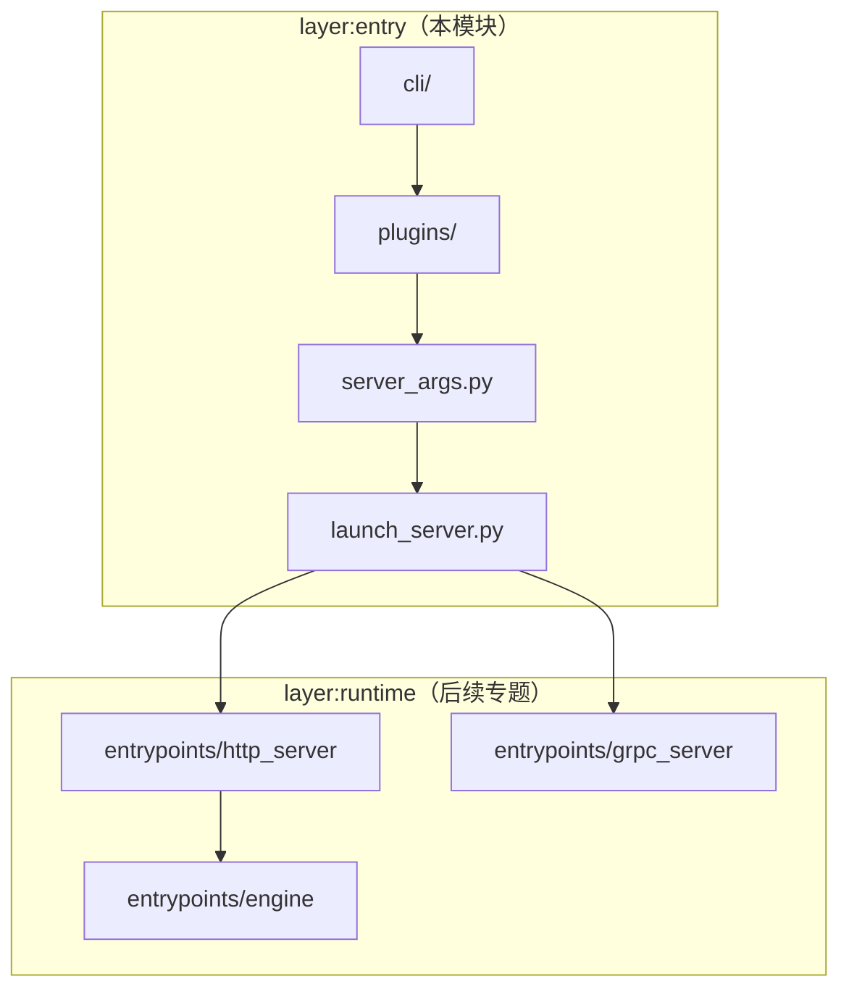
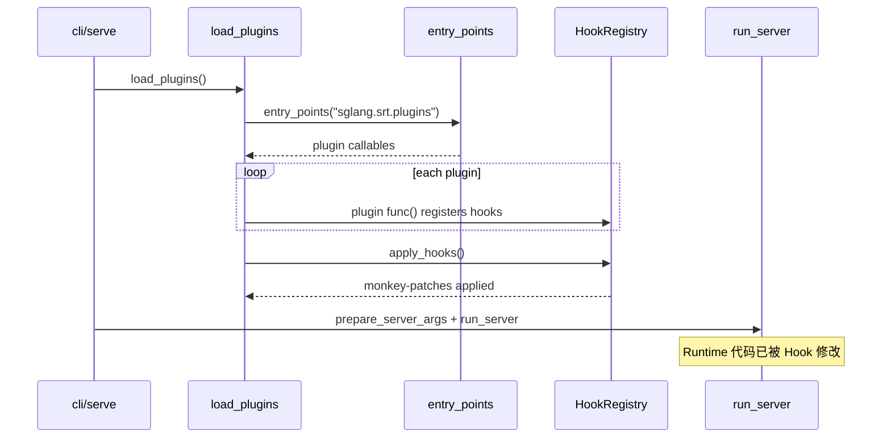

# 启动链路：数据流与交互

> 上下游模块边界与数据流。

---

## 1. 架构位置（知识图谱 layer:entry）

本模块模块处于 SGLang 启动链路的**最外层**，连接用户 shell 与 Runtime 入口：



**图谱边（batch-01-initial）：**

| 源 | 目标 | 关系 |
|----|------|------|
| `config:pyproject.toml` | `cli/main.py` | configures（注册 `sglang` 脚本） |
| `cli/main.py` | `cli/serve.py` | calls |
| `cli/serve.py` | `launch_server.py` | calls |
| `launch_server.py` | `module:srt` | depends_on |

---

## 2. 输入 / 输出

| 方向 | 类型 | 说明 | 产生位置 |
|------|------|------|----------|
| 输入 | `List[str]` argv | shell 传入的 CLI 参数（含 `--model-path` 等） | 用户 / `sys.argv[1:]` |
| 中间 | `argparse.Namespace` | `parser.parse_args` 的原始解析结果 | `prepare_server_args` |
| 中间 | `ServerArgs` | 校验后的服务端配置 dataclass | `from_cli_args` + `__post_init__` |
| 输出 | 阻塞调用 | 启动 HTTP/gRPC/Ray/Encoder 服务（长期运行） | `run_server` → 各 `launch_server` |

**Explain：** 数据流的核心变换是 `argv: List[str]` → `ServerArgs` dataclass。中间没有序列化/网络传输，全在同一进程内完成。

**Code：**

```python
# 来源：python/sglang/srt/server_args.py L6862-L6881（节选）
# 提交版本：70df09b
    def from_cli_args(cls, args: argparse.Namespace):
        # Some dataclass fields (e.g. stat_loggers) intentionally have no CLI
        # surface and won't appear on the argparse Namespace. Skip them so the
        # dataclass default applies.
        attrs = [
            attr.name for attr in dataclasses.fields(cls) if hasattr(args, attr.name)
        ]
        return cls(**{attr: getattr(args, attr) for attr in attrs})

    def url(self, port: Optional[int] = None):
        scheme = "https" if self.ssl_certfile else "http"
        # When binding to all interfaces, use loopback for internal requests.
        host = self.host
        if not host or host == "0.0.0.0":
            host = "127.0.0.1"
        elif host == "::":
            host = "::1"
        return NetworkAddress(host, port if port is not None else self.port).to_url(
            scheme
        )
```

**Comment：**

- `url()` 方法供内部 health check 使用；绑定 `0.0.0.0` 时回环到 `127.0.0.1`。
- `ServerArgs` 构造后立即可用，但 `get_model_config()` 等方法会 lazy init 更多对象。

---

## 3. 上下游连接

| 上游/下游 | 模块 | 交互方式 | 说明 |
|-----------|------|----------|------|
| 上游 | 用户 shell | 进程启动 | `sglang serve --model-path ...` |
| 上游 | pip/setuptools | entry_points | 插件发现（`sglang.srt.plugins` group） |
| 下游 | `http_server.launch_server` | Python 函数调用 | 默认 HTTP 路径 |
| 下游 | `grpc_server.serve_grpc` | `asyncio.run` | gRPC 路径 |
| 下游 | `ray.http_server.launch_server` | Python 函数调用 | Ray 分布式路径 |
| 下游 | `encode_server.launch_server` | Python 函数调用 | PD 分离 Encoder 路径 |
| 下游 | `multimodal_gen` CLI | Python 函数调用 | diffusion 路径（绕过 ServerArgs） |

**Explain：** `run_server` 是唯一的分发点，下游模块之间**互斥**，不会同时启动多个协议栈。

**Code：**

```python
# 来源：python/sglang/launch_server.py L15-L51
# 提交版本：70df09b
def run_server(server_args):
    """Run the server based on server_args.grpc_mode and server_args.encoder_only."""
    if server_args.encoder_only:
        # For encoder disaggregation
        if server_args.grpc_mode:
            from sglang.srt.disaggregation.encode_grpc_server import (
                serve_grpc_encoder,
            )

            asyncio.run(serve_grpc_encoder(server_args))
        else:
            from sglang.srt.disaggregation.encode_server import launch_server

            launch_server(server_args)
    elif server_args.grpc_mode:
        # TODO: Once the native Rust gRPC server starts alongside HTTP in the
        # default path below (controlled by SGLANG_ENABLE_GRPC / SGLANG_GRPC_PORT),
        # remove this legacy SMG path and the grpc_mode flag.
        from sglang.srt.entrypoints.grpc_server import serve_grpc

        asyncio.run(serve_grpc(server_args))
    elif server_args.use_ray:
        # Ray mode: HTTP mode with Ray backend.
        try:
            from sglang.srt.ray.http_server import launch_server
        except ImportError:
            raise ImportError(
                "Ray is required for --use-ray mode. "
                "Install it with: pip install 'sglang[ray]'"
            )

        launch_server(server_args)
    else:
        # Default mode: HTTP mode.
        from sglang.srt.entrypoints.http_server import launch_server

        launch_server(server_args)
```

**Comment：**

- 每个分支的 import 路径不同，但都接收同一个 `ServerArgs` 对象。
- gRPC 路径使用 `asyncio.run`，HTTP/Ray/Encoder 为同步调用。
- 注释提到未来 Rust gRPC 将与 HTTP 并存（`SGLANG_ENABLE_GRPC`），届时 `grpc_mode` flag 可能废弃。

---

## 4. 典型数据流：从 shell 到 HTTP 服务

### 步骤 1：shell → CLI 路由

用户执行：

```bash
sglang serve --model-path meta-llama/Llama-3.1-8B-Instruct --tp-size 2 --port 8080
```

**Code：**

```python
# 来源：python/sglang/cli/main.py L35-L40
# 提交版本：70df09b
    args, extra_argv = parser.parse_known_args()

    if args.subcommand == "serve":
        from sglang.cli.serve import serve

        serve(args, extra_argv)
```

**Comment：** `extra_argv` = `['--model-path', 'meta-llama/...', '--tp-size', '2', '--port', '8080']`。

### 步骤 2：插件加载 + 模型类型判断

**Code：**

```python
# 来源：python/sglang/cli/serve.py L89-L128（节选）
# 提交版本：70df09b
    from sglang.srt.plugins import load_plugins

    load_plugins()

    model_type, dispatch_argv = _extract_model_type_override(extra_argv)
    model_path = get_model_path(dispatch_argv)
    try:
        if model_type == "auto":
            is_diffusion_model = get_is_diffusion_model(model_path)
            if is_diffusion_model:
                logger.info("Diffusion model detected")
        else:
            is_diffusion_model = model_type == "diffusion"
            logger.info(
                "Dispatch override enabled: --model-type=%s " "(skip auto detection)",
                model_type,
            )

        if is_diffusion_model:
            # Logic for Diffusion Models
            from sglang.multimodal_gen.runtime.entrypoints.cli.serve import (
                add_multimodal_gen_serve_args,
                execute_serve_cmd,
            )

            parser = argparse.ArgumentParser(
                description="SGLang Diffusion Model Serving"
            )
            add_multimodal_gen_serve_args(parser)
            parsed_args, remaining_argv = parser.parse_known_args(dispatch_argv)

            execute_serve_cmd(parsed_args, remaining_argv)
        else:
            # Logic for Standard Language Models
            from sglang.launch_server import run_server
            from sglang.srt.server_args import prepare_server_args

            server_args = prepare_server_args(dispatch_argv)

            run_server(server_args)
```

**Comment：**

- `dispatch_argv` 与 `extra_argv` 相同（无 `--model-type` 时）。
- `load_plugins` 在此执行 Hook apply，可能影响后续 Runtime import 的行为。

### 步骤 3：argv → ServerArgs

**Code：**

```python
# 来源：python/sglang/srt/server_args.py L7561-L7595
# 提交版本：70df09b
def prepare_server_args(argv: List[str]) -> ServerArgs:
    """
    Prepare the server arguments from the command line arguments.

    Args:
        args: The command line arguments. Typically, it should be `sys.argv[1:]`
            to ensure compatibility with `parse_args` when no arguments are passed.

    Returns:
        The server arguments.
    """
    parser = argparse.ArgumentParser(prog="sglang serve")
    ServerArgs.add_cli_args(parser)

    # Check for config file and merge arguments if present
    if "--config" in argv:
        # Import here to avoid circular imports
        from sglang.srt.server_args_config_parser import ConfigArgumentMerger

        # Extract boolean actions from the parser to handle them correctly
        config_merger = ConfigArgumentMerger(parser)
        argv = config_merger.merge_config_with_args(argv)

    raw_args = parser.parse_args(argv)

    # Set up basic logging before ServerArgs.__post_init__ so that
    # logger.info / logger.warning calls there are properly formatted.
    logging.basicConfig(
        level=getattr(logging, raw_args.log_level.upper()),
        format="[%(asctime)s] %(message)s",
        datefmt="%Y-%m-%d %H:%M:%S",
        force=True,
    )

    return ServerArgs.from_cli_args(raw_args)
```

**Comment：**

- 解析后 `server_args.model_path = 'meta-llama/Llama-3.1-8B-Instruct'`。
- `server_args.tp_size = 2`，`server_args.port = 8080`。
- `__post_init__` 会进一步校验 tp_size 与模型架构的兼容性。

### 步骤 4：ServerArgs → HTTP 启动

**Code：**

```python
# 来源：python/sglang/launch_server.py L47-L51
# 提交版本：70df09b
    else:
        # Default mode: HTTP mode.
        from sglang.srt.entrypoints.http_server import launch_server

        launch_server(server_args)
```

**Comment：**

- 此处 `server_args.grpc_mode=False`、`encoder_only=False`、`use_ray=False`，走默认分支。
- `http_server.launch_server` 将创建 TokenizerManager、Scheduler、Worker 等子进程——**HTTP Server–Scheduler** 展开。
- 进程退出时 `cli/serve.py` 的 `finally` 块调用 `kill_process_tree` 清理。

---

## 5. 插件数据流（并行于主链路）



**Explain：** 插件不改变 `ServerArgs` 的数据流，而是在 Runtime 代码被 import 前修改其行为（如替换 Scheduler、添加计时 Hook）。

**Code：**

```python
# 来源：python/sglang/srt/plugins/hook_registry.py L399-L430
# 提交版本：70df09b
def plugin_hook(
    target: str,
    type: HookType = HookType.AFTER,
) -> Callable:
    """Decorator that registers a function or class as a hook on *target*.

    Usage::

        # Function hook (AROUND)
        @plugin_hook("sglang.srt.managers.scheduler.Scheduler.schedule",
                      type=HookType.AROUND)
        def my_timer(original_fn, *args, **kwargs):
            start = time.perf_counter()
            result = original_fn(*args, **kwargs)
            print(f"Elapsed: {time.perf_counter() - start:.3f}s")
            return result

        # Class replacement (REPLACE)
        @plugin_hook("sglang.srt.managers.scheduler.Scheduler",
                      type=HookType.REPLACE)
        class MyScheduler(Scheduler):
            ...

    The decorated function/class is returned unchanged so it can still be
    used directly if needed.
    """

    def decorator(hook: Callable) -> Callable:
        HookRegistry.register(target, hook, type)
        return hook

    return decorator
```

**Comment：**

- 插件作者在 entry_point 函数内用 `@plugin_hook(...)` 或 `HookRegistry.register(...)` 声明 Hook。
- Hook 在 `load_plugins()` 末尾统一 apply，无需插件手动调用 `apply_hooks`。

---

## 6. PortArgs：启动后的进程间通信配置

**Explain：** `prepare_server_args` 只产生 `ServerArgs`；进程间 ZMQ/NCCL 端口在 Runtime 启动时由 `PortArgs.init_new(server_args)` 派生。此处列出结构供理解上下游边界。

**Code：**

```python
# 来源：python/sglang/srt/server_args.py L7602-L7632
# 提交版本：70df09b
@dataclasses.dataclass
class PortArgs:
    # The ipc filename for tokenizer to receive inputs from detokenizer (zmq)
    tokenizer_ipc_name: str
    # The ipc filename for scheduler (rank 0) to receive inputs from tokenizer (zmq)
    scheduler_input_ipc_name: str
    # The ipc filename for detokenizer to receive inputs from scheduler (zmq)
    detokenizer_ipc_name: str

    # The port for nccl initialization (torch.dist)
    nccl_port: int

    # The ipc filename for rpc call between Engine and Scheduler
    rpc_ipc_name: str

    # The ipc filename for Scheduler to send metrics
    metrics_ipc_name: str

    # The ipc filename for MultiTokenizerRouter to receive inputs from TokenizerWorker processes (zmq)
    tokenizer_worker_ipc_name: Optional[str]

    # The ipc endpoints between verifier scheduler and drafter scheduler
    decoupled_spec_ipc_config: Optional[DecoupledSpecIpcConfig]

    # zmq address for load snapshot PUSH/PULL (dp-attention TCP mode only;
    # empty when IPC mode derives the address from instance_id).
    load_collector_ipc_name: str = ""

    # Stable token shared by all processes in one server instance, used to
    # derive the /dev/shm path for load snapshots.
    instance_id: str = ""
```

**Comment：**

- `PortArgs` 不在本模块 CLI 解析范围内，但它是 `ServerArgs` 启动后的第一个「衍生数据结构」。
- TokenizerManager ↔ Scheduler ↔ Detokenizer 的 ZMQ 地址由此生成——**TokenizerManager–Detokenizer** 详述。
