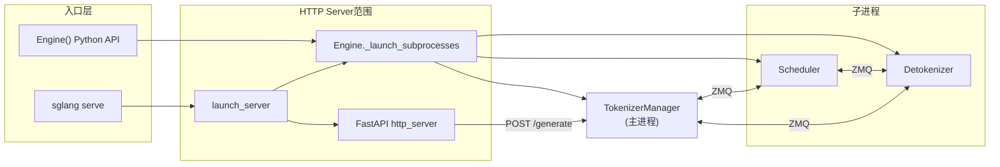

# HTTP Server 入口 · 核心概念

> 本节说明本模块在全局架构中的位置与设计动机。

---

## 用户故事：第一个 POST /generate

**Explain：** 你执行 `sglang serve --model-path meta-llama/Llama-3.2-1B` 后，用 curl 发第一个生成请求。HTTP 层几乎不做推理——FastAPI 把 JSON 反序列化为 `GenerateReqInput`，经 `_global_state.tokenizer_manager` 进入与 `Engine.generate()` 相同的 ZMQ 链路。流式响应走 SSE `data: {...}\n\n`；非流式一次性 `__anext__()` 取首包。

**Code：**

```python
## 来源：python/sglang/srt/entrypoints/http_server.py L785-L831
@app.api_route(
    "/generate",
    methods=["POST", "PUT"],
    response_class=SGLangORJSONResponse,
)
async def generate_request(obj: GenerateReqInput, request: Request):
    """Handle a generate request."""
    if envs.SGLANG_ENABLE_REQUEST_HEADER_OVERRIDES.get():
        apply_header_overrides(obj, request.headers)
    if obj.stream:

        async def stream_results() -> AsyncIterator[bytes]:
            try:
                async for out in _global_state.tokenizer_manager.generate_request(
                    obj, request
                ):
                    yield b"data: " + dumps_json(out) + b"\n\n"
            except ValueError as e:
                # A client disconnect also surfaces here. It's a client-side
                # cancellation, not a server error or bad input -- log it and
                # stop (the request was already aborted upstream) instead of
                # emitting a 400.
                if request is not None and await request.is_disconnected():
                    logger.info(f"[http_server] Client disconnected: {e}")
                    return
                out = {
                    "error": {
                        "message": str(e),
                        "type": "invalid_request_error",
                        "code": 400,
                        "retryable": False,
                    }
                }
                logger.error(f"[http_server] Error: {e}")
                yield b"data: " + dumps_json(out) + b"\n\n"
            yield b"data: [DONE]\n\n"

        return StreamingResponse(
            stream_results(),
            media_type="text/event-stream",
            background=_global_state.tokenizer_manager.create_abort_task(obj),
        )
    else:
        try:
            ret = await _global_state.tokenizer_manager.generate_request(
                obj, request
            ).__anext__()
```

**Comment：** 请求体示例 `{"text": "Hello", "sampling_params": {"max_new_tokens": 16}}`。主进程 TokenizerManager 分词 → ZMQ → Scheduler 子进程 forward → Detokenizer 回主进程 → HTTP 响应。全链路见 [[全链路请求追踪]]。

---

## 1. 架构位置

SGLang Runtime（SRT）在「入口层」分为两条并行路径：



**Explain：** `engine.py` 定义「引擎」——负责拉起子进程并提供 `generate`/`encode` 等 Python 接口；`http_server.py` 在引擎之上套一层 FastAPI，把 HTTP JSON 转成 `GenerateReqInput` 等结构体，再交给同一个 `TokenizerManager`。HTTP 不是独立引擎，而是**薄路由层**。

---

## 2. 三进程（+ 可选 DP Controller）模型

**Explain：** 文档与源码注释反复强调 Runtime 的三进程协作：**TokenizerManager**（主进程，HTTP/gRPC 接入 + 分词）、**Scheduler**（GPU batch 调度 + 模型 forward）、**Detokenizer**（CPU 侧 incremental decode）。可选 **DataParallelController** 在 `dp_size>1` 时管理多 DP rank 的 Scheduler，但 node_rank==0 的 HTTP 入口仍只连一个 TokenizerManager（或多 Worker Router）。

| 组件 | 进程 | 职责 |
|------|------|------|
| TokenizerManager | 主进程 | 分词、组请求、经 ZMQ 发给 Scheduler、收 Detokenizer 回包 |
| Scheduler | 子进程 | 批调度、模型 forward、把 token 发给 Detokenizer |
| DetokenizerManager | 子进程 | 反分词，结果回主进程 |

**Code：**

```python
## 来源：python/sglang/srt/entrypoints/engine.py L183-L195
# 提交版本：70df09b
class Engine(EngineScoreMixin, EngineBase):
    """
    The entry point to the inference engine.

    - The engine consists of three components:
        1. TokenizerManager: Tokenizes the requests and sends them to the scheduler.
        2. Scheduler (subprocess): Receives requests from the Tokenizer Manager, schedules batches, forwards them, and sends the output tokens to the Detokenizer Manager.
        3. DetokenizerManager (subprocess): Detokenizes the output tokens and sends the result back to the Tokenizer Manager.

    Note:
    1. The HTTP server, Engine, and TokenizerManager all run in the main process.
    2. Inter-process communication is done through IPC (each process uses a different port) via the ZMQ library.
    """
```

**Comment：**

- 英文 docstring 的核心意思：Engine 由 TokenizerManager、Scheduler、DetokenizerManager 三部分组成；HTTP、Engine、TokenizerManager 在主进程，Scheduler/Detokenizer 走子进程，进程间用 ZMQ IPC。
- `dp_size > 1` 时还会启动 **DataParallelController** 子进程，由它再 fork 多个 Scheduler（见 `02-源码走读` §2.3）。
- `detokenizer_worker_num > 1` 时 Detokenizer 前有 **MultiDetokenizerRouter** 做 fan-out。

---

## 3. `_GlobalState` — HTTP 层的进程内单例

**Explain：** FastAPI 路由函数是模块级 `@app.get`/`@app.post`，无法直接注入依赖容器里的 `TokenizerManager`。SGLang 用模块级 `_global_state` 持有运行时对象，供所有 endpoint 访问。

**Code：**

```python
## 来源：python/sglang/srt/entrypoints/http_server.py L190-L207
# 提交版本：70df09b
# Store global states
@dataclasses.dataclass
class _GlobalState:
    tokenizer_manager: Union[TokenizerManager, MultiTokenizerRouter, TokenizerWorker]
    template_manager: TemplateManager
    scheduler_info: Dict

_global_state: Optional[_GlobalState] = None

def set_global_state(global_state: _GlobalState):
    global _global_state
    _global_state = global_state

def get_global_state() -> _GlobalState:
    return _global_state
```

**Comment：**

- 单 tokenizer 模式：`_setup_and_run_http_server` 在 uvicorn 启动前 `set_global_state`。
- 多 tokenizer worker 模式：每个 uvicorn worker 在 `lifespan` 里调用 `init_multi_tokenizer()` 从共享内存重建状态（不支持 `api_key`）。

---

## 4. `PortArgs` — 子进程 ZMQ 端口分配

**Explain：** 各进程通过不同 IPC 端点通信。`PortArgs.init_new(server_args)` 在 `_launch_subprocesses` 开头分配 tokenizer / scheduler / detokenizer / rpc 等 socket 名称。

**Code：**

```python
## 来源：python/sglang/srt/entrypoints/engine.py L793-L796
# 提交版本：70df09b
        # Allocate ports for inter-process communications
        if port_args is None:
            port_args = PortArgs.init_new(server_args)
        logger.info(f"{server_args=}")
```

**Comment：** 具体字段在启动链路 `ServerArgs` 文档中展开；本模块只需知道：**HTTP 层不直接操作 ZMQ**，一切经 `TokenizerManager` 封装。

---

## 5. FastAPI `lifespan` — 延迟初始化 Serving 层

**Explain：** OpenAI / Ollama / Anthropic 兼容 handler 在 `lifespan` 上下文管理器中创建，挂在 `fast_api_app.state` 上。这样 uvicorn 开始接受连接前，TokenizerManager 与模板已就绪。

**Code：**

```python
## 来源：python/sglang/srt/entrypoints/http_server.py L291-L299
# 提交版本：70df09b
    # Initialize OpenAI serving handlers
    fast_api_app.state.openai_serving_completion = OpenAIServingCompletion(
        _global_state.tokenizer_manager, _global_state.template_manager
    )
    fast_api_app.state.openai_serving_chat = (
        _global_state.tokenizer_manager.serving_chat_class(
            _global_state.tokenizer_manager, _global_state.template_manager
        )
    )
```

**Comment：** 原生 SGLang API（`/generate`）不经过这些 Serving 类，直接调 `tokenizer_manager.generate_request`；OpenAI 路径在OpenAI API 详述。

---

## 6. `Engine` vs `launch_server`

| 维度 | `Engine(**kwargs)` | `launch_server(server_args)` |
|------|-------------------|------------------------------|
| 使用场景 | 嵌入式 Python、测试、Ray 包装 | CLI `sglang serve` 默认路径 |
| HTTP | 无 | FastAPI + uvicorn/Granian |
| 子进程启动 | `__init__` → `_launch_subprocesses` | 同上（类方法） |
| 请求入口 | `engine.generate(...)` | `POST /generate` 等 |
| 关闭 | `atexit` + `shutdown()` | 进程树 SIGQUIT / kill |

**Explain：** 两者共享 `_launch_subprocesses`；差别在于 HTTP 层是否启动、以及请求如何封装为 `GenerateReqInput`。

---

## 7. 关键术语

| 术语 | 含义 |
|------|------|
| SRT | SGLang Runtime，`srt/` 包 |
| Native API | `/generate`、`/encode` 等 SGLang 自有 JSON 接口 |
| Warmup | 服务就绪前发探测请求，触发 CUDA/graph 编译 |
| Single vs Multi Tokenizer | `tokenizer_worker_num==1` 单进程 vs 多 uvicorn worker 各持 TokenizerWorker |
| `ServerStatus` | Starting → Up / UnHealthy，影响 `/health` 返回码 |

---

## 设计追问

### Q1：为什么 HTTP handler 不直接 import Scheduler，而必须经 TokenizerManager？

**Explain：** Scheduler 跑在独立子进程，主进程只有 ZMQ socket。TokenizerManager 封装「分词 + 发请求 + 收 Detokenizer 流」的 async generator，HTTP 与 gRPC 共用此入口，避免在 FastAPI 路由里重复 IPC 协议。这也保证 `Engine()` 嵌入式与 `sglang serve` 行为一致。

**Code：**

```python
## 来源：python/sglang/srt/entrypoints/http_server.py L798-L800
                async for out in _global_state.tokenizer_manager.generate_request(
                    obj, request
                ):
```

**Comment：** 若绕过 TokenizerManager 直连 Scheduler，会跳过 template、grammar 预处理与 abort 传播。

---

### Q2：`_global_state` 为何不用 FastAPI `Depends` 注入？

**Explain：** 大量路由在模块加载时注册为 `@app.post`，且 uvicorn 多 worker 模式下每个 worker 需从共享内存重建 state。模块级单例 + `lifespan`/`init_multi_tokenizer` 比改造全体签名为 Depends 改动面更小，与 Granian/uvicorn worker fork 模型兼容。

**Code：**

```python
## 来源：python/sglang/srt/entrypoints/http_server.py L98-L107
from sglang.srt.entrypoints.openai.serving_rerank import OpenAIServingRerank
from sglang.srt.entrypoints.openai.serving_score import OpenAIServingScore
from sglang.srt.entrypoints.openai.serving_tokenize import (
    OpenAIServingDetokenize,
    OpenAIServingTokenize,
)
from sglang.srt.entrypoints.openai.serving_transcription import (
    OpenAIServingTranscription,
)
from sglang.srt.entrypoints.request_headers import apply_header_overrides
```

**Comment：** 多 tokenizer worker 时 `api_key` 不可用——state 不在主进程统一持有。

---

### Q3：OpenAI 兼容 API 与 Native `/generate` 谁先初始化？

**Explain：** Native 路由在 import 时即绑定 `_global_state`；OpenAI/Ollama handler 在 `lifespan` 里挂到 `app.state`，依赖 TokenizerManager 与 TemplateManager 已就绪。因此 warmup 与 health 探测通常走 Native 或 `/v1/models`，不必等 OpenAI handler 构造完成。

**Code：**

```python
## 来源：python/sglang/srt/entrypoints/http_server.py L146-L148
    MultiTokenizerRouter,
    TokenizerWorker,
    get_main_process_id,
```

**Comment：** OpenAI API 展开 OpenAI chat/completion 如何把 messages 转成同一 `GenerateReqInput`。
