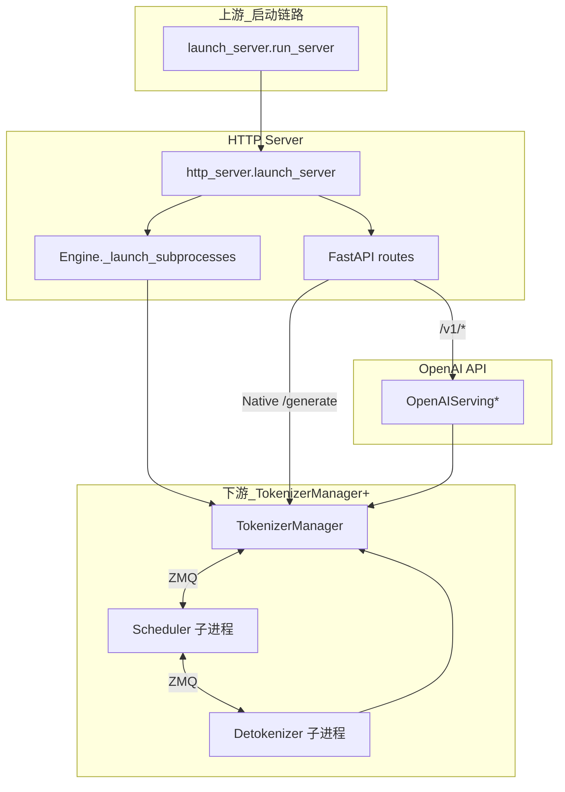
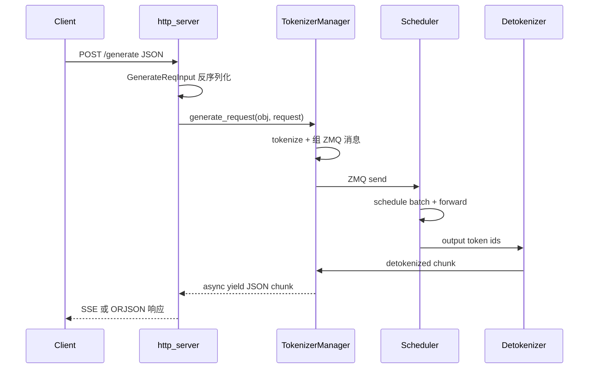

# HTTP Server：数据流与交互

> 上下游模块边界与数据流。

---

## 1. 架构位置（图谱 layer: 入口层）

知识图谱（batch-01-initial）中，`launch_server.py` 通过 `depends_on → module:srt` 连接到 Runtime；本模块两个文件位于 **SRT 入口层** 与 **调度层（TokenizerManager）** 之间：



---

## 2. 输入 / 输出

| 方向 | 类型 | 说明 | 定义位置 |
|------|------|------|----------|
| HTTP 入 | `GenerateReqInput` | Native 生成：text/input_ids、sampling_params、stream 等 | `io_struct.py`（本模块通过 FastAPI Body 注入） |
| HTTP 入 | `ChatCompletionRequest` | OpenAI chat 格式 | `openai/protocol.py` |
| HTTP 出 | JSON / SSE | 非流式 ORJSON；流式 `text/event-stream` | `generate_request` 路由 |
| Python 入 | `Engine.generate(...)` kwargs | 与 `GenerateReqInput` 字段对齐 | `engine.py` |
| Python 出 | `Dict` / `Iterator[Dict]` | 与 HTTP 响应体同结构 | `tokenizer_manager.generate_request` 产出 |
| 进程间 | ZMQ msgspec 结构 | Tokenizer ↔ Scheduler ↔ Detokenizer | `io_struct.py`（ScheduleBatch-IO） |

**Explain：** HTTP 层只做 **协议适配**（JSON ↔ dataclass），不做 tensor 计算。

**Code：**

```python
# 来源：python/sglang/srt/entrypoints/http_server.py L784-L790
# 提交版本：70df09b
# fastapi implicitly converts json in the request to obj (dataclass)
@app.api_route(
    "/generate",
    methods=["POST", "PUT"],
    response_class=SGLangORJSONResponse,
)
async def generate_request(obj: GenerateReqInput, request: Request):
```

**Comment：** FastAPI + msgspec/pydantic 在边界完成反序列化；字段校验失败走 `RequestValidationError` → 400。

---

## 3. 上下游连接

| 上游/下游 | 模块 | 交互方式 | 本模块代码锚点 |
|-----------|------|----------|--------------|
| 上游 | `launch_server.run_server` | Python import + 函数调用 | `http_server.launch_server` |
| 上游 | `ServerArgs` / `PortArgs` | 配置对象传递 | `_launch_subprocesses` 参数 |
| 同级 | `TemplateManager` | Python 对象引用 | `_GlobalState.template_manager` |
| 下游 | `TokenizerManager.generate_request` | async generator | `/generate`、`Engine.generate` |
| 下游 | `OpenAIServing*` | `app.state` 方法调用 | `/v1/chat/completions` |
| 下游 | `run_scheduler_process` | `mp.Process` + ZMQ | `_launch_scheduler_processes` |
| 下游 | `run_detokenizer_process` | `mp.Process` + ZMQ | `_launch_detokenizer_subprocesses` |
| 运维 | Prometheus | FastAPI middleware | `enable_metrics` 分支 |
| 运维 | SubprocessWatchdog | 监控子进程存活 | `_launch_subprocesses` 末尾 |

**Code（Engine 侧 ZMQ RPC，供权重更新等管理面）：**

```python
# 来源：python/sglang/srt/entrypoints/engine.py L254-L261, L1241-L1246
# 提交版本：70df09b
        # Initialize ZMQ sockets
        context = zmq.Context(2)
        if self.server_args.node_rank == 0:
            self.send_to_rpc = get_zmq_socket(
                context, zmq.DEALER, self.port_args.rpc_ipc_name, True
            )
        else:
            self.send_to_rpc = None
```

**Comment：** HTTP 管理端点（如 `/update_weights_from_disk`）经 TokenizerManager 转发；`collective_rpc` 是 Engine Python API 直连 Scheduler 的旁路。

---

## 4. 启动数据流（逐步）

### 步骤 1：CLI 进入 HTTP 默认分支

**Code：**

```python
# 来源：python/sglang/launch_server.py L47-L51
# 提交版本：70df09b
    else:
        # Default mode: HTTP mode.
        from sglang.srt.entrypoints.http_server import launch_server

        launch_server(server_args)
```

### 步骤 2：拉起子进程并等待模型 ready

**Explain：** Pipe 同步点确保 HTTP 不会在 GPU 模型未加载时大量接入真实流量（warmup 前 `/health` 仍可能 503）。

**Code：**

```python
# 来源：python/sglang/srt/entrypoints/engine.py L883-L889
# 提交版本：70df09b
        # Wait for the model to finish loading
        scheduler_init_result.wait_for_ready()

        # Get back some info from scheduler to tokenizer_manager
        tokenizer_manager.max_req_input_len = scheduler_init_result.scheduler_infos[0][
            "max_req_input_len"
        ]
```

### 步骤 3：绑定全局状态并启动 ASGI 服务器

**Code：**

```python
# 来源：python/sglang/srt/entrypoints/http_server.py L2401-L2414
# 提交版本：70df09b
                # Default case, one tokenizer process
                uvicorn.run(
                    app,
                    host=server_args.host,
                    port=server_args.port,
                    root_path=server_args.fastapi_root_path,
                    log_level=server_args.log_level_http or server_args.log_level,
                    timeout_keep_alive=envs.SGLANG_TIMEOUT_KEEP_ALIVE.get(),
                    loop="uvloop",
                    ssl_keyfile=server_args.ssl_keyfile,
                    ssl_certfile=server_args.ssl_certfile,
                    ssl_ca_certs=server_args.ssl_ca_certs,
                    ssl_keyfile_password=server_args.ssl_keyfile_password,
                )
```

### 步骤 4：lifespan 内 warmup 线程

**Explain：** 主监听已启动后，后台线程循环请求 `/model_info` 再 POST 一次真实推理，编译 CUDA graph / 填充 cache。

---

## 5. 典型请求数据流（推理）



**Code（HTTP 层进入 TokenizerManager 的唯一枢纽）：**

```python
# 来源：python/sglang/srt/entrypoints/http_server.py L828-L831
# 提交版本：70df09b
        try:
            ret = await _global_state.tokenizer_manager.generate_request(
                obj, request
            ).__anext__()
```

---

## 6. 多 tokenizer worker 数据流差异

**Explain：** `tokenizer_worker_num > 1` 时，主进程写共享内存，每个 uvicorn worker 独立 `TokenizerWorker` + 独立 ZMQ IPC 名；**不支持 API Key**。Router 进程 `MultiTokenizerRouter` 在 Engine 启动时替代单进程 TokenizerManager。

**Code：**

```python
# 来源：python/sglang/srt/entrypoints/http_server.py L216-L256
# 提交版本：70df09b
    # Read configuration from shared memory
    main_pid = get_main_process_id()
    port_args, server_args, scheduler_info = read_from_shared_memory(
        f"multi_tokenizer_args_{main_pid}"
    )
    server_args: ServerArgs
    port_args: PortArgs

    # API key authentication is not supported in multi-tokenizer mode
    assert (
        server_args.api_key is None
    ), "API key is not supported in multi-tokenizer mode"

    # Create a new ipc name for the current process
    port_args.tokenizer_ipc_name = (
        f"ipc://{tempfile.NamedTemporaryFile(delete=False).name}"
    )
    logger.info(
        f"Start multi-tokenizer worker process {os.getpid()}, "
        f"ipc_name={port_args.tokenizer_ipc_name}"
    )

    # Launch multi-tokenizer manager process
    tokenizer_manager = TokenizerWorker(server_args, port_args)
    template_manager = TemplateManager()
    template_manager.initialize_templates(
        tokenizer_manager=tokenizer_manager,
        model_path=server_args.model_path,
        chat_template=server_args.chat_template,
        completion_template=server_args.completion_template,
    )

    tokenizer_manager.max_req_input_len = scheduler_info["max_req_input_len"]

    set_global_state(
        _GlobalState(
            tokenizer_manager=tokenizer_manager,
            template_manager=template_manager,
            scheduler_info=scheduler_info,
        )
    )
```

---

## 7. 与 Engine Python API 的数据流对比

| 步骤 | HTTP 路径 | `Engine()` 路径 |
|------|-----------|-----------------|
| 请求封装 | FastAPI → `GenerateReqInput` | `Engine.generate` 内构造同名对象 |
| 调用 | `_global_state.tokenizer_manager` | `self.tokenizer_manager` |
| Request 对象 | Starlette `Request`（abort/headers） | `None` |
| 响应 | HTTP Response / SSE | Python dict / iterator |

两者在 **TokenizerManager 边界之后** 数据流完全一致。
