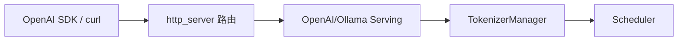

# OpenAI API · 核心概念

## 用户故事：OpenAI SDK 流式 `delta.content` 为空

### Persona

**Amy**，业务后端工程师，用官方 `openai` Python SDK 调 SGLang 的 `/v1/chat/completions`，`stream=True` 时客户端收到的 chunk 里 `delta.content` 时有时无，前端 UI 出现「闪字」或整段一次性弹出。

### 时间线

| 时刻 | 事件 |
|------|------|
| T0 | SDK `client.chat.completions.create(..., stream=True)` 连上 SGLang，首包 role-only chunk 正常 |
| T1 | 中间若干 SSE 事件 `delta.content` 为空，仅 `finish_reason` 前才有文本 |
| T2 | 对照 OpenAI 文档，确认 Serving 层应对 **增量 text** 做 delta 而非全量 echo |
| T3 | 改读 `OpenAIServingChat._handle_streaming_request`，理解 TM chunk → SSE 封装链路 |

**Explain：** OpenAI 兼容层位于 **HTTP 路由与 TokenizerManager 之间**。`OpenAIServingBase.handle_request` 校验 Pydantic 请求 → 转为 `GenerateReqInput` → 流式分支调 `_handle_streaming_request`。TokenizerManager 产出的是 **累积 text 或 meta chunk**，Serving 负责算 **delta** 并封装为 `data: {...}\n\n` SSE；delta 逻辑错误会直接导致 SDK 解析异常。

**Code：**

```python
# 来源：python/sglang/srt/entrypoints/openai/serving_base.py L73-L109
    async def handle_request(
        self, request: OpenAIServingRequest, raw_request: Request
    ) -> Union[Any, StreamingResponse, ErrorResponse]:
        """Handle the specific request type with common pattern
        If you want to override this method, you should be careful to record the validation time.
        """
        received_time = monotonic_time()

        try:
            # Validate request
            error_msg = self._validate_request(request)
            if error_msg:
                return self.create_error_response(error_msg)

            # Log the raw OpenAI request payload before conversion to tokenized form.
            request_logger = self.tokenizer_manager.request_logger
            if request_logger.log_requests and request_logger.log_requests_level >= 2:
                request_logger.log_openai_received_request(request, request=raw_request)

            # Convert to internal format
            adapted_request, processed_request = self._convert_to_internal_request(
                request, raw_request
            )

            if isinstance(adapted_request, (GenerateReqInput, EmbeddingReqInput)):
                # Only set timing fields if adapted_request supports them
                adapted_request.received_time = received_time

            # Note(Xinyuan): raw_request below is only used for detecting the connection of the client
            if hasattr(request, "stream") and request.stream:
                return await self._handle_streaming_request(
                    adapted_request, processed_request, raw_request
                )
            else:
                return await self._handle_non_streaming_request(
                    adapted_request, processed_request, raw_request
                )
```

**Comment：** `received_time` 写入 `GenerateReqInput` 供 metrics 用；chat 与 completion 子类各自实现 delta 组装，见 `serving_chat.py` / `serving_completions.py`。

### 如果…会怎样（调试）

| 现象 | 可能原因 | 排查 |
|------|----------|------|
| 每 chunk 是全量重复文本 | Serving 未减前序长度 | 对比 TM 输出与 SSE payload 的 `choices[0].delta` |
| 只有 `[DONE]` 无内容 | `stream` 字段未传到 `GenerateReqInput` | 查 `_convert_to_internal_request` 里 `stream=request.stream` |
| 非流式正常、流式 501 | 子类未 override streaming handler | 确认 endpoint 用的是 `OpenAIServingChat` 而非 base 默认 |

---

## 1. 架构位置

OpenAI API 兼容层位于 **HTTP 入口层** 与 **TokenizerManager（调度入口）** 之间，职责是：

| 层次 | 模块 | 职责 |
|------|------|------|
| 上游 | `http_server.py` | FastAPI 路由、JSON 校验、CORS |
| **本层** | `openai/`、`ollama/` | 协议转换、流式封装、错误格式 |
| 下游 | `TokenizerManager` | tokenize、发 ZMQ、收 stream chunk |
| 再下游 | Scheduler / ModelRunner | 批次调度与推理（TokenizerManager+） |



## 2. 核心术语

| 术语 | 含义 |
|------|------|
| **Protocol** | Pydantic 模型，对齐 OpenAI/Ollama 官方 JSON schema |
| **Serving** | 业务 handler：校验 → 转换 → 调 TM → 组装响应 |
| **Adapted Request** | 内部结构 `GenerateReqInput` 或 `EmbeddingReqInput` |
| **SSE** | Server-Sent Events；OpenAI chat/completion 流式用 `text/event-stream` |
| **NDJSON** | 换行分隔 JSON；Ollama 流式用 `application/x-ndjson` |

## 3. OpenAIServingBase：模板方法模式

**Explain：** 所有 OpenAI endpoint handler 继承 `OpenAIServingBase`，共享「校验 → 转换 → 流式/非流式分发 → 统一错误处理」流程。子类只需实现 `_convert_to_internal_request` 和具体的 streaming/non-streaming 处理。

**Code：**

```python
# 来源：python/sglang/srt/entrypoints/openai/serving_base.py L73-L109
    async def handle_request(
        self, request: OpenAIServingRequest, raw_request: Request
    ) -> Union[Any, StreamingResponse, ErrorResponse]:
        """Handle the specific request type with common pattern
        If you want to override this method, you should be careful to record the validation time.
        """
        received_time = monotonic_time()

        try:
            # Validate request
            error_msg = self._validate_request(request)
            if error_msg:
                return self.create_error_response(error_msg)

            # Log the raw OpenAI request payload before conversion to tokenized form.
            request_logger = self.tokenizer_manager.request_logger
            if request_logger.log_requests and request_logger.log_requests_level >= 2:
                request_logger.log_openai_received_request(request, request=raw_request)

            # Convert to internal format
            adapted_request, processed_request = self._convert_to_internal_request(
                request, raw_request
            )

            if isinstance(adapted_request, (GenerateReqInput, EmbeddingReqInput)):
                # Only set timing fields if adapted_request supports them
                adapted_request.received_time = received_time

            # Note(Xinyuan): raw_request below is only used for detecting the connection of the client
            if hasattr(request, "stream") and request.stream:
                return await self._handle_streaming_request(
                    adapted_request, processed_request, raw_request
                )
            else:
                return await self._handle_non_streaming_request(
                    adapted_request, processed_request, raw_request
                )
```

**Comment：**

- `received_time` 写入 `GenerateReqInput`，供后续 metrics / tracing 使用。
- `raw_request` 用于读取 HTTP header（如 `X-Data-Parallel-Rank`、自定义 metrics labels）。
- 子类若未 override streaming 方法，默认返回 501 Not Implemented。

## 4. Protocol 层：对外契约

**Explain：** `protocol.py` 用 Pydantic 定义 OpenAI 兼容的请求/响应模型。`CompletionRequest` 与 `ChatCompletionRequest` 是两条最常用路径的入口类型；字段顺序对齐 OpenAI 官方文档。

**Code：**

```python
# 来源：python/sglang/srt/entrypoints/openai/protocol.py L316-L339
class CompletionRequest(BaseModel):
    # Ordered by official OpenAI API documentation
    # https://platform.openai.com/docs/api-reference/completions/create
    model: str = Field(
        default=DEFAULT_MODEL_NAME,
        description="Model name. Supports LoRA adapters via 'base-model:adapter-name' syntax.",
    )
    prompt: Union[List[int], List[List[int]], str, List[str]]
    best_of: Optional[int] = None
    echo: bool = False
    frequency_penalty: float = 0.0
    logit_bias: Optional[Dict[str, float]] = None
    logprobs: Optional[int] = None
    max_tokens: int = 16
    n: int = 1
    presence_penalty: float = 0.0
    seed: Optional[int] = None
    stop: Optional[Union[str, List[str]]] = None
    stream: bool = False
    stream_options: Optional[StreamOptions] = None
    suffix: Optional[str] = None
    temperature: float = 1.0
    top_p: float = 1.0
    user: Optional[str] = None
```

**Comment：**

- `model` 支持 `base-model:adapter-name` 语法，Serving 层会解析为 LoRA adapter（见 `_parse_model_parameter`）。
- SGLang 扩展字段（如 `return_hidden_states`、`routed_dp_rank`）定义在同文件后续字段中，不在此片段列出。
- `ErrorResponse` 统一错误 JSON 形状，与 OpenAI API 一致。

## 5. 内部请求结构：GenerateReqInput

**Explain：** OpenAI 请求经 Serving 转换后变为 `GenerateReqInput`（定义在 `managers/io_struct.py`）。这是 TokenizerManager 能理解的「生成请求」统一格式。

**Code：**

```python
# 来源：python/sglang/srt/entrypoints/openai/serving_completions.py L110-L135
        adapted_request = GenerateReqInput(
            **prompt_kwargs,
            sampling_params=sampling_params,
            return_logprob=request.logprobs is not None,
            top_logprobs_num=request.logprobs if request.logprobs is not None else 0,
            logprob_start_len=logprob_start_len,
            return_text_in_logprobs=True,
            stream=request.stream,
            lora_path=lora_path,
            bootstrap_host=request.bootstrap_host,
            bootstrap_port=request.bootstrap_port,
            bootstrap_room=request.bootstrap_room,
            routed_dp_rank=effective_routed_dp_rank,
            disagg_prefill_dp_rank=request.disagg_prefill_dp_rank,
            return_hidden_states=request.return_hidden_states,
            return_routed_experts=request.return_routed_experts,
            routed_experts_start_len=request.routed_experts_start_len,
            rid=request.rid,
            session_id=request.session_id,
            extra_key=self._compute_extra_key(request),
            priority=request.priority,
            routing_key=self.extract_routing_key(raw_request),
            custom_labels=custom_labels,
            custom_logit_processor=request.custom_logit_processor,
            images_config=getattr(request, "images_config", None),
        )
```

**Comment：**

- `prompt_kwargs` 要么是 `text=` 要么是 `input_ids=`，取决于 prompt 是字符串还是 token id 列表。
- `sampling_params` 由 `_build_sampling_params` 从 OpenAI 字段映射而来（temperature、max_tokens → max_new_tokens 等）。
- PD 分离相关字段（`bootstrap_*`、`disagg_prefill_dp_rank`）在PD 分离 展开。

## 6. Ollama 兼容层：平行适配

**Explain：** Ollama API 与 OpenAI 格式不同，SGLang 用独立的 `OllamaServing` 做转换。它不继承 `OpenAIServingBase`，但同样构造 `GenerateReqInput` 并调用 `tokenizer_manager.generate_request`。

**Code：**

```python
# 来源：python/sglang/srt/entrypoints/ollama/serving.py L68-L94
    async def handle_chat(
        self, request: OllamaChatRequest, raw_request: Request
    ) -> Union[OllamaChatResponse, StreamingResponse]:
        """Handle /api/chat endpoint."""
        model_name = self.tokenizer_manager.served_model_name

        # Convert messages to SGLang format
        messages = [
            {"role": msg.role, "content": msg.content} for msg in request.messages
        ]

        # Apply chat template using tokenizer
        prompt_ids = self.tokenizer_manager.tokenizer.apply_chat_template(
            messages,
            tokenize=True,
            add_generation_prompt=True,
        )

        # Convert options to sampling params
        sampling_params = self._convert_options_to_sampling_params(request.options)

        # Create SGLang request with input_ids
        gen_request = GenerateReqInput(
            input_ids=prompt_ids,
            sampling_params=sampling_params,
            stream=request.stream,
        )
```

**Comment：**

- Ollama `options.num_predict` 映射为 SGLang 的 `max_new_tokens`；默认 2048（高于 SGLang 原生默认 128）。
- Chat template 直接用 HuggingFace tokenizer 的 `apply_chat_template`，不走 SGLang 的 `TemplateManager` 复杂路径。
- 流式输出为 NDJSON（每行一个 JSON），而非 OpenAI 的 SSE `data:` 前缀。

## 7. Endpoint 一览

| HTTP 路径 | Handler 类 | 内部类型 |
|-----------|-----------|----------|
| `/v1/completions` | `OpenAIServingCompletion` | `GenerateReqInput` |
| `/v1/chat/completions` | `OpenAIServingChat` | `GenerateReqInput` |
| `/v1/embeddings` | `OpenAIServingEmbedding` | `EmbeddingReqInput` |
| `/v1/classify` | `OpenAIServingClassify` | `GenerateReqInput` |
| `/v1/score`、`/v1/rerank` | Score / Rerank | 专用逻辑 |
| `/v1/tokenize`、`/v1/detokenize` | Tokenize / Detokenize | 本地 tokenizer |
| `/v1/audio/transcriptions` | Transcription | ASR adapter |
| `/api/chat`、`/api/generate` | `OllamaServing` | `GenerateReqInput` |

## 8. 设计动机小结

1. **协议与执行解耦**：OpenAI JSON ↔ 内部 IO 结构，便于同时支持 Anthropic、Ollama、SageMaker 等多套 API。
2. **模板方法复用**：校验、计时、错误格式、header 解析写一次，各 endpoint 只关心字段映射。
3. **流式在 Serving 层组装**：TokenizerManager 产出增量 text/meta_info，Serving 负责 delta 计算与 SSE/NDJSON 封装。
