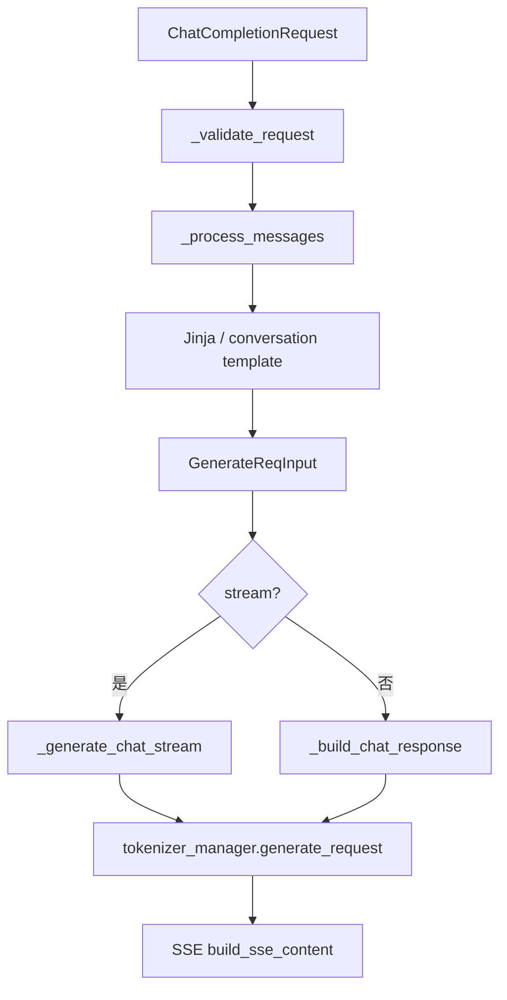

# OpenAI API · 源码走读

> 走读顺序：路由委托 → 基类模板 → Completion → Chat 流式 → SSE → Ollama

## 走读顺序

1. `http_server.py` — 路由与 handler 挂载
2. `serving_base.py` — 抽象基类与公共逻辑
3. `serving_completions.py` — Completion 转换与流式
4. `serving_chat.py` — Chat 消息预处理（节选）
5. `sse_utils.py` — SSE chunk 构建
6. `usage_processor.py` — 用量统计
7. `ollama/serving.py` — Ollama 适配

---

## 1. http_server.py：薄路由层

### 1.1 OpenAI 路由委托

**Explain：** 每个 OpenAI 路由函数体极短：从 `app.state` 取 handler，调用 `handle_request`。Pydantic 已在 FastAPI 层完成 JSON → 模型解析。

**Code：**

```python
# 来源：python/sglang/srt/entrypoints/http_server.py L1598-L1613
@app.post("/v1/completions", dependencies=[Depends(validate_json_request)])
async def openai_v1_completions(request: CompletionRequest, raw_request: Request):
    """OpenAI-compatible text completion endpoint."""
    return await raw_request.app.state.openai_serving_completion.handle_request(
        request, raw_request
    )


@app.post("/v1/chat/completions", dependencies=[Depends(validate_json_request)])
async def openai_v1_chat_completions(
    request: ChatCompletionRequest, raw_request: Request
):
    """OpenAI-compatible chat completion endpoint."""
    return await raw_request.app.state.openai_serving_chat.handle_request(
        request, raw_request
    )
```

**Comment：**

- `validate_json_request` 依赖项做 JSON 合法性检查，避免 malformed body 进入 Serving。
- `raw_request` 传入 Serving 以便读 header、检测客户端断连。
- Embedding、classify、tokenize 等路由结构相同，只是 handler 类不同。

### 1.2 Ollama 路由与环境变量

**Explain：** Ollama 路径可通过环境变量覆盖，便于与现有 Ollama 客户端或反向代理共存。

**Code：**

```python
# 来源：python/sglang/srt/entrypoints/http_server.py L1857-L1880
@app.post(os.environ.get("SGLANG_OLLAMA_CHAT_ROUTE", "/api/chat"))
async def ollama_chat(request: OllamaChatRequest, raw_request: Request):
    """Ollama-compatible chat endpoint."""
    return await raw_request.app.state.ollama_serving.handle_chat(request, raw_request)


@app.post(os.environ.get("SGLANG_OLLAMA_GENERATE_ROUTE", "/api/generate"))
async def ollama_generate(request: OllamaGenerateRequest, raw_request: Request):
    """Ollama-compatible generate endpoint."""
    return await raw_request.app.state.ollama_serving.handle_generate(
        request, raw_request
    )


@app.get(os.environ.get("SGLANG_OLLAMA_TAGS_ROUTE", "/api/tags"))
async def ollama_tags(raw_request: Request):
    """Ollama-compatible list models endpoint."""
    return raw_request.app.state.ollama_serving.get_tags()


@app.post(os.environ.get("SGLANG_OLLAMA_SHOW_ROUTE", "/api/show"))
async def ollama_show(request: OllamaShowRequest, raw_request: Request):
    """Ollama-compatible show model info endpoint."""
    return raw_request.app.state.ollama_serving.get_show(request.model)
```

**Comment：**

- `SGLANG_OLLAMA_ROOT_ROUTE` 若设置，根路径返回 `"Ollama is running"` 而非 `"SGLang is running"`。
- `/api/show` 返回模型元信息，供 Ollama CLI 探测 context length。

---

## 2. serving_base.py：公共基础设施

### 2.1 LoRA 模型名解析

**Explain：** OpenAI `model` 字段支持 `base:adapter` 语法，Serving 基类统一解析，子类在构建 `GenerateReqInput` 时调用 `_resolve_lora_path`。

**Code：**

```python
# 来源：python/sglang/srt/entrypoints/openai/serving_base.py L40-L71
    def _parse_model_parameter(self, model: str) -> Tuple[str, Optional[str]]:
        """Parse 'base-model:adapter-name' syntax to extract LoRA adapter.

        Returns (base_model, adapter_name) or (model, None) if no colon present.
        """
        if ":" not in model:
            return model, None

        # Split on first colon only to handle model paths with multiple colons
        parts = model.split(":", 1)
        base_model = parts[0].strip()
        adapter_name = parts[1].strip() or None

        return base_model, adapter_name

    def _resolve_lora_path(
        self,
        request_model: str,
        explicit_lora_path: Optional[Union[str, List[Optional[str]]]],
    ) -> Optional[Union[str, List[Optional[str]]]]:
        """Resolve LoRA adapter with priority: model parameter > explicit lora_path.

        Returns adapter name or None. Supports both single values and lists (batches).
        """
        _, adapter_from_model = self._parse_model_parameter(request_model)

        # Model parameter adapter takes precedence
        if adapter_from_model is not None:
            return adapter_from_model

        # Fall back to explicit lora_path
        return explicit_lora_path
```

**Comment：**

- 只按**第一个**冒号分割，避免 Windows 路径或多段 model id 误拆。
- 显式 `lora_path` 字段优先级低于 `model` 中的 adapter 名。

### 2.2 错误响应格式

**Explain：** 非流式错误返回 `ORJSONResponse`；流式错误返回 JSON 字符串供 SSE `data:` 行使用。

**Code：**

```python
# 来源：python/sglang/srt/entrypoints/openai/serving_base.py L209-L241
    def create_error_response(
        self,
        message: str,
        err_type: str = "BadRequestError",
        status_code: int = 400,
        param: Optional[str] = None,
    ) -> ORJSONResponse:
        """Create an error response"""
        # TODO: remove fastapi dependency in openai and move response handling to the entrypoint
        error = ErrorResponse(
            object="error",
            message=message,
            type=err_type,
            param=param,
            code=status_code,
        )
        return ORJSONResponse(content=error.model_dump(), status_code=status_code)

    def create_streaming_error_response(
        self,
        message: str,
        err_type: str = "BadRequestError",
        status_code: int = 400,
    ) -> str:
        """Create a streaming error response"""
        error = ErrorResponse(
            object="error",
            message=message,
            type=err_type,
            param=None,
            code=status_code,
        )
        return json.dumps({"error": error.model_dump()})
```

**Comment：**

- `code` 字段存 HTTP status code，与 OpenAI Python SDK 期望一致。
- 注释提到未来可能把 response 处理上移到 entrypoint，减少 FastAPI 耦合。

### 2.3 Data Parallel Rank Header

**Explain：** 分布式场景下，HTTP header `X-Data-Parallel-Rank` 可覆盖 body 中的 `routed_dp_rank`，便于网关层路由。

**Code：**

```python
# 来源：python/sglang/srt/entrypoints/openai/serving_base.py L277-L306
    def extract_routed_dp_rank_from_header(
        self, raw_request: Request, body_routed_dp_rank: Optional[int] = None
    ) -> Optional[int]:
        """Extract routed_dp_rank from HTTP header, with higher priority than routed_dp_rank in body.

        Header name: X-Data-Parallel-Rank (case-insensitive in HTTP/1.1/2)
        """
        if raw_request is None:
            return body_routed_dp_rank

        header_value = raw_request.headers.get("x-data-parallel-rank")
        if header_value is not None:
            try:
                header_dp_rank = int(header_value)
                if (
                    body_routed_dp_rank is not None
                    and header_dp_rank != body_routed_dp_rank
                ):
                    logger.debug(
                        f"X-Data-Parallel-Rank header ({header_dp_rank}) overrides "
                        f"body routed_dp_rank ({body_routed_dp_rank})"
                    )
                return header_dp_rank
            except ValueError:
                raise HTTPException(
                    status_code=400,
                    detail=f"Invalid X-Data-Parallel-Rank header: must be an integer, got '{header_value}'",
                )

        return body_routed_dp_rank
```

**Comment：**

- HTTP/1.1 header 名大小写不敏感，FastAPI 统一小写键名。
- 非法整数会抛 `HTTPException`，由 `handle_request` 捕获并转为 error response。

---

## 3. serving_completions.py：Completion 全流程

### 3.1 校验与 prompt 处理

**Explain：** Completion handler 校验 prompt 非空；若配置了 completion template，会用 code completion 专用 prompt 生成逻辑。

**Code：**

```python
# 来源：python/sglang/srt/entrypoints/openai/serving_completions.py L57-L97
    def _validate_request(self, request: CompletionRequest) -> Optional[str]:
        """Validate that the input is valid."""
        prompt = request.prompt
        if not prompt or (isinstance(prompt, list) and all(not p for p in prompt)):
            return "Prompt cannot be empty"

        return None

    def _convert_to_internal_request(
        self,
        request: CompletionRequest,
        raw_request: Request = None,
    ) -> tuple[GenerateReqInput, CompletionRequest]:
        """Convert OpenAI completion request to internal format"""
        # NOTE: with openai API, the prompt's logprobs are always not computed
        if request.echo and request.logprobs:
            logger.warning(
                "Echo is not compatible with logprobs. "
                "To compute logprobs of input prompt, please use the native /generate API."
            )
        # Process prompt
        prompt = request.prompt
        if self.template_manager.completion_template_name is not None:
            prompt = generate_completion_prompt_from_request(request)

        # Set logprob start length based on echo and logprobs
        if request.echo and request.logprobs:
            logprob_start_len = 0
        else:
            logprob_start_len = -1

        # Build sampling parameters
        sampling_params = self._build_sampling_params(request)

        # Determine prompt format
        if isinstance(prompt, str) or (
            isinstance(prompt, list) and isinstance(prompt[0], str)
        ):
            prompt_kwargs = {"text": prompt}
        else:
            prompt_kwargs = {"input_ids": prompt}
```

**Comment：**

- `echo=True` 时在响应中回显 prompt；与 `logprobs` 同时开启有已知限制。
- prompt 可为 batch（字符串列表或 token id 列表的列表），由 `GenerateReqInput` 批处理。

### 3.2 Sampling 参数映射

**Explain：** OpenAI 字段名与 SGLang 内部 sampling 字典键不完全一致，此处做显式映射；`response_format` 会转为 `json_schema` 约束。

**Code：**

```python
# 来源：python/sglang/srt/entrypoints/openai/serving_completions.py L139-L185
    def _build_sampling_params(self, request: CompletionRequest) -> Dict[str, Any]:
        """Build sampling parameters for the request"""
        # Start with common parameters
        sampling_params = {
            "temperature": request.temperature,
            "max_new_tokens": request.max_tokens,
            "min_new_tokens": request.min_tokens,
            "stop": request.stop,
            "stop_token_ids": request.stop_token_ids,
            "stop_regex": request.stop_regex,
            "top_p": request.top_p,
            "top_k": request.top_k,
            "min_p": request.min_p,
            "presence_penalty": request.presence_penalty,
            "frequency_penalty": request.frequency_penalty,
            "repetition_penalty": request.repetition_penalty,
            "regex": request.regex,
            "json_schema": request.json_schema,
            "ebnf": request.ebnf,
            "n": request.n,
            "no_stop_trim": request.no_stop_trim,
            "ignore_eos": request.ignore_eos,
            "skip_special_tokens": request.skip_special_tokens,
            "logit_bias": request.logit_bias,
            "custom_params": request.custom_params,
            "sampling_seed": request.seed,
        }

        # Handle response_format constraints
        if request.response_format and request.response_format.type == "json_schema":
            json_schema = request.response_format.json_schema
            schema = getattr(json_schema, "schema_", None)
            if schema is None:
                raise ValueError(
                    "schema_ is required for json_schema response format request."
                )
            sampling_params["json_schema"] = convert_json_schema_to_str(schema)
        elif request.response_format and request.response_format.type == "json_object":
            sampling_params["json_schema"] = '{"type": "object"}'
        elif (
            request.response_format and request.response_format.type == "structural_tag"
        ):
            sampling_params["structural_tag"] = convert_json_schema_to_str(
                request.response_format.model_dump(by_alias=True)
            )

        return sampling_params
```

**Comment：**

- `max_tokens`（OpenAI）→ `max_new_tokens`（SGLang 调度层）。
- `structural_tag` 类型 response_format 在完整源码中还有第三条分支。

### 3.3 流式 Completion：SSE 与 abort task

**Explain：** 流式请求先「预取」第一个 chunk 做校验，再包装为 `StreamingResponse`；`background` 注册 abort task，客户端断连时可取消生成。

**Code：**

```python
# 来源：python/sglang/srt/entrypoints/openai/serving_completions.py L187-L213
    async def _handle_streaming_request(
        self,
        adapted_request: GenerateReqInput,
        request: CompletionRequest,
        raw_request: Request,
    ) -> Union[StreamingResponse, ErrorResponse]:
        """Handle streaming completion request"""
        generator = self._generate_completion_stream(
            adapted_request, request, raw_request
        )

        # Kick-start the generator to trigger validation before HTTP 200 is sent.
        try:
            first_chunk = await generator.__anext__()
        except ValueError as e:
            return self.create_error_response(str(e))

        async def prepend_first_chunk():
            yield first_chunk
            async for chunk in generator:
                yield chunk

        return StreamingResponse(
            prepend_first_chunk(),
            media_type="text/event-stream",
            background=self.tokenizer_manager.create_abort_task(adapted_request),
        )
```

**Comment：**

- 「kick-start generator」模式避免 HTTP 200 已发送后才发现 validation 失败。
- `text/event-stream` 是 OpenAI 官方 SDK 期望的 MIME 类型。

### 3.4 流式 delta 计算

**Explain：** TokenizerManager 每次返回**累积** text；Serving 用 `stream_offsets` 记录已发送长度，计算增量 `delta`。

**Code：**

```python
# 来源：python/sglang/srt/entrypoints/openai/serving_completions.py L244-L320
            async for content in self.tokenizer_manager.generate_request(
                adapted_request, raw_request
            ):
                index = content.get("index", 0)

                text = content["text"]
                prompt_tokens[index] = content["meta_info"].get("prompt_tokens", 0)
                completion_tokens[index] = content["meta_info"].get(
                    "completion_tokens", 0
                )
                reasoning_tokens[index] = content["meta_info"].get(
                    "reasoning_tokens", 0
                )
                cached_tokens[index] = content["meta_info"].get("cached_tokens", 0)
                hidden_states[index] = content["meta_info"].get("hidden_states", None)
                routed_experts[index] = content["meta_info"].get("routed_experts", None)
                cached_tokens_details[index] = content["meta_info"].get(
                    "cached_tokens_details", None
                )

                is_first_chunk = index not in stream_offsets
                offset = stream_offsets.get(index, 0)
                # Handle echo for first chunk
                if is_first_chunk:  # The first chunk
                    if request.echo:
                        echo_text = self._get_echo_text(request, index)
                        text = echo_text + text

                # Handle logprobs
                logprobs = None
                if request.logprobs is not None:
                    # The first chunk and echo is enabled.
                    if is_first_chunk and request.echo:
                        input_token_logprobs = content["meta_info"][
                            "input_token_logprobs"
                        ]
                        input_top_logprobs = content["meta_info"]["input_top_logprobs"]
                    else:
                        input_token_logprobs = None
                        input_top_logprobs = None

                    n_prev_token = n_prev_tokens.get(index, 0)
                    total_output_logprobs = content["meta_info"][
                        "output_token_logprobs_length"
                    ]
                    if (
                        n_prev_token < total_output_logprobs
                        or input_token_logprobs is not None
                    ):
                        output_token_logprobs = content["meta_info"][
                            "output_token_logprobs"
                        ]
                        output_top_logprobs = content["meta_info"].get(
                            "output_top_logprobs", []
                        )
                        if (
                            not self.tokenizer_manager.server_args.incremental_streaming_output
                        ):
                            output_token_logprobs = output_token_logprobs[
                                n_prev_token:total_output_logprobs
                            ]
                            output_top_logprobs = output_top_logprobs[
                                n_prev_token:total_output_logprobs
                            ]
                        logprobs = to_openai_style_logprobs(
                            input_token_logprobs=input_token_logprobs,
                            input_top_logprobs=input_top_logprobs,
                            output_token_logprobs=output_token_logprobs,
                            output_top_logprobs=output_top_logprobs,
                        )
                    n_prev_tokens[index] = total_output_logprobs

                # Generate delta
                delta = text[offset:]
                stream_offsets[index] = len(content["text"])
                finish_reason = content["meta_info"].get("finish_reason", None)
                finish_reason_type = finish_reason["type"] if finish_reason else None
```

**Comment：**

- 多路采样（`n>1`）时 `index` 区分各 choice 的 offset 状态。
- 系统级 abort（OOM、timeout）走 streaming error chunk；用户主动 abort 走正常 finish 路径。

---

## 4. serving_chat.py：Chat 全流程走读

> `serving_chat.py` 约 2000 行，是本模块最复杂 handler。主线：**messages → template → GenerateReqInput → generate_request → SSE delta / tool_calls**。

### 4.1 模板方法：handle_request 入口

**Explain：** `OpenAIServingChat` 继承 `OpenAIServingBase.handle_request`：校验 → `_convert_to_internal_request` → 流式/非流式分支。Chat 的差异全在子类实现的 `_convert_to_internal_request` 与 `_generate_chat_stream`。

**Code：**

```python
# 来源：python/sglang/srt/entrypoints/openai/serving_base.py L82-L108
            # Validate request
            error_msg = self._validate_request(request)
            if error_msg:
                return self.create_error_response(error_msg)

            # Log the raw OpenAI request payload before conversion to tokenized form.
            request_logger = self.tokenizer_manager.request_logger
            if request_logger.log_requests and request_logger.log_requests_level >= 2:
                request_logger.log_openai_received_request(request, request=raw_request)

            # Convert to internal format
            adapted_request, processed_request = self._convert_to_internal_request(
                request, raw_request
            )

            if isinstance(adapted_request, (GenerateReqInput, EmbeddingReqInput)):
                # Only set timing fields if adapted_request supports them
                adapted_request.received_time = received_time

            # Note(Xinyuan): raw_request below is only used for detecting the connection of the client
            if hasattr(request, "stream") and request.stream:
                return await self._handle_streaming_request(
                    adapted_request, processed_request, raw_request
                )
            else:
                return await self._handle_non_streaming_request(
                    adapted_request, processed_request, raw_request
```

**Comment：** Amy 的「delta 为空」问题多数出在 §4.4–4.5 的 offset 计算或首 chunk 未带 `role=assistant`。

---

### 4.2 `_convert_to_internal_request`：messages → GenerateReqInput

**Explain：** 主转换链：`_process_messages`（Jinja / conversation template + multimodal parts）→ `to_sampling_params` → 组装 `GenerateReqInput`（含 LoRA、PD bootstrap、reasoning、routing header 等）。流式时禁止 `return_prompt_token_ids` / `return_meta_info`。

**Code：**

```python
# 来源：python/sglang/srt/entrypoints/openai/serving_chat.py L551-L622
        is_multimodal = self.tokenizer_manager.model_config.is_multimodal

        # Process messages and apply chat template
        processed_messages = self._process_messages(request, is_multimodal)
        # Build sampling parameters
        sampling_params = request.to_sampling_params(
            stop=processed_messages.stop,
            model_generation_config=self.default_sampling_params,
            tool_call_constraint=processed_messages.tool_call_constraint,
        )

        if request.input_ids is not None:
            prompt_kwargs = {"input_ids": processed_messages.prompt_ids}
        elif is_multimodal:
            prompt_kwargs = {"text": processed_messages.prompt}
        else:
            if isinstance(processed_messages.prompt_ids, str):
                prompt_kwargs = {"text": processed_messages.prompt_ids}
            else:
                prompt_kwargs = {"input_ids": processed_messages.prompt_ids}

        # Extract custom labels from raw request headers
        custom_labels = self.extract_custom_labels(raw_request)

        # Extract routed_dp_rank from header (has higher priority than body)
        effective_routed_dp_rank = self.extract_routed_dp_rank_from_header(
            raw_request, request.routed_dp_rank
        )

        # Resolve LoRA adapter from model parameter or explicit lora_path
        lora_path = self._resolve_lora_path(request.model, request.lora_path)
        img_max_dynamic_patch, vid_max_dynamic_patch = _extract_max_dynamic_patch(
            request
        )
        require_reasoning = self._get_reasoning_from_request(request)

        adapted_request = GenerateReqInput(
            **prompt_kwargs,
            image_data=processed_messages.image_data,
            video_data=processed_messages.video_data,
            audio_data=processed_messages.audio_data,
            sampling_params=sampling_params,
            return_logprob=request.logprobs,
            logprob_start_len=-1,
            top_logprobs_num=request.top_logprobs or 0,
            stream=request.stream,
            return_text_in_logprobs=True,
            modalities=processed_messages.modalities,
            lora_path=lora_path,
            bootstrap_host=request.bootstrap_host,
            bootstrap_port=request.bootstrap_port,
            bootstrap_room=request.bootstrap_room,
            routed_dp_rank=effective_routed_dp_rank,
            disagg_prefill_dp_rank=request.disagg_prefill_dp_rank,
            return_hidden_states=request.return_hidden_states,
            return_routed_experts=request.return_routed_experts,
            routed_experts_start_len=request.routed_experts_start_len,
            rid=request.rid,
            session_id=request.session_id,
            extra_key=self._compute_extra_key(request),
            require_reasoning=require_reasoning,
            priority=request.priority,
            routing_key=self.extract_routing_key(raw_request),
            custom_labels=custom_labels,
            custom_logit_processor=request.custom_logit_processor,
            images_config=getattr(request, "images_config", None),
            image_max_dynamic_patch=img_max_dynamic_patch,
            video_max_dynamic_patch=vid_max_dynamic_patch,
            max_dynamic_patch=getattr(request, "max_dynamic_patch", None),
            use_audio_in_video=getattr(request, "use_audio_in_video", False),
            return_prompt_token_ids=request.return_prompt_token_ids,
        )
```

**Comment：**

- `text` vs `input_ids`：template 输出字符串走 `text`；已 tokenize 的 id 列表走 `input_ids`。
- VLM 多模态走 `image_data` / `modalities`，与 [[24-Multimodal-00-MOC|Multimodal Multimodal]] 衔接。

---

### 4.3 `_process_messages` 与 Jinja template

**Explain：** 按模型选择 `_apply_jinja_template` 或 `_apply_conversation_template`。Jinja 路径：messages → `normalize_assistant_tool_call_arguments` → `_encode_messages`（DeepSeek 等专用编码）或 tokenizer `apply_chat_template` → 得到 `prompt_ids` / multimodal tensors。

**Code：**

```python
# 来源：python/sglang/srt/entrypoints/openai/serving_chat.py L626-L695
    def _process_messages(
        self, request: ChatCompletionRequest, is_multimodal: bool
    ) -> MessageProcessingResult:
        """Process chat messages and apply chat template"""
        # GptOss model needs to keep special tokens for harmony parsing
        if self.is_gpt_oss or self.is_gemma4:
            request.skip_special_tokens = False

        self._patch_reasoning_skip_special_tokens(request)

        thinking_mode = self._get_reasoning_from_request(request)
        # SGLang's ReasonerGrammarBackend owns the reasoning prefix
        # when --reasoning-parser is configured, so builtin xgrammar
        # tags must describe only the post-reasoning tool-call suffix.
        xgrammar_reasoning = thinking_mode and (
            self.tokenizer_manager.server_args.reasoning_parser is None
        )
        tool_call_constraint = None

        # Apply chat template and its stop strings
        tools = None
        if request.tools and request.tool_choice != "none":
            request.skip_special_tokens = False
            if not isinstance(request.tool_choice, str):
                tools = [
                    item.model_dump()
                    for item in request.tools
                    if item.function.name == request.tool_choice.function.name
                ]
            else:
                tools = [item.model_dump() for item in request.tools]
            if self.tool_call_parser:
                parser = FunctionCallParser(request.tools, self.tool_call_parser)
                tool_call_constraint = parser.get_structure_constraint(
                    request.tool_choice,
                    parallel_tool_calls=request.parallel_tool_calls,
                    thinking_mode=xgrammar_reasoning,
                )
            # Fallback: use generic JSON schema for required/named tool choice
            # only when no parser-specific constraint was set
            if tool_call_constraint is None and (
                request.tool_choice == "required"
                or isinstance(request.tool_choice, ToolChoice)
            ):
                json_schema = get_json_schema_constraint(
                    request.tools,
                    request.tool_choice,
                    parallel_tool_calls=request.parallel_tool_calls,
                )
                tool_call_constraint = ("json_schema", json_schema)

        # When input_ids are provided, skip template tokenization entirely;
        # only stop tokens and tool_call_constraint are needed.
        if request.input_ids is not None:
            result = MessageProcessingResult(
                prompt="",
                prompt_ids=request.input_ids,
                image_data=None,
                audio_data=None,
                video_data=None,
                modalities=[],
                stop=request.stop or [],
            )
        elif self.template_manager.chat_template_name is None:
            result = self._apply_jinja_template(request, tools, is_multimodal)
        else:
            result = self._apply_conversation_template(request, is_multimodal)

        result.tool_call_constraint = tool_call_constraint
        return result
```

**Code：**

```python
# 来源：python/sglang/srt/entrypoints/openai/serving_chat.py L721-L727
        messages = [msg.model_dump() for msg in request.messages]
        for message in messages:
            normalize_assistant_tool_call_arguments(message)

        prompt_ids = self._encode_messages(
            copy.deepcopy(messages), request, thinking_mode
        )
```

**Comment：** tool 消息 content 数组在进 template 前由 `normalize_tool_content` flatten（§4.6）。

---

### 4.4 流式：kick-start generator 避免 HTTP 200 后报错

**Explain：** 与 Completion 相同模式：先 `await generator.__anext__()`，校验失败（如超长 context）仍返回 HTTP 400；成功则 `prepend_first_chunk` 包装 SSE。

**Code：**

```python
# 来源：python/sglang/srt/entrypoints/openai/serving_chat.py L975-L1001
    async def _handle_streaming_request(
        self,
        adapted_request: GenerateReqInput,
        request: ChatCompletionRequest,
        raw_request: Request,
    ) -> Union[StreamingResponse, ErrorResponse]:
        """Handle streaming chat completion request"""
        generator = self._generate_chat_stream(adapted_request, request, raw_request)

        # Kick-start the generator to trigger validation before HTTP 200 is sent.
        # If validation fails (e.g., context length exceeded), we can still return
        # a proper HTTP 400 error response instead of streaming it as SSE payload.
        try:
            first_chunk = await generator.__anext__()
        except ValueError as e:
            return self.create_error_response(str(e))

        async def prepend_first_chunk():
            yield first_chunk
            async for chunk in generator:
                yield chunk

        return StreamingResponse(
            prepend_first_chunk(),
            media_type="text/event-stream",
            background=self.tokenizer_manager.create_abort_task(adapted_request),
        )
```

---

### 4.5 `_generate_chat_stream`：TM chunk → OpenAI delta

**Explain：** `async for content in tokenizer_manager.generate_request(...)` 消费 TM 输出。维护 per-index 状态：`stream_offsets`（已发送文本长度）、`parser_dict`（tool_calls 流式解析）、`reasoning_parser_dict`（reasoning 字段）。**delta = 累积 text[offset:]**，与 Completion 相同；额外组装 `reasoning_content`、`tool_calls` delta。

**Code：**

```python
# 来源：python/sglang/srt/entrypoints/openai/serving_chat.py L1034-L1047
        try:
            include_usage, continuous_usage_stats = should_include_usage(
                request.stream_options,
                self.tokenizer_manager.server_args.stream_response_default_include_usage,
            )

            async for content in self.tokenizer_manager.generate_request(
                adapted_request, raw_request
            ):
                index = content.get("index", 0)

                prompt_tokens[index] = content["meta_info"].get("prompt_tokens", 0)
                completion_tokens[index] = content["meta_info"].get(
                    "completion_tokens", 0
```

**Comment：**

| 字段 | 含义 |
|------|------|
| `content["text"]` | **累积**全文（非增量） |
| `stream_offsets[index]` | 已写入 SSE 的字符数 |
| `delta.content` | `text[offset:]` |
| 首 chunk | 常带 `delta.role="assistant"` |

---

### 4.6 Tool 消息 content 规范化

**Explain：** OpenAI 客户端可能把 tool 消息 content 发成 `[{"type":"text","text":"..."}]` 数组；进 template 前 flatten 为纯字符串。

**Code：**

```python
# 来源：python/sglang/srt/entrypoints/openai/serving_chat.py L79-L98
def normalize_tool_content(role: str, content):
    """Normalize tool message content from OpenAI array format to plain string.

    OpenAI clients may send tool content as a list of content parts
    (e.g. [{"type":"text","text":"..."}]) but most chat templates expect
    a plain string for tool messages. Only flatten when ALL items are
    pure OpenAI text parts; preserve lists containing non-text-type items
    that some templates intentionally iterate over.
    """
    if role != "tool" or not isinstance(content, list):
        return content
    parts = content
    is_openai_text_parts = all(
        (isinstance(p, dict) and p.get("type") == "text") or isinstance(p, str)
        for p in parts
    )
    if is_openai_text_parts:
        text_parts = [p.get("text", "") if isinstance(p, dict) else p for p in parts]
        return " ".join(text_parts)
    return content
```

**Comment：** 流式 tool_calls 走 `_process_tool_call_stream`；reasoning 模型走 `_process_reasoning_stream`——与 OpenAI o1/DeepSeek-R1 类 API 对齐。

---

### 4.7 Chat 主路径一图



---

## 5. sse_utils.py：高性能 SSE 序列化

**Explain：** Chat 流式用 `msgspec` 结构体 + 预分配 bytes 前缀，比纯 Pydantic `model_dump_json` 更省 CPU。

**Code：**

```python
# 来源：python/sglang/srt/entrypoints/openai/sse_utils.py L13-L46
class StreamDelta(msgspec.Struct, omit_defaults=True):
    """Delta content for streaming responses.

    OpenAI Python SDK's ChoiceDelta does not declare reasoning_content; it is
    surfaced via pydantic `extra`. With omit_defaults=True, defaulting to
    None would drop the key entirely from the SSE payload, making
    `data.reasoning_content` raise AttributeError on the client. Keep it
    required (no default) so it is always serialized as null or a string.
    """

    reasoning_content: Optional[str]
    role: Optional[str] = None
    content: Optional[str] = None


class StreamChoice(msgspec.Struct):
    """A single choice in a streaming response."""

    index: int
    delta: StreamDelta
    logprobs: Optional[dict] = None
    finish_reason: Optional[str] = None
    matched_stop: Union[None, int, str] = None


class StreamChunk(msgspec.Struct, omit_defaults=True):
    """A complete streaming chunk."""

    id: str
    object: str
    created: int
    model: str
    choices: List[StreamChoice]
    usage: Optional[dict] = None
```

**Code（build_sse_content）：**

```python
# 来源：python/sglang/srt/entrypoints/openai/sse_utils.py L52-L99
def build_sse_content(
    chunk_id: str,
    created: int,
    model: str,
    index: int,
    role: Optional[str] = None,
    content: Optional[str] = None,
    reasoning_content: Optional[str] = None,
    finish_reason: Optional[str] = None,
    logprobs: Optional[dict] = None,
    matched_stop: Union[None, int, str] = None,
    usage: Optional[dict] = None,
) -> str:
    """Build an SSE chunk string for content/reasoning updates.

    Args:
        chunk_id: Request ID for this chunk
        created: Unix timestamp
        model: Model name
        index: Choice index
        role: Message role (usually "assistant")
        content: Text content delta
        reasoning_content: Reasoning/thinking content delta
        finish_reason: Finish reason if done
        logprobs: Log probabilities if requested
        matched_stop: Stop token/string that was matched
        usage: Token usage statistics

    Returns:
        SSE-formatted string "data: {...}\\n\\n"
    """
    delta = StreamDelta(role=role, content=content, reasoning_content=reasoning_content)
    choice = StreamChoice(
        index=index,
        delta=delta,
        logprobs=logprobs,
        finish_reason=finish_reason,
        matched_stop=matched_stop,
    )
    chunk = StreamChunk(
        id=chunk_id,
        object="chat.completion.chunk",
        created=created,
        model=model,
        choices=[choice],
        usage=usage,
    )
    return (_SSE_DATA_B + _stream_encoder.encode(chunk) + _SSE_NL_B).decode()
```

**Comment：**

- `reasoning_content` 无默认值且必填字段——保证 SSE 里始终有该键（null 或 string），避免 OpenAI SDK 读属性报错。
- 模块顶部 `_SSE_DATA_B = b"data: "` 与 `_SSE_NL_B = b"\n\n"` 避免重复分配。

---

## 6. usage_processor.py：Token 用量

**Explain：** 非流式从 response list 聚合；流式从 per-index 字典聚合。`enable_cache_report` 时附加 `cached_tokens` 明细。

**Code：**

```python
# 来源：python/sglang/srt/entrypoints/openai/usage_processor.py L18-L55
    def calculate_response_usage(
        responses: List[Dict[str, Any]],
        n_choices: int = 1,
        enable_cache_report: bool = False,
        image_tokens: int = 0,
        audio_tokens: int = 0,
        video_tokens: int = 0,
    ) -> UsageInfo:
        completion_tokens = sum(
            r["meta_info"].get("completion_tokens", 0) for r in responses
        )
        prompt_tokens = sum(
            responses[i]["meta_info"].get("prompt_tokens", 0)
            for i in range(0, len(responses), n_choices)
        )

        # some API don't have reasoning_tokens semantics
        reasoning_tokens = sum(
            r["meta_info"].get("reasoning_tokens", 0) for r in responses
        )

        cached_details = None
        if enable_cache_report:
            cached_total = sum(
                responses[i]["meta_info"].get("cached_tokens", 0)
                for i in range(0, len(responses), n_choices)
            )
            cached_details = UsageProcessor._details_if_cached(cached_total)

        return UsageProcessor.calculate_token_usage(
            prompt_tokens=prompt_tokens,
            reasoning_tokens=reasoning_tokens,
            completion_tokens=completion_tokens,
            cached_tokens=cached_details,
            image_tokens=image_tokens,
            audio_tokens=audio_tokens,
            video_tokens=video_tokens,
        )
```

**Comment：**

- `n_choices>1` 时 prompt_tokens 只按每个 prompt 的第一个 choice 计一次，避免重复计数。
- 多模态 token 计数（image/audio/video）在 PromptTokensDetails 中可选输出。

---

## 7. ollama/serving.py：选项映射与 NDJSON 流

### 7.1 Ollama options → sampling_params

**Code：**

```python
# 来源：python/sglang/srt/entrypoints/ollama/serving.py L41-L66
    def _convert_options_to_sampling_params(self, options: dict = None) -> dict:
        """Convert Ollama options to SGLang sampling params."""
        sampling_params = {}

        if options:
            # Map Ollama options to SGLang params
            param_mapping = {
                "temperature": "temperature",
                "top_p": "top_p",
                "top_k": "top_k",
                "num_predict": "max_new_tokens",
                "stop": "stop",
                "presence_penalty": "presence_penalty",
                "frequency_penalty": "frequency_penalty",
                "seed": "seed",
            }
            for ollama_param, sglang_param in param_mapping.items():
                if ollama_param in options:
                    sampling_params[sglang_param] = options[ollama_param]

        # Set a reasonable default for max_new_tokens if not specified
        # Ollama users typically expect longer responses than SGLang's default (128)
        if "max_new_tokens" not in sampling_params:
            sampling_params["max_new_tokens"] = 2048

        return sampling_params
```

### 7.2 NDJSON 流式输出

**Code：**

```python
# 来源：python/sglang/srt/entrypoints/ollama/serving.py L137-L171
        async def generate_stream() -> AsyncIterator[bytes]:
            previous_text = ""
            async for chunk in self.tokenizer_manager.generate_request(
                gen_request, raw_request
            ):
                text = chunk.get("text", "")
                is_done = chunk.get("meta_info", {}).get("finish_reason") is not None

                # Calculate delta (new text since last chunk)
                delta = text[len(previous_text) :]
                previous_text = text

                if is_done:
                    # Final chunk
                    response = OllamaChatStreamResponse(
                        model=model_name,
                        created_at=self._get_timestamp(),
                        message=OllamaMessage(role="assistant", content=""),
                        done=True,
                        done_reason="stop",
                    )
                else:
                    response = OllamaChatStreamResponse(
                        model=model_name,
                        created_at=self._get_timestamp(),
                        message=OllamaMessage(role="assistant", content=delta),
                        done=False,
                    )

                yield orjson.dumps(response.model_dump()) + b"\n"

        return StreamingResponse(
            generate_stream(),
            media_type="application/x-ndjson",
        )
```

**Comment：**

- 与 OpenAI SSE 相同：基于累积 text 算 delta。
- 最后一 chunk `done=True` 且 content 为空字符串，符合 Ollama 客户端惯例。
- 空 prompt 的 generate 请求（Ollama CLI 初始化探测）直接返回 `done=True` 空响应，不触发真实推理。

---

## 8. ollama/protocol.py：请求模型

**Code：**

```python
# 来源：python/sglang/srt/entrypoints/ollama/protocol.py L21-L30
class OllamaChatRequest(BaseModel):
    """Ollama /api/chat request format."""

    model: str
    messages: List[OllamaMessage]
    stream: bool = True
    format: Optional[Union[Literal["json"], Dict[str, Any]]] = None
    options: Optional[Dict[str, Any]] = None
    keep_alive: Optional[Union[float, str]] = None
    think: Optional[Union[bool, Literal["low", "medium", "high"]]] = None
```

**Comment：**

- Ollama 默认 `stream=True`，与 OpenAI Chat 默认 `stream=False` 不同。
- `think` 等字段在 protocol 中定义，具体推理行为取决于后续版本实现。
