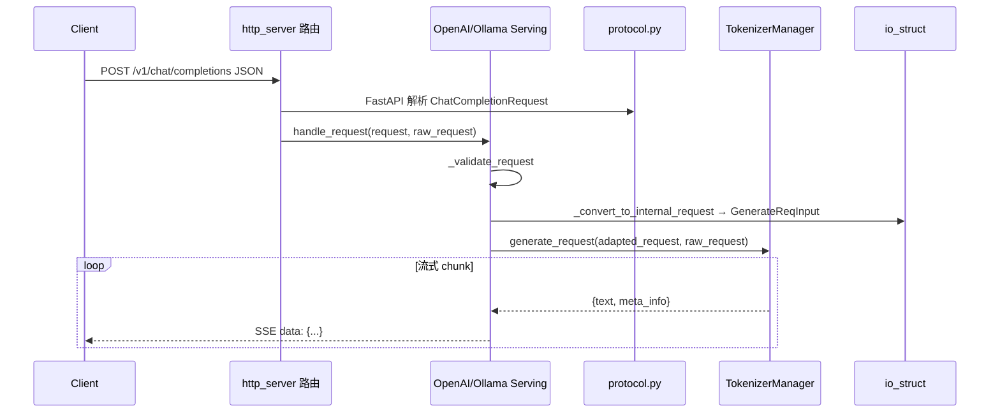
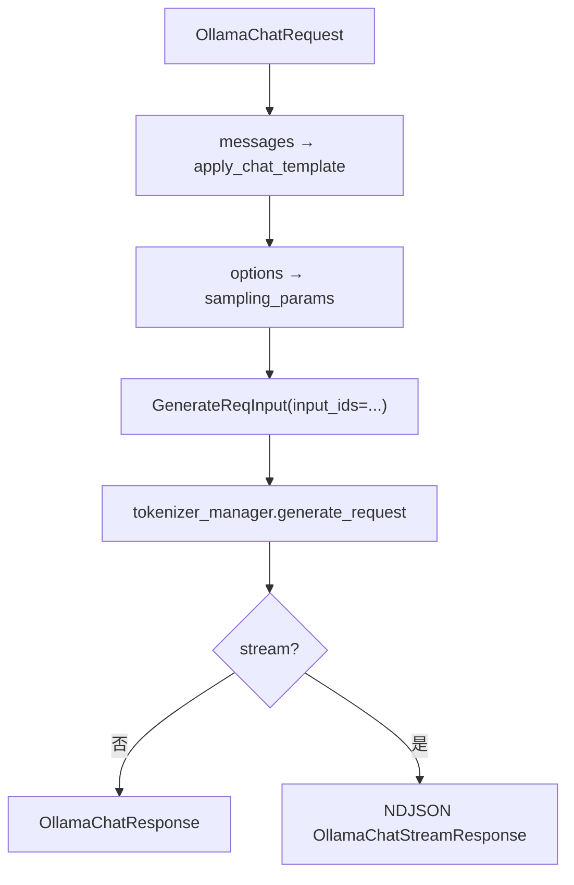

# OpenAI API：数据流与交互

## 1. 架构位置

本模块处于 **HTTP 入口层（layer:entrypoint）** 与 **TokenizerManager（layer:manager）** 之间：



## 2. 输入 / 输出

| 方向 | 类型 | 说明 | 定义位置 |
|------|------|------|----------|
| 输入 | `ChatCompletionRequest` | OpenAI chat JSON body | `openai/protocol.py` |
| 输入 | `CompletionRequest` | OpenAI completion JSON body | `openai/protocol.py` |
| 输入 | `OllamaChatRequest` | Ollama chat JSON body | `ollama/protocol.py` |
| 中间 | `GenerateReqInput` | 内部生成请求 | `managers/io_struct.py` |
| 中间 | `EmbeddingReqInput` | 内部 embedding 请求 | `managers/io_struct.py` |
| 输出 | `ChatCompletionResponse` / SSE chunks | OpenAI 格式 | Serving + protocol |
| 输出 | `OllamaChatResponse` / NDJSON lines | Ollama 格式 | `ollama/serving.py` |
| 输出 | `ErrorResponse` | 统一错误 JSON | `protocol.py` |

### 2.1 ErrorResponse 结构

**Explain：** 所有 Serving 错误（校验失败、400、500）统一序列化为 OpenAI 风格 error 对象。

**Code：**

```python
# 来源：python/sglang/srt/entrypoints/openai/protocol.py L87-L92
class ErrorResponse(BaseModel):
    object: str = "error"
    message: str
    type: str
    param: Optional[str] = None
    code: int
```

**Comment：** `type` 常为 `BadRequestError` 或 HTTP status 名；`code` 为 HTTP 状态码整数。

## 3. 上下游连接

| 方向 | 模块 | 交互方式 | 关键 API |
|------|------|----------|----------|
| 上游 | `http_server.py` | Python 调用 | `app.state.openai_serving_* .handle_request()` |
| 上游 | FastAPI | 依赖注入 | `validate_json_request`、Pydantic 模型绑定 |
| 下游 | `TokenizerManager` | async generator | `generate_request()` |
| 下游 | `TemplateManager` | 同步调用 | chat template、completion template |
| 下游 | `FunctionCallParser` | Chat 专用 | tool_calls 解析（chat serving） |
| 平行 | `AnthropicServing` | 包装 Chat | 复用 `openai_serving_chat` 转换结果 |

### 3.1 TokenizerManager 是唯一执行入口

**Explain：** Serving 层不直接碰 Scheduler；所有生成/embedding 经 `tokenizer_manager.generate_request` 或 embedding 等价方法。

**Code：**

```python
# 来源：python/sglang/srt/entrypoints/ollama/serving.py L111-L114
        # Get response from tokenizer manager
        response = await self.tokenizer_manager.generate_request(
            gen_request, raw_request
        ).__anext__()
```

**Comment：**

- 非流式用 `__anext__()` 取第一个（也是唯一）完整结果。
- 流式用 `async for` 迭代；TM 内部通过 ZMQ 与 Scheduler/Detokenizer 通信（TokenizerManager–Detokenizer）。

## 4. 典型数据流：Chat Completions（逐步）

### 步骤 1：HTTP 解析

FastAPI 将 JSON body 绑定为 `ChatCompletionRequest`（含 `messages`、`model`、`stream` 等）。

### 步骤 2：handle_request 模板

**Code：**

```python
# 来源：python/sglang/srt/entrypoints/openai/serving_base.py L82-L108
            # Validate request
            error_msg = self._validate_request(request)
            if error_msg:
                return self.create_error_response(error_msg)

            # Log the raw OpenAI request payload before conversion to tokenized form.
            request_logger = self.tokenizer_manager.request_logger
            if request_logger.log_requests and request_logger.log_requests_level >= 2:
                request_logger.log_openai_received_request(request, request=raw_request)

            # Convert to internal format
            adapted_request, processed_request = self._convert_to_internal_request(
                request, raw_request
            )

            if isinstance(adapted_request, (GenerateReqInput, EmbeddingReqInput)):
                # Only set timing fields if adapted_request supports them
                adapted_request.received_time = received_time

            # Note(Xinyuan): raw_request below is only used for detecting the connection of the client
            if hasattr(request, "stream") and request.stream:
                return await self._handle_streaming_request(
                    adapted_request, processed_request, raw_request
                )
            else:
                return await self._handle_non_streaming_request(
                    adapted_request, processed_request, raw_request
```

### 步骤 3：Chat 消息 → GenerateReqInput（内嵌主路径）

**Explain：** `_convert_to_internal_request` 调用 `_process_messages` 应用 chat template，再构造 `GenerateReqInput`。以下为核心片段（非节选）。

**Code：**

```python
# 来源：python/sglang/srt/entrypoints/openai/serving_chat.py L554-L622
        processed_messages = self._process_messages(request, is_multimodal)
        # Build sampling parameters
        sampling_params = request.to_sampling_params(
            stop=processed_messages.stop,
            model_generation_config=self.default_sampling_params,
            tool_call_constraint=processed_messages.tool_call_constraint,
        )

        if request.input_ids is not None:
            prompt_kwargs = {"input_ids": processed_messages.prompt_ids}
        elif is_multimodal:
            prompt_kwargs = {"text": processed_messages.prompt}
        else:
            if isinstance(processed_messages.prompt_ids, str):
                prompt_kwargs = {"text": processed_messages.prompt_ids}
            else:
                prompt_kwargs = {"input_ids": processed_messages.prompt_ids}

        # Extract custom labels from raw request headers
        custom_labels = self.extract_custom_labels(raw_request)

        # Extract routed_dp_rank from header (has higher priority than body)
        effective_routed_dp_rank = self.extract_routed_dp_rank_from_header(
            raw_request, request.routed_dp_rank
        )

        # Resolve LoRA adapter from model parameter or explicit lora_path
        lora_path = self._resolve_lora_path(request.model, request.lora_path)
        img_max_dynamic_patch, vid_max_dynamic_patch = _extract_max_dynamic_patch(
            request
        )
        require_reasoning = self._get_reasoning_from_request(request)

        adapted_request = GenerateReqInput(
            **prompt_kwargs,
            image_data=processed_messages.image_data,
            video_data=processed_messages.video_data,
            audio_data=processed_messages.audio_data,
            sampling_params=sampling_params,
            return_logprob=request.logprobs,
            logprob_start_len=-1,
            top_logprobs_num=request.top_logprobs or 0,
            stream=request.stream,
            return_text_in_logprobs=True,
            modalities=processed_messages.modalities,
            lora_path=lora_path,
            bootstrap_host=request.bootstrap_host,
            bootstrap_port=request.bootstrap_port,
            bootstrap_room=request.bootstrap_room,
            routed_dp_rank=effective_routed_dp_rank,
            disagg_prefill_dp_rank=request.disagg_prefill_dp_rank,
            return_hidden_states=request.return_hidden_states,
            return_routed_experts=request.return_routed_experts,
            routed_experts_start_len=request.routed_experts_start_len,
            rid=request.rid,
            session_id=request.session_id,
            extra_key=self._compute_extra_key(request),
            require_reasoning=require_reasoning,
            priority=request.priority,
            routing_key=self.extract_routing_key(raw_request),
            custom_labels=custom_labels,
            custom_logit_processor=request.custom_logit_processor,
            images_config=getattr(request, "images_config", None),
            image_max_dynamic_patch=img_max_dynamic_patch,
            video_max_dynamic_patch=vid_max_dynamic_patch,
            max_dynamic_patch=getattr(request, "max_dynamic_patch", None),
            use_audio_in_video=getattr(request, "use_audio_in_video", False),
            return_prompt_token_ids=request.return_prompt_token_ids,
        )
```

**Comment：** 完整走读见 [[04-OpenAI-API-02-源码走读|02-源码走读 §4]]（含 Jinja、流式 delta、tool_calls）。

### 步骤 4：TM 返回 chunk 结构

Serving 期望的每个 chunk 大致形状：

```python
# 概念结构（来自 serving_completions 消费方式）
{
 "index": 0, # n>1 时的 choice 下标
 "text": "累积输出文本",
 "meta_info": {
 "prompt_tokens": int,
 "completion_tokens": int,
 "finish_reason": {"type": "stop", "matched": ...} | None,
 "output_token_logprobs": [...],
 # ... cached_tokens, reasoning_tokens, hidden_states ...
 },
}
```

### 步骤 5a：非流式 — 组装 ChatCompletionResponse

聚合所有 choice 的 text、logprobs、usage，返回 JSON。

### 步骤 5b：流式 — SSE

**Code：**

```python
# 来源：python/sglang/srt/entrypoints/openai/sse_utils.py L83-L99
    delta = StreamDelta(role=role, content=content, reasoning_content=reasoning_content)
    choice = StreamChoice(
        index=index,
        delta=delta,
        logprobs=logprobs,
        finish_reason=finish_reason,
        matched_stop=matched_stop,
    )
    chunk = StreamChunk(
        id=chunk_id,
        object="chat.completion.chunk",
        created=created,
        model=model,
        choices=[choice],
        usage=usage,
    )
    return (_SSE_DATA_B + _stream_encoder.encode(chunk) + _SSE_NL_B).decode()
```

最后一 chunk 可带 `finish_reason=stop`；若 `stream_options.include_usage`，在末 chunk 或单独 chunk 附带 `usage`。

## 5. 典型数据流：Ollama /api/chat



**Explain：** Ollama 路径跳过 OpenAI protocol 与 `OpenAIServingBase`，但下游 TM 调用与 OpenAI 完全一致。

**Code：**

```python
# 来源：python/sglang/srt/entrypoints/ollama/serving.py L89-L103
        # Create SGLang request with input_ids
        gen_request = GenerateReqInput(
            input_ids=prompt_ids,
            sampling_params=sampling_params,
            stream=request.stream,
        )

        if request.stream:
            return await self._stream_chat_response(
                gen_request, raw_request, model_name
            )
        else:
            return await self._generate_chat_response(
                gen_request, raw_request, model_name
            )
```

## 6. Embedding 路径差异

**Explain：** Embedding 走 `EmbeddingReqInput` 而非 `GenerateReqInput`；校验逻辑检查 `input` 非空。

**Code：**

```python
# 来源：python/sglang/srt/entrypoints/openai/serving_embedding.py L42-L55
    def _validate_request(self, request: EmbeddingRequest) -> Optional[str]:
        """Validate that the input is not empty or whitespace only."""
        if not (input := request.input):
            return "Input cannot be empty"

        # Handle single string
        if isinstance(input, str):
            if not input.strip():
                return "Input cannot be empty or whitespace only"
            return None

        # Handle list inputs
        if isinstance(input, list):
            if len(input) == 0:
```

**Comment：** 转换后调用 TM 的 embedding 接口；响应组装为 `EmbeddingResponse` + `UsageInfo`。

## 7. HTTP Header 参与的数据流

| Header | 作用 | 提取函数 |
|--------|------|----------|
| `X-Data-Parallel-Rank` | 指定 DP rank | `extract_routed_dp_rank_from_header` |
| `x-smg-routing-key` | 网关路由键 | `extract_routing_key` |
| 自定义 metrics labels header | Prometheus 标签 | `extract_custom_labels` |

这些 header 在 `_convert_to_internal_request` 阶段写入 `GenerateReqInput` 对应字段，随 ZMQ 消息传入调度层。

## 8. 与HTTP Server / 06 的衔接

| 模块 | 衔接点 |
|------|--------|
| 03 HTTP Server | 路由注册、`init_app_state` 挂载 handler |
| 06 TokenizerManager | `generate_request` 内部 ZMQ 协议 |
| 20 Sampling | `sampling_params` 在 Scheduler 侧生效 |
| 22 Disaggregation | `bootstrap_*`、`disagg_prefill_dp_rank` 字段 |
