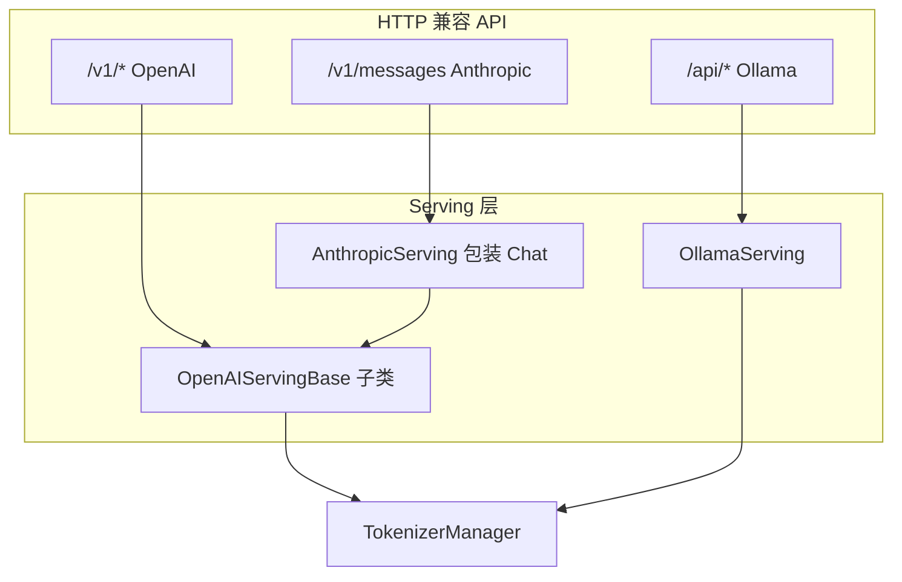

# OpenAI API：关键问题

## 1. OpenAI API 与原生 `/generate` 有何区别？

| 维度 | OpenAI `/v1/chat/completions` | 原生 `/generate` |
|------|------------------------------|------------------|
| 请求格式 | OpenAI JSON schema | SGLang 原生 JSON |
| Prompt 构造 | Chat template + tool 处理 | 直接传 `text` / `input_ids` |
| 流式格式 | SSE `data: {...}\n\n` | 自定义 JSON stream |
| 错误格式 | `ErrorResponse` | 可能不同 status/body |
| 扩展字段 | 部分 SGLang 字段暴露在 protocol | 全部 io_struct 字段 |

**建议：** 生产对接 OpenAI SDK 用 `/v1/*`；调试调度/KV cache 用原生 API。

## 2. 为什么 Chat 比 Completion 复杂得多？

`OpenAIServingChat` 约 2000 行，额外处理：

- 多轮 messages + Jinja chat template
- Tool calls（`FunctionCallParser`、JSON schema 约束）
- Reasoning / thinking 内容分离（`ReasoningParser`）
- Multimodal content parts
- DeepSeek v3.2/v4 专用 encoding（`encoding_dsv32.py`、`encoding_dsv4.py`）
- 自定义 `ResponseParserProtocol` 模型输出解析

Completion 基本是 prompt → `GenerateReqInput` 的单向映射。

## 3. 流式响应为什么用「累积 text − offset」算 delta？

**Explain：** Detokenizer 每次推送的是**当前完整解码字符串**（便于回退与 logprob 对齐），不是原生 delta token。Serving 层维护 `stream_offsets[index]` 做字符串切片。

**Code（正确模式 — Completion 流式）：**

```python
# 来源：python/sglang/srt/entrypoints/openai/serving_completions.py L316-L318
                # Generate delta
                delta = text[offset:]
                stream_offsets[index] = len(content["text"])
```

**易错写法（假设 chunk 已是 delta）：**

```python
# ❌ 错误：直接把 content["text"] 当 delta 发送
yield f"data: {json.dumps({'choices': [{'text': content['text']}]})}\n\n"
# 客户端会看到重复/膨胀的文本
```

**Comment：** Ollama NDJSON 流用同样的 `previous_text` 切片模式（见 `ollama/serving.py` L146-L147）。

## 4. echo + logprobs 为什么不能同时用？

**Explain：** OpenAI completion 的 echo 要在输出中包含 prompt；logprobs 对 prompt 的计算在 OpenAI API 语义下与 echo 冲突。SGLang 记录 warning 且 `logprob_start_len` 行为受限。

**Code：**

```python
# 来源：python/sglang/srt/entrypoints/openai/serving_completions.py L71-L86
        # NOTE: with openai API, the prompt's logprobs are always not computed
        if request.echo and request.logprobs:
            logger.warning(
                "Echo is not compatible with logprobs. "
                "To compute logprobs of input prompt, please use the native /generate API."
            )
        # Process prompt
        prompt = request.prompt
        if self.template_manager.completion_template_name is not None:
            prompt = generate_completion_prompt_from_request(request)

        # Set logprob start length based on echo and logprobs
        if request.echo and request.logprobs:
            logprob_start_len = 0
        else:
            logprob_start_len = -1
```

**正确做法：** 需要 prompt logprobs 时调用原生 `/generate` 并设置 `return_logprob=True`。

## 5. LoRA adapter 怎么指定？

两种方式，**model 字段优先**：

**Code：**

```python
# 来源：python/sglang/srt/entrypoints/openai/serving_base.py L64-L71
        _, adapter_from_model = self._parse_model_parameter(request_model)

        # Model parameter adapter takes precedence
        if adapter_from_model is not None:
            return adapter_from_model

        # Fall back to explicit lora_path
        return explicit_lora_path
```

| 写法 | 示例 |
|------|------|
| model 语法 | `"model": "meta-llama/Llama-3-8b:my-lora"` |
| 显式字段 | `"lora_path": "my-lora"`（各 request 模型中的扩展字段） |

## 6. Ollama 与 OpenAI 默认行为差异

| 项 | OpenAI Chat | Ollama Chat |
|----|-------------|-------------|
| 默认 stream | `false` | `true` |
| max tokens 默认 | `max_tokens` / `max_completion_tokens` | `num_predict` → 默认 2048 |
| 流式 MIME | `text/event-stream` | `application/x-ndjson` |
| Template | TemplateManager + 模型 config | HF `apply_chat_template` |

**易错点：** 用 OpenAI SDK 连 Ollama 路径会失败；用 Ollama CLI 连 `/v1/chat/completions` 也会格式不匹配。

## 7. 流式请求何时返回 HTTP 200 之前失败？

**Explain：** `_handle_streaming_request` 会先 `await generator.__anext__()`，若 validation 在 generator 内抛 `ValueError`，仍返回 4xx JSON 而非空 SSE。

**Code（正确 — kick-start pattern）：**

```python
# 来源：python/sglang/srt/entrypoints/openai/serving_completions.py L198-L202
        # Kick-start the generator to trigger validation before HTTP 200 is sent.
        try:
            first_chunk = await generator.__anext__()
        except ValueError as e:
            return self.create_error_response(str(e))
```

**易错写法：** 直接把 async generator 交给 `StreamingResponse` 而不预取——客户端已收到 200 和 `Content-Type: text/event-stream`，后续错误只能走 SSE error chunk。

## 8. `serving_chat_class` 是什么？

TokenizerManager 上可配置自定义 Chat Serving 类（例如某模型需要专用 parser）。`http_server` 实例化时用：

```python
_global_state.tokenizer_manager.serving_chat_class(
 _global_state.tokenizer_manager, _global_state.template_manager
)
```

默认即 `OpenAIServingChat`；换模型 config 可能指向子类。

## 9. 本模块未展开的子模块（留到后续或按需阅读）

| 模块 | 职责 |
|------|------|
| `serving_responses.py` | OpenAI Responses API（含 tool server） |
| `serving_transcription.py` | 语音转写 + WebSocket realtime |
| `realtime/` | Realtime API 会话 |
| `transcription_adapters/` | Whisper / Qwen ASR 适配 |
| `tool_server.py` | MCP / Demo / Native tool 执行 |
| `encoding_dsv32.py` / `encoding_dsv4.py` | DeepSeek 专用消息编码 |

## 10. FAQ 速查

**Q：错误 JSON 长什么样？** 
A：`{"object":"error","message":"...","type":"BadRequestError","code":400}`

**Q：如何带 usage 的流式？** 
A：请求设 `stream_options: {"include_usage": true}`；Serving 在末 chunk 调用 `UsageProcessor.calculate_streaming_usage`。

**Q：客户端断连会 abort 吗？** 
A：流式 `StreamingResponse` 的 `background=create_abort_task(...)` 会注册清理；详见 TokenizerManager（TokenizerManager）。

**Q：Ollama 空 prompt？** 
A：`handle_generate` 对空 prompt 直接返回 `done=True` 空响应，兼容 Ollama CLI 探活。

## 11. 对比：三套 API 入口汇总



Anthropic 路径（其他专题）复用 Chat 转换逻辑，仅响应 JSON 形状不同——说明 OpenAI Serving 是「事实上的内部标准中间表示」。

---

## 验证建议（零基础可试）

以下 **4 条**：第 1–2 条零 GPU（读 Serving 源码）；第 3–4 条需 HTTP 服务已启动（最小模型即可）。

1. **操作：** `rg "stream_offsets|delta = text\\[offset" python/sglang/srt/entrypoints/openai/serving_completions.py -n` 
 **预期现象：** 命中 `delta = text[offset:]` 与 `stream_offsets[index] = len(...)`——Detokenizer 推全量字符串，Serving 层做切片 delta。 
 **对应文档节：** §3 流式「累积 text − offset」

2. **操作：** `rg "Echo is not compatible with logprobs" python/sglang/srt/entrypoints/openai/serving_completions.py -n` 
 **预期现象：** 命中 warning 与 `logprob_start_len` 分支——echo 与 logprobs 不可同时按 OpenAI 语义使用。 
 **对应文档节：** §4 echo + logprobs、§10 FAQ「prompt logprobs 用 /generate」

3. **操作（需服务）：** 
 `curl -s http://127.0.0.1:30000/v1/models | python -m json.tool | head -15` 
 **预期现象：** JSON 含 `"object":"list"` 与 `data[].id`——OpenAI 兼容模型列表，与原生 `/generate` 路径分离。 
 **对应文档节：** §1 OpenAI API vs 原生 `/generate`

4. **操作（需服务）：** 
 `curl -N http://127.0.0.1:30000/v1/chat/completions -H "Content-Type: application/json" -d "{\"model\":\"default\",\"messages\":[{\"role\":\"user\",\"content\":\"Say hi in 3 words\"}],\"stream\":true}"` 
 **预期现象：** 终端逐行 `data: {"choices":[{"delta":{"content":"..."}}]}`，末行 `data: [DONE]`；各 chunk 的 `delta.content` 为增量片段而非重复全文。 
 **对应文档节：** §3 流式 delta、§7 kick-start 预取首 chunk
