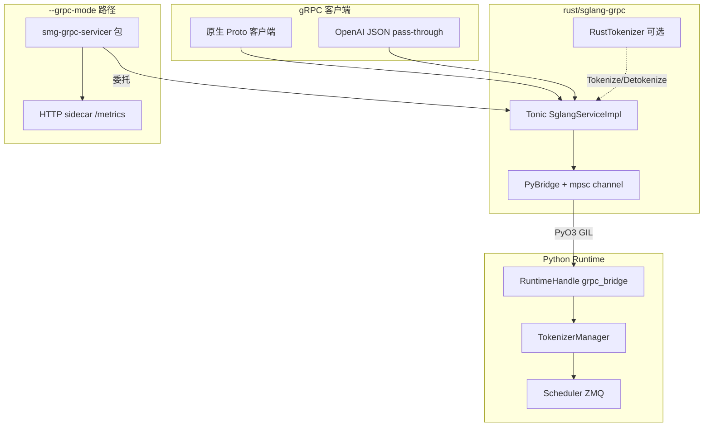

# gRPC/Proto：gRPC 与 Proto

> **阶段 I 收官批**：在 HTTP / OpenAI 兼容层之外，理解 SGLang 的 **gRPC 原生接口**——从 `.proto` 契约，到 Rust Tonic 服务，再到 Python Runtime 桥接。 
> **读者只读本目录，不打开 `sglang/` 源码树。**

---

## 本模块目标

1. 弄清 **Proto 契约**（`SglangService`）定义了哪些 RPC、消息类型如何分层。
2. 理解 **Rust 进程内 gRPC 服务器**（`rust/sglang-grpc`）如何通过 PyO3 调用 Python `RuntimeHandle`。
3. 区分 **`--grpc-mode` 独立部署** 与 **`SGLANG_ENABLE_GRPC` 伴生模式** 两条启动路径。
4. 追踪一条 **TextGenerate 流式请求** 从 Tonic handler → PyBridge → TokenizerManager 的完整链路。

---

## 源码范围

| 路径 | 职责 |
|------|------|
| `proto/sglang/runtime/v1/sglang.proto` | gRPC 服务与消息定义（单一事实来源） |
| `rust/sglang-grpc/` | Tonic 服务器、PyBridge、Rust tokenizer、Proto 编译 |
| `python/sglang/srt/entrypoints/grpc_server.py` | `--grpc-mode` 薄封装 + HTTP sidecar |
| `python/sglang/srt/entrypoints/grpc_bridge.py` | Python 侧 `RuntimeHandle`（Rust 回调入口） |
| `python/sglang/srt/grpc/` | PyO3 扩展包命名空间（`sglang.srt.grpc._core`） |
| `python/sglang/launch_server.py` | 启动分发：`grpc_mode` 分支 |

> **说明：** 计划中的 `srt/grpc/` 目录目前仅有 `__init__.py` 占位；真正的 gRPC 实现在 **Rust crate** 中，通过 `pyproject.toml` 的 `setuptools-rust` 编译为 `sglang.srt.grpc._core`。

---

## 架构一图



---

## 关键入口：`launch_server` 的 gRPC 分支

**Explain：** 用户显式传 `--grpc-mode` 时，不走 HTTP FastAPI，而是进入 `serve_grpc`——当前实现委托外部包 `smg-grpc-servicer`，内部再启动 Rust Tonic 服务与调度器。注释表明未来 `SGLANG_ENABLE_GRPC` 将让 gRPC **与 HTTP 并存**，届时可移除此 legacy 路径。

**Code：**

```python
# 来源：python/sglang/launch_server.py L15-L51
def run_server(server_args):
    """Run the server based on server_args.grpc_mode and server_args.encoder_only."""
    if server_args.encoder_only:
        # For encoder disaggregation
        if server_args.grpc_mode:
            from sglang.srt.disaggregation.encode_grpc_server import (
                serve_grpc_encoder,
            )

            asyncio.run(serve_grpc_encoder(server_args))
        else:
            from sglang.srt.disaggregation.encode_server import launch_server

            launch_server(server_args)
    elif server_args.grpc_mode:
        # TODO: Once the native Rust gRPC server starts alongside HTTP in the
        # default path below (controlled by SGLANG_ENABLE_GRPC / SGLANG_GRPC_PORT),
        # remove this legacy SMG path and the grpc_mode flag.
        from sglang.srt.entrypoints.grpc_server import serve_grpc

        asyncio.run(serve_grpc(server_args))
    elif server_args.use_ray:
        # Ray mode: HTTP mode with Ray backend.
        try:
            from sglang.srt.ray.http_server import launch_server
        except ImportError:
            raise ImportError(
                "Ray is required for --use-ray mode. "
                "Install it with: pip install 'sglang[ray]'"
            )

        launch_server(server_args)
    else:
        # Default mode: HTTP mode.
        from sglang.srt.entrypoints.http_server import launch_server

        launch_server(server_args)
```

**Comment：**
- `elif server_args.grpc_mode` 是**互斥模式**：gRPC 取代 HTTP，而非附加。
- `encoder_only + grpc_mode` 走 PD 分离的 Encoder gRPC，与本模块主链路不同（见 PD 分离）。
- 默认 `else` 分支是HTTP Server 的 HTTP 入口；`SGLANG_ENABLE_GRPC` 伴生模式尚未在此文件接线。

---

## 与相邻专题的关系

| 模块 | 衔接点 |
|------|--------|
| 02 启动链路 | `ServerArgs.grpc_mode`、`SGLANG_ENABLE_GRPC` / `SGLANG_GRPC_PORT` |
| 03 HTTP Server | 默认 HTTP 入口；gRPC sidecar 复用 Prometheus / profile 路由逻辑 |
| 04 OpenAI API | Proto 中 `ChatComplete` 等 RPC 为 JSON pass-through，复用 OpenAI serving 类 |
| 06 TokenizerManager | `RuntimeHandle.submit_request` 最终调用 `generate_request` |

---

## 验收标准

- [ ] 能说出 Proto 中 **三类 RPC**（原生 typed / OpenAI pass-through / Admin）各举一例
- [ ] 能解释 **PyBridge 的 mpsc channel + ChunkCallback** 如何把 Python 异步流变成 Rust gRPC stream
- [ ] 能区分 `--grpc-mode` 与 `SGLANG_ENABLE_GRPC` 的部署差异
- [ ] 五篇正文 ≥ 15 段内嵌源码，见 [[05-gRPC-Proto-05-checkpoint]]

---

## 文档索引

| 文件 | 内容 |
|------|------|
| [[05-gRPC-Proto-01-核心概念]] | 术语、设计动机、架构位置 |
| [[05-gRPC-Proto-02-源码走读]] | Proto → Rust → Python 按调用顺序精读 |
| [[05-gRPC-Proto-03-数据流与交互]] | 消息流、上下游、典型请求追踪 |
| [[05-gRPC-Proto-04-关键问题]] | FAQ、易错点、与 HTTP 对比 |
| [[05-gRPC-Proto-05-checkpoint]] | 读者自测清单 |
