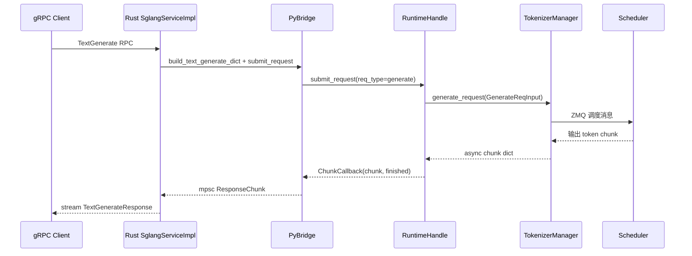

# gRPC/Proto：数据流与交互

---

## 1. 架构位置（layer:entrypoint + layer:runtime-core）



gRPC 层 **不绕过** TokenizerManager：与 HTTP 共用同一调度入口，差异仅在 **请求编解码** 与 **传输协议**。

---

## 2. 输入 / 输出对照

| 方向 | gRPC 类型 | 内部 Python 类型 | 说明 |
|------|-----------|------------------|------|
| 入（文本生成） | `TextGenerateRequest` | `GenerateReqInput` | Rust dict 映射 |
| 入（token 生成） | `GenerateRequest` | `GenerateReqInput` | 含 `input_ids` |
| 入（嵌入） | `TextEmbedRequest` / `EmbedRequest` | `EmbeddingReqInput` | `req_type=embed` |
| 入（OpenAI） | `OpenAIRequest.json_body` | OpenAI serving 解析后的内部对象 | 不经 typed proto |
| 出（流式） | `TextGenerateResponse` stream | chunk dict `{text, meta_info}` | `finished` 标记末包 |
| 出（Unary） | `TextEmbedResponse` | 单 chunk `{embedding, meta_info}` | 只收 Finished chunk |

**GenerateReqInput 构造处（Python）：**

```python
# 来源：python/sglang/srt/entrypoints/grpc_bridge.py L275-L278
        if req_type == "generate":
            from sglang.srt.managers.io_struct import GenerateReqInput

            obj = GenerateReqInput(**req_dict)
```

---

## 3. 上下游连接

| 上游/下游 | 模块 | 交互方式 | 代码位置 |
|-----------|------|----------|----------|
| 上游 | gRPC 客户端 / model-gateway | HTTP/2 + Protobuf | `server.rs` Tonic |
| 下游 | TokenizerManager | asyncio `generate_request` | `grpc_bridge._run_generate` |
| 下游 | Scheduler | ZMQ（经 TM 间接） | TokenizerManager |
| 平行 | HTTP sidecar | aiohttp GET/POST | `grpc_server._add_*_routes` |
| 外部包 | smg-grpc-servicer | Python import | `grpc_server.serve_grpc` |
| 构建 | proto/ | tonic-build | `build.rs` |

**OpenAI pass-through 提交路径：**

```rust
// 来源：rust/sglang-grpc/src/bridge.rs L411-L434
 pub fn submit_openai(
 &self,
 rid: &str,
 method_name: &str,
 json_body: &[u8],
 trace_headers: &HashMap<String, String>,
 ) -> PyResult<Receiver<ResponseChunk>> {
 self.submit_json(rid, move |py, runtime_handle, callback| {
 let kwargs = PyDict::new(py);
 kwargs.set_item("json_body", PyBytes::new(py, json_body))?;
 kwargs.set_item("chunk_callback", callback)?;
 runtime_handle.call_method(py, method_name, (), Some(&kwargs))?;
 Ok(())
 })
 }
```

---

## 4. 典型数据流：TextGenerate 流式请求

### 步骤 1 — 客户端发起 RPC

客户端发送 `TextGenerateRequest { text, stream=true, sampling_params }`。

### 步骤 2 — Rust 构造内部 dict

```rust
// 来源：rust/sglang-grpc/src/server.rs L226-L236
 let req = request.into_inner();
 let rid = req.rid.clone().unwrap_or_else(|| uuid::Uuid::new_v4().to_string());
 let req_dict = build_text_generate_dict(&rid, &req);
 let mut receiver = self.bridge
 .submit_request(&rid, "generate", req_dict)
 ...
```

### 步骤 3 — PyBridge 调用 Python

```rust
// 来源：rust/sglang-grpc/src/bridge.rs L190-L196
 kwargs.set_item("req_type", req_type)?;
 kwargs.set_item("req_dict", py_req_dict)?;
 kwargs.set_item("chunk_callback", callback)?;
 self.runtime_handle
 .call_method(py, "submit_request", (), Some(&kwargs))?;
```

### 步骤 4 — TokenizerManager 产出 chunk

Python `_run_generate` 在 TM event loop 上 `async for chunk in gen`，每个 decode step 一个 dict，含增量 `text` 与 `meta_info`。

### 步骤 5 — 背压与回写

若 Rust channel 满，`ChunkCallback` 返回 `Pending`；Python 注册 `on_ready`，待 Rust 消费后再发。流结束发 `finished=True` 的 `ResponseChunk::Finished`。

### 步骤 6 — Tonic 映射为 Proto 响应

```rust
// 来源：rust/sglang-grpc/src/server.rs L246-L259
 Ok(Some(ResponseChunk::Data(data))) => {
 yield Ok(proto::TextGenerateResponse {
 text: data.text.unwrap_or_default(),
 meta_info: data.meta_info,
 finished: false,
 });
 }
 Ok(Some(ResponseChunk::Finished(data))) => {
 yield Ok(proto::TextGenerateResponse {
 text: data.text.unwrap_or_default(),
 meta_info: data.meta_info,
 finished: true,
 });
 break;
 }
```

### 步骤 7 — 客户端断开时的取消传播

```rust
// 来源：rust/sglang-grpc/src/server.rs L115-L122
impl Drop for RequestAbortGuard {
 fn drop(&mut self) {
 if self.armed {
 spawn_abort(self.bridge.clone(), self.rid.clone());
 }
 }
}
```

Drop 流对象时 Rust 在 `spawn_blocking` 中调用 Python `abort(rid)`，释放 Scheduler 中的请求槽位。

---

## 5. Legacy `--grpc-mode` 启动数据流

```text
sglang serve --grpc-mode --model-path ...
 → launch_server.run_server (grpc_mode=True)
 → grpc_server.serve_grpc
 → smg_grpc_servicer.sglang.server.serve_grpc
 → 启动 Scheduler 子进程
 → 构造 RuntimeHandle(tokenizer_manager, ...)
 → sglang.srt.grpc._core.start_server(host, port, runtime_handle)
 → on_request_manager_ready → HTTP sidecar (port+1)
```

**Sidecar 端口默认值：**

```python
# 来源：python/sglang/srt/entrypoints/grpc_server.py L170-L174
    sidecar_port = (
        server_args.grpc_http_sidecar_port
        if server_args.grpc_http_sidecar_port is not None
        else server_args.port + 1
    )
```

---

## 6. meta_info 的跨语言编码

Python chunk 的 `meta_info` 可能含数字、布尔、嵌套对象；Proto 要求 `map<string,string>`。Bridge 在提取时用 JSON 字符串化：

```rust
// 来源：rust/sglang-grpc/src/bridge.rs L785-L800
fn extract_meta_info(chunk: &Bound<'_, PyDict>) -> HashMap<String, String> {
 ...
 // The proto schema is map<string, string>; encode each Python value as JSON
 // so clients can recover numbers, booleans, arrays, and objects losslessly.
 if let Ok(key) = k.extract::<String>()
 && let Ok(val) = py_value_to_json_string(&v)
 {
 meta.insert(key, val);
 }
 ...
}
```

客户端解析 `meta_info` 值时需按 JSON decode，而非当作 plain string。

---

## 7. 与 HTTP 路径的边界

| 维度 | HTTP（HTTP Server–OpenAI API） | gRPC（本模块） |
|------|-------------------|--------------|
| 协议 | REST / SSE | HTTP/2 + Protobuf |
| 入口 | FastAPI routes | Tonic `SglangService` |
| OpenAI 兼容 | 路径 + JSON body | `ChatComplete` 等 RPC + `json_body` |
| Tokenize | HTTP endpoint | `Tokenize` RPC（可 Rust 无 GIL） |
| Metrics | 同端口或独立 metrics port | gRPC 模式用 sidecar `/metrics` |
| 认证 | API key middleware（HTTP） | **当前 gRPC 无认证**（TODO grpc-auth） |

```rust
// 来源：rust/sglang-grpc/src/server.rs L974-L977
// TODO(grpc-auth): this listener is currently unauthenticated. Before exposing
// it in any default deploy path, gate it with the same API-key / admin-key
// checks the HTTP server applies.
```

---

## 8. 交互小结

1. **Proto 是边界契约**；gateway 与 server 共用同一 `.proto`。
2. **PyBridge 是性能关键**：隔离 GIL、channel 背压、abort 传播。
3. **TokenizerManager 是业务中枢**；gRPC 只是另一种「外壳」。
4. **Sidecar 补运维缺口**；纯 gRPC 端口不承载 Prometheus scrape。
