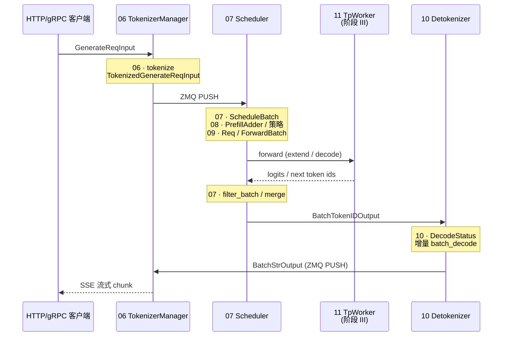

# 阶段 II · 请求调度（TokenizerManager–Detokenizer）

> **你只需阅读本目录，不必打开 `sglang/` 源码。** 
> 内嵌代码对应 sglang Git commit `70df09b`。

---

## 本阶段解决什么问题

阶段 I（阅读方法论–gRPC/Proto）讲清了「请求如何从 HTTP/gRPC 进来」。阶段 II 回答：**进来之后，SGLang 如何把文本变成 GPU batch、跑 forward、再把 token 变回文本推给客户端？**

五个专题覆盖调度子系统全链路：

| 模块 | 模块 | 一句话 |
|------|------|--------|
| [[06-TokenizerManager-00-MOC|06 TokenizerManager]] | 前台进程 | 文本 ↔ token id，ZMQ 与 Scheduler/Detokenizer 通信 |
| [[07-Scheduler-00-MOC|07 Scheduler]] | GPU 子进程核心 | continuous batching、prefill/decode 调度、OOM retract |
| [[08-SchedulePolicy-00-MOC|08 SchedulePolicy]] | 调度策略 | FCFS / LPM / 抢占、PrefillAdder 预算、Radix 前缀匹配 |
| [[09-ScheduleBatch-IO-00-MOC|09 ScheduleBatch-IO]] | 数据结构 | ScheduleBatch → ForwardBatch、Req、io_struct |
| [[10-Detokenizer-00-MOC|10 Detokenizer]] | 输出进程 | 增量 UTF-8 decode、DecodeStatus |

---

## 端到端时序（阶段 II 验收图）

满足 PLAN 阶段 II 验收：「TokenizerManager → Scheduler → TP Worker → Detokenizer 消息流」。

**Explain：** 数据面是 **三进程拓扑**：TokenizerManager（主进程）、Scheduler+TpWorker（GPU 子进程）、Detokenizer（独立 CPU 进程）。Scheduler **不直接**与 Detokenizer 对话——token id 经 Scheduler 发出，Detokenizer 收完后 PUSH 回 TokenizerManager，再由 TM 组装 HTTP 响应。

---

## 零基础一句话

**像餐厅运营：** 06 是前台点单员，07+08 是后厨排班与配菜规则，09 是订单卡片格式，10 是传菜员把菜名翻译成客人能看懂的文本。

---

## 推荐阅读顺序

严格按专题顺序 06 → 07 → 08 → 09 → 10。若时间紧，最低闭环：**06 → 07 → 10**（跳过策略与 IO 细节，但读 09 的 ScheduleBatch vs ForwardBatch 对比仍强烈建议）。

| 顺序 | 文档 | 必读理由 |
|------|------|----------|
| 1 | [[06-TokenizerManager-01-核心概念|06/01-核心概念]] | 理解 ReqState、Mixin、generate_request 入口 |
| 2 | [[07-Scheduler-02-源码走读|07/02-源码走读]] | event loop、overlap、retract 主路径 |
| 3 | [[08-SchedulePolicy-01-核心概念|08/01-核心概念]] | LPM 与 RadixCache 如何协同 |
| 4 | [[09-ScheduleBatch-IO-04-关键问题|09/04-关键问题]] | ScheduleBatch vs ForwardBatch（最高频混淆） |
| 5 | [[10-Detokenizer-02-源码走读|10/02-源码走读]] | UTF-8 增量 decode 机制 |

---

## 阶段衔接

| 方向 | 模块 | 衔接点 |
|------|------|--------|
| ← 上一阶段 | 01–05 启动与入口 | HTTP `generate_request` → 06 TokenizerManager |
| → 下一阶段 | 11–14 模型执行 | 07 Scheduler 调用 TpWorker → 11 ModelRunner |
| → 内存核心 | 15–16 | 08 LPM 依赖 RadixAttention prefix match |
| → 高级 | 20–22 | 07 overlap 与 21 投机解码；22 PD 分离 mixin |

---

## 验证建议（零基础可试）

1. **启动服务：** `sglang serve --model-path <small-model>`，另开终端 `curl -N` 流式请求，观察首 token 延迟。
2. **进程拓扑：** `ps aux | grep -E 'Tokenizer|Scheduler|Detokenizer'`（Windows 可用任务管理器）应见三个相关进程。
3. **策略对比：** 同一长 system prompt 两次请求，第二次 `--schedule-policy lpm` 时 TTFT 应低于 `fcfs`（需开启 RadixCache）。

---

## 模块导航

| 模块 | 目录 | 状态 |
|------|------|------|
| 06 | [[06-TokenizerManager-00-MOC|TokenizerManager]] | ✅ |
| 07 | [[07-Scheduler-00-MOC|Scheduler]] | ✅ |
| 08 | [[08-SchedulePolicy-00-MOC|SchedulePolicy]] | ✅ |
| 09 | [[09-ScheduleBatch-IO-00-MOC|ScheduleBatch-IO]] | ✅ |
| 10 | [[10-Detokenizer-00-MOC|Detokenizer]] | ✅ |

← [[01-启动与入口-00-MOC|启动与入口]] · → [[03-模型执行-00-MOC|阶段 III：模型执行]]
