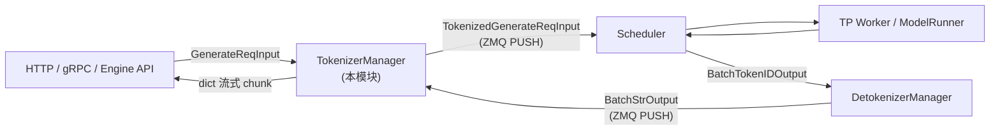

# TokenizerManager

> **阶段 II · 请求调度** | 状态：已完成 | Git：`70df09b83363e0127b43c83a6007d3938f815b2d` 
> **源码范围：** `srt/managers/tokenizer_manager.py` 及 Mixin 系列

---

## 本模块在架构中的位置

TokenizerManager 是 SGLang Runtime **前台进程**的核心：不承担 GPU 推理，负责输入侧文本/多模态 → token ids、采样参数校验、LoRA 解析，以及输出侧接收 Detokenizer 回传、组装流式 chunk。它通过 ZMQ 与 Scheduler（PUSH tokenized 请求）和 Detokenizer（PULL 字符串输出）通信；控制面（权重更新、flush cache）经 Mixin 广播到 Scheduler。HTTP/gRPC 层最终调用 `generate_request` 作为数据面统一入口。



---

## 零基础一句话

**像餐厅前台的「点单员+传菜员」**：把客人菜单（文本）翻译成厨房订单（token ids）送给后厨（Scheduler），再把做好的菜（解码文本）端回客人桌上。

---

## 用户场景

**Persona：** 后端工程师小赵接入 OpenAI 兼容 API，需要理解流式 SSE 如何从 `generate_request` 的 async generator 逐 chunk 产出。她关心：权重热更新时 `is_pause_cond` 如何暂停新请求，以及多 HTTP Worker 模式下 `TokenizerWorker` 如何路由 Detokenizer 回传。

---

## 五件套阅读顺序

| 顺序 | 文件 | 一句话说明 |
|------|------|------------|
| 01 | [[06-TokenizerManager-01-核心概念]] | ReqState、Mixin 分层、分词策略与控制面分离 |
| 启动链路 | [[06-TokenizerManager-02-源码走读]] | `generate_request`、handle_loop、ZMQ 收发精读 |
| HTTP Server | [[06-TokenizerManager-03-数据流与交互]] | ZMQ 通道、上下游、典型 generate 时序 |
| OpenAI API | [[06-TokenizerManager-04-关键问题]] | FAQ、与 Scheduler 边界、pause/LoRA 热更新 |
| ✓ | [[06-TokenizerManager-05-checkpoint]] | 验收：能否追踪 HTTP 请求到首次 token 回传路径 |

---

## 核心源码锚点

**Explain：** HTTP/gRPC 层收到用户请求后，最终调用 `TokenizerManager.generate_request`。这是**数据面**的统一入口：规范化输入 → 等待 pause 解除 → 分词 → ZMQ 发给 Scheduler → 异步等待 Detokenizer 回传并 yield 流式 chunk。

**Code：**

```python
# 来源：python/sglang/srt/managers/tokenizer_manager.py L589-L636
    async def generate_request(
        self,
        obj: Union[GenerateReqInput, EmbeddingReqInput],
        request: Optional[fastapi.Request] = None,
    ):
        self.auto_create_handle_loop()

        # Normalize the request
        obj.normalize_batch_and_arguments()
        self._set_default_priority(obj)

        if isinstance(obj, GenerateReqInput) and obj.routed_dp_rank is not None:
            dp_size = self.server_args.dp_size
            if dp_size <= 1 and obj.routed_dp_rank == 0:
                logger.debug(
                    f"routed_dp_rank={obj.routed_dp_rank} is ignored because dp_size={dp_size}"
                )
            elif obj.routed_dp_rank < 0 or obj.routed_dp_rank >= dp_size:
                raise ValueError(
                    f"routed_dp_rank={obj.routed_dp_rank} out of range [0, {dp_size})"
                )

        self._init_req_state(obj, request)
        try:
            if self.server_args.language_only:
                self._handle_epd_disaggregation_encode_request(obj)

            # Log the request
            self.request_logger.log_received_request(obj, self.tokenizer, request)

            async with self.is_pause_cond:
                await self.is_pause_cond.wait_for(lambda: not self.is_pause)

            async with self.model_update_lock.reader_lock:
                await self._validate_and_resolve_lora(obj)

                # Tokenize the request and send it to the scheduler
                if obj.is_single:
                    tokenized_obj = await self._tokenize_one_request(obj)
                    state = self.rid_to_state[obj.rid]
                    if obj.return_prompt_token_ids:
                        state.prompt_token_ids = list(tokenized_obj.input_ids)
                    self._send_one_request(tokenized_obj)
                    async for response in self._wait_one_response(obj, request):
                        yield response
                else:
                    async for response in self._handle_batch_request(obj, request):
                        yield response
```

**Comment：**

- `auto_create_handle_loop()` 懒启动后台协程，专门从 Detokenizer 收 ZMQ 消息并唤醒 `ReqState.event`。
- `is_pause_cond` + `model_update_lock.reader_lock`：权重热更新时暂停新请求或串行化读写。
- `yield` 使本函数成为**异步生成器**，上层 HTTP 可逐 chunk 流式返回 SSE。
- 单请求走 `_tokenize_one_request` → `_send_one_request`；批请求走 `_handle_batch_request`。

---

## 验证建议

1. **CLI：** 正常启动服务后 `curl` 流式请求，日志应出现 `log_received_request` 与 ZMQ send 相关 trace。
2. **日志：** 搜索 `TokenizerManager` / `handle_loop`；权重更新时可见 `is_pause` 相关 pause/resume 日志。

---

## 阅读路径

← [[05-gRPC-Proto-00-MOC|gRPC/Proto：gRPC 与 Proto]] 
→ [[07-Scheduler-00-MOC|Scheduler]]
