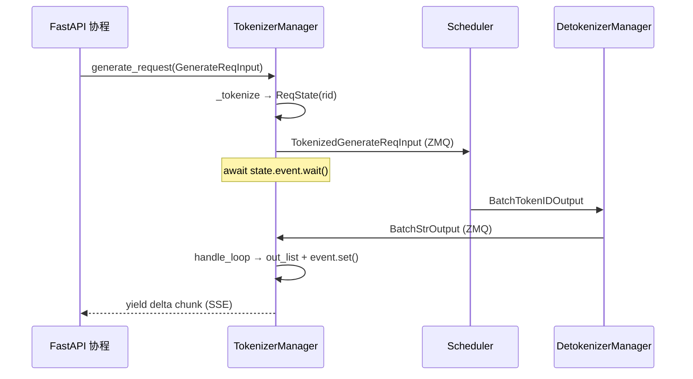
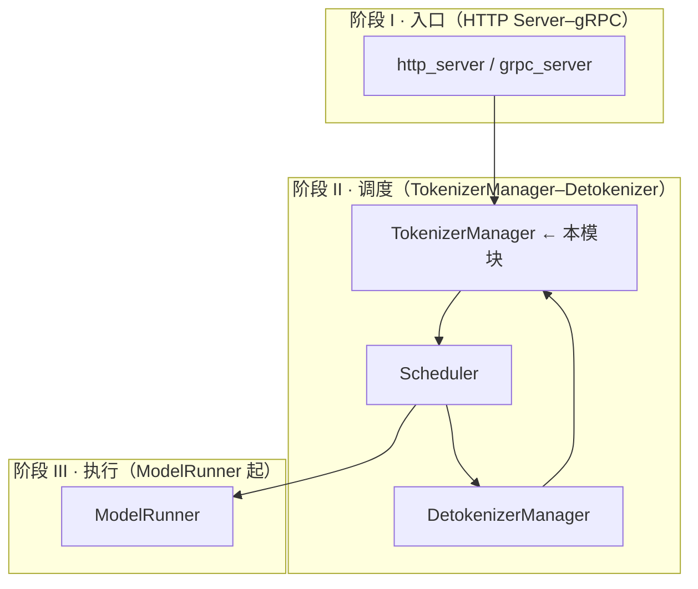

# TokenizerManager · 核心概念

## 用户故事：SSE 流式客服回复 — TokenizerManager 如何「等 GPU、收 Detokenizer、推 delta」

### Persona

**小周**，某 B 端 SaaS 的后端开发。产品用 OpenAI 兼容 `/v1/chat/completions`，`stream=True` 逐字输出客服回复。小周不关心 GPU batch 怎么组，但需要搞清：**HTTP 协程为何能一边等一边收 chunk、为何有时中间包没有 text**。

### 时间线

| 时刻 | 事件 |
|------|------|
| T0 | 客户端 POST；FastAPI 调用 `tokenizer_manager.generate_request()`，分配 `rid` 与 `ReqState` |
| T0+5ms | `_tokenize_one_request` 把 messages 模板化 → `input_ids`；构造 `TokenizedGenerateReqInput` 经 ZMQ 发给 Scheduler |
| T0+120ms | Detokenizer 首包 `BatchStrOutput` 到达；`handle_loop` 写入 `state.out_list` 并 `event.set()` |
| T0+121ms | `_wait_one_response` 被唤醒，组装 SSE delta（`incremental_streaming_output=True` 时只含新增 text） |
| T1 | 生成结束；`state.finished=True`，HTTP 连接关闭，Scheduler 侧 rid 生命周期结束 |

### 涉及模块



**Explain：** TokenizerManager 是**主进程里的异步枢纽**：分词在 CPU 完成，GPU 推理在 Scheduler 子进程。每个 `rid` 对应一个 `ReqState`，HTTP 协程通过 `asyncio.Event` 与后台 `handle_loop` 解耦——后者持续收 ZMQ 包、前者按需 drain `out_list`。流式模式下 Detokenizer 做增量 decode，TokenizerManager 只负责把 delta 包装成 OpenAI 格式。

**Code：**

```python
# 来源：python/sglang/srt/managers/tokenizer_manager.py L152-L172
# 提交版本：70df09b
@dataclasses.dataclass
class ReqState:
    """Store the state a request."""

    out_list: List[Dict[Any, Any]]
    finished: bool
    event: asyncio.Event
    obj: Union[GenerateReqInput, EmbeddingReqInput]

    # For performance metrics
    time_stats: APIServerReqTimeStats
    last_completion_tokens: int = 1
    ttft_observed: bool = False

    # For streaming output
    last_output_offset: int = 0

    # Accumulate text lazily so incremental streaming can emit the incoming
    # delta directly without rebuilding the full output prefix.
    text: str = ""
    text_chunks: List[str] = dataclasses.field(default_factory=list)
```

**Comment：**

- `out_list` 是 Detokenizer → TokenizerManager 的**增量队列**；`_wait_one_response` 一次性 drain 后清空，避免重复推送。
- `text_chunks` 懒拼接，避免流式每步 O(n) 重建完整前缀字符串。
- 控制面（LoRA 加载、flush cache）走 `TokenizerControlMixin` + `FanOutCommunicator`，与按 `rid` 多路复用的数据面分离。

### 如果…会怎样（调试）

| 现象 | 可能原因 | 排查 |
|------|----------|------|
| 流式中间 chunk `text=None` | 未开 `incremental_streaming_output`，非末包设计如此 | 见 [[06-TokenizerManager-04-关键问题]] |
| `cannot accept text prompts` | `--skip-tokenizer-init` 但仍传 `text` | 改传 `input_ids` 或关闭 skip |
| 长时间无响应 | 权重热更新触发 `is_pause` / `model_update_lock` | 检查 Admin API 是否在 swap 权重 |

---

## 1. TokenizerManager 的角色

**Explain：** TokenizerManager 是 SGLang Runtime 中**前台进程**的核心组件。它不承担 GPU 推理，而是负责：

- **输入侧**：文本/多模态 → token ids、采样参数校验、LoRA 解析
- **输出侧**：接收 Detokenizer 的 batch 输出，组装 `meta_info`、流式 delta、logprob
- **控制面**：通过 Mixin 向 Scheduler 广播权重更新、flush cache、LoRA 加载等

在单进程部署中，它与 HTTP Server 同进程；多 HTTP Worker 模式下，每个 Worker 是一个 `TokenizerWorker` 子类实例。

**Code：**

```python
# 来源：python/sglang/srt/managers/tokenizer_manager.py L244-L245, L14
# 提交版本：70df09b
class TokenizerManager(TokenizerControlMixin, TokenizerManagerScoreMixin):
    """TokenizerManager is a process that tokenizes the text."""
```

**Comment：**

- 类名中的 "Tokenizer" 强调**分词**职责，但现代实现已扩展为完整的**请求生命周期管理器**。
- 通过 **Mixin 组合** 而非单一巨型类，把控制面（Control）和打分（Score）逻辑拆到独立文件。

---

## 2. ReqState — 单请求在 TokenizerManager 内的状态机

**Explain：** 每个 `rid`（request id）在 `rid_to_state` 中对应一个 `ReqState`。HTTP 协程在 `_wait_one_response` 里 `await state.event.wait()`；`handle_loop` 收到 Detokenizer 输出后往 `state.out_list` 追加并 `event.set()` 唤醒。

**Code：**

```python
# 来源：python/sglang/srt/managers/tokenizer_manager.py L152-L172
# 提交版本：70df09b
@dataclasses.dataclass
class ReqState:
    """Store the state a request."""

    out_list: List[Dict[Any, Any]]
    finished: bool
    event: asyncio.Event
    obj: Union[GenerateReqInput, EmbeddingReqInput]

    # For performance metrics
    time_stats: APIServerReqTimeStats
    last_completion_tokens: int = 1
    ttft_observed: bool = False

    # For streaming output
    last_output_offset: int = 0

    # Accumulate text lazily so incremental streaming can emit the incoming
    # delta directly without rebuilding the full output prefix.
    text: str = ""
    text_chunks: List[str] = dataclasses.field(default_factory=list)
```

**Comment：**

| 字段 | 含义 |
|------|------|
| `out_list` | Detokenizer 推送的增量输出队列，`_wait_one_response` 一次性 drain |
| `event` | asyncio 条件变量，连接「后台收包」与「前台等待」 |
| `text_chunks` | 懒拼接文本，避免流式每步 O(n) 重建前缀 |
| `output_ids` / logprob 系列 | 增量累积，供 `convert_logprob_style` 最终 detokenize |

---

## 3. Mixin 分层：数据面 vs 控制面 vs 打分

**Explain：** `TokenizerManager` 本体负责数据面（分词、ZMQ 与 Scheduler/Detokenizer 通信），控制面与打分能力通过 **Mixin 多重继承** 叠加：`TokenizerControlMixin` 用 `FanOutCommunicator` 向所有 DP Scheduler 广播权重/LoRA/cache 操作；`TokenizerManagerScoreMixin` 处理 `/v1/score`；多 HTTP Worker 场景则由 `MultiTokenizerRouter` 做路由，而非改 TokenizerManager 核心类。

| Mixin | 文件 | 职责 |
|-------|------|------|
| `TokenizerControlMixin` | `tokenizer_control_mixin.py` | FanOutCommunicator → Scheduler：权重、LoRA、cache、profile |
| `TokenizerManagerScoreMixin` | `tokenizer_manager_score_mixin.py` | `/v1/score`：query+items 拼接、MIS 多 item |
| `MultiTokenizerRouter` 等 | `multi_tokenizer_mixin.py` | 多 HTTP Worker 路由，非 TokenizerManager 本体 |

**Code：**

```python
# 来源：python/sglang/srt/managers/tokenizer_control_mixin.py L124-L142
# 提交版本：70df09b
class TokenizerControlMixin:
    """Mixin for TokenizerManager's control-plane operations (weights, cache, lora,
    profile, internal state, etc.) -- everything that talks to the scheduler via
    FanOutCommunicator, as opposed to data-plane inference requests multiplexed by rid.
    """

    def init_communicators(self: TokenizerManager, server_args: ServerArgs):
        dispatch_pairs = []
        for spec in _COMMUNICATOR_SPECS:
            name, resp_type = spec[0], spec[1]
            mode = spec[2] if len(spec) > 2 else "queueing"
            comm = FanOutCommunicator(
                self._dispatch_to_scheduler,
                server_args.dp_size,
                mode,
            )
            setattr(self, f"{name}_communicator", comm)
            dispatch_pairs.append((resp_type, comm.handle_recv))
        self._result_dispatcher += TypeBasedDispatcher(dispatch_pairs)
```

**Comment：**

- **数据面**请求带唯一 `rid`，Scheduler 按 rid 路由输出；**控制面**通过 `FanOutCommunicator` 向所有 DP rank 广播并 merge 结果。
- `_COMMUNICATOR_SPECS` 声明式注册 20+ 种控制操作，避免在 `init_request_dispatcher` 里手写 switch。

---

## 4. 分词策略与 InputFormat

**Explain：** `_tokenize_texts` 先用 `InputFormat` 检测输入是单串、批串还是 cross-encoder 对，再在三套路径间选择。单串且开启 `enable_dynamic_batch_tokenizer` 时走 `AsyncDynamicbatchTokenizer` 合并小请求；非 fast tokenizer 逐条 `encode`；其余走 HF `tokenizer(texts, ...)` 批量路径以摊薄 Python 开销。

**Code：**

```python
# 来源：python/sglang/srt/managers/tokenizer_manager.py L236-L241
# 提交版本：70df09b
class InputFormat(Enum):
    """Input format types for tokenization handling."""

    SINGLE_STRING = 1  # Regular single text like "Hello world"
    BATCH_STRINGS = 2  # Regular batch like ["Hello", "World"]
    CROSS_ENCODER_PAIRS = 3  # Cross-encoder pairs like [["query", "document"]]
```

```python
# 来源：python/sglang/srt/managers/tokenizer_manager.py L648-L669
# 提交版本：70df09b — TokenizerManager 实例方法（与 InputFormat 同级，不在 Enum 内）
    def _detect_input_format(
        self, texts: Union[str, List[str]], is_cross_encoder: bool
    ) -> InputFormat:
        """Detect the format of input texts for proper tokenization handling.

        Returns:
            - InputFormat.SINGLE_STRING: Regular single text like "Hello world"
            - InputFormat.BATCH_STRINGS: Regular batch like ["Hello", "World"]
            - InputFormat.CROSS_ENCODER_PAIRS: Cross-encoder pairs like [["query", "document"]]
        """
        if isinstance(texts, str):
            return InputFormat.SINGLE_STRING

        if (
            is_cross_encoder
            and len(texts) > 0
            and isinstance(texts[0], list)
            and len(texts[0]) == 2
        ):
            return InputFormat.CROSS_ENCODER_PAIRS

        return InputFormat.BATCH_STRINGS
```

**Comment：**

- Cross-encoder（如 reranker）需要 `token_type_ids` 区分 query/document 段。
- Embedding 请求的 `is_cross_encoder_request` 标志触发该分支。

---

## 5. Tiktoken 后端

**Explain：** 部分模型（如基于 xtok 训练的 checkpoint）不走 HuggingFace `AutoTokenizer`，而使用 `srt/tokenizer/tiktoken_tokenizer.py` 从 JSON 构建 `tiktoken.Encoding`，并适配 HF 接口（`encode` / `apply_chat_template` / `init_xgrammar`）。

**Code：**

```python
# 来源：python/sglang/srt/tokenizer/tiktoken_tokenizer.py L29-L56, L110-L111
# 提交版本：70df09b
class TiktokenTokenizer:
    def __init__(self, tokenizer_path):
        import tiktoken
        from jinja2 import Template

        # Read the JSON
        with open(tokenizer_path, "rb") as fin:
            xtok_dict = json.load(fin)

        # Copy from train/xlm/tokenizers/tiktoken_wrapper.py::Encoding::from_xtok_dict
        mergeable_ranks = {
            bytes(item["bytes"]): item["token"] for item in xtok_dict["regular_tokens"]
        }
        special_tokens = {
            bytes(item["bytes"]).decode(): item["token"]
            for item in xtok_dict["special_tokens"]
        }
        if xtok_dict["word_split"] == "V1":
            pad_str = PAT_STR_B
        else:
            assert False, f"Unknown word_split: {xtok_dict['word_split']}"
        pad_str = xtok_dict.get("pat_str", pad_str)

        kwargs = {
            "name": tokenizer_path,
            "pat_str": pad_str,
            "mergeable_ranks": mergeable_ranks,
            "special_tokens": special_tokens,
```

**Comment：**

- `get_tokenizer(..., tokenizer_backend=...)` 在 `init_tokenizer_and_processor` 中间接选用此实现。
- `init_xgrammar` 为结构化输出（JSON schema）提供 xgrammar 所需的 vocab 映射。

---

## 6. 架构位置（阶段 II 调度层）



TokenizerManager 是**调度层最靠近 API 的一跳**：它把用户语义（文本、采样参数）转换为 Scheduler 能消费的 **IO 结构体**（ScheduleBatch-IO 详述 `io_struct.py`）。
