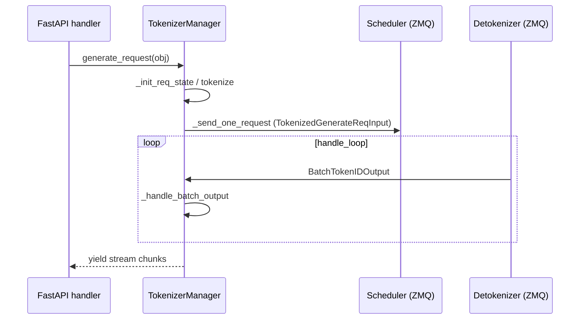

# TokenizerManager · 源码走读

> 走读顺序：`__init__` → `generate_request` → 分词链路 → ZMQ 发送 → `handle_loop` → 输出处理 → Mixin 扩展

---

## 1. 初始化：七段式 init

### 1.1 `__init__` 总览

**Explain：** 构造函数按固定顺序初始化七块子系统，便于子类（如 `TokenizerWorker`）覆写单个 `init_*` 方法。

**Code：**

```python
# 来源：python/sglang/srt/managers/tokenizer_manager.py L257-L297
# 提交版本：70df09b
    def __init__(
        self,
        server_args: ServerArgs,
        port_args: PortArgs,
    ):
        # Parse args
        self.server_args = server_args
        self.enable_metrics = server_args.enable_metrics
        self.preferred_sampling_params = server_args.preferred_sampling_params
        self.crash_dump_folder = server_args.crash_dump_folder
        set_global_server_args_for_tokenizer(server_args)

        # Init model config
        self.init_model_config()

        # Initialize tokenizer and multimodalprocessor
        self.init_tokenizer_and_processor()

        # Init inter-process communication
        self.init_ipc_channels(port_args)

        # Init running status
        self.init_running_status()

        # Init logging and dumping
        self.init_request_logging_and_dumping()

        # Init weight update
        self.init_weight_update()

        # Init LoRA status
        self.init_lora()

        # Init PD disaggregation and encoder disaggregation
        self.init_disaggregation()

        # Init metric collector and watchdog
        self.init_metric_collector_watchdog()

        # Init request dispatcher
        self.init_request_dispatcher()
```

**Comment：**

| 步骤 | 关键产物 |
|------|----------|
| `init_model_config` | `model_config`、`is_generation`、`num_reserved_tokens`（EAGLE 预留） |
| `init_tokenizer_and_processor` | `tokenizer` / `mm_processor` / `async_dynamic_batch_tokenizer` |
| `init_ipc_channels` | ZMQ `send_to_scheduler`、`recv_from_detokenizer` |
| `init_weight_update` | `model_update_lock`、`is_pause` |
| `init_request_dispatcher` | `_result_dispatcher` + `init_communicators` |

---

### 1.2 `init_ipc_channels` — ZMQ 通道

**Explain：** TokenizerManager 与 Scheduler、Detokenizer 之间通过 **ZMQ IPC**（Unix domain socket 或 TCP）通信。单 Worker 直连 Scheduler；多 Worker 先连 `MultiTokenizerRouter`。

**Code：**

```python
# 来源：python/sglang/srt/managers/tokenizer_manager.py L382-L413
# 提交版本：70df09b
    def init_ipc_channels(self, port_args: PortArgs):
        context = zmq.asyncio.Context(2)
        self.recv_from_detokenizer = get_zmq_socket(
            context, zmq.PULL, port_args.tokenizer_ipc_name, True
        )
        if self.server_args.tokenizer_worker_num == 1:
            self.send_to_scheduler = get_zmq_socket(
                context, zmq.PUSH, port_args.scheduler_input_ipc_name, True
            )
            self.tokenizer_ipc_name = None
        else:
            # Use tokenizer_worker_ipc_name in multi-tokenizer mode
            self.send_to_scheduler = get_zmq_socket(
                context, zmq.PUSH, port_args.tokenizer_worker_ipc_name, False
            )
            self.tokenizer_ipc_name = port_args.tokenizer_ipc_name

        self.load_snapshot_reader = create_load_snapshot_reader(
            self.server_args,
            port_args,
            caller="TokenizerManager",
        )

    def _dispatch_to_scheduler(self, obj: Any) -> None:
        if self.tokenizer_ipc_name is not None:
            stamp_http_worker_ipc(obj, self.tokenizer_ipc_name)
        sock_send(self.send_to_scheduler, obj)

    async def _async_dispatch_to_scheduler(self, obj: Any) -> None:
        if self.tokenizer_ipc_name is not None:
            stamp_http_worker_ipc(obj, self.tokenizer_ipc_name)
        await async_sock_send(self.send_to_scheduler, obj)
```

**Comment：**

- `PULL` 绑定在 `tokenizer_ipc_name`（收 Detokenizer）；`PUSH` 连 Scheduler 输入（发请求）。
- 多 Worker 时 `stamp_http_worker_ipc` 给每个请求打上 `http_worker_ipc`，Detokenizer 才能把结果路由回正确的 Worker。

---

## 2. `generate_request` — 数据面主流程

### 2.1 入口：normalize → pause 等待 → 分词 → ZMQ → 流式 yield

**Explain：** `generate_request` 是 HTTP `/generate` 与 OpenAI 兼容层汇入的**唯一异步生成入口**。先 `normalize_batch_and_arguments` 统一 batch 形态；`_init_req_state` 为每个 (sub)request 建 `ReqState` 并注册 `rid_to_state`；在 `is_pause_cond` 与 `model_update_lock` 保护下分词并 `_send_one_request`；最后 `_wait_one_response` 异步 yield 每个 output chunk。任一步失败且请求尚未进 Scheduler，必须 `_discard_pending_req_states` 清理，否则 `rid_to_state` 泄漏。

**Code：**

```python
# 来源：python/sglang/srt/managers/tokenizer_manager.py L589-L646
# 提交版本：70df09b
    async def generate_request(
        self,
        obj: Union[GenerateReqInput, EmbeddingReqInput],
        request: Optional[fastapi.Request] = None,
    ):
        self.auto_create_handle_loop()

        # Normalize the request
        obj.normalize_batch_and_arguments()
        self._set_default_priority(obj)

        if isinstance(obj, GenerateReqInput) and obj.routed_dp_rank is not None:
            dp_size = self.server_args.dp_size
            if dp_size <= 1 and obj.routed_dp_rank == 0:
                logger.debug(
                    f"routed_dp_rank={obj.routed_dp_rank} is ignored because dp_size={dp_size}"
                )
            elif obj.routed_dp_rank < 0 or obj.routed_dp_rank >= dp_size:
                raise ValueError(
                    f"routed_dp_rank={obj.routed_dp_rank} out of range [0, {dp_size})"
                )

        self._init_req_state(obj, request)
        try:
            if self.server_args.language_only:
                self._handle_epd_disaggregation_encode_request(obj)

            # Log the request
            self.request_logger.log_received_request(obj, self.tokenizer, request)

            async with self.is_pause_cond:
                await self.is_pause_cond.wait_for(lambda: not self.is_pause)

            async with self.model_update_lock.reader_lock:
                await self._validate_and_resolve_lora(obj)

                # Tokenize the request and send it to the scheduler
                if obj.is_single:
                    tokenized_obj = await self._tokenize_one_request(obj)
                    state = self.rid_to_state[obj.rid]
                    if obj.return_prompt_token_ids:
                        state.prompt_token_ids = list(tokenized_obj.input_ids)
                    self._send_one_request(tokenized_obj)
                    async for response in self._wait_one_response(obj, request):
                        yield response
                else:
                    async for response in self._handle_batch_request(obj, request):
                        yield response
        except Exception:
            # _init_req_state created a rid_to_state entry per (sub-)request up
            # front. The normal remover is the scheduler-response path
            # (_handle_batch_output), so a failure *before* a request reaches the
            # scheduler -- e.g. input-length validation rejecting an over-context
            # request -- would otherwise leak those entries forever. Drop any that
            # are still pending; entries already removed on the normal completion
            # path are left untouched (pop is a no-op).
            self._discard_pending_req_states(obj)
            raise
```

**Comment：**

| 阶段 | 关键函数 | 失败时 |
|------|----------|--------|
| 状态注册 | `_init_req_state` | except 路径 `_discard_pending_req_states` |
| 权重热更新 / pause | `is_pause_cond`、`model_update_lock` | 阻塞直到 unpause |
| 单请求 | `_tokenize_one_request` → `_send_one_request` | 分词校验失败 → discard |
| 批请求 | `_handle_batch_request` | 同上 |
| 输出 | `_wait_one_response` / `handle_loop` | 正常完成由 scheduler 响应路径 pop state |



### 2.2 异常路径：为何必须 discard

**Explain：** `_init_req_state` 在 try 之前执行——若 `_tokenize_one_request` 因超长 context 等抛错，Scheduler 从未收到请求，但 `rid_to_state` 已写入。正常完成由 `_handle_batch_output` 清理；异常路径必须 `_discard_pending_req_states`，否则内存与 rid 泄漏。

**Code：**

```python
# 来源：python/sglang/srt/managers/tokenizer_manager.py L637-L646（注释节选）
        except Exception:
            # _init_req_state created a rid_to_state entry per (sub-)request up
            # front. The normal remover is the scheduler-response path
            # (_handle_batch_output), so a failure *before* a request reaches the
            # scheduler -- e.g. input-length validation rejecting an over-context
            # request -- would otherwise leak those entries forever. Drop any that
            # are still pending; entries already removed on the normal completion
            # path are left untouched (pop is a no-op).
            self._discard_pending_req_states(obj)
            raise
```

**Comment：** 生产排障：若 rid 计数只增不减，查是否在 tokenize 阶段抛错且未走 discard（旧版本 bug 类问题）。

---

## 3. 分词链路

### 3.1 `_tokenize_one_request`

**Explain：** 单请求分词是 TokenizerManager 最复杂的函数之一：支持 `input_ids` 直传、`input_embeds`、多模态 processor、EPD 编码器分离等分支。

**Code：**

```python
# 来源：python/sglang/srt/managers/tokenizer_manager.py L793-L832
# 提交版本：70df09b
    async def _tokenize_one_request(
        self,
        obj: Union[GenerateReqInput, EmbeddingReqInput],
    ):
        """Tokenize one request."""
        # Tokenize
        input_embeds = None
        input_text = obj.text
        token_type_ids = None
        is_cross_encoder_request = (
            isinstance(obj, EmbeddingReqInput) and obj.is_cross_encoder_request
        )
        if obj.input_embeds is not None:
            if not self.server_args.disable_radix_cache:
                raise ValueError(
                    "input_embeds is provided while disable_radix_cache is False. "
                    "Please add `--disable-radix-cache` when you launch the server "
                    "if you want to use input_embeds as inputs."
                )
            input_embeds = obj.input_embeds
            input_ids = obj.input_ids
        elif obj.input_ids is not None:
            input_ids = obj.input_ids
        else:
            if self.tokenizer is None:
                raise ValueError(
                    "The engine initialized with skip_tokenizer_init=True cannot "
                    "accept text prompts. Please provide input_ids or re-initialize "
                    "the engine with skip_tokenizer_init=False."
                )

            # For audio-only requests (e.g., Whisper), text may be empty.
            # The multimodal processor will provide input_ids later.
            if not input_text and self.mm_processor and obj.contains_mm_input():
                # Use empty placeholder - multimodal processor will override
                input_ids = []
            else:
                input_ids, token_type_ids = await self._tokenize_texts(
                    input_text, is_cross_encoder_request
                )
```

**Comment：**

- 优先级：`input_embeds` > `input_ids` > 文本分词。
- `input_embeds` 必须 `--disable-radix-cache`，因为 Radix 树按 token id 索引，无法共享 arbitrary embedding。
- 纯音频（Whisper）可能 `text=""`，由 `mm_processor` 后续填充 `input_ids`。

---

### 3.2 `_tokenize_texts` — 策略选择

**Code：**

```python
# 来源：python/sglang/srt/managers/tokenizer_manager.py L757-L786
# 提交版本：70df09b
        # Step 3: Choose tokenization strategy
        use_async_tokenizer = (
            self.async_dynamic_batch_tokenizer is not None
            and input_format == InputFormat.SINGLE_STRING
        )

        if use_async_tokenizer:
            logger.debug("Using async dynamic batch tokenizer for single text")
            result = await self.async_dynamic_batch_tokenizer.encode(
                tokenizer_input[0], **tokenizer_kwargs
            )
            # Convert to batch format for consistency
            input_ids = [result["input_ids"]]
            token_type_ids = (
                [result["token_type_ids"]]
                if is_cross_encoder and result.get("token_type_ids")
                else None
            )
        else:
            logger.debug(f"Using regular tokenizer for {len(tokenizer_input)} inputs")

            if not is_cross_encoder and (not getattr(self.tokenizer, "is_fast", False)):
                input_ids = [self.tokenizer.encode(t) for t in tokenizer_input]
                token_type_ids = None
            else:
                encoded = self.tokenizer(tokenizer_input, **tokenizer_kwargs)
                input_ids = encoded["input_ids"]
                token_type_ids = (
                    encoded.get("token_type_ids") if is_cross_encoder else None
                )
```

**Comment：**

- **Dynamic batch tokenizer** 把短时间窗口内多个单条请求合并成一次 HF batch encode，降低 Python 开销。
- 慢速 tokenizer（无 `is_fast`）退化为 Python 循环 `encode`，吞吐较低。

---

### 3.3 `_create_tokenized_object`

**Explain：** 分词完成后构造 `TokenizedGenerateReqInput` 或 `TokenizedEmbeddingReqInput`，附带 `SamplingParams`、PD disagg 的 `bootstrap_room`、LoRA id 等。

**Code：**

```python
# 来源：python/sglang/srt/managers/tokenizer_manager.py L1122-L1160
# 提交版本：70df09b
        input_ids_arr: Optional[array[int]] = (
            array("q", input_ids) if input_ids is not None else None
        )
        # Parse sampling parameters
        # Note: if there are preferred sampling params, we use them if they are not
        # explicitly passed in sampling_params
        if self.preferred_sampling_params:
            sampling_kwargs = {**self.preferred_sampling_params, **obj.sampling_params}
        else:
            sampling_kwargs = obj.sampling_params
        sampling_params = self.sampling_params_class(**sampling_kwargs)
        sampling_params.normalize(self.tokenizer)
        sampling_params.verify(self.model_config.vocab_size)

        # Build return object
        if isinstance(obj, GenerateReqInput):
            session_params = (
                SessionParams(**obj.session_params) if obj.session_params else None
            )

            bootstrap_room = obj.bootstrap_room
            if (
                bootstrap_room is None
                and self.server_args.disaggregation_transfer_backend == "fake"
            ):
                bootstrap_room = self.fake_bootstrap_room_counter
                self.fake_bootstrap_room_counter += 1

            tokenized_obj = TokenizedGenerateReqInput(
                input_text=input_text,
                input_ids=input_ids_arr,
                mm_inputs=mm_inputs,
                sampling_params=sampling_params,
                return_logprob=obj.return_logprob,
                logprob_start_len=obj.logprob_start_len,
                top_logprobs_num=obj.top_logprobs_num,
                token_ids_logprob=obj.token_ids_logprob,
                stream=obj.stream,
                rid=obj.rid,
```

**Comment：**

- `array("q", ...)` 用 C 级 int 数组减少 pickle/ZMQ 序列化体积。
- `sampling_params.normalize` 把 stop strings 转成 token ids。

---

## 4. 发送到 Scheduler

### 4.1 `_send_one_request` / `_send_batch_request`

**Code：**

```python
# 来源：python/sglang/srt/managers/tokenizer_manager.py L1331-L1363
# 提交版本：70df09b
    def _send_one_request(
        self,
        tokenized_obj: Union[TokenizedGenerateReqInput, TokenizedEmbeddingReqInput],
    ):
        tokenized_obj.time_stats.set_api_server_dispatch_time()
        tokenized_obj = wrap_shm_features(tokenized_obj)
        time_stats = tokenized_obj.time_stats
        tokenized_obj.wrap_pickle_fields()
        self._dispatch_to_scheduler(tokenized_obj)
        tokenized_obj.time_stats = time_stats
        tokenized_obj.time_stats.set_api_server_dispatch_finish_time()

    def _send_batch_request(
        self,
        tokenized_objs: List[
            Union[TokenizedGenerateReqInput, TokenizedEmbeddingReqInput]
        ],
    ):
        """Send a batch of tokenized requests as a single batched request to the scheduler."""
        set_time_batch(tokenized_objs, "set_api_server_dispatch_time")
        time_stats = [tokenized_obj.time_stats for tokenized_obj in tokenized_objs]
        for tokenized_obj in tokenized_objs:
            tokenized_obj.wrap_pickle_fields()

        if isinstance(tokenized_objs[0], TokenizedGenerateReqInput):
            batch_req = BatchTokenizedGenerateReqInput(batch=tokenized_objs)
        else:
            batch_req = BatchTokenizedEmbeddingReqInput(batch=tokenized_objs)

        self._dispatch_to_scheduler(batch_req)
        for tokenized_obj, time_stat in zip(tokenized_objs, time_stats):
            tokenized_obj.time_stats = time_stat
        set_time_batch(tokenized_objs, "set_api_server_dispatch_finish_time")
```

**Comment：**

- `wrap_shm_features`：大多模态 tensor 走 shared memory，避免 ZMQ 拷贝巨型 payload。
- `wrap_pickle_fields`：复杂字段（如 mm_items）pickle 后随 ZMQ 发送。
- 批模式打包为 `BatchTokenizedGenerateReqInput`，Scheduler 一次调度多条。

---

## 5. 后台事件循环

### 5.1 `auto_create_handle_loop` + `handle_loop`

**Explain：** 首次 `generate_request` 时启动后台协程；主线程 HTTP handler 与 `handle_loop` 并发运行。

**Code：**

```python
# 来源：python/sglang/srt/managers/tokenizer_manager.py L1822-L1860
# 提交版本：70df09b
    def auto_create_handle_loop(self):
        if self.event_loop is not None:
            return

        # Create and start the handle_loop task
        loop = get_or_create_event_loop()
        self.asyncio_tasks.add(
            loop.create_task(print_exception_wrapper(self.handle_loop))
        )
        self.event_loop = loop

        # We only add signal handler when the tokenizer manager is in the main thread
        # due to the CPython limitation.
        if threading.current_thread() is threading.main_thread():
            signal_handler = self.signal_handler_class(self)
            loop.add_signal_handler(signal.SIGTERM, signal_handler.sigterm_handler)
            # Update the signal handler for the process. It overrides the sigquit handler in the launch phase.
            loop.add_signal_handler(
                signal.SIGQUIT, signal_handler.running_phase_sigquit_handler
            )

        self.asyncio_tasks.add(
            loop.create_task(print_exception_wrapper(self.sigterm_watchdog))
        )

    async def handle_loop(self):
        """The event loop that handles requests"""
        while True:
            with self.soft_watchdog.disable():
                recv_obj = await async_sock_recv(self.recv_from_detokenizer)
            if isinstance(
                recv_obj,
                (BatchStrOutput, BatchEmbeddingOutput, BatchTokenIDOutput),
            ):
                await self._handle_batch_output(recv_obj)
            else:
                self._result_dispatcher(recv_obj)
            self.last_receive_tstamp = real_time()
            self.soft_watchdog.feed()
```

**Comment：**

- `BatchStrOutput`：正常路径（Detokenizer 已 decode 为文本）。
- `BatchTokenIDOutput`：`skip_tokenizer_init=True` 时跳过 Detokenizer，Scheduler 直发 token ids。
- 其他类型（`AbortReq`、`OpenSessionReqOutput` 等）走 `_result_dispatcher` 类型分派。

---

### 5.2 `_handle_batch_output` — 流式 delta

**Explain：** 对每个 rid 构建 `meta_info`，按 streaming / incremental 模式决定 `out_dict` 内容，写入 `state.out_list` 并 `event.set()`。

**Code：**

```python
# 来源：python/sglang/srt/managers/tokenizer_manager.py L1970-L2011
# 提交版本：70df09b
            state.finished = recv_obj.finished_reasons[i] is not None
            if isinstance(recv_obj, BatchStrOutput):
                # Not all request types have `stream` (e.g., EmbeddingReqInput). Default to non-streaming.
                is_stream = getattr(state.obj, "stream", False)
                incremental = (
                    self.server_args.incremental_streaming_output and is_stream
                )
                delta_text = recv_obj.output_strs[i]
                delta_output_ids = list(recv_obj.output_ids[i])
                output_offset = state.last_output_offset
                state.append_text(delta_text)
                state.output_ids.extend(delta_output_ids)

                if is_stream:
                    if incremental:
                        output_token_ids = delta_output_ids
                        _slice_streaming_output_meta_info(
                            meta_info,
                            output_offset,
                            state.customized_info_accumulated.keys(),
                        )
                        state.last_output_offset = len(state.output_ids)
                        out_dict = {
                            "text": delta_text,
                            "output_ids": output_token_ids,
                            "meta_info": meta_info,
                        }
                    elif state.finished:
                        out_dict = {
                            "text": state.get_text(),
                            "output_ids": state.output_ids.copy(),
                            "meta_info": meta_info,
                        }
                    else:
                        # Non-incremental intermediate: pass reference (no
                        # copy) and defer text to _wait_one_response to avoid
                        # O(n) per-step cost that compounds to O(n^2).
                        out_dict = {
                            "text": None,
                            "output_ids": state.output_ids,
                            "meta_info": meta_info,
                        }
```

**Comment：**

- **incremental**：每 chunk 只发 delta，客户端自行拼接。
- **非 incremental 中间步**：`text=None`，避免 O(n²) 字符串重建；最终步才 `get_text()`。
- `finished_reasons[i] is not None` 标记请求结束。

---

### 5.3 `_wait_one_response`

**Explain：** 前台协程循环等待 `state.event`，drain `out_list`，处理断连 abort、流式 coalesce、metrics 导出。

**Code：**

```python
# 来源：python/sglang/srt/managers/tokenizer_manager.py L1455-L1492
# 提交版本：70df09b
        while True:
            try:
                await asyncio.wait_for(
                    state.event.wait(), timeout=_REQUEST_STATE_WAIT_TIMEOUT
                )
            except asyncio.TimeoutError:
                if (
                    request is not None
                    and not obj.background
                    and await request.is_disconnected()
                ):
                    # Abort the request for disconnected requests (non-streaming, waiting queue)
                    self.abort_request(obj.rid)
                    # Use exception to kill the whole call stack and asyncio task
                    raise ValueError(
                        f"Request is disconnected from the client side (type 1). Abort request {obj.rid=}"
                    )
                continue

            # Drain all pending outputs atomically.
            out_list = state.out_list
            state.out_list = []
            finished = state.finished
            state.event.clear()

            # With incremental streaming, each chunk is a delta — coalesce
            # multiple queued chunks to avoid dropping token ids.
            incremental_stream = (
                is_stream and self.server_args.incremental_streaming_output
            )
            if incremental_stream and len(out_list) > 1:
                out = self._coalesce_streaming_chunks(
                    out_list,
                    obj.rid,
                    state.customized_info_accumulated.keys(),
                )
            else:
                out = out_list[-1]
```

**Comment：**

- 超时轮询 + `request.is_disconnected()`：客户端断连时主动 `abort_request`。
- `_coalesce_streaming_chunks`：积压多个 delta 时合并，防止丢 token。

---

## 6. Mixin 扩展

### 6.1 `score_request`（Score Mixin）

**Code：**

```python
# 来源：python/sglang/srt/managers/tokenizer_manager_score_mixin.py L691-L713
# 提交版本：70df09b
        if is_generation:
            batch_request = GenerateReqInput(
                text=text_prompts,
                input_ids=input_ids,
                token_ids_logprob=label_token_ids,
                return_logprob=True,
                # Set logprob_start_len=0 for multi-item scoring since we want logprobs at all delimiter positions
                logprob_start_len=0 if use_multi_item_scoring else -1,
                stream=False,
                sampling_params={"max_new_tokens": 0},
                positional_embed_overrides=positional_embed_overrides,
                multi_item_delimiter_indices=mis_delimiter_indices,
            )
        else:
            batch_request = EmbeddingReqInput(
                text=text_prompts,
                input_ids=input_ids,
                positional_embed_overrides=positional_embed_overrides,
                return_pooled_hidden_states=return_pooled_hidden_states,
                multi_item_delimiter_indices=mis_delimiter_indices,
            )

        results = await self.generate_request(batch_request, request).__anext__()
```

**Comment：**

- 打分本质是 **`max_new_tokens=0` 的 generate** 或 embedding forward，复用整条数据面链路。
- `--enable-mis` 开启 Multi-Item Scoring：query + 多 item 用 delimiter token 拼成一条序列。

---

### 6.2 `flush_cache`（Control Mixin）

**Code：**

```python
# 来源：python/sglang/srt/managers/tokenizer_control_mixin.py L256-L262
# 提交版本：70df09b
    async def flush_cache(
        self: TokenizerManager, timeout_s: Optional[float] = None
    ) -> FlushCacheReqOutput:
        self.auto_create_handle_loop()
        return (
            await self.flush_cache_communicator(FlushCacheReqInput(timeout_s=timeout_s))
        )[0]
```

**Comment：** 控制面 API 统一先 `auto_create_handle_loop()`，确保 `_result_dispatcher` 能收到 Scheduler 回复。

---

### 6.3 多 HTTP Worker — `MultiTokenizerRouter`

**Code：**

```python
# 来源：python/sglang/srt/managers/multi_tokenizer_mixin.py L379-L385, L449-L480
# 提交版本：70df09b
class MultiTokenizerRouter:
    """A router between tokenizer managers and the scheduler/detokenizer manager.

    Forward: tokenizer managers → router → scheduler.
    Backward: detokenizer manager → router → tokenizer managers.
    Also broadcasts pause/continue to all tokenizer managers for consistent is_pause state.
    """
```

**Comment：**

- N 个 `TokenizerWorker` 进程分担 HTTP 分词压力；Router 聚合后**单连接**进 Scheduler。
- pause/continue 必须广播，保证所有 Worker 的 `is_pause` 一致。

---

## 7. 走读小结

| 阶段 | 函数 | 输入 → 输出 |
|------|------|-------------|
| 入口 | `generate_request` | `GenerateReqInput` → async generator of dict |
| 分词 | `_tokenize_one_request` | 文本/mm → `TokenizedGenerateReqInput` |
| 发送 | `_send_one_request` | ZMQ PUSH → Scheduler |
| 接收 | `handle_loop` | ZMQ PULL ← Detokenizer |
| 唤醒 | `_handle_batch_output` | 更新 `ReqState`，`event.set()` |
| 返回 | `_wait_one_response` | yield chunk 给 HTTP |
