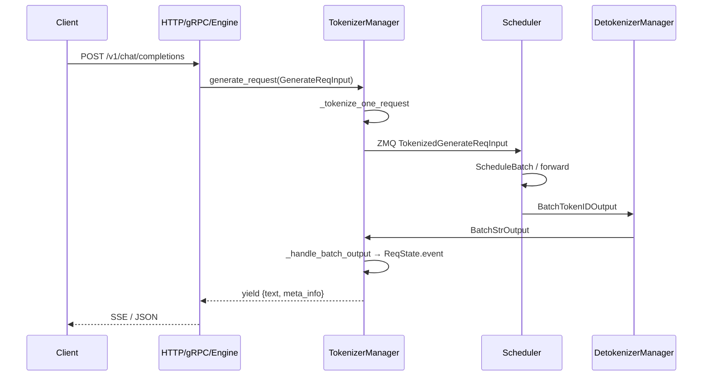
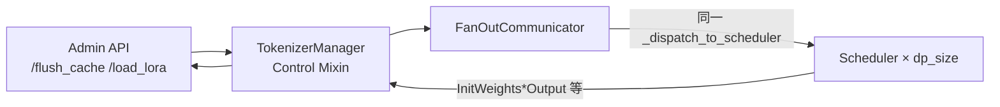
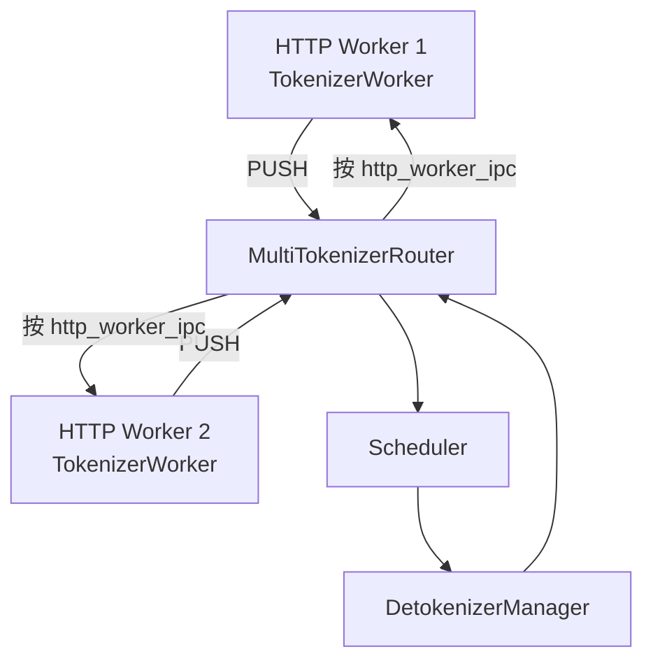

# TokenizerManager：数据流与交互

## 1. 架构位置

TokenizerManager 位于 **API 层与 Scheduler 之间**，是阶段 II「请求调度」的起点：



---

## 2. 输入 / 输出结构

| 方向 | 类型 | 说明 | 构造位置 |
|------|------|------|----------|
| 输入 | `GenerateReqInput` | 用户文本、采样参数、stream 标志 | HTTP `serving_chat` / Engine API |
| 中间 | `TokenizedGenerateReqInput` | token ids、SamplingParams、mm_inputs | `_create_tokenized_object` |
| 中间 | `BatchTokenizedGenerateReqInput` | 多条打包 | `_send_batch_request` |
| 输出 | `BatchStrOutput` | 已 detokenize 的 batch 文本 | DetokenizerManager |
| 输出 | `dict` | `{text, output_ids, meta_info}` | `_handle_batch_output` → `_wait_one_response` |

**Code（HTTP 层输入结构）：**

```python
# 来源：python/sglang/srt/managers/io_struct.py L152-L177
# 提交版本：70df09b
class GenerateReqInput:
    # Request ID(s). If omitted, generated during normalization. For batch
    # requests, a string is expanded to per-item IDs using it as a prefix.
    rid: Optional[Union[str, List[str]]] = field(default=None, kw_only=True)
    # Stable identity shared by requests in the same session. Unlike
    # session_params, this does not alter or reconstruct the prompt.
    session_id: Optional[str] = field(default=None, kw_only=True)
    # The input prompt. It can be a single prompt or a batch of prompts.
    text: Optional[Union[List[str], str]] = None
    # The token ids for text.
    # Use C-loop validator to replace Pydantic per-element type check for efficiency.
    input_ids: Annotated[
        Optional[Union[List[List[int]], List[int]]],
        PlainValidator(validate_optional_list_i64_1d_2d),
    ] = None
    # The embeddings for input_ids; one can specify either text or input_ids or input_embeds.
    input_embeds: Optional[Union[List[List[List[float]]], List[List[float]]]] = None
    # The image input. It can be an image instance, file name, URL, or base64 encoded string.
    # Can be formatted as:
    # - Single image for a single request
    # - List of images (one per request in a batch)
    # - List of lists of images (multiple images per request)
    # See also python/sglang/srt/utils.py:load_image for more details.
    image_data: Optional[MultimodalDataInputFormat] = None
    # The video input. Like image data, it can be a file name, a url, or base64 encoded string.
    video_data: Optional[MultimodalDataInputFormat] = None
```

**Comment：**

- `text` 与 `input_ids` 二选一；提供 `input_ids` 可跳过分词器（embedding 或预 tokenize 场景）。
- `normalize_batch_and_arguments()` 在 `generate_request` 入口将单条/批量统一形态；`rid` 省略时自动生成。
- 完整字段与 `TokenizedGenerateReqInput` 映射见 ScheduleBatch-IO `03-数据流与交互.md`。

---

## 3. ZMQ 通道与 PortArgs

**Explain：** `PortArgs`（`server_args.py`）定义各进程 IPC 名称。TokenizerManager 使用其中两个：

**Code：**

```python
# 来源：python/sglang/srt/managers/tokenizer_manager.py L382-L408
# 提交版本：70df09b
    def init_ipc_channels(self, port_args: PortArgs):
        context = zmq.asyncio.Context(2)
        self.recv_from_detokenizer = get_zmq_socket(
            context, zmq.PULL, port_args.tokenizer_ipc_name, True
        )
        if self.server_args.tokenizer_worker_num == 1:
            self.send_to_scheduler = get_zmq_socket(
                context, zmq.PUSH, port_args.scheduler_input_ipc_name, True
            )
            self.tokenizer_ipc_name = None
        else:
            # Use tokenizer_worker_ipc_name in multi-tokenizer mode
            self.send_to_scheduler = get_zmq_socket(
                context, zmq.PUSH, port_args.tokenizer_worker_ipc_name, False
            )
            self.tokenizer_ipc_name = port_args.tokenizer_ipc_name

        self.load_snapshot_reader = create_load_snapshot_reader(
            self.server_args,
            port_args,
            caller="TokenizerManager",
        )

    def _dispatch_to_scheduler(self, obj: Any) -> None:
        if self.tokenizer_ipc_name is not None:
            stamp_http_worker_ipc(obj, self.tokenizer_ipc_name)
        sock_send(self.send_to_scheduler, obj)
```

| Socket | 模式 | 对端 | 消息类型 |
|--------|------|------|----------|
| `send_to_scheduler` | PUSH | Scheduler (或 Router) | `Tokenized*ReqInput`, `AbortReq`, 控制面 Req |
| `recv_from_detokenizer` | PULL | DetokenizerManager | `BatchStrOutput`, `BatchEmbeddingOutput`, ... |

**Comment：** ZMQ 消息体经 pickle；大 tensor 可走 shared memory（`wrap_shm_features`）。

---

## 4. 上下游连接

| 上游/下游 | 模块 | 交互方式 | 典型调用 |
|-----------|------|----------|----------|
| **上游** | `http_server` / `engine.py` | Python async | `await tokenizer_manager.generate_request(...)` |
| **上游** | OpenAI `serving_chat.py` | 同上 | 构造 `GenerateReqInput` |
| **下游** | Scheduler | ZMQ PUSH | `_dispatch_to_scheduler(tokenized_obj)` |
| **下游** | DetokenizerManager | ZMQ PULL（收） | `handle_loop` ← `BatchStrOutput` |
| **横向** | LoRARegistry | 内存 | `_validate_and_resolve_lora` |
| **横向** | mm_processor | async | `process_mm_data_async` |

**上游调用示例（Engine）：**

```python
# 来源：python/sglang/srt/entrypoints/engine.py（概念摘录）
# 提交版本：70df09b
# Engine.generate / async_generate 内部：
async for output in self.tokenizer_manager.generate_request(obj):
 yield output
```

---

## 5. 典型数据流（单条流式生成）

### 步骤 1：API 构造请求

HTTP 层把 JSON body 转为 `GenerateReqInput`，分配 `rid`，设置 `stream=True`。

### 步骤 2：初始化 ReqState

**Code：**

```python
# 来源：python/sglang/srt/managers/tokenizer_manager.py L2850-L2870（概念摘录）
# 提交版本：70df09b
    def _init_req_state(
        self,
        obj: Union[GenerateReqInput, EmbeddingReqInput],
        request: Optional[fastapi.Request] = None,
    ):
        created_time = obj.received_time

        external_trace_header = None
        if self.server_args.enable_trace:
            if obj.external_trace_header:
                # When the request comes from the rust grpc server or Engine there isn't a
                # real request object but we still need to propagate the trace context from
                # the trace context that is explicitly passed in
                external_trace_header = obj.external_trace_header
            elif request:
                external_trace_header = extract_trace_headers(request.headers)
                obj.external_trace_header = external_trace_header

        # Normalize single/batch into a uniform list of (rid, sub_obj, bootstrap_room)
        if not hasattr(obj, "is_single") or obj.is_single:
            items = [(obj.rid, obj, getattr(obj, "bootstrap_room", None))]
```

### 步骤 3：分词并发送

`_tokenize_one_request` → `TokenizedGenerateReqInput` → `_send_one_request` → Scheduler 入队。

### 步骤 4：Scheduler 推理 → Detokenizer

Scheduler 每 decode step 产生 token ids；Detokenizer 增量 decode 为 `output_strs`，打包 `BatchStrOutput` PUSH 到 `tokenizer_ipc_name`。

### 步骤 5：handle_loop 更新状态

**Code：**

```python
# 来源：python/sglang/srt/managers/tokenizer_manager.py L2055-L2068（概念摘录）
# 提交版本：70df09b
                    out_dict = {
                        "output_ids": state.output_ids.copy(),
                        "meta_info": meta_info,
                    }
                else:
                    out_dict = None
                if out_dict is not None and state.prompt_token_ids is not None:
                    out_dict["prompt_token_ids"] = state.prompt_token_ids
            else:
                assert isinstance(recv_obj, BatchEmbeddingOutput)
                out_dict = {
                    "embedding": recv_obj.embeddings[i],
                    "meta_info": meta_info,
                }
```

### 步骤 6：前台 yield

`_wait_one_response` 被唤醒，`yield out` 给 HTTP；若 `finished`，清理 `rid_to_state`、释放 LoRA 引用、写 metrics。

---

## 6. 控制面数据流（与数据面并行）



**Code：**

```python
# 来源：python/sglang/srt/managers/tokenizer_control_mixin.py L453-L484
# 提交版本：70df09b
    async def update_weights_from_tensor(
        self: TokenizerManager,
        obj: UpdateWeightsFromTensorReqInput,
        request: Optional[fastapi.Request] = None,
    ) -> Tuple[bool, str]:
        self.auto_create_handle_loop()
        assert (
            self.server_args.dp_size == 1 or self.server_args.enable_dp_attention
        ), "dp_size must be 1 or dp attention must be enabled for update weights from tensor"

        if obj.abort_all_requests:
            self.abort_request(abort_all=True)

        obj.serialized_named_tensors = normalize_serialized_named_tensor_payloads(
            obj.serialized_named_tensors
        )

        async with self.is_pause_cond:
            is_paused = self.is_pause
            if is_paused:
                results = await self.update_weights_from_tensor_communicator(obj)

        if not is_paused:
            async with self.model_update_lock.writer_lock:
                results = await self.update_weights_from_tensor_communicator(obj)

        success, message = FanOutCommunicator.merge_results(results)
        if success and obj.weight_version is not None:
            self._update_weight_version_if_provided(obj.weight_version)
            message += f" Weight version updated to {obj.weight_version}."

        return success, message
```

**Comment：**

- 权重更新持 **writer_lock**，与 `generate_request` 的 **reader_lock** 互斥。
- 可选 `abort_all_requests` 先清空在途推理。

---

## 7. 多 HTTP Worker 数据流

当 `tokenizer_worker_num > 1`：



**Code：**

```python
# 来源：python/sglang/srt/managers/multi_tokenizer_mixin.py L488-L498
# 提交版本：70df09b
    async def _distribute_result_to_workers(self, recv_obj):
        if isinstance(recv_obj, BaseReq):
            ipc_names = [recv_obj.http_worker_ipc]
        elif isinstance(recv_obj, BaseBatchReq):
            ipc_names = recv_obj.http_worker_ipcs
        else:
            raise ValueError(f"Unknown recv_obj type: {type(recv_obj)}")

        for i, ipc_name in enumerate(ipc_names):
            new_recv_obj = _handle_output_by_index(recv_obj, i)
            self.socket_mapping.send_output(ipc_name, new_recv_obj)
```

**Comment：** `_handle_output_by_index` 从 batch 中拆出单条结果，避免 Worker 收到无关 rid 的输出。

---

## 8. 与Scheduler–Detokenizer 的衔接

| 模块 | 衔接点 |
|------|--------|
| 07 Scheduler | 消费 `TokenizedGenerateReqInput`，产出 `BatchTokenIDOutput` |
| 09 ScheduleBatch/IO | `io_struct` 全量字段定义 |
| 10 Detokenizer | 将 `BatchTokenIDOutput` 转为 `BatchStrOutput` 发回本模块 |
